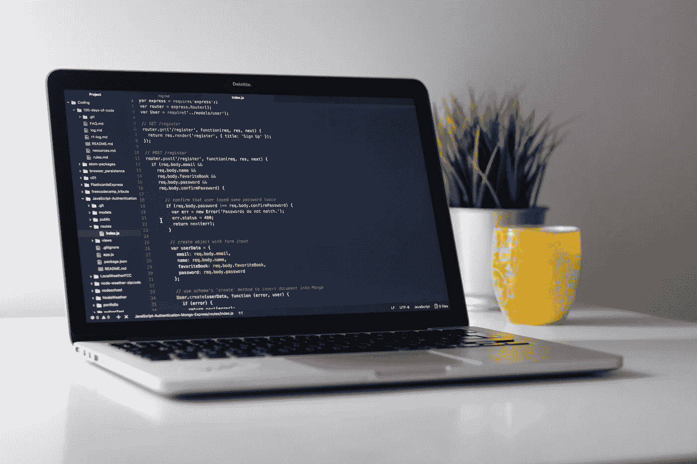

# 你知道为什么局部变量在 Java 中是线程安全的吗？

> 原文：<https://medium.com/javarevisited/do-you-know-why-local-variables-are-thread-safe-in-java-latest-e4f98e013ac?source=collection_archive---------1----------------------->

## JAVA 多线程——线程安全变量

## 多线程环境中局部变量的线程安全。



**照片由** [**Clément H**](https://unsplash.com/@clemhlrdt?utm_source=unsplash&utm_medium=referral&utm_content=creditCopyText) **上** [**Unsplash**](https://unsplash.com/s/photos/java-programming?utm_source=unsplash&utm_medium=referral&utm_content=creditCopyText)

多线程是 java 编程中的基本概念之一。了解多线程总是有好处的，因为它有助于您编写和调试基于多线程的大型应用程序。

在这篇文章中，我将通过例子解释 ***为什么局部变量是线程安全的。***

# 线程堆栈和堆:

首先，Java 虚拟机将自己的内存分为 ***栈*** *和* ***堆*** *内存*。

> 它将所有对象存储在堆上，并将本地原语和本地对象引用存储在堆栈上。

***最重要的是，每个线程包括主线程都有自己的私有栈。*** ***在其栈(基本上是线程栈)上，存储了局部原语和局部引用变量。***

因此，一个线程不与任何其他线程共享其局部变量，因为这些局部变量和引用在该线程的私有堆栈内。因此局部变量总是线程安全的。

# 让我们举一个简单的例子来理解这一点:

**局部变量的线程安全**

# 上面程序的输出:

```
counter : -2066897874 count : 1775146445
counter : 170327989 count : -1649657772
```

在上面的例子中，在第 11 行，创建了 *ThreadExample* 的实例，在接下来的两行(第 12 行和第 13 行)，创建了两个线程对象，并在第 14 行和第 15 行开始。这些线程将执行同一个实例*【thread example】*的***run****方法。*

*当这两个线程执行 run 方法时，它们在自己的私有堆栈中创建自己的本地 **count** 变量副本。由于这些堆栈是私有的，两个线程不能共享同一个**计数**变量的副本。因此它是线程安全的。此外，**计数**变量被赋予一个随机整数，因此不太可能将相同的整数赋予**计数**变量。*

*但是两个线程都引用了 threadExample 类的同一个实例***【thread example】***。这个实例在堆上，因此它的字段**计数器**也在堆上。所以在堆上只有一个字段计数器的副本在这两个线程之间共享。因此线程之间有可能发生冲突，并可能导致争用情况。这就是为什么**计数器**字段不是线程安全的。*

****目前就这些。我希望这篇文章能让你明白为什么局部变量是线程安全的。****

****这里*** ***你可以联系我*** [***。***](/@basecs101)*