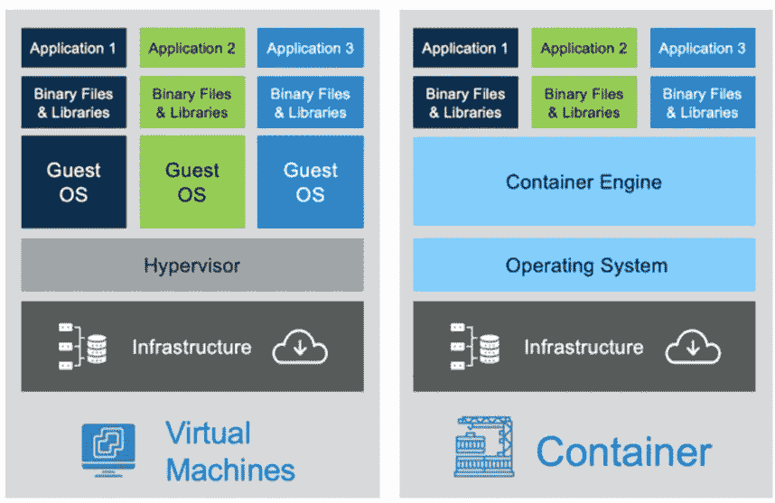
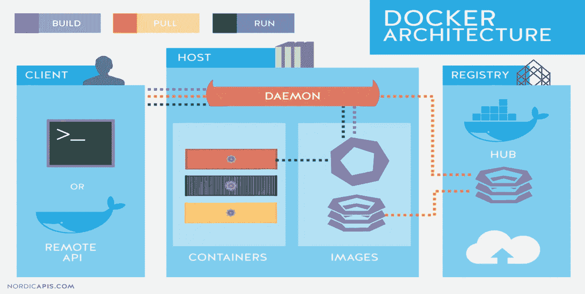
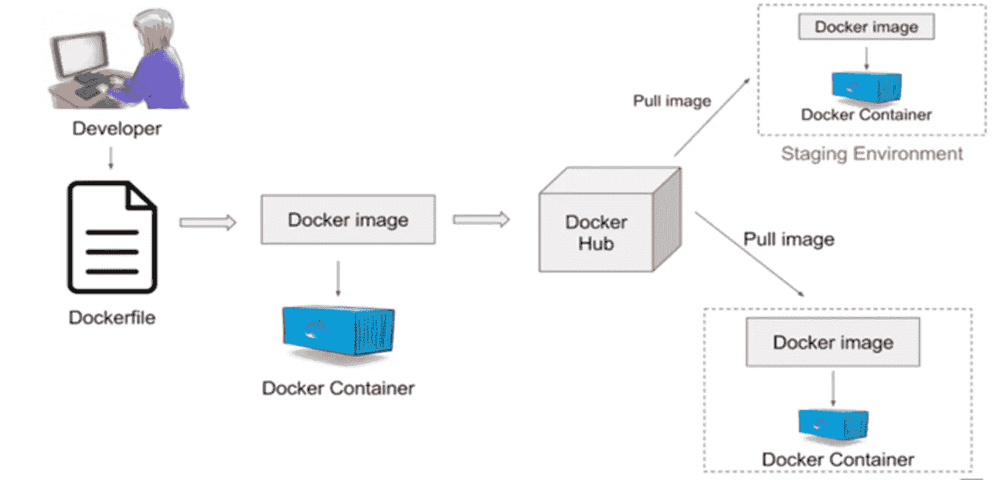
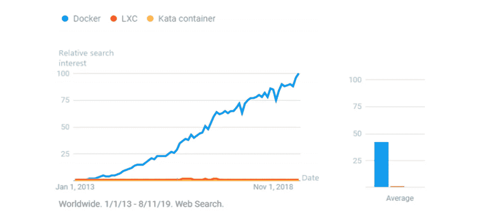
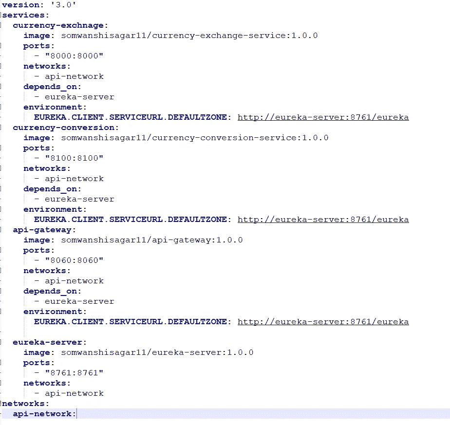

# Docker 容器和容器编排基本概述

> 原文：<https://medium.com/javarevisited/docker-containers-container-orchestration-basic-overview-c29db8f18a55?source=collection_archive---------1----------------------->

**Docker** 是一个执行操作系统级虚拟化的计算机程序，也称为“**容器化**”。

[Docker](/javarevisited/top-5-free-courses-to-learn-docker-for-beginners-best-of-lot-b2b1ad2b98ad) 的职责是在不改变每个环境(开发/质量保证/UAT/生产)中映像内容的情况下构建、交付、部署应用程序

# **需要什么 Docker** :-

1.  解决争议(应用程序无法在我的机器上运行(QA)*)
2.  自动扩展、自动部署和监控
3.  要获得应用程序的确切配置

*   匹配软件版本
*   开发人员和 QA/生产系统上 jar 的匹配版本
*   解决基础设施或配置的问题

# **虚拟机 vs 容器:-**

虚拟机与容器(复制的映像)

**虚拟机:-**

答】。虚拟机执行硬件级虚拟化
b】。以分钟为单位的启动时间
c。每个虚拟机都运行在自己的操作系统上。需要更多的内存。要人

**集装箱:-**

答】。容器执行操作系统级的虚拟化。以毫秒为单位的启动时间
c。所有的容器共享主机操作系统。与虚拟机
相比，需要更少的内存。轻量级选手

# **Docker 架构:-**

Docker 架构(复制图像)

**Docker 客户端**:Docker 命令执行的用户界面。
**Docker 镜像**:创建容器的模板
**Docker 容器**:Docker 镜像
实例 **Docker 守护进程**:负责接收命令并通过命令行传递给容器的后台进程。
**Docker Registry** :通常称为 Docker Hub，这是存储和检索容器映像的地方。如果需要，我们也可以有自己的私人仓库。

# **码头工人工作流程:-**

Docker 工作流程(复制图像)

# Docker 谷歌趋势:-

Docker 的谷歌趋势(复制图片)

# **码头工人组成** : -

Docker Compose 用于将多个容器作为单个服务运行

例如，假设您有一个需要 Spring Boot 服务和[我的 SQL 数据库](/javarevisited/top-5-courses-to-learn-mysql-in-2020-4ffada70656f)的应用程序，我们可以创建一个文件，将两个容器作为服务启动，而不需要分别启动每个容器。在生产系统中，我们可能需要一起使用多个容器，并同时启动/停止它们。

这是通过 docker-compose.yml 文件完成的。

例如

# **容器编排:-**

1.  容器编排是协调和管理容器的所有方面的自动化。容器编排侧重于管理容器的生命周期及其动态环境。

2.容器编排用于自动化以下任务:
配置和调度容器

容器的自动化部署和复制

集装箱集群的在线扩大或扩大。

集装箱的可用性

应用程序在其运行的容器方面的配置

集装箱之间的资源分配

容器的负载平衡、流量路由和服务发现

集装箱的健康监控

*   保护容器之间的交互

3.容器编排可以用 Docker Swarm 或 Kubernetes 实现

谢谢你…..

参考资料:

<https://www.aquasec.com/cloud-native-academy/docker-container/docker-architecture/>  </@evans.stepanov/containerization-technology-what-when-where-and-why-80321c4dcd9c>  <https://en.wikipedia.org/wiki/LXC>  <https://www.quora.com/How-are-docker-and-container-different>  <https://docs.docker.com/engine/swarm/swarm-tutorial/scale-service/>  <https://kubernetes.io/docs/concepts/overview/what-is-kubernetes/> 