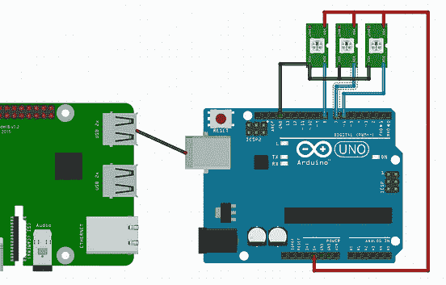
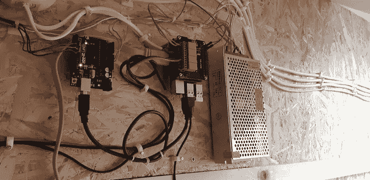
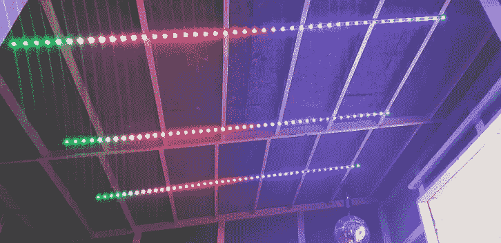
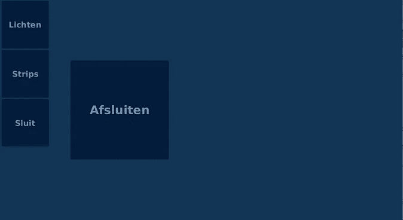
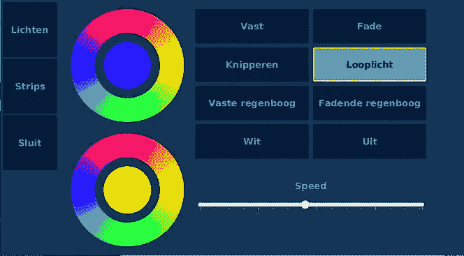
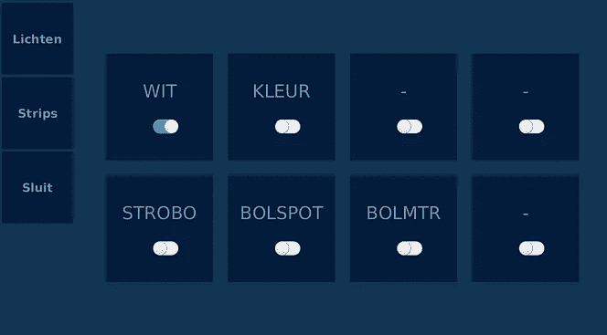
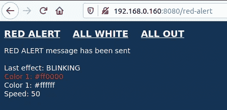
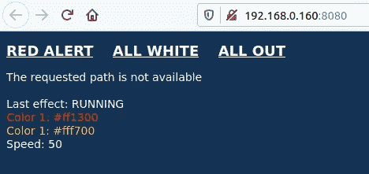

# Drumbooth 触摸屏控制器，带 Raspberry Pi 和 JavaFX

> 原文：<https://medium.com/javarevisited/drumbooth-touchscreen-controller-with-raspberry-pi-and-javafx-f42583bfe14f?source=collection_archive---------0----------------------->

基于我的书[“Raspberry Pi Java 入门”](https://webtechie.be/books/)中的多个例子，我为我儿子的架子鼓创建了一个触摸屏控制器。结合继电器板和 Arduino，这允许通过触摸屏界面控制 LED 灯条和不同的灯。

还有一个网络服务器，所以我们可以通过网页在房子的任何地方触发一些事件，这样当食物摆在桌子上时，我们就不再需要在楼下大喊大叫了；-)

整个装置连接在 220V 电源开关之后，以便在展台不使用时关闭所有设备。Pi 通电时，Java 应用程序自动启动。其中一个 220 伏的灯连接到继电器的开路端，所以当 220 伏的开关打开时，灯立即亮了。

# 材料表

*   树莓派 3B+
*   触摸屏，对我来说是[7 英寸型号](https://www.kiwi-electronics.nl/raspberry-pi/hdmi-7-inch-800x480-display-backpack-met-touchscreen)
*   2 * SPI [可堆叠中继板](https://www.amazon.com/gp/product/B07Q2P9D7K/ref=ppx_yo_dt_b_asin_title_o00_s00?ie=UTF8&psc=1)
*   Arduino Uno
*   WS2812B LED 灯条
*   5V 电源，取决于灯条上 led 的数量，在我的情况下[这是 20A 型号](https://www.dx.com/p/5v-20a-led-monitoring-constant-voltage-power-supply-switch-ac-90-264v-2055437)
*   Pi 和 Arduino 之间的 USB 电缆
*   安装材料，大量电缆，连接继电器的不同灯

# 接线



布线方案、安装的组件、为 led 灯条选择的彩虹效果

*   两块板之间的 USB 电缆(用于串行通信)
*   从电源到 Pi、Arduino 和 LED 灯条的 5V 和接地
*   引脚 6、7 和 8 与三个 LED 灯条之间的控制电缆

# 源代码

这个项目是我的书《[树莓 Pi](https://webtechie.be/books/) 上的 Java 入门》的多个例子的组合，这些例子都在[这个 GitHub 项目“JavaOnRaspberryPi”](https://github.com/FDelporte/JavaOnRaspberryPi)中分享。这个项目本身也作为“DrumBoothController”在 GitHub 上分享[。](https://github.com/FDelporte/DrumBoothController)

因为它同时使用了 Raspberry Pi 和 Arduino，所以您会在源代码中找到两个目录。

两个板之间共享的命令是“COMMAND _ ID:SPEED:R1:G1:B1:R2:G2:B2”结构中的字符串，其中命令 ID 是以下选项之一:


一些例子

*   1:20:255:0:0 =所有 led 固定为全红色
*   3:2500:255:0:0:0:0:255 =每隔 2.5 秒将所有 led 从全红变为全蓝
*   5:50:255:0:0:0:0:255 =所有 led 为蓝色，一个运行中的 led 为红色并持续 50 毫秒

# Arduino 控制 LED 灯条

因为我使用了三个平行的 LED 灯条，所以我想在这三个灯条上产生相同的效果。所以代码从条带的初始化开始。

```
Adafruit_NeoPixel strip1 = Adafruit_NeoPixel(NUMBER_OF_LEDS, PIN1, NEO_GRB + NEO_KHZ800);
Adafruit_NeoPixel strip2 = Adafruit_NeoPixel(NUMBER_OF_LEDS, PIN2, NEO_GRB + NEO_KHZ800);
Adafruit_NeoPixel strip3 = Adafruit_NeoPixel(NUMBER_OF_LEDS, PIN3, NEO_GRB + NEO_KHZ800);
```

两个电路板之间的通信是通过串行链路完成的(不是书中的 Mosquitto，因为在这种情况下我只想使用一个控制器)。因此，在循环方法中，串行数据被读取和处理。

```
void loop() {  
  checkSerial();
  handleMessage();

  currentLoop++; // Only do LED effect when loop exceeds the defined animationSpeed
  if (currentLoop >= animationSpeed) {
    // Depending on the commandId, call the correct LED effect
    if (commandId == 1) {
      setStaticColor();
    } else if (commandId == 2) {
      setStaticFade();
    } else if (commandId == 3) {
      ...
    } currentLoop = 0;
  } delay(5);
}
```

查看每个被调用方法的 GitHub 源代码，了解更多细节。

# 树莓 Pi 的 Java 和 JavaFX

Java 应用程序包含三个不同的屏幕

*   继电器控制器，带有用于 2 * 4 继电器的切换按钮
*   LED 条形控制器选择颜色和 LED 效果，使用[这个颜色选择器组件](https://harmoniccode.blogspot.com/2016/03/friday-fun-xxiv.html)来自 [Gerrit 格伦瓦德](https://twitter.com/hansolo_)。
*   在切断电源之前，退出屏幕以安全关闭 Pi 电源



退出屏幕、LED 灯条控制器、继电器控制器的屏幕截图

事件管理器在所有 UI 组件和 Undertow web 服务器之间共享，以将 UI 与通过网页触发的事件对齐。该事件管理器也是执行命令的地方，以便:

*   用集成电路控制继电器
*   使用 Pi4J 通过串行通信发送 LED 命令

以下截图显示了在网页上选择“红色警报”后的状态，以及在 LED 条 UI 上选择运行灯时的初始状态。



选择“红色警报”和其他选定的 LED 效果后显示页面的网页

# 最终结果

网页和触摸屏用户界面并排。正如您所看到的(从 37 英寸开始)，通过 web 页面进行的更改会立即在 JavaFX UI 中可视化。

> 您可能喜欢的其他文章:

</javarevisited/what-java-programmers-should-learn-in-2020-648050533c83>  </javarevisited/top-5-java-online-courses-for-beginners-best-of-lot-1e1e240a758>  </free-code-camp/these-are-the-best-free-courses-to-learn-data-structures-and-algorithms-in-depth-4d52f0d6b35a> 