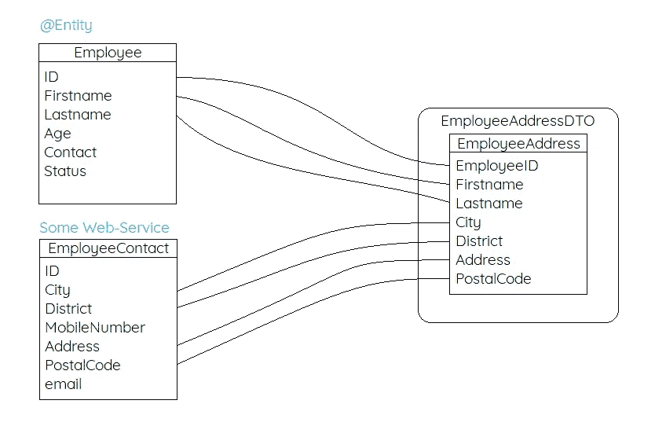

# DTO 还是不去 DTO？

> 原文：<https://medium.com/javarevisited/dto-or-not-to-dto-58259d4228ec?source=collection_archive---------0----------------------->

**免责声明:** *这篇文章并没有考虑到* [*Java 记录*](/javarevisited/java-14-new-language-features-1e185b7f120) *的存在，它仅仅说的是 dto，在他们的经典理解中。*

# 我到底要不要用 dto？

这是一个长期流行的，在某种程度上值得商榷，有时，甚至倾向于所谓的“神圣战争”的问题，非常简短的答案是

# **—视情况而定。**

——DTO 到底是什么？

—它是一个*数据传输对象，*即数据聚集对象，其唯一目的是方便将数据从 A 点(源)传送到 B 点(目的)。

有很多人，在很多情况下，更喜欢一种方法(使用 dto)而不是另一种方法(使用裸模型类/实体)，反之亦然；然而，没有哪种*单一来源的真理*更好用。

这在很大程度上取决于需求、软件设计、您决定坚持的架构方法、其他(与项目相关的)具体细节，甚至个人偏好。

有些人甚至声称 **DTO 是反模式的**；有些人喜欢使用它们；有人认为，数据细化/调整应该发生在消费者/客户端(出于各种原因，其中之一可能是*没有 API 更改的策略*)。

话虽如此，是的，你可以简单地从你的控制器返回模型类(在 [Hibernate](/javarevisited/top-5-hibernate-online-training-courses-for-beginners-and-advance-java-programmers-469460596b2b) 中，它是@ `Entity`)实例(或实例列表)并且**这种方法没有问题**。我甚至可以说，这甚至没有违反任何来自 [SOLID](https://javarevisited.blogspot.com/2018/07/10-object-oriented-design-principles.html) 或 [Clean Code principles](/javarevisited/10-oop-design-principles-you-can-learn-in-2020-f7370cccdd31?source=collection_home---4------1-----------------------) 的东西。

但是再一次..

> 这取决于你用 response 做什么；你需要什么样的数据表示；正在讨论的对象的能力和目的应该是什么，等等..

# 在以下情况下，DTO 通常是一种很好的做法:

1.  **当您想要聚合来自不同[re]源的对象数据时，例如，您想要在持久层和业务(或 Web)层之间放置一些*对象转换*逻辑:** 假设您正在使用 ORM，并且您的数据库有一个 Java 代码抽象。现在想象一下，您从数据库中获取一个`Employee`实例；然而，从另一个第三方 web 服务(或任何其他来源)中，您还会收到一些针对该*雇员*对象的*补充雇员*数据。说，是— `EmployeeContact`。
    现在，您想将来自*雇员*对象的一些数据(假设它是`ID`、`Firstname`、`Lastname`字段)和来自*雇员账户*对象的一些数据(假设它是`City`、`District`、`Address`和`PostalCode`字段)发送给客户机，客户机需要数据、建模雇员及其地址，但是您不希望分别发送这两个实例(尤其是，您不希望将所有的与发送两个实例并将组装责任委托给客户机不同，您可能会发现一个更好、更方便的替代方法是使用 DTO。
    使用 DTO 看起来就像创建相应的 DTO 类(假设— `EmployeeAddressDTO`)，它聚合了两个(或更多)模型类，并且对于这样一个类的每个实例，您将拥有一个聚合所需数据的模型，在上面的例子中，这些数据是来自`employee`和`employeeContact`对象的数据。顺便说一下，在这个汇总过程中，你可能还想做一些其他的事情，比如数据变更、调整、修改、计算等等。
    关键是你想要*组合来自不同来源的数据*，并把这种组合表示为一个统一的对象。这是使用 DTO 模式的一个很好的例子。DTO 是可重用的，它符合单责任原则，并与其他层很好地隔离。**注，**谓自；
2.  **当您不一定要组合从不同来源收到的数据，但您想要修改和定制您将返回的模型实例:** 假设您有一个非常大的实体(有很多字段)，调用相应端点(前端应用程序、移动设备或任何客户端)的客户端不需要接收这个巨大的实体(或实体列表)。如果你不顾客户的要求，仍然发送原始的/未改变的实体，你将会无效率地消耗网络带宽/负载(超过足够的)，性能将会降低，并且通常，你将会毫无理由地浪费计算资源。在这种情况下，您可能希望将您的原始实体转换为客户端需要的 DTO 对象(只有必填字段)。在这里，你甚至可能想要为一个实体、为不同的消费者/客户实现不同的 DTO 类，因为你可能想要为每个客户定制数据表示。

请注意，您可能会遇到这样的情况，当您的需求同时涉及上述第一点(聚合)和第二点(修改/定制)时。

但是，如果您确定您的表/关系表示(实例[@实体类](https://javarevisited.blogspot.com/2016/01/why-jpa-entity-or-hibernate-persistence-should-not-be-final-in-java.html#axzz5SmuS0lnR))正是客户需要的，就没有必要引入 dto。

# 为了进一步支持这个想法，可以将@Entity 返回到表示层，而不使用 d to

1.  [3 . 3 . 2 中的 Java 持久化与 Hibernate，第二版](https://livebook.manning.com/book/java-persistence-with-hibernate-second-edition/chapter-3/64)，甚至明确地激励它:

> 您可以在持久性环境之外重用持久性类，例如，在单元测试或者在**表示层**中。您可以使用常规的 Java new 操作符在任何运行时环境中创建实例，保持可测试性和可重用性；

2.Hibernate 实体[不需要被](https://stackoverflow.com/a/2726357/1553537)显式序列化。

## 您可能喜欢的其他 Hibernate 和 JPA 文章

 [## 2021 年面向 Java 开发者的 5 门最佳 Hibernate 和 JPA 在线课程

### Hibernate 是 Java 开发人员的一项关键技能，这些是在线学习 Hibernate 的最佳课程。

medium.com](/javarevisited/top-5-hibernate-online-training-courses-for-beginners-and-advance-java-programmers-469460596b2b)  [## 2021 年学习 Hibernate 和 JPA 的前 5 本书

### Hibernate 是最流行的开源 ORM(对象关系映射)框架之一，它现在已经成为一个…

medium.com](/javarevisited/top-5-books-to-learn-hibernate-for-java-developers-b2cb4b16ccd6)  [## 面向 Java 程序员的 20 大 Hibernate 面试问题及答案

### Hibernate 是 Java 世界中最流行的持久性框架之一。Hibernate 提供了一个对象到关系…

www.java67.com](https://www.java67.com/2016/02/top-20-hibernate-interview-questions.html)