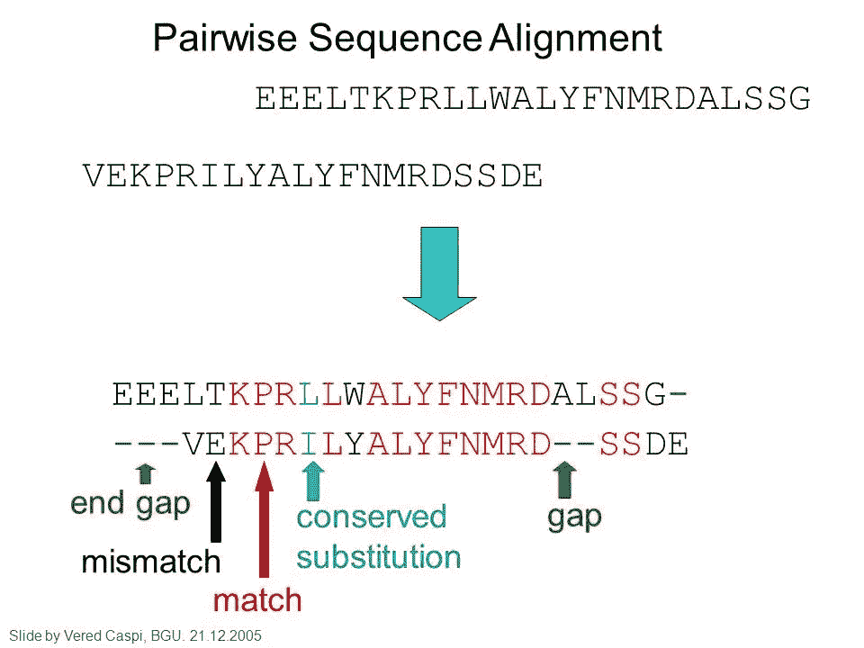
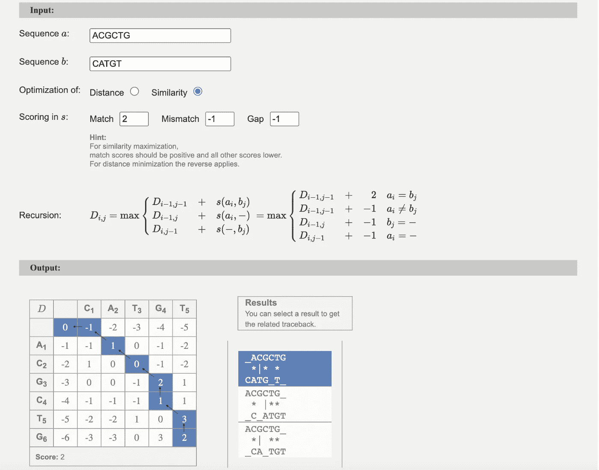
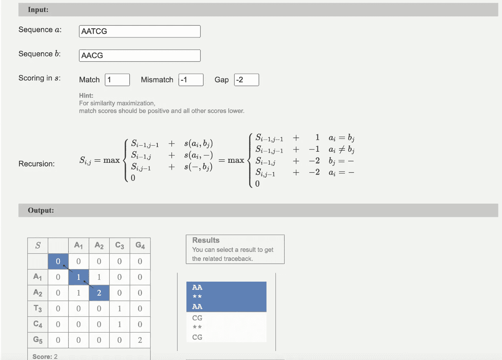

# 两两 DNA 序列比对的动态规划方法

> 原文：<https://medium.com/javarevisited/dynamic-programming-approach-for-pairwise-dna-sequence-alignment-c3e98ec35576?source=collection_archive---------2----------------------->

## 生物信息学

## 两个 DNA 序列有多相似？如何使用 BioPython 执行 DNA 成对序列比对:Python 库

大家好😃你好吗，you❓Hope 你过得很好。这一集我们将学习成对 DNA 序列比对。让我们毫不迟疑地深入到上下文中。


[亚历山大·波波夫](https://unsplash.com/@5tep5?utm_source=medium&utm_medium=referral)在 [Unsplash](https://unsplash.com/?utm_source=medium&utm_medium=referral) 上拍照

首先，学习一些基本定义，以便轻松理解这一集。

*   **—序列比对是根据两个 DNA 或蛋白质序列内容表示的相似性来排列它们的方法。**
*   ****成对序列比对**:成对序列比对是一种仅比较两个序列的序列比对方法。该过程需要确定两个序列之间的最佳比对，基于它们的相似性或不相似性分配分数，并确定相似性或不相似性的分数。**

# **得分**

**评分主要考虑三个方面。**

*   ****匹配值** —匹配两个序列中的字符**
*   ****不匹配值** —两个序列中不匹配的字符**
*   ****空位罚分** —将一个字符与一个空格匹配**

**为了便于理解上述三个概念，下面给你一张图片。**

**[](https://www.java67.com/2019/01/5-free-courses-to-learn-machine-and-deep-learning-in-2019.html)

[图像来源](https://www.google.com/url?sa=i&url=https%3A%2F%2Fslideplayer.com%2Fslide%2F5698114%2F&psig=AOvVaw0bzeLBJbndRVn8CYYbjjYt&ust=1653933140005000&source=images&cd=vfe&ved=0CA0QjhxqFwoTCPD23aKjhfgCFQAAAAAdAAAAABAD)** 

> **让我们以下面的例子来学习评分方法**

**[](https://javarevisited.blogspot.com/2019/08/top-5-courses-to-learn-deep-learning.html)**

**匹配:24，替换:4，插入/缺失:5**

*****基于距离计分*****

*   **该评分将给出两个序列的不同之处。**
*   **匹配:0，替换:1，插入/删除:2**
*   **距离= 24*0 + 4*1 + 5*2 = 14**

*****相似度基础评分*****

*   **该评分将给出两个序列是如何相似的。**
*   **匹配:1，替换:0，插入/删除:-1.5**
*   **相似度:24 * 1+4 * 0+5 *(1.5)= 16.5**

**比对距离/相似性可用于估计两个 DNA 或蛋白质序列之间的生物学差异/相似性。现在，你知道了序列比对和成对序列比对。让我们学习两两序列比对的类型。**

> ***全局比对(Needleman-Wunsch 算法)***
> 
> ***局部对齐(史密斯-沃特曼算法)***
> 
> ***自由端对齐***

*   ****全局比对:**两个序列的整个长度被认为是计算最佳相似性值。插入空格以匹配序列长度。**
*   ****局部比对:**考虑两个序列的子序列，寻找相似度的最优值。**
*   ****无末端比对:**当这些子序列中至少有一个是原始序列的前缀，一个是后缀时，子序列之间的最佳比对。所以序列不需要在同一个地方开始和结束。**

****使用 Needleman-Wunsch 算法计算全局比对，而使用 Smith-Waterman 算法计算局部比对。****

> ****用于全局比对的 Needleman-Wunsch 算法****

*   **needle man–Wunsch 算法是一种用于生物信息学的蛋白质或核苷酸序列比对算法。这是第一次使用动态编程进行生物序列比较。Saul B. Needleman 和 Christian D. Wunsch 创建了该算法，并于 1970 年发表。该方法将一个主要问题分解为一系列较小的问题，然后使用较小问题的解决方案来发现较大问题的最佳解决方案(这被称为[动态编程](/javarevisited/6-best-dynamic-programming-courses-for-coding-interviews-14744060923c)，要了解有关动态编程的更多信息，请访问[**此处**](/javarevisited/what-is-dynamic-programming-e3e1c2eb0621) )。全局比对技术和最佳匹配算法是它的其他名称。为了获得最佳的全局比对，needle man–Wunsch 算法仍然被广泛使用。该算法的目标是找到所有具有最佳分数的潜在比对。**
*   **观看下面的视频，了解如何使用 Needleman-Wunch 算法执行全局比对。**

****这里有一个使用 Needleman-Wunch 算法** [**进行全局比对的可视化工具**](http://rna.informatik.uni-freiburg.de/Teaching/index.jsp?toolName=Needleman-Wunsch) **。下图显示了一个可视化示例。****

**[](https://javarevisited.blogspot.com/2020/08/top-10-coursera-certifications-to-learn-Data-Science-Visualization-and-Data-Analysis.html)

图片作者来自:[http://rna.informatik.uni-freiburg.de/](http://rna.informatik.uni-freiburg.de/)** 

> ****局部对准的史密斯-沃特曼算法****

*   **Smith-Waterman 方法通过进行局部序列比对来确定两串核酸或蛋白质序列之间的可比较区域。Smith-Waterman 算法分析所有可能长度的片段，并优化相似性度量，而不是查看整个序列。坦普尔·f·史密斯和迈克尔·s·沃特曼于 1981 年首次提出了这一方法。Smith-Waterman 是一种动态规划算法，就像 needle man–Wunsch 方法一样，它是该方法的变体。结果，它具有确保为所使用的评分系统找到最佳局部比对的理想品质。**
*   **观看下面的视频，了解如何使用 Smith-Waterman 算法执行局部对齐。**

****这里有一个使用史密斯-沃特曼算法**[](http://rna.informatik.uni-freiburg.de/Teaching/index.jsp?toolName=Smith-Waterman)****进行局部比对的可视化工具。下图显示了一个可视化示例。******

****[](https://www.java67.com/2020/07/top-5-data-visualization-tools-every.html)

图片作者来自:[http://rna.informatik.uni-freiburg.de/](http://rna.informatik.uni-freiburg.de/)**** 

# ****用于生物计算的 BioPython 库****

*   ****我们已经了解了这些全局和局部比对是如何进行的。然而，当序列太长时，我们无法做到这一点。因此，使用程序寻找最佳比对是最有效的方法。****
*   ****BioPython 是一个基于 Python 的库。它有许多生物信息学相关的实现。我们可以直接使用它们，而不用太担心实现。你可以在这里了解更多关于 biopython 库[的信息。](https://biopython.org/)****

> *****Biopython 是由一个国际开发团队用*[*Python*](/javarevisited/10-free-python-tutorials-and-courses-from-google-microsoft-and-coursera-for-beginners-96b9ad20b4e6)*编写的一套免费可用的生物计算工具。这是一个分布式的合作项目，旨在开发 Python 库和应用程序，以满足当前和未来生物信息学工作的需求。源代码可以在* [*Biopython 许可*](https://github.com/biopython/biopython/blob/master/LICENSE.rst) *下获得，这是非常自由的，并且与世界上几乎所有的许可都兼容——bio python 网站*****

****[](https://javarevisited.blogspot.com/2019/09/5-websites-to-learn-python-for-free.html)

来源:[https://biopython.org/](https://biopython.org/)**** 

******让我们看看如何使用这个 Bio Python 库进行成对序列比对******

*   *******注意，根据评分矩阵，这些比对可能会有所不同。*******
*   *****让我们看看如何在下面的 BioPython 中全局对齐两个序列。*****

```
**from Bio import Alignaligner = Align.PairwiseAligner()
aligner.match_score = 2.0
aligner.mismatch_score = -1.0
aligner.gap_score = -1alignments = aligner.align("ACGCTG","CATGT")
score = aligner.score("ACGCTG","CATGT")for alignment in alignments:
    print(alignment)
print(score)**
```

****上面代码的输出如下所示。下面给出了匹配方式和最佳匹配分数。我们可以使用上述工具的全球比对问题的结果来验证这一点。****

****[](https://www.java67.com/2018/10/top-10-data-science-and-machine-learning-courses.html)

作者图片:全球对齐**** 

*   *****让我们看看如何在下面的 BioPython 中局部对齐两个序列。*****

```
**from Bio import Alignaligner = Align.PairwiseAligner()
aligner.mode="local"
aligner.match_score = 1.0
aligner.mismatch_score = -1.0
aligner.gap_score = -2alignments = aligner.align("AATCG","AACG")
score = aligner.score("AATCG","AACG")for alignment in alignments:
     print(alignment)
print(score)**
```

****上面代码的输出如下所示。下面给出了匹配方式和最佳匹配分数。我们可以使用上述工具的局部对齐问题的结果来验证这一点。****

****[](https://javarevisited.blogspot.com/2020/08/top-10-coursera-courses-and-certification-for-artificial-intelligence-and-machine-learning.html#axzz6oh08Cv8w)

作者图片:局部对齐**** 

****我相信你学到了生物信息学中关于序列比对和成对序列比对的一些关键点。如果您有任何问题或任何澄清，不要犹豫，通过回复部分与我联系。感谢您花费宝贵的时间阅读本博客，我相信这将激励您继续阅读我的其他博客 [***这里***](https://sthenusan.medium.com/) *。*****

********

****照片由[Courtney hedge](https://unsplash.com/@cmhedger?utm_source=medium&utm_medium=referral)在 [Unsplash](https://unsplash.com/?utm_source=medium&utm_medium=referral) 拍摄****

*****喜欢这篇文章吗？成为* [***中等会员***](https://sthenusan.medium.com/membership) *继续学习没有任何限制。如果你使用上面的链接，我会收到你的一部分会员费，不需要你额外付费。提前感谢。*****