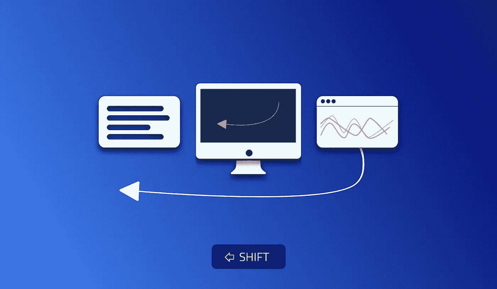

# 在不牺牲可靠性的情况下，有效弥补了 devo PS-R&D 之间的差距

> 原文：<https://medium.com/javarevisited/effectively-bridging-the-devops-r-d-gap-without-sacrificing-reliability-4379a818c86e?source=collection_archive---------1----------------------->

DevOps 文化彻底改变了我们的行业。持续交付和持续集成使得六西格玛可靠性变得司空见惯。20 年前，我们会踢开生产服务器，监听硬盘旋转，这就是可观察性。今天的 DevOps 团队部署监控工具，为开发团队提供对生产环境的深入了解。

> *"* 啊，勇敢的新世界里有这样的人在 t！
> 
> **—威廉·莎士比亚**

*在 DevOps 实践普及之前，生产经常失败。很多。我们不想回到 DevOps 工具普及之前的时代…*

*

Twitter Fail Whale 证明了 DevOps 的必要性* 

# *在我们的开发过程中，一切都很完美，对吗？*

*嗯……不。软件很难，尤其是在连续交付周期的快节奏下。我们总是会制造一些 bug，不幸的是，有些 bug 会被投入生产。那是不可避免的。*

*问题是这些投入生产的 bug 通过了我们的[持续集成管道。他们通过了测试环境。它们通常很难检测/重现错误——优步错误……我们努力建立的 DevOps 实践突然对我们不利。](/javarevisited/7-best-courses-to-learn-jenkins-and-ci-cd-for-devops-engineers-and-software-developers-df2de8fe38f3)*

# *那条细线(可能是蓝色的)*

*DevOps 团队通常独立于开发团队。他们之间有一条分界线。这并不太坏，并且非常适合敏捷开发过程。但是当开发团队需要调试时，它就失败了。这明显影响了软件质量。DevOps 方法确实显著提高了正常运行时间，但是产品中的 bug 仍然很多，并且需要更长的时间来修复。*

# *持续集成搅动*

*这种退化的第一个原因是持续的集成混乱。当我们在生产中遇到错误时，开发人员需要添加日志/信息，并通过连续交付管道来查看新的日志。如果他们做错了什么或错过了一些信息，就要“清洗-重复”一遍。*

*在一个敏捷团队快速前进的世界里，这是一个乏味且痛苦缓慢的过程，它会暂停开发周期。虽然持续的交付管道是翻腾，我们仍然有一个生产缺陷，我们仍然不明白。*

# *访问限制和安全团队*

*第二个原因更多的是关于孤立的团队，核心 DevOps 实践之一。我想强调的是，我们显然拥有并需要一种协作文化。那是明显的。但是 [DevOps](/javarevisited/7-free-google-cloud-devops-engineer-certification-courses-f0046ac39f7e) 也有责任将开发环境与阶段化和产品化分开。*

*将 [DevOps 工程师](/javarevisited/the-2018-devops-roadmap-31588d8670cb)和 R & D 分开的那条线是一条很好的线。这是一条重要的线。这是一条通过有组织的过程审查投入生产的一切来实现高质量软件的路线。*

*开发人员只想连接一个“调试器”并单步调试代码。这显然无法扩展，并且会导致生产系统崩溃。还有明显的安全问题…这就是为什么我们有一个 DevOps 工作流和筒仓很重要。*

# *开发和运营团队之间的协作*

*这不是一个新问题。快速交付和可靠性工程在正常情况下工作得很好，但是当我们需要跟踪一个错误的时候就不行了。此时，我们有两个选择:日志和可观察性工具。在我继续之前，我想强调的是，我们两者都使用，并且热爱它们。它们是软件开发生命周期的关键部分！*

# *日志*

*今天的日志不是前人的日志。DevOps 管道，过滤，索引他们在一个巨大的规模。事实上，企业在日志接收云基础设施上花费了数百万美元！*

*使用日志有一些限制:*

*   *成本——过度采伐是一个主要问题。它会降低应用程序的性能，并且可能非常昂贵*
*   *它是静态的——开发人员没有洞察力。他们不知道要记录什么，这就是他们过度记录的原因。尽管如此，一些信息经常丢失，这将我们送回到上面提到的连续部署周期*

# *可观察性工具*

*生产中有许多可观察性工具，但大多数都有一个共同点:它们被设计为 DevOps 工具链的一部分。它们不是为 R&D 设计的，也不提供开发者经常寻找的信息类型。*

*这些工具中的大多数都专注于度量和错误。这对一个 [DevOps 实践者](/javarevisited/7-best-linux-courses-for-developers-cloud-engineers-and-devops-in-2021-7415314087e1)来说是有意义的，但是一个产品 bug 经常在应用程序逻辑/UI 中表现出来。*

*最后，应用程序的性能会受到这种可观察性工具的影响。这些工具通过广泛监控和接收应用程序事件来工作。在紧张的生产环境中，它们的开销通常很明显。*

# *持续可观察性工具拯救世界*

*这些问题并不新鲜。结果，市场开始为开发人员提供一个尊重 DevOps 过程的工具。尊重安全实践和可靠性工程师的调试器。*

*持续可观测性工具是新一代的[云原生开发](/javarevisited/10-best-java-microservices-courses-with-spring-boot-and-spring-cloud-6d04556bdfed)。它们允许开发人员在代码级别查询正在运行的系统，而无需部署新版本。*

*让我们检查一下上面的问题:*

*   *日志成本——连续可观察性工具让我们可以动态地注入日志。这意味着开发人员可以减少日志的数量(开发人员可以根据需要注入更多日志)*
*   *更新的 CI/CD 周期——由于可以注入日志，开发人员不需要通过持续部署管道*
*   *这些工具是为开发者设计的，并与开发工具如[ide](/javarevisited/7-best-courses-to-learn-intellij-idea-for-beginners-and-experienced-java-programmers-2e9aa9bb0c05)集成。它们在源代码中直接提供开发人员需要的信息类型*
*   *性能开销很低。由于这些工具查询特定的代码区域，而不是整个应用程序，因此影响很小。最好的工具抑制特性以保持应用程序的性能*

# *这条线保留了*

*持续可观察性工具通过 DevOps 环境部署。这意味着开发人员不会绕开操作团队，我们保持分离，保护系统的可靠性。软件更新和所有维护仍然像以前一样通过单个开发团队传播。*

*如果你像我一样对可靠性工程和云原生开发充满热情，这是一个好消息。该工具的功能和可靠性让我们能够跟上发布的步伐，并在不影响安全性的情况下大规模调试产品。*

# *实际上，它是如何工作的？*

*该领域中使用的通用工具遵循一个用例，类似于普通应用程序开发中的调试器。生产中报告了一个问题，应用程序开发团队对应用程序做出了假设。这些假设可以使用快照、日志或指标(也称为行动)来验证。*

*快照是持续可观察性工具的主力，它们提供了对底层基础设施的深入了解。快照的工作非常像一个[断点](https://www.java67.com/2018/01/how-to-remote-debug-java-application-in-Eclipse.html)；它们提供了堆栈跟踪，其中包含堆栈帧上下文中的变量值。因此，它们甚至看起来像 IDE 中的 IDE 断点。但它们有一个区别:它们不会断裂。当前线程不会停止，也不会影响其他线程。*

*这意味着没有可以理解的“跨越”。但是有一些条件动作允许我们基于类似于条件断点的条件来放置快照(或任何动作)。例如，可以定义快照，因此只有特定用户才会触发快照来跟踪该用户遇到的问题。我们可以使用标签将它放在一组服务器上，这样我们就可以跟踪分布式服务器之间的问题。*

*日志，让我们添加日志，并与现有的无缝集成。这是一个关键的能力，因为最好按照上下文/顺序来阅读日志。根据 DevOps 团队所做的定义，它们也会与其他日志一起被摄取。*

*度量让我们度量代码或方法的小块。这些都是非常精细的度量，甚至像计数器这样简单的东西也非常有用。*

# *TL；DR 将持续可观察性应用到您的敏捷实践中*

*现代云环境非常复杂。由于我们都在采用云原生开发，我们不能给开发人员提供他们过去在生产中享受的访问级别。那是站不住脚的。在 DevOps 的整个生命周期中，一切都必须遵循关键实践。*

*这给我们留下了一个在大多数情况下都很健壮的系统，但是调试和故障排除要困难得多。组织文化有所帮助，但这还不够。质量保证没有抓住的错误是最难的错误，在生产中根据客户反馈分析它们是困难的。它耗时、昂贵，影响发布频率和代码质量。*

*现有的工具很棒，但它们是为 DevOps 团队设计的，而不是为开发人员设计的。bug 应该是开发团队的责任，但是我们不能指望开发人员在没有提供洞察力的工具的情况下解决 bug…*

*这就是持续可观察性工具背后的思想。这些工具不是 DevOps 平台的一部分，但它们由 DevOps 部署。从这个意义上说，他们保持分离。开发人员无法接触到产品。不过，他们可以安全地大规模调试它。*