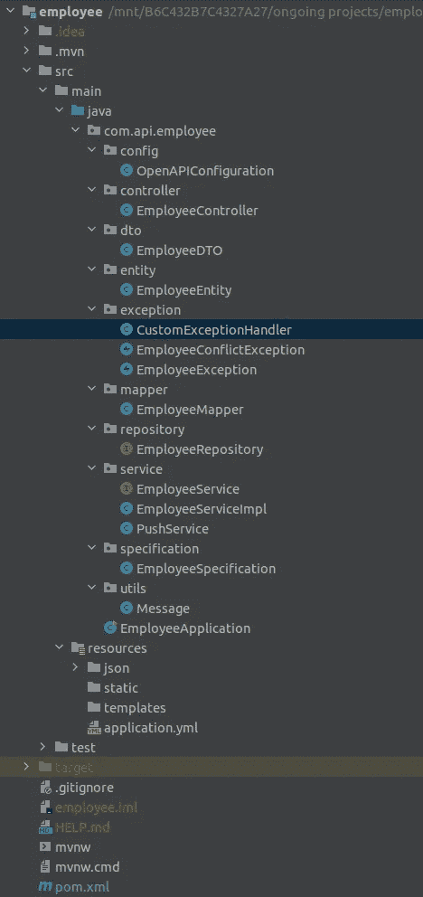
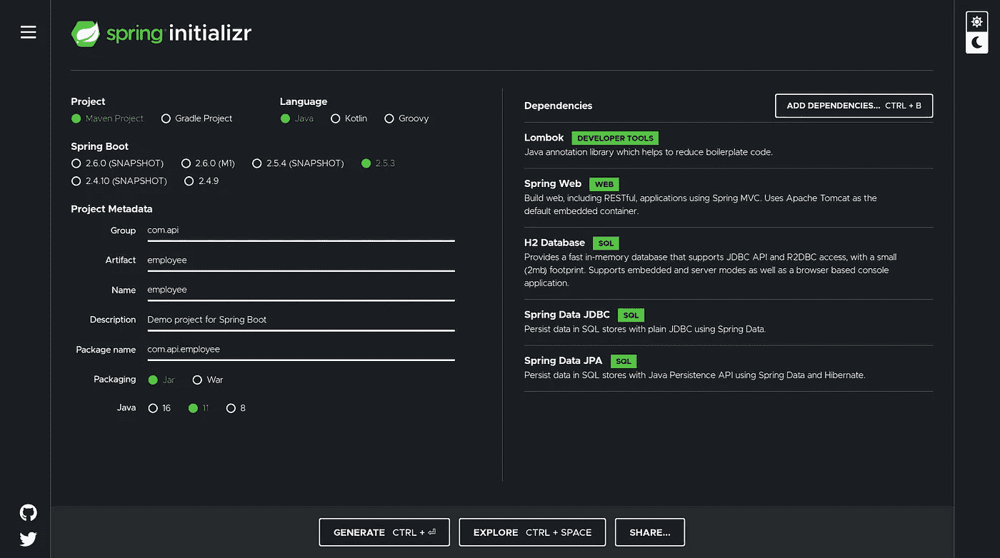
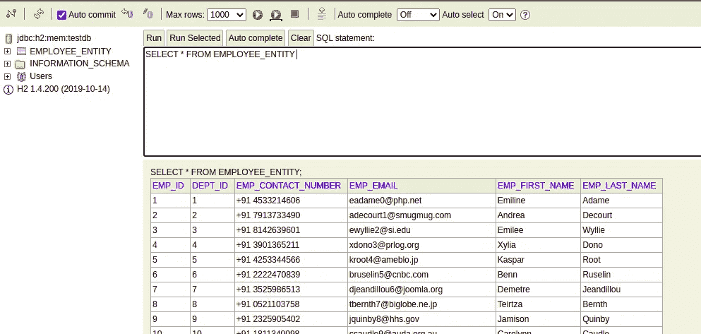
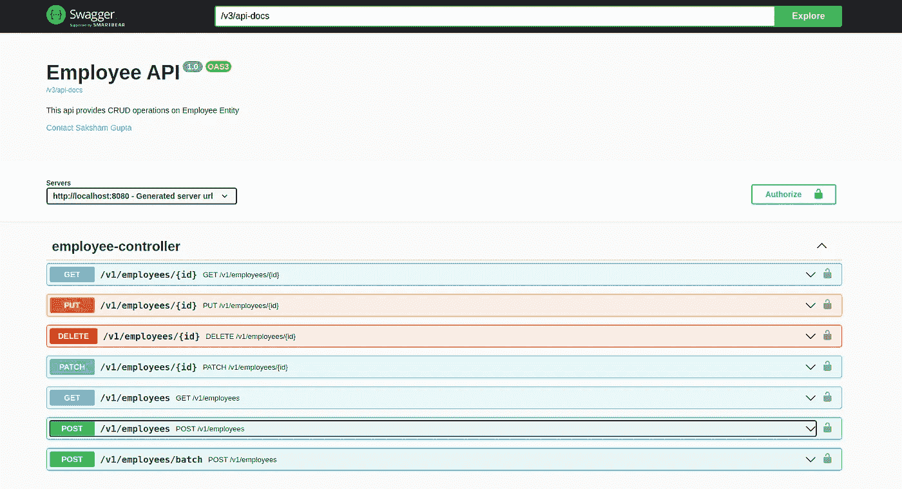
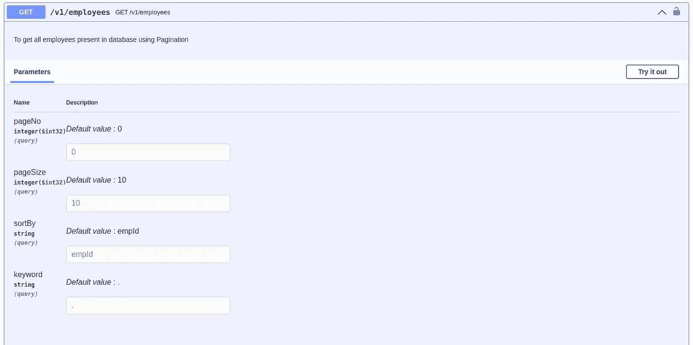

# 员工 API—Spring Boot[第 1 部分]

> 原文：<https://medium.com/javarevisited/employee-api-spring-boot-part-1-926c32014c9d?source=collection_archive---------1----------------------->

> 大家好！！！这是我的第一篇文章，作为分享我在 *DBS 银行暑期实习期间所学的一部分。*这是我们为了熟悉 Spring Boot 而不得不制作的模拟 API。

进一步的任务是添加两个数据库(非 SQL 和 SQL)到实际的 API 中(不泄露任何机密信息)。) .实际实现中使用了 MariaDB 和 MongoDB。在这篇文章中，我将介绍员工模拟 API，它将使用 H2 数据库，这是一个内存中的易失性数据库，但适合我们的需要[学习 Spring Boot](/javarevisited/top-10-courses-to-learn-spring-boot-in-2020-best-of-lot-6ffce88a1b6e) 并制作一个 API。这个 API 的一个关键特性是特定关键字的搜索特性。 *(PS:最后提供 github 链接)*

在雇员 API 的第 2 部分中，我将为地址添加一个组合键，为惟一标识添加一个组合主键。

在这个员工 API 的第 3 部分**中，除了 H2 数据库之外，我将添加 [MongoDB](/javarevisited/10-free-online-courses-to-learn-mongodb-and-nosql-942609611664) ，以了解如何在同一个 API 中连接两个数据库。**

[](https://www.java67.com/2018/06/5-best-courses-to-learn-spring-boot-in.html)

> 让我从我的角度谈谈 Spring Boot。我从 [NodeJS](https://www.java67.com/2019/07/top-5-free-nodejs-courses-for-web-development.html) 切换到 Spring 来创建一个 API，并且我个人精通 Java，我发现 Spring 真的很容易，而且锅炉代码少得多，加上对 [Java](/javarevisited/10-best-places-to-learn-java-online-for-free-ce5e713ab5b2) 的熟悉使我很容易切换。最初，人们可能会觉得我们需要大约 10 行代码来运行 Node 中的服务器，这与 Spring 相比要少得多，但是在 Spring 中，我们不需要提到任何代码来运行服务器，我们只需要编写我们的逻辑并观察它的工作。

从实际的实现开始，让我们看看目录结构，以理解事物是如何连接的。



**。idea** 包含了 [IntelliJ](/javarevisited/7-best-courses-to-learn-intellij-idea-for-beginners-and-experienced-java-programmers-2e9aa9bb0c05) 的所有设置和配置文件。

**。mvn** 包含来自 [maven](/javarevisited/6-best-maven-courses-for-beginners-in-2020-23ea3cba89) 的所有依赖文件。

src 包含了所有的代码文件，这些文件分别打包成不同的代码部分，从而利用了[的坚实原则](/javarevisited/10-oop-design-principles-you-can-learn-in-2020-f7370cccdd31?source=collection_home---4------1-----------------------)。

**目标**包含构建文件。

**。gitignore** 有不需要推送到 [GitHub](https://javarevisited.blogspot.com/2018/01/5-free-git-courses-for-programmers-to-learn-online.html) 的文件名。

pom.xml 拥有 maven 和 spring 的所有细节和依赖关系，包括版本信息和项目名称。

从项目开始，我们需要从[***Spring Initializr***](https://javarevisited.blogspot.com/2020/05/top-20-spring-boot-interview-questions-answers.html)下载项目设置 zip，在那里我们将选择我们的需求，它将为我们提供配置的项目文件。

请做出类似的选择，如下图所示。首先，我们添加了 API 所需的某些依赖项，即:

**Lombok-** 用于添加注释，代替一些常见的基本代码，如 Getters 和 Setters，Parameterised 和[No-Arguments constructor](https://javarevisited.blogspot.com/2014/01/why-default-or-no-argument-constructor-java-class.html)等。

Spring Web- 为我们提供了制作 [REST API](/javarevisited/10-best-java-web-services-rest-soap-and-api-courses-for-beginners-724a8f51298d) 所必需的有用特性，这是在 Spring 中运行应用程序所必需的。

**H2 数据库-** 为我们提供了一个内存数据库，我们不需要在本地安装任何数据库来测试我们的 API。这是一个基于 SQL 的数据库。

[**春季数据 JPA**](https://javarevisited.blogspot.com/2021/08/top-5-spring-data-jpa-courses-for-java.html) **和**[**JDBC**](/javarevisited/top-5-courses-to-learn-jdbc-and-database-connectivity-for-java-developers-free-and-best-of-lot-7945156fcc3)**-**为我们提供了必要的库。需要成功地在我们的 SQL 数据库上进行查询。

[](https://www.java67.com/2021/01/spring-data-jpa-interview-questions-answers-java.html)

**春初始**快照

接下来，我们可以解压缩。从上面下载 zip 并在我们的 IntelliJ 中打开它，添加一些必要的插件，即 *Lombok* (需要阅读 Lombok 注释)和 *SpringBootGen* (需要在开发时提出更好的建议)以使我们的开发更容易。

所有的设置和配置都在资源文件夹的 *application.yml* 文件中完成，这包括数据库连接和 **H2 控制台、**等。看起来像是:

我们需要在 *pom.xml* 中添加一些其他依赖项，包括验证、swagger 文档、open-ui 等。像这样:

我们现在完成了设置，并准备编写代码来使我们的 API 工作。我们的应用程序从*EmployeeApplication.java*开始，它包含了 *com.api.employee* 包中我们应用程序的主要功能和起始点。我们需要用[*@ spring boot application*](https://javarevisited.blogspot.com/2018/05/the-springbootapplication-annotation-example-java-spring-boot.html)对我们的类进行注释，之后 spring 将其标识为主类，如下所示:

我们需要提到我们的 employee 对象的模式，为此我们在 Employee 中创建了一个名为 *entity* 的包，在这里我们定义了 Employee POJO(普通旧 Java 对象)类，它看起来像:

在这里我们可以看到我们如何利用 Lombok 并跳过编写所有的 *getter、setter 和 constructors* 。 **@Entity** 注释使 spring 能够将其作为一个实体读取，该实体稍后通过存储库链接到[数据库](/javarevisited/5-best-books-to-learn-sql-and-database-design-for-programmers-and-developers-1e7839df2f3e)。 **@Id** 注释告诉我们，这个字段将用于唯一标识每个雇员，并作为我们对象的[主键](https://www.java67.com/2015/12/difference-between-primary-and-foreign.html)。

我们还向我们的雇员实体添加了**验证**，例如不能为空的字段标有 **@NotEmpty** ，我们用最小和最大范围指定了字段中条目的大小，我们还指定了电话号码可接受的模式以及格式不正确时需要显示的错误消息。

> 你可以注意到所有的属性都是私有的，这是为了保证我们数据的安全，任何修改或检索都只能通过 getters 和 setters 来完成。

接下来，我们将在包 *com.api.employee.dto* 中指定我们的 dto(数据传输对象),我们不希望将我们的所有数据或模式暴露给 api 的最终用户，因此我们使用 dto 作为最终用户和 api 之间的通信模式。对于我们的例子，我们将跳过 dto 中的 *deptNo* ，因为我们不想向消费者显示任何雇员的部门。EmployeeDTO class 看起来像这样:

接下来，我们可以添加一个存储库，它将我们的实体与数据库连接起来，使我们能够运行查询。我们在响应体中使用了 [**分页**](https://javarevisited.blogspot.com/2018/07/how-to-do-pagination-in-oracle-database.html#axzz6Cm5fkGBY) ，因此我们需要向 *findAll* ()函数提供一个**可分页**(包括页面大小、页码和排序顺序)对象，以及**规范**(包括我们稍后将定义并在服务层中使用的结构化格式的查询)和返回类型 **Page** 。

在控制器和服务层之前，我们可以首先编写其他实用程序类，帮助我们有效地利用 [OOPs 概念](/swlh/5-free-object-oriented-programming-online-courses-for-programmers-156afd0a3a73)并减少代码冗余，同时遵循可靠的原则和行业级应用程序结构。

这些包括*异常框架*(需要以正确的格式发送错误响应)*规范*(用于进行查询)*模型映射器*(需要将实体映射到 dto)*openapi configuration*(需要用于 Swagger 文档)和一个*消息*类。所有这些类都写在它们自己的包中(如显示目录结构的顶部所述)。

**异常类-** 我们将异常响应分为三类，这是因为目前我们的异常数量有限，但在大型应用程序中有许多错误，所有错误都应遵循相同的响应结构。

这个类指定了每个异常应该具有的字段。

这个类提到了可能发生的不同异常。

这个类充当异常监听器，即每当异常发生时，相应的方法被触发并发送异常响应。

**Specification Class-** 这个类为 like 和 equals 操作创建了不同的查询结构，我们也可以显式地[在存储库中编写 SQL 查询](https://javarevisited.blogspot.com/2017/02/top-6-sql-query-interview-questions-and-answers.html)，但是为了进行任何更改，我们需要编辑查询，这有时会很复杂，在大规模应用程序中并不可取。

**ModelMapper Class-** 它将属性从实体映射到 dto，反之亦然，以便在网络上传输。

**OpenAPIConfiguration-** 具有 Swagger 文档的设置，这是一个基于 GUI 的 web 应用程序，显示 API 中可用的所有操作以及执行这些操作的选项。

消息类- 它有一个简单的 POJO 结构，如果我们想给用户发送一个特定的消息，我们可以利用它。

现在我们可以来看看 API 和类中最关键的部分，它们是向最终用户公开的—*[***控制器***](https://javarevisited.blogspot.com/2017/11/difference-between-component-service.html) 。这里有所有的 CRUD 操作，还有一个端点可以将多个员工加在一起:*

*在控制器中需要注意的关键点是，它只接收请求并将它们传输到服务层。控制器用[**@ rest controller**](https://javarevisited.blogspot.com/2017/08/difference-between-restcontroller-and-controller-annotations-spring-mvc-rest.html#ixzz6OYNB9oii)(告诉 spring 这是控制器类，并在接收任何请求时查找其 url)和 **@RequestMapping** (指定该控制器将接收其请求的 url)进行了注释。*

*每个端点都由一个函数表示，并用它处理的请求类型(如 GET、POST 等)进行注释。在 **@Operation** 注释中提供的描述在 Swagger 中添加。 **@Valid** 检查请求体是否符合我们在 dto 和实体中提供的验证。*

*我们现在将编写 API 的核心部分，即服务层。从控制器传输的所有请求都在这里处理。我们定义的所有实用程序类都将在服务类中使用。*

*我们已经遵循了服务层的 [**接口**模型](https://www.java67.com/2014/02/what-is-actual-use-of-interface-in-java.html)，因为我们可以有许多服务层的实现，但它们都需要遵循相同的参数和由我们的接口指定的返回类型。*

*该类用 **@Service** 注释，它告诉 spring 将它包含在服务层中，如果我们有服务接口的多个实现，并且它在控制器中是[](https://javarevisited.blogspot.com/2017/04/difference-between-autowired-and-inject-annotation-in-spring-framework.html)**， **@Qualifier** 可以用来指定使用哪个接口实现。***

***service 中的其余代码非常简单，利用了我们为 API 编写的异常， *getAllEmployees* ()函数中的查询是通过我们提到的规范类生成的，实体在发送到控制器之前被转换为 d to。***

> ***由于我们在应用程序启动时没有任何数据，所以我添加了一个推送服务，它在应用程序启动时被调用，从资源文件夹中读取一个 json 文件，并将所有员工添加到数据库中。这里没有提到这部分代码，因为这篇文章已经很长了，你可以在所附的 github repo 链接中找到它。***

***您还可以使用 h2 控制台查看在 H2 数据库中创建的表，在您的浏览器上转到此 URL([*http://localhost:8080/H2*](http://localhost:8080/h2))并使用 *application.yml* 中的 id 和密码登录，该表如下所示:***

******

*****Github 回购链接:-*****

***[](https://github.com/drunkenlegend/Employee-API) [## GitHub-drunken legend/Employee-API:这是我在学习 Spring Boot 时制作的模拟 API…

### 这是我在星展银行实习期间做的模拟 api，作为我学习 Spring Boot 的一部分。- GitHub …

github.com](https://github.com/drunkenlegend/Employee-API) 

嘿，我们已经按照一些行业标准编写了我们的第一个 API，如果你想知道 **Swagger 文档**看起来怎么样…..给你！！！



这里显示了所有的端点，还提供了关于它们的请求和响应结构的更多细节。



基于搜索关键字和页面结构的 getAllEmployee 端点示例。

```
//This is the Response Body Structure
{
  "totalPages": 0,
  "totalElements": 0,
  "size": 0,
  "content": [
    {
      "empId": 0,
      "empFirstName": "string",
      "empLastName": "string",
      "empEmail": "string",
      "empContactNumber": "string"
    }
  ],
  "number": 0,
  "sort": {
    "sorted": true,
    "unsorted": true,
    "empty": true
  },
  "pageable": {
    "offset": 0,
    "sort": {
      "sorted": true,
      "unsorted": true,
      "empty": true
    },
    "pageNumber": 0,
    "pageSize": 0,
    "paged": true,
    "unpaged": true
  },
  "numberOfElements": 0,
  "first": true,
  "last": true,
  "empty": true
}
```

帖子开头提到的第二部分和第三部分将会及时更新，因为这是我的第一篇帖子，花了一些时间才完成。

感谢你走了这么远，我希望它增加了你对春天的理解，并在某些方面帮助了你。

再见，在我的下一篇文章中再见。！！！***