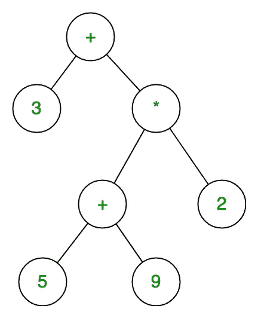
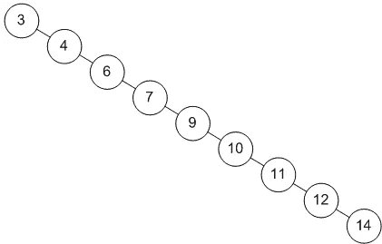

# 二元表达式树的评估

> 原文：<https://medium.com/javarevisited/evaluation-of-binary-expression-tree-6768db3be82f?source=collection_archive---------2----------------------->

来自顶级科技公司现场采访的编码挑战

在 [Unsplash](https://unsplash.com?utm_source=medium&utm_medium=referral) 上拍摄的 [ThisisEngineering RAEng](https://unsplash.com/@thisisengineering?utm_source=medium&utm_medium=referral)

在这里，我将描述我在一家世界著名的顶级科技公司的现场采访中遇到的编码挑战。是的，现场采访是疫情会议之前的活动。你去了公司，所有东西都付了钱。免费机票、酒店、餐饮！不幸的是，如今现场面试被虚拟面试所取代。

首先，获得现场面试的邀请既困难又耗时。从招聘人员的第一次联系，发回简历，然后是在线编码挑战评估，然后是工程师和招聘人员的两次电话面试。是的，在他们最终邀请我之前，我应该确认如果他们邀请我，我会把自己重新安置到一个外国。

在现场面试中，我有 3 个编码挑战和一个系统设计面试。最终，我没有收到 offer。但是这个我描述的编码挑战，我表现得很好。因此，这是最简单的编码挑战，其他两个要困难得多。

编码挑战是:编写一个评估二进制表达式树的方法。二进制表达式树是这样一种二叉树，其中每个内部节点对应于操作符，每个叶节点对应于操作数，因此例如 3 + ((5+9) * 2)的表达式树将是:

**二元表达式树示例**

这个二元表达式树的求值结果应该是 31。

我有大约 25-30 分钟的时间来完成这项任务。你在空白编辑器中编码，没有 IDE(集成开发环境)的帮助，也没有 Google 的帮助。程序应该可以编译并运行。不容易？

当你接到这样的任务时，你能做的最糟糕的事情就是没有额外的问题就开始编码。你应该问自己是否很好地理解了任务，以及边缘情况。如果你什么问题都不问，说明你即使在日常工作中也不把事情说清楚。没有人愿意雇佣一个自己编写代码的人，没有说明。简直是浪费时间和金钱！

所以我问了一大堆问题:

1.  二叉树的价值是什么？它是可以包含数字或运算符+、-、*和/之一的字符串数据类型吗？或者二叉树节点有两个值字段，一个数字字段和一个运算符字段？

答案是:二叉树的值是一个字符串字段。

2.如果二叉树的值是一个数(字符串数据格式)，它是某个带十进制值的实数(比如 2.33)，还是某个整数(比如 3)？

答案是:它是一个整数。

3.树可以是空的吗？

答案是:不，它至少有一个元素。

4.我能算出树处于正确的状态吗？换句话说，它是一棵结构良好的二叉表达式树吗？

答案是:是的，这是一个结构良好的二进制表达式树。

5.被零除可能吗？

答案是:不，不可能。

当我收到所有这些答案时，我开始编码。在编码期间，我解释了我所做的。简而言之，我说过有两种主要的树(或图)遍历方式:BFS(广度优先搜索)和 DFS(深度优先搜索)。在 DFS 中，树的遍历主要有 3 种方式:按序遍历(左-节点-右)、后序遍历(左-节点-右)和前序遍历(节点-左-右)。BFS 通常用于图的路径问题。所以很自然，我们会在这里使用 DFS，DFS 前序遍历。使用前序遍历是最自然的，因为我们需要看到节点值是什么来决定下一步做什么:如果它是一个数字，那么它就是叶子，我们应该立即返回那个数字；如果是运算符，那么我们需要看到左树的总值(作为数字)和右树的总值(也作为数字)，以便对这些值应用运算符。

最终解决方案是:

二元表达式树的评估

最后的话是关于解决方案的运行时间和空间复杂性。运行时复杂度是 O(N ),因为我们只遍历每个节点一次(N 是树节点的数量)。

空间复杂度呢？对于 DFS 树遍历，它沿着单个“树分支”一直向下，并使用堆栈实现(每个递归方法调用都放在堆栈上)，树的高度很重要。DFS 的空间复杂度是 O(h ),其中 h 是树的最大高度。一般来说，树可以是倾斜的(像一个列表，所有节点在一个分支上)，在这种情况下，空间复杂度也是 O(N)。

倾斜二叉树

关于偏斜二元表达式树，由于叶子是数字，节点是二元运算符，所以偏斜二元表达式树的每一层(除了根层)包含 2 个节点，所以空间复杂度为 O(N/2)。但是，因为 Big-O 符号不关心常数，所以最终的空间复杂度也是 O(N)。

## 结论

这里描述了对编码挑战的成功响应。你越了解它在现实中的样子——你就越有可能成功地成为高科技社区的一员。

祝你好运，继续编码！