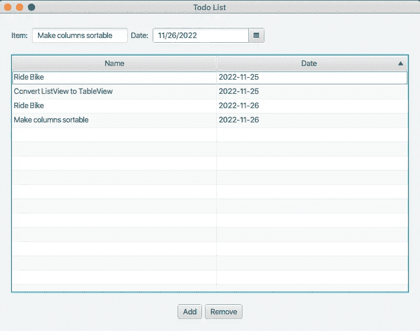

# 在 JavaFX 中试验 Java 记录、日期选择器和表视图

> 原文：<https://medium.com/javarevisited/experimenting-with-java-records-datepicker-and-tableview-in-javafx-446ff272dfd2?source=collection_archive---------3----------------------->

将我的 JavaFX ToDoList 从 ListView 升级到 TableView



我的 ToDoList 从 ListView 升级到带有两个可排序列的 TableView

# 将我的 JavaFX 升级到 DoList 应用程序

在我的 Java ToDoList 的第一次迭代中，我使用了 JavaFX `ListView`组件。在第一次迭代中，我只是在 ToDo 列表中保存了一个字符串`List`。你可以在下面的博客中看到我第一次迭代的结果。

[](https://donraab.medium.com/my-first-javafx-application-ee70a1d48cb3) [## 我的第一个 JavaFX 应用程序

### 通过在 IntelliJ 中构建简单的 TodoList 应用程序来学习 JavaFX

donraab.medium.com](https://donraab.medium.com/my-first-javafx-application-ee70a1d48cb3) 

我决定让我的待办事项列表按日期记录待办事项。所以我需要在我的待办事项列表中保留一些比字符串更复杂的东西。

# 将待办事项创建为记录

因为我在 Java 17 中开发这个应用程序，所以我把我的`ToDoItem`变成了 Java `record`。从 Java 14 开始，Java 就支持记录。

这是我的`ToDoItem`的第一次迭代。

```
public record ToDoItem(String name, LocalDate date) {}
```

我在`TodoController`类中定义了这个`ToDoItem`记录。一个`ToDoItem`有名字和日期。我本能地使用 Java Time 中的`LocalDate`作为日期类型，并希望 JavaFX 能够神奇地支持这种类型。

# 添加日期选择器

JavaFX 有一个名为`DatePicker`的组件，它以我希望的方式工作。我在我的待办事项的`TextField`旁边添加了`DatePicker`。

```
<HBox id="HBox1" alignment="CENTER_LEFT" spacing="5.0">
    <Label text="Item: " />
    <TextField fx:id="todoItem" />
    <Label text="Date: " />
    <DatePicker fx:id="todoDate" />
</HBox>
```

我将`DatePicker`绑定到一个名为`todoDate`的变量，并将其添加到我的`TodoListController`中。现在，当我在`TodoListController`中更改`onAddButtonClick`代码时，发生了一个惊喜。

```
@FXML
protected void onAddButtonClick()
{
    ToDoItem item = new ToDoItem(
        this.todoItem.getText(), 
        this.todoDate.getValue());

    this.todoList.getItems().add(item);
}
```

从`DatePicker`实例获取日期值的代码返回一个`LocalDate`！天哪！我没想到会这样，但我感到惊喜。

# 将 ListView 转换为 TableView

从`ListView`转换到`TableView`时，我的目标是尽可能多地将 UI 代码保留在 FXML 中。我原本以为必须通过编程来做更多的事情，因为我使用 Java 记录来定义我的`ToDoItem`类。我认为 JavaFX 可以更容易地与普通的 JavaBean 一起工作。我认为在最坏的情况下，我可以在我的`ToDoItem`记录中添加 getter 方法。

这就是我在 FXML 文件中完成的`TableView`定义。

```
<TableView fx:id="todoList">
    <columns>
        <TableColumn text="Name" minWidth="75.0" sortable="true">
            <cellValueFactory>
                <PropertyValueFactory property="name" />
            </cellValueFactory>
        </TableColumn>
        <TableColumn text="Date" minWidth="50.0" sortable="true">
            <cellValueFactory>
                <PropertyValueFactory property="date" />
            </cellValueFactory>
        </TableColumn>
    </columns>
</TableView>
```

为了使用`PropertyValueFactory`，我不得不在我的`ToDoItem`记录中添加 getter(`getName`和`getDate`)。我知道我本可以使用带有`setCellValueFactory`的 lambda，但是这需要我在我的控制器类中放入更多的代码，我还不想这么做。

最后，正如您在上面的 FXML 片段中看到的，我能够简单地为两列设置一个名为`sortable`到`true`的属性。这使得我的待办事项列表可排序。

# 到目前为止，一切顺利

在我的待办事项应用程序中，没有太多其他需要改变的地方。下面是我的 FXML、应用程序和控制器文件的代码。

`todolist-view.xml`

```
<?xml version="1.0" encoding="UTF-8"?>

<?import javafx.geometry.Insets?>
<?import javafx.scene.control.Button?>
<?import javafx.scene.control.cell.PropertyValueFactory?>
<?import javafx.scene.control.DatePicker?>
<?import javafx.scene.control.Label?>
<?import javafx.scene.control.TableColumn?>
<?import javafx.scene.control.TableView?>
<?import javafx.scene.control.TextField?>
<?import javafx.scene.layout.HBox?>
<?import javafx.scene.layout.VBox?>
<VBox alignment="CENTER" spacing="20.0" xmlns:fx="http://javafx.com/fxml"
    fx:controller="example.todolist.TodoListController">
    <padding>
        <Insets bottom="20.0" left="20.0" right="20.0" top="20.0" />
    </padding>

    <HBox id="HBox1" alignment="CENTER_LEFT" spacing="5.0">
        <Label text="Item: " />
        <TextField fx:id="todoItem" />
        <Label text="Date: " />
        <DatePicker fx:id="todoDate" />
    </HBox>
    <TableView fx:id="todoList">
        <columns>
            <TableColumn text="Name" minWidth="75.0" sortable="true">
                <cellValueFactory>
                    <PropertyValueFactory property="name" />
                </cellValueFactory>
            </TableColumn>
            <TableColumn text="Date" minWidth="50.0" sortable="true">
                <cellValueFactory>
                    <PropertyValueFactory property="date" />
                </cellValueFactory>
            </TableColumn>
        </columns>
    </TableView>
    <HBox id="HBox2" alignment="CENTER" spacing="5.0">
        <Button text="Add" onAction="#onAddButtonClick" alignment="BOTTOM_LEFT" />
        <Button text="Remove" onAction="#onRemoveButtonClick" alignment="BOTTOM_RIGHT" />
    </HBox>
</VBox>
```

`TodoListApplication`阶级

```
package example.todolist;

import javafx.application.Application;
import javafx.fxml.FXMLLoader;
import javafx.scene.Scene;
import javafx.stage.Stage;

import java.io.IOException;

public class TodoListApplication extends Application
{
    @Override
    public void start(Stage stage) throws IOException
    {
        FXMLLoader fxmlLoader = new FXMLLoader(
                TodoListApplication.class.getResource("todolist-view.fxml"));
        Scene scene = new Scene(fxmlLoader.load(), 640, 480);
        stage.setTitle("Todo List");
        stage.setScene(scene);
        stage.show();
    }

    public static void main(String[] args)
    {
        TodoListApplication.launch();
    }
}
```

`TodoListController`类

```
package example.todolist;

import java.time.LocalDate;

import javafx.collections.FXCollections;
import javafx.collections.ObservableList;
import javafx.fxml.FXML;
import javafx.scene.control.DatePicker;
import javafx.scene.control.TableView;
import javafx.scene.control.TextField;
import org.eclipse.collections.api.factory.Lists;
import org.eclipse.collections.api.list.MutableList;

public class TodoListController
{
    @FXML
    private TextField todoItem;

    @FXML
    private DatePicker todoDate;

    @FXML
    private TableView<ToDoItem> todoList;

    @FXML
    protected void initialize()
    {
        this.todoList.setColumnResizePolicy(TableView.CONSTRAINED_RESIZE_POLICY);
        MutableList<ToDoItem> items = Lists.mutable.empty();
        ObservableList<ToDoItem> list = FXCollections.observableList(items);
        this.todoList.setItems(list);
    }

    @FXML
    protected void onAddButtonClick()
    {
        ToDoItem item = new ToDoItem(
                this.todoItem.getText(),
                this.todoDate.getValue());

        this.todoList.getItems().add(item);
    }

    @FXML
    protected void onRemoveButtonClick()
    {
        int indexToRemove = this.todoList.getSelectionModel().getSelectedIndex();
        this.todoList.getItems().remove(indexToRemove);
    }

    public record ToDoItem(String name, LocalDate date) {

        public String getName()
        {
            return this.name;
        }
        public String getDate()
        {
            return this.date.toString();
        }
    }
}
```

# 后续步骤

我的下一步将是使我的待办事项列表持久化。我可能会看看是否可以使用 [Jackson 对 Eclipse 集合的支持](https://github.com/FasterXML/jackson-datatypes-collections)来写出和读入 ToDo 列表中的数据。我使用了来自 [Eclipse 集合](https://github.com/eclipse/eclipse-collections)的`MutableList`，并使用名为`FXCollections`的 JavaFX 实用程序类将其包装在一个`ObservableList`中。如果我不在 ToDo List 应用程序中使用 Eclipse 集合，我就不会是一个 Eclipse 集合的拥护者。😀

感谢您的阅读！

*我是*[*Eclipse Collections*](https://github.com/eclipse/eclipse-collections)*OSS 项目的创建者和提交者，该项目由*[*Eclipse Foundation*](https://projects.eclipse.org/projects/technology.collections)*管理。Eclipse Collections 为* [*投稿*](https://github.com/eclipse/eclipse-collections/blob/master/CONTRIBUTING.md) *开放。*