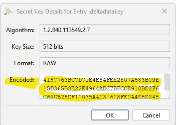

# 探索 Java 密钥库和密钥

> 原文：<https://medium.com/javarevisited/exploring-java-keystore-keys-9eb4805fa4ec?source=collection_archive---------0----------------------->

通过代码

> 什么是密钥库？

**KeyStore** 是**密钥**的容器，就这么简单。

实体钥匙柜

让我们了解一下**密钥**，然后*它是如何存储*在 [**密钥库**](https://www.java67.com/2012/09/keytool-command-examples-java-add-view-certificate-ssl.html) 中的。

> [那么，那些键是什么？](#a198)
> 
> 他们看起来怎么样？
> 
> [如何创建一个？](#370d)
> 
> 我们会用它做什么？

和

> 密钥是如何存储在密钥库中的？

我们来一一回答。

在深入研究之前，如果您正在寻找创建一个[自签名证书](https://javarevisited.blogspot.com/2013/07/how-ssl-https-and-certificates-works-in-java-web-application.html)，那么请随意查看这个帖子，

 [## 自签名证书

### 本地主机

suriyaprakhash.medium.com](https://suriyaprakhash.medium.com/self-signed-certificate-d545d6054327) 

## ***那些钥匙是什么？***

顾名思义，钥匙类似于我们用来开门/锁门的家里的钥匙。

物理键

在日常生活中，我们使用不同类型的钥匙，比如家里的、汽车的、车库的、办公室的、书桌的、保险箱的、银行存物柜的等等，来保护我们的财产和所爱的人的安全。

类似地，**密钥**是一个类似于我们密码的软件令牌，用它我们可以*锁定/解锁*我们的秘密信息。

***如果类似于密码，为什么不能直接用密码？***

*密码*由**人类**创建，可能包含来自其*配偶姓名、出生日期*的字符，并且可能很容易被*破解*或*猜测*。

另一方面，**密钥**可以通过实现难以猜测的 ***密码算法*** 来帮助加强*密码*。

## ***他们长得怎么样？***

它们有不同的形式，类似于我们的物理密钥，如*私钥、公钥、密钥对、秘密密钥。这是他们标准语法的样子。*

[ASN.1 格式](https://en.wikipedia.org/wiki/ASN.1)

然而，当它被传输或读取时，它通常是以一种**编码的**标准格式 X.509 或 PKCS#8。

编码

## ***如何创建一个？***

可以通过命令行 [keytool](https://docs.oracle.com/javase/8/docs/technotes/tools/unix/keytool.html) 或者使用像 [KeyStore Explorer](https://keystore-explorer.org/) 这样的工具或者甚至通过编程来创建密钥。

我们至少需要知道 ***键类型*** 和*****算法*** 来开始创建一个。**

****按键类型****

**这些是钥匙的主要类型，**

*   **密钥对—私钥、公钥**
*   **秘密钥匙**

**像[赏金城堡](https://www.bouncycastle.org/latest_releases.html)这样的外部库支持其他不同的密钥类型。**

****支持的算法****

**下面这段代码将列出所有*支持的算法*，这些算法可用于生成**密钥**或**密钥对****

**一旦我们知道了**键的类型。**生成一个非常简单。这里有一个简单的 Java 代码来生成一个随机的**密钥。****

**返回的**密钥**可用于加密秘密。**

## **我们能用它做什么？**

**从技术上讲，我们可以根据自己的需求做不同的事情。范围缩小到什么是 ***秘密*** *信息*以及我们将如何使用或共享*信息*。**

****

**典型的公钥证书**

**这里详细说明了如何在[***SSL***](/javarevisited/best-https-ssl-and-tls-courses-for-beginners-4437661250b3)***证书*** 中使用它的示例，**

** [## SSL 证书

### 了解 SSL 基础知识

medium.com](/@suriyaprakhash/ssl-certificate-67b4e3bdee38) 

也用在 [SSH](https://javarevisited.blogspot.com/2020/05/10-example-of-ssh-command-in-linux-and.html) ，IOT，许可证，电子邮件，通信协议等。

SSH 方式认证进入 [Github](http://github.com)

## 密钥是如何存储在密钥库中的？

被人说中了要害。让我们看看它们是如何储存的。如前所述， **KeyStore** 是作为 ***条目的 **Key** s 的集合列表。***

包含多个密钥(公共证书、私钥和公钥的密钥对、SecretKey)的密钥库

类似于**密钥**，我们有[类似的工具](https://docs.oracle.com/javase/8/docs/technotes/tools/unix/keytool.html)来创建*密钥库*。但是，在这个演示中，我们将研究创建一个的编程方式。

最后，我们回答了我们的问题。**