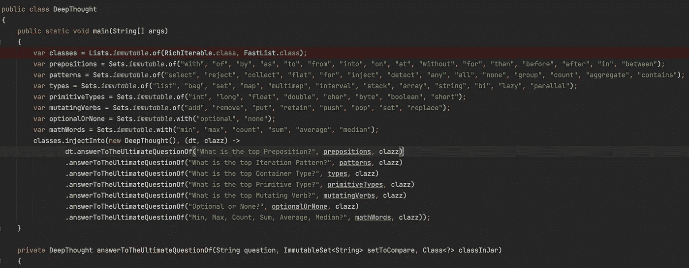

# 寻找关于 Eclipse 集合的终极问题的答案

> 原文：<https://medium.com/javarevisited/finding-answers-to-the-ultimate-questions-about-eclipse-collections-a0f9953b8fa?source=collection_archive---------1----------------------->

Eclipse 集合 API 中最常用的词是什么？


我最近从佛罗里达回来时拍的一张照片启发我思考一些问题

# 背景

上世纪 80 年代，我十几岁的时候读过《T2 银河系漫游指南》三部曲。我运行了几年的公告板系统，那是我第一次接触到书籍的时候。近四十年来，这些书一直是我的最爱。我经常向和我一起工作的开发人员推荐这个系列。

[深思](https://en.wikipedia.org/wiki/List_of_The_Hitchhiker%27s_Guide_to_the_Galaxy_characters#Deep_Thought)是道格拉斯·亚当斯写的《[银河系漫游指南](https://en.wikipedia.org/wiki/The_Hitchhiker%27s_Guide_to_the_Galaxy)系列丛书中的一台虚拟计算机。深度思考是为了回答生命、宇宙和万物的终极问题而建立的。如果你想知道答案，我强烈推荐你去看书。

我决定构建一个名为`DeepThought`的 Java 类，它可以回答我关于 [Eclipse 集合](https://github.com/eclipse/eclipse-collections) API 中方法的所有终极问题。我开始想知道“最常用的介词是什么？”然后我想知道 API 中最常引用的迭代模式、容器类型、原始类型和可变动词。我使用 Eclipse 集合来回答这些问题。谢天谢地，我不必为这些答案等待 750 万年。

# 构建深度思考的 Java 版本

下面是我的 Java 版本的`DeepThought`的代码快照。



deep think Java 类

得出每个终极问题答案的过程如下。

1.  在一个 JAR (Java 归档文件)的所有类中查找所有方法名
2.  展平每个方法名中的所有单词(基于适当的大小写名称)
3.  根据特定单词集中包含的内容过滤所有单词
4.  按照包含的匹配单词对所有方法名进行分组，并打印出现次数最多的五个方法名
5.  查找指定单词集中出现次数最多的单词(答案！)

# 答案

我向`DeepThought`询问 Eclipse Collections API 中顶级介词、模式、类型、基本类型和变异动词的终极问题的答案。代码分别查看了`eclipse-collections-api-11.1.0.jar`(使用`RichIterable.class`)和`eclipse-collections-11.1.0.jar`(使用`FastList.class`)中的类。这段代码应该也适用于其他 JAR 文件，只要它们在类路径上，并且您引用了 JAR 中的一个类。注:我没有用其他罐子试过，所以 YMMV。

# 源头

以下是要点中的完整源代码:

您必须将这个类添加到某个包中，并拥有一个包含以下 Maven 依赖项的项目，以便让它工作。我使用了 Java 17 并使用了`var`关键字来缩短代码，纯粹是为了网页可读性。如果您在 IDE 中尝试这样做，如果有任何不清楚的地方，您可以扩展类型。

```
<**dependency**>
    <**groupId**>org.eclipse.collections</**groupId**>
    <**artifactId**>eclipse-collections-api</**artifactId**>
    <**version**>11.1.0</**version**>
</**dependency**>

<**dependency**>
    <**groupId**>org.eclipse.collections</**groupId**>
    <**artifactId**>eclipse-collections</**artifactId**>
    <**version**>11.1.0</**version**>
</**dependency**>

<**dependency**>
    <**groupId**>org.eclipse.collections</**groupId**>
    <**artifactId**>eclipse-collections-testutils</**artifactId**>
    <**version**>11.1.0</**version**>
    <**scope**>test</**scope**>
</**dependency**>
```

# 司法、土地退化和干旱方面的挑战

也许 José Paumard 会发现这一组特殊的问题对于 JLDD(时差驱动开发)挑战来说足够有趣。我在这篇博客中使用的图片是在从佛罗里达返回的晚间航班上拍摄的，这是我自 2020 年 2 月以来的第一次飞行。十月份 JavaOne 的一些 JLDD 挑战给了我灵感。

# **寻找更大问题的答案**

并不是所有的答案都像一个单词一样简单。有些问题需要更深刻的理解和更广阔的世界观。在 HHGTTG 中，深层思考不得不委托建造一台更大的计算机来回答一个更困难的问题。

使用可视化可以帮助我们人类简化事情。如果您想更深入地理解 Eclipse 集合，那么我建议从下面的博客开始。这将有助于解释为什么 API 中有如此多的单词，以至于`DeepThought`不得不从头到尾扫描一遍，以得出一个单词的答案。

</oracledevs/visualizing-eclipse-collections-646dad9533a9>  

# 最后的想法

我希望您喜欢这次对 Eclipse 集合 API 的探索。作为这个练习的一部分，我学到了一些有趣的东西。我一直想知道如何以编程方式在一个 JAR 中加载所有的类。我不确定这是不是最好的方法，但是对于我的特定实验来说，它似乎非常有效。我不想硬编码对. jar 文件的引用，所以发现这个小东西很有趣。

```
URL location = clazz.getProtectionDomain().getCodeSource().getLocation();
```

这允许我通过简单地使用 JAR 中的一个类来找到类路径上的 JAR 位置。我以前从未尝试过这个。然后我可以使用`JarFile`和`JarEntry`来获取所有的类名并加载它们。我喜欢尝试随机实验，学习新的有用的东西。

我希望你喜欢阅读这篇博客，并找到我对 Eclipse Collections API 的终极问题的答案，至少有点娱乐性。

感谢您的阅读！尽情享受吧！

*我是由*[*Eclipse Foundation*](https://projects.eclipse.org/projects/technology.collections)*管理的*[*Eclipse Collections*](https://github.com/eclipse/eclipse-collections)*OSS 项目的创建者和提交者。Eclipse Collections 为* [*投稿*](https://github.com/eclipse/eclipse-collections/blob/master/CONTRIBUTING.md) *打开。*