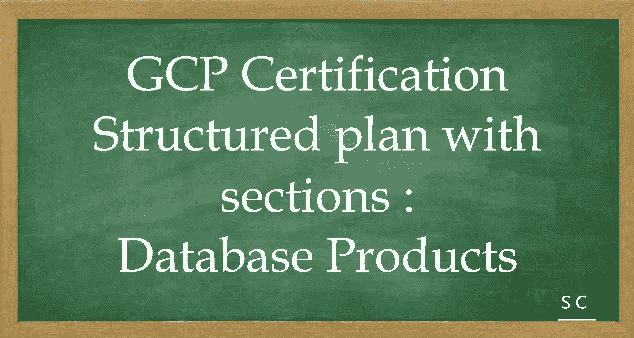

# GCP 认证-让我们一起航行。结构化计划包含以下部分:数据库产品。

> 原文：<https://medium.com/javarevisited/gcp-certification-lets-sail-together-structuredplan-with-sections-database-products-3f93eb39cab5?source=collection_archive---------4----------------------->



大家好，

[1 分钟了解谷歌云认证|谷歌云博客](https://cloud.google.com/blog/topics/developers-practitioners/get-know-google-cloud-certifications-1-minute)

在此，我向您展示一份包含多个部分的结构化计划，作为计划获得解决方案架构师认证的云有志者的参考。

**了解基本知识:**

1.  [云计算简介](/javarevisited/10-free-courses-to-learn-cloud-computing-for-beginners-4f3cd984ddb1)
2.  不同云平台的概述([AWS](/javarevisited/5-best-aws-courses-for-beginners-and-experienced-developers-to-learn-in-2021-563212409fbd)/[Azure](/javarevisited/5-best-azure-fundamentals-courses-to-pass-az-900-certification-exam-in-2020-9e602aea035d)/[GCP](/javarevisited/5-best-courses-to-learn-google-cloud-platform-gcp-in-2021-169093a3771a))—一个很好的对比[将 AWS 和 Azure 服务与谷歌云进行对比](https://cloud.google.com/free/docs/aws-azure-gcp-service-comparison)
3.  [谷歌云平台](/javarevisited/5-best-courses-to-learn-google-cloud-platform-gcp-in-2021-169093a3771a)及其可用产品概述

**感受谷歌云产品:** [*产品说明书*](https://raw.githubusercontent.com/gregsramblings/google-cloud-4-words/master/DarkPoster-lowres.png)

1.  [网络产品](https://cloud.google.com/products/networking)
2.  [计算产品](https://cloud.google.com/products/compute)
3.  [存储产品](https://cloud.google.com/products/storage)
4.  [集装箱](https://cloud.google.com/products/#section-6)
5.  [开发者工具](https://cloud.google.com/products/tools)
6.  [安全和身份产品](https://cloud.google.com/products/security-and-identity)

…..更多，但这应该有助于您开始并在您的旅程中不断增加。

在动手之前，先熟悉

1.  [谷歌云控制台](https://cloud.google.com/cloud-console)
2.  [Google Cloud shell](https://cloud.google.com/shell) — [命令行](https://cloud.google.com/sdk/gcloud)工具是创建和管理 Google Cloud 资源的主要 CLI 工具
3.  [谷歌云存储](https://cloud.google.com/storage) — [gsutil 访问它](https://cloud.google.com/storage/docs/gsutil)
4.  [bq 命令行工具](https://cloud.google.com/bigquery/docs/bq-command-line-tool) —基于 Python 的 BigQuery 命令行工具。
5.  [地区和区域](https://cloud.google.com/compute/docs/regions-zones)和[全球位置](https://cloud.google.com/about/locations)

*—————**数据库**启动— — — — *

**SQL 数据库服务**

[云 SQL](https://cloud.google.com/sql/docs) — Imp [高可用性配置概述](https://cloud.google.com/sql/docs/mysql/high-availability)

[云 SQL 草图注释](https://thecloudgirl.dev/gcpsketchnote3.html)

1.  [MySQL 的云 SQL](https://cloud.google.com/sql/docs/mysql)
2.  [云 SQL for PostgreSQL](https://cloud.google.com/sql/docs/postgres)
3.  [针对 SQL Server 的云 SQL](https://cloud.google.com/sql/docs/sqlserver)

[云扳手](https://cloud.google.com/spanner/docs)

[云扳手草图注释](https://thecloudgirl.dev/images/spanner.jpg)

*————**数据库**继续— — — *

**NoSQL 数据库服务**

1.  [云 Bigtable](https://cloud.google.com/bigtable/docs) — [草图注释](https://thecloudgirl.dev/Bigtable.html)(低延迟/高吞吐量主要特性)
2.  [Firestore](https://cloud.google.com/firestore/docs) — [草图注释](https://thecloudgirl.dev/firestore.html)

[原生模式下的 Firestore](https://cloud.google.com/firestore/docs/firestore-or-datastore#in_native_mode)—适用于新的移动和网络应用

[数据存储模式下的 Firestore](https://cloud.google.com/firestore/docs/firestore-or-datastore#in_datastore_mode)—用于新的服务器项目

1.  【Memcached 的 Memorystore】
2.  【Redis 的存储库

*—————**数据库**继续— — — — *

云 SQL 支持以下类型的复制副本:

*   [读取副本](https://cloud.google.com/sql/docs/mysql/replication#read-replicas)
*   [跨区域读取副本](https://cloud.google.com/sql/docs/mysql/replication#cross-region-read-replicas)
*   [外部读取副本](https://cloud.google.com/sql/docs/mysql/replication#external-read-replicas)
*   从外部服务器复制时的云 SQL 副本

*————**数据库**继续— — — — *

**总结**:

*   如果您需要低延迟和高吞吐量的可伸缩 NoSQL 数据库来处理分析和运营工作负载，请考虑 Bigtable。请注意，它不是一个关系数据库。它不支持 [SQL 查询](http://sqlrevisited.blogspot.com/2022/01/top-15-sql-query-interview-questions.html)、[连接](http://sqlrevisited.blogspot.com/2022/02/how-to-use-left-right-inner-outer-full.html)或多行事务。
*   如果您需要在线事务处理(OLTP)系统的完整 SQL 支持，请考虑[云扳手](https://cloud.google.com/spanner)或[云 SQL](https://cloud.google.com/sql) 。
*   如果在联机分析处理(OLAP)系统中需要交互式查询，可以考虑 [BigQuery](https://cloud.google.com/bigquery) 。
*   如果您需要在文档数据库中存储高度结构化的对象，并支持 ACID 事务和类似 SQL 的查询，请考虑 [Firestore](https://cloud.google.com/firestore) 。
*   对于低延迟的内存数据存储，可以考虑[内存存储](https://cloud.google.com/memorystore)。
*   为了在用户之间实时同步数据，考虑一下 [Firebase 实时数据库](https://firebase.google.com/products/realtime-database/)。

*—————**数据库**继续— — — — *

[数据库迁移服务](https://cloud.google.com/database-migration) —让您更轻松地将数据迁移到谷歌云。该服务可帮助您将 MySQL 工作负载提升并转移到云 SQL 中。

[连续迁移](https://cloud.google.com/database-migration/docs/postgres/migration-types#continuous-migration) —是在初始完全转储和加载之后，从源到目标的连续更改流。在迁移的情况下，当切换到使用目标进行读取和写入时，执行`promote`操作。升级意味着目标云 SQL 实例与源断开连接，并从复制副本实例升级到主实例。

[一次性迁移](https://cloud.google.com/database-migration/docs/postgres/migration-types#one-time-migration) —是数据库的单个时间点快照，从源获取并应用到目标。这实质上是一个转储和加载过程，当加载完成时，目的地就可以使用了。任何依赖源数据库的应用程序都可能在迁移过程中经历停机，因为在迁移过程中不能向该数据库写入新数据。

*————**数据库**结束— — — — — *

参考消息— [谷歌云平台服务水平协议](https://cloud.google.com/terms/sla/)

好样的…..让我们一起航行吧。

*——————**问题** — — — — —

为了让它更令人兴奋，我会在这里列出一些问题，鼓励你在评论区回答:-

**回答:**查看评论

```
Q1\. You have been asked to select the storage system for the click-data of your company’s large portfolio of websites. This data is streamed in from a custom website analytics package at a typical rate of 6,000 clicks per minute, with bursts of up to 8,500 clicks per second. It must be stored for future analysis by your data science and user experience teams.
Which storage infrastructure should you choose?a. Google Cloud Datastore
b. Google Cloud SQL
c. Google Cloud Storage
d. Google Cloud BigtableQ2\. Which of the following features is not available with Google Cloud Memorystore for Redis?a. Persistence
b. Automatic failover
c. High Availability
d. Threat MonitoringQ3\. Which Google Cloud storage service offers file storage with a traditional, hierarchical filesystem?a. Filestore
b. CloudStorage
c. Cloud SQL
d. BigTableQ4\. Which GCP relational database service is massively scalable, but also quite expensive compared to other relational database services?a. Cloud SQL
b. Cloud Spanner
c. BigQuery
d. FirestoreQ5\. If you want to query on multiple properties in Google Cloud Datastore, you can create a _____ index.a.Partial
b.Multi
c.Functional
d.composite
```

*————**问题结束**————*