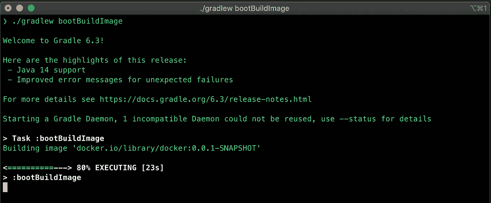
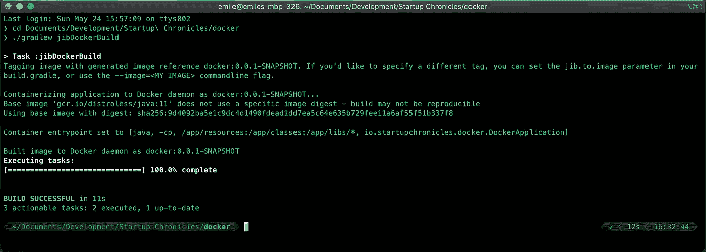

# 用 Spring Boot 生成 Docker 图像

> 原文：<https://medium.com/javarevisited/generate-docker-images-with-spring-boot-d78e5a80fae4?source=collection_archive---------1----------------------->

一种简单、快速、无压力的生成 Docker 图像的方法，无需为 Spring 应用程序定义任何手动 Docker 文件


图片来自[未绘制的](http://undraw.co)

# 为什么是集装箱

在一个用户被能在几毫秒内返回数据的应用程序所吸引的世界里，只有一种工具是每个公司都倾向于用来解决请求能力增加所带来的问题的……容器。

无论您使用的是 Docker、Kubernetes 还是亚马逊的弹性计算服务(ECS)，处理系统上增加的负载都变得更加易于管理，因为您现在有了一种机制，可以在应用超过某个阈值时自动扩展应用(基于*指标，例如 CPU、RAM 等)。*)。

# Docker 图像的旧状态

当 Docker 第一次发布时，开发人员花了一些时间来习惯语法并理解他们如何容器化他们的应用程序，考虑诸如挂载卷、端口暴露等事情。

这是一个非常基本的 docker 文件示例，它允许您在端口 8080 上部署应用程序。对于那些对 Docker 一无所知的人来说，它可能看起来有点像行话…

对于那些这样做的人，你可能认为这很容易——你是对的，虽然这个例子是一个非常简单的例子，但我见过 100 多行长的文件来启动和运行像视频流应用程序这样简单的东西。


旧的部署状态

# Spring 2.3 新增功能

Pivotal ( *被 VMWare* 收购)的可爱员工认为他们可以帮助这个部门，所以他们将它添加到了 Spring 的[最新版本](https://spring.io/blog/2020/01/27/creating-docker-images-with-spring-boot-2-3-0-m1)！

## 云原生构建包

如果你曾经在一个托管平台上使用过一个应用程序(比如 CloudFoundry )，你会以某种方式使用构建包，甚至可能没有意识到这一点！由于最近对这些处理方式的更新，它与平台分离，并产生了一种新的类型，称为云原生构建包(*CNBP*)——正如其名称所示，编写一次，在任何地方运行。

 [## 云本机构建包文档

### 与 Dockerfiles 相比，Buildpacks 为构建应用程序提供了更高层次的抽象。具体来说，构建包…

buildpacks.io](https://buildpacks.io/) 

Spring 2.3 中更具体的构建包— Paketo

[](https://paketo.io/) [## 帕克托建筑包

### 模块化构建包，用 Go 编写。Paketo Buildpacks 为应用程序提供语言运行时支持。他们利用…

paketo.io](https://paketo.io/) 

## 生成命令

Spring 2.3 现在支持 CNBP ( *Paketo* ) 开箱即用。您可以在 [Docker](/@javinpaul/10-free-courses-to-learn-docker-and-devops-for-frontend-developers-691ac7652cee) 中生成并运行您的 [Spring 应用程序](https://www.java67.com/2018/06/5-best-courses-to-learn-spring-boot-in.html)，无需任何额外的配置，只需从您的终端窗口发出一条命令！

**美文** : `./mvnw spring-boot:build-image`

**梯度** : `./gradlew bootBuildImage`



用 Gradle 生成图像

虽然运行需要一段时间，但请记住，我们的这一特性是现成的！


建立成功

既然构建已经完成，让您的 Docker 守护进程启动并运行，然后简单地运行容器(*您的映像名称将会不同*)

`docker run -p 8080:8080 docker.io/library/docker:0.0.1-SNAPSHOT`


在 Docker 中运行应用程序

就这样…您的应用程序现在正在 Docker 中运行，您可以将它部署到您选择的平台上了！

# JIB 谷歌图书馆

另一种自动生成和部署容器的方法是使用 Google 的 JIB 库。虽然输出仍然是可以在任何地方运行的云原生 docker 映像，但 Google 已经决定进一步优化映像层的构建方式，以便您可以在每次部署中获得最佳性能(*构建时间*)。


以三角帆的方式构建图像

你会问，构建上下文和图像缓存去了哪里？问得好，Google 决定 JIB 将你的应用程序分解成逻辑层(*，例如应用程序，依赖层*)，只构建你的应用程序中已经改变的部分(*，而 Docker 构建所有部分*)，并自动生成图像——将它直接推送到你选择的容器注册表或你的本地 Docker 守护进程。

## 生成命令

在生成映像时，您有两种选择，要么是远程存储库，要么直接到本地 Docker 守护进程。

[美芬](https://github.com/GoogleContainerTools/jib/blob/master/jib-maven-plugin):

```
mvn compile jib:build (remote registry)
mvn compile jib:dockerBuild (local Daemon)
```

格雷德:

```
./gradlew jib (remote registry)
./gradlew jibDockerBuild (local Daemon)
```



JIB 构建到守护进程

# 摘要

因此，我们研究了两种不同的方法来为您的 Spring Boot 应用程序生成 Docker 图像，该应用程序与您能想象到的所有平台都兼容。虽然它们都生成相同的输出，但每一个都有自己的优点和注意事项，所以请确保您仔细考虑了您的用例，查看了文档，然后就下一个项目使用哪一个做出明智的决定。

希望你喜欢这种风格的教程，请在评论中留下你的反馈，否则…下次见！

## 资源

**Spring 2.3 Docker Docs:**[https://Spring . io/blog/2020/01/27/creating-Docker-images-with-Spring-boot-2-3-0-m1](https://spring.io/blog/2020/01/27/creating-docker-images-with-spring-boot-2-3-0-m1)

**云原生构建包文档**:[https://Build Packs . io](https://buildpacks.io)

**Paketo Docs**:[https://Paketo . io](https://paketo.io)

**吊臂库**:[https://cloud.google.com/java/getting-started/jib](https://cloud.google.com/java/getting-started/jib)