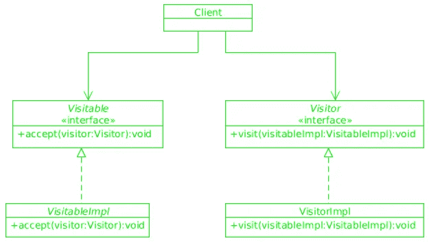

# 访问者设计模式——很高兴你回来了

> 原文：<https://medium.com/javarevisited/glad-to-see-you-are-back-an-article-about-the-visitor-design-pattern-4a2b9843ddba?source=collection_archive---------8----------------------->

敲门的访客

*在做某些单调乏味、困难或我们已经筋疲力尽的任务时；我们常常希望有一个无私的人伸出援助之手，让他们变得更容易。有时在这种情况下，我们会准备接受任何人的帮助，甚至是陌生的访客……*

visitor 是一种行为设计模式，旨在不改变类的原始实现的情况下，向类中添加或删除功能。它可以帮助利用复杂性，还允许将关注点分开。也是非侵入性的，因为只需调用一个方法，就可以让客户选择是否允许访问者访问并提供支持。

让我们来看一下 UML:

原始类中唯一需要的修改是添加一个接受访问者的方法。
该方法将仅由客户端调用，并且访问该类的访问者也将由客户端提供。[访问者](/javarevisited/7-best-online-courses-to-learn-object-oriented-design-pattern-in-java-749b6399af59)只有一个访问方法，该方法采用了必须访问的类的具体实现。如果你使用 Visitable 接口作为 visit 方法中的一个参数是没有错的，但是你将限制访问者只能看到接口中的内容(在某些场合可能是可取的)。

现在让我们看一个例子。
这里是*visible*接口和几个实现:

正如我们在上面的代码中看到的，访问者被传递到 accept 方法的参数中，该参数用于触发访问。

现在让我们来看看游客这边

在访问者端，`FormulaOnePitOperation` 的功能可以在不改变任何原始代码的情况下进行修改。此外，在上面的例子中需要注意的另一件事是，由于我们使用接口作为参数，我们可能会被限制为只能使用在它上面定义的东西。

有时这就足够了，不需要访问具体的类，但是请注意 [UML 图](https://javarevisited.blogspot.com/2017/07/top-5-books-to-learn-uml-unified-modelling-language-java.html)鼓励使用具体的实现(在我个人看来，我认为没有太大的区别，因为具体类上的方法不能公开)

现在最后是客户端类:

关于客户端没有太多要说的，它只是像往常一样使用类，唯一的区别是现在可以根据需要传递访问者来帮助添加某些任务。我在开始时提到 visitor 是一种非侵入式模式，我想说的是，如果客户不愿意的话，没有什么可以强制要求他调用 Visitor。

这种模式的一个小缺点是，accept()和 visit()这两种方法在它们的参数中都有硬连线的依赖关系，这使得它们很难进行单元测试。

有一段时间了。很高兴看到你回来了。

*原载于*[http://javing . blogspot . com/2014/01/its-been-while-glad-to-see-you-are-back . html](http://javing.blogspot.com/2014/01/its-been-while-glad-to-see-you-are-back.html)