# JavaZone 2022 的美好时光

> 原文：<https://medium.com/javarevisited/great-time-at-javazone-2022-849b37f3d80a?source=collection_archive---------2----------------------->

我有一次非常糟糕的旅行经历，试图到达奥斯陆，但这一切都是值得的，因为这可能是我最喜欢的会议:JavaZone。我非常喜欢这次会议。它拥有一切:幽默感、疯狂、重金属、持续的食物整合以及与伟大人物的精彩对话。今年的会议有一个幻想主题，这个主题与会议的“怪异”相吻合。请注意，当我说“奇怪”时，这是我能给一次会议的最高评价之一。JavaZone 在各个方面都是独一无二的。第一天早上看到这个开场的场景…

会议有很多事情要做。其中一个很酷的噱头是一个让你在绿色屏幕上设置背景和装饰的应用程序。下面是我和布鲁诺·伯格斯在典型的维京背景下的照片。

JavaZone 具有持续整合食物的功能。这意味着食物从早上就开始出来，而且永远不会停止。没有午休时间。食物随时供应，质量是我参加过的所有会议中最高的。这是餐饮服务，所以我不想过度推销，但它很棒，很丰富，是在 JavaZone 体验的一个重要部分。晚上还有派对，甜甜圈、啤酒、泰国菜和现场音乐混合在一起。没有其他的会议像它一样！

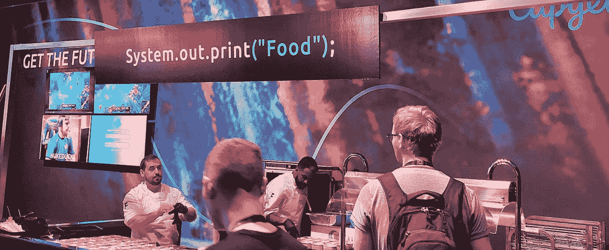

JavaZone 的另一大特色是溢出室。在我开始之前，你需要了解这次会议的壮观的场地。奥斯陆光谱是一个巨大的圆形建筑，中心有一个大型竞技场，我们在那里有展馆、聚会和现场维京人战斗。它的周围有七个房间，我们可以在那里看到会谈。这些房间大多建得像电影院。你需要爬上去才能够到椅子，而且屏幕很大。这太棒了。如果他们坐在你面前，没有人会把说话者藏起来。景色非常棒，灯光也很完美。但最神奇的功能是溢出。在这个房间里，屏幕被分成 7 个部分，你可以一次看到所有 7 个同时进行的谈话。给你一个耳机，你可以在不同的演讲之间转换音频通道，同时欣赏几个演讲。以前我总是坐在这个房间里。但是这次拜访我不能。在 Zoom 上呆了这么久之后，我觉得我需要看看人们的生活。结果，我错过了一些我想参加的讲座，这很遗憾。内容太多了。

不幸的是，由于交通和后勤方面的原因，我不得不很早就离开了，所以在 JavaZone 的第二天我没怎么看。我试着参加了几个上午的会议，但是由于日程紧张，我错过了更多。尽管事实上我这次旅行的一半时间是在机场/途中，但它仍然是值得的，因为它是在这样一个伟大的城市举行的这样一个伟大的会议！

# 鸭子教:向高手学习调试。本地生产—消灭 bug—Shai Almog(我)

今年，我举办了一个为期两小时的“动手”体验研讨会。我喜欢它，并得到了一些很好的反馈，但我觉得还有改进的空间。罪魁祸首是让 Kubernetes 很好地处理演示代码。我希望既然我选择了[斯卡福德](https://talktotheduck.dev/cloud-native-skaffold-book-review)做演示，事情会进展顺利。斯卡福德的确很神奇，但它的力量是有限的。一半的学生不能让环境工作，这令人沮丧，并吃掉了我们很多时间。下次我做这个演讲的时候，我会把它组织好，这样 Kubernetes 的部分就在最后，即使不运行它，人们也能得到很多。

另一个选择是为他们建立 Kubernetes 集群，这样他们就可以远程连接到它，如果这个研讨会被其他会议接受，我可能会选择走这条路。不管怎样，这门课很可爱，我得到了很好的反馈，所以希望他们喜欢它。我希望制作一个研讨会的视频，这样人们就可以在家观看，因为这是一个非常酷的研讨会。

# 演讲者晚宴

由于航班延误，我不得不降落并赶往车间。从那里我有不到一个小时的时间去参加演讲者晚宴。这通常是会议的亮点之一。你可以见到参加会议的朋友，我们这些参加一个又一个会议的人。7 年前我离开会议很久了，所以我不像以前那样认识很多人，但我开始遇到一些熟悉的面孔。也有一些像我一样的“老前辈”，我在过去的日子里就认识他们。

我认识了一些我从未见过面的人，但在网上互动过，这很棒。事情发生的酒吧也很不错。我很累，所以和几个朋友一起比较早地离开了。

# Maven 在煮什么？—马腾·穆尔德斯

Apache maven 委员会成员 Maarten 谈到了这个构建工具的新特性。他讲述了 maven 包装器、构建/消费者 POM、反应器和 maven 守护进程。maven 包装器是让我们从 CLI 构建 maven 项目的脚本。`./mvnw`脚本等。它让我们忽略用户系统上的 maven 版本。

Tikari-wrapper 是我们大多数人都熟悉的 maven 包装类型。apache-wrapper 是做同样事情的第二种方法。在即将发布的 maven 4 中，包装器被预打包到 maven 中。它将包装器代码下载到`~/.m2/wrapper`中，这是 gradle 包装器的一个想法。

Maven 4.0 的发布日期仍然没有公布。我们现在可以用快照来玩它。但这可能不是我们此时想要用于产品开发的东西(我的预测不是 Maarten 说的)。

将构建和消费者分离是另一个大的变化。我们在源代码控制中的 POM 与我们在 maven central 或本地 maven repo 中的 POM 是相同的。这让事情变得相当复杂。我们希望 pom 更加紧凑，但是它可能会破坏解析 POM 并依赖于 POM 的其他工具。解决方案是将本地的 POM 与上传的 POM 分开。Maven 4.x 很聪明，它从相对路径中查看子 pom，并挑选嵌套的 POM，而不像 Maven 3.x 那样冗长。它通过从 4.x 允许的更简洁的 POM 语法中创建“有效的 POM”来工作。这使得 Maven 在推进到中央(通过有效的 POM)的同时保持兼容性，同时保持本地 POM 语法简洁明了。

改进后的反应堆使得多模块项目更加简单。反应器是 maven 的一部分，它知道您的项目结构。它遍历项目结构并解析依赖关系。它构建构建所需的概念依赖图。但是它只在项目的根起作用！

只要您有一个`.mvn`文件夹，新的反应器将是根项目感知的。它消除了不断做`mvn install`的需要，这是一个巨大的痛苦。由于这些变化，当多模块构建失败时，它知道构建失败在哪里，并可以从该点恢复。你不需要明确地告诉它哪个模块需要恢复，你只需要把`-r`传递给`mvn`就可以从上一次失败中恢复。

maven 守护进程是他们对 gradle 守护进程的回应。您已经让 maven 运行后台，因此它可以保持运行和 jitted。这样构建会稍微快一点。默认情况下运行多线程构建，而不会扰乱输出。在演示过程中，使用 mvn3 时需要 23 秒的构建时间，使用 maven 4.x 时减少到 7 秒甚至 3 秒。主要的好处来自多线程方面，但守护程序的启动也有所帮助。请注意，有些插件可能无法与 maven 守护进程一起工作。它今天已经有了一个版本，你现在就可以使用。

依赖项下载也可能是并行的，但这是一个独立的过程，与 maven 4.x 的当前路线图无关，因此它可能不会进入 4.0.0。由于 4.0 将改变 POM 的工作方式，如果我们有一个自定义插件，我们需要现在就开始测试。插件可能需要更新，在某些情况下可能需要更换。当转移到 maven 4.0 时，我们需要替换签名插件，我们需要这个插件上传到 maven central。

你可以在推特上关注马尔滕，点击这里 [mthmulders](https://twitter.com/mthmulders) 。

# 构建 Kotlin DSL —安东·阿尔希波夫

当我用 Kotlin 编码时，我没有大规模地这样做，并且认为自己是这种语言的新手。我理解这些概念，代码也很熟悉，因为它源于 JVM，但对我来说有点不直观。我喜欢 DSL 的概念，所以决定参加这个演讲。

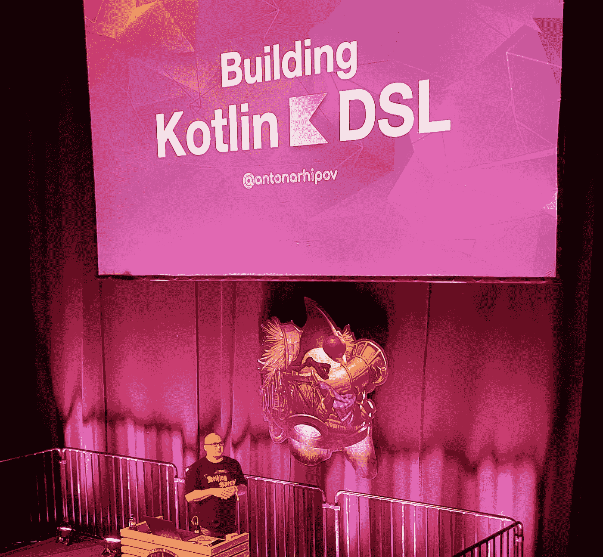

大多数人选择空安全、协程、多平台、语法等等。作为挑[科特林](/javarevisited/top-5-courses-to-learn-kotlin-in-2020-dfc3fa7706d8)的理由。语法实际上是 DSL 的主导，DSL 让我们可以构建定制的语法来满足特定领域的需求。有两种类型，外部和内部 DSL。构建 DSL 并不是一个新想法。领域特定语言工具已经存在很长时间了。其中一些工具相当壮观，但在 [Kotlin](/javarevisited/7-free-courses-to-learn-kotlin-in-2020-327c3872c1e1) 中添加内部 DSL 的价值在于，我们可以在 Kotlin 已经拥有的功能基础上进行构建。我们可以与 Kotlin 无缝集成，构建复杂的子集。我们不需要构建一个完整的语言，我们可以构建一个特定于某个领域的小特性，而不用解决整个问题。我们仍然可以从编译器的统一性、检查和可扩展性中受益。

kotlin 中的 DSL 看起来非常相似，因为它们是从 kotlin 的块语法中派生出来的。我们可以调用函数，突出显示语法，重构以及构建 DSL 所需的几乎所有东西。语法需要慢慢习惯，但是语法的好处是非常大的。我能想到很多这样的例子，对于商业应用程序和特定领域的代码来说，这是非常有用的。如果有什么会让我转而使用[科特林](https://www.java67.com/2020/05/5-free-courses-to-learn-kotlin-for-java-and-Android-developers.html)的话，那就是 DSL。

[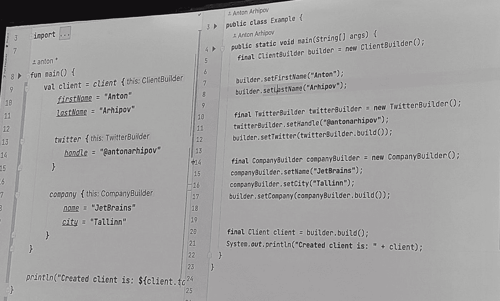](https://javarevisited.blogspot.com/2018/02/5-courses-to-learn-kotlin-programming-java-android.html)

你可以在推特上关注安东 [@antonarhipov](https://twitter.com/antonarhipov) 。

# Java 中的反序列化漏洞:我为什么要关心？—布莱恩·弗米尔

由于日程冲突，我错过了 Brian 在之前会议上的精彩演讲。这一次我拒绝错过它。这个非常重要的演讲以一种令人信服的方式呈现是必须的。序列化(和反序列化)是“不断给予的礼物”。至少在安全漏洞方面。

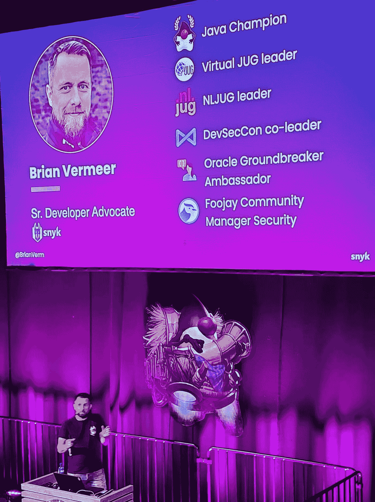

序列化跳过构造函数，让我们向对象注入无效值。如果一个对象被序列化，我们就有可能将一个变量设置为任何值，从而扰乱应用程序的内部状态。我们可以将私有变量设置为任何值，完全绕过任何验证逻辑。想象一下，一个时间戳值可以突然回到某个纪元或某个未来的日期。权限可以提升，一切都可以操作。

gadget 允许您在序列化时加载不同的类。当我们向下转换时，这将失败，但是在读取过程中，我们可以加载一个不同的类，在那里我们可以执行任意代码。`HashMap`是一个覆盖`readObject`的类，可以用作漏洞链的一部分。ysoserial 帮助我们创建一个序列化链，以基于已知的序列化弱点产生漏洞。您可以运行该项目并生成有效负载 ser 文件，您可以传递这些文件来利用潜在漏洞。

Log4Shell 漏洞有一个反序列化方面。这不仅仅是一个 JNDI/LDAP 漏洞。LDAP 服务器需要返回一个小工具类，该类执行实际的远程代码执行。代码执行可以转向反向外壳。在 records 中，反序列化使用构造函数工作，因此它解决了这个问题。记录不能解决所有问题，但是如果我们都使用它们，将会减少一些问题。

使用`ValidatingObjectInputStream`与 JEP 290 和 415 您可以使用`ObjectInputFilter`来限制序列化范围。

Jackson 中的默认类型允许我们将无效的对象类型注入到 JSON 中，即使我们不使用传统的序列化。即使我们不使用传统意义上的序列化，由于我们的依赖图，我们仍然容易受到攻击。

在 XML 中，我们可以引用一个外部实体，它指向任意文件，如`/env/passed`或类似的私有信息，并从服务器重试这些信息。这是一个存在于所有内置于 JDK 的 XML 解析器中的漏洞。

*   不要反序列化来自未知来源的输入
*   阻止 Java 自定义序列化
*   如果需要序列化，请使用过滤器
*   了解 JSON/XML/YAML 封送拆收器是如何工作的
*   检查不安全的默认值
*   更新不安全的库

你可以在 twitter 上关注布莱恩 [@BrianVerm](https://twitter.com/BrianVerm) 。

# 神话终结者:用 Java 构建高性能数据库

Vlad 是开源项目 QuestDB 的创建者。他使用`sun.misc.Unsafe`类在 Java 中实现了快速内存访问，并且在没有 GC 的情况下为数据库提供了本机级别的性能。您可以在本机 RAM 中分配一个大规模数组，并在不复制数据的情况下遍历它。这使得 Java 和 C 代码的交互比典型的慢速 JNI 桥要快得多。

演讲结束后，我问了关于贬值的问题，弗拉德表示这是他非常关心的事情。之后，我们讨论了巴拿马和其他一些潜在的方法(GraalVM 等。).这是一个充满挑战和有趣的领域。

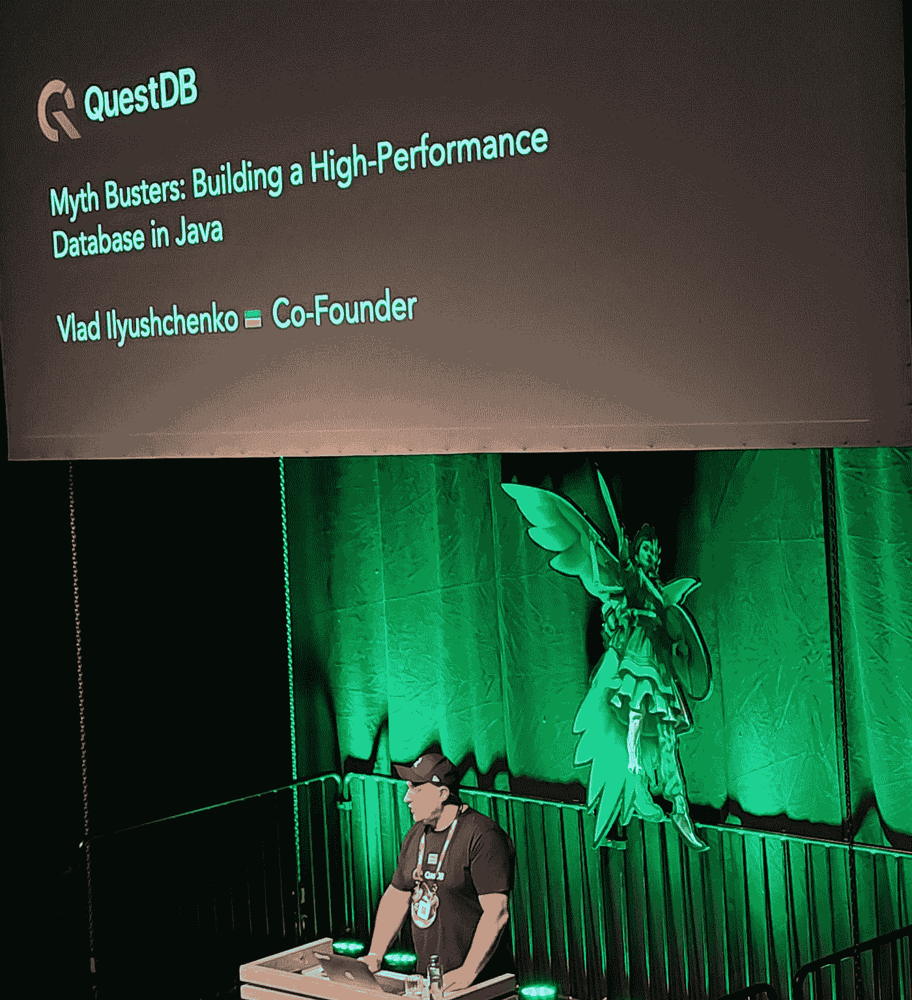

为了最大化性能，我们需要最小化 GC 颠簸，这意味着避免分配。这也意味着尽可能避免使用 Java API，以尽可能减少分配。当该方法不产生垃圾时，性能可以翻倍，而影响很小。解析中的`String`是主要性能问题的来源。为了解决这个问题，QuestDB 团队创建了他们自己的`String`实现，实现了字符集，但解决了`String`中的问题。

DB 文件是通过`mmap`访问的，它让我们将一个文件映射到 RAM 并对其进行随机访问。这达到了 IOPS(每秒输入/输出操作数)的极限。解决方案是 IOURing，让它们对操作进行排队，以保持 IOPS 饱和，并最大限度地利用硬件。但不超过最大值。这在云环境中非常重要，因为在云环境中，您可能会超出要求而失败。

在更新的伐木工出现之前，他们建立了自己的伐木系统。它的语法旨在避免字符串串联，从而避免 GC 开销。

可以在 twitter [@ilyusvl](https://twitter.com/ilyusvl) 关注 Vlad。

# Apache Pulsar 的事件流和处理— Mary Grygleski

一般来说，什么是事件？

> *“在相对论假设的时空连续体中，由三个位置坐标和一个时间坐标指定的点所代表的被观察的物理现实的基本实体”*

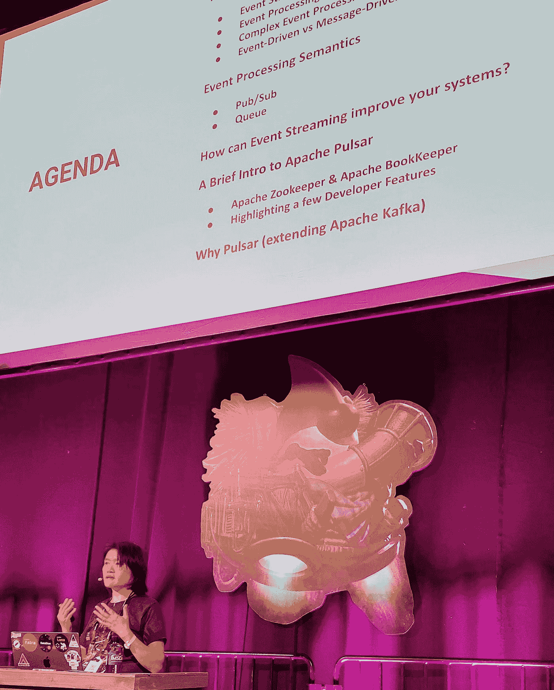

事件流是对一系列数据点采取行动的实践，这些数据点来自连续创建数据的系统。复杂的事件处理让你找到机会得出一些结论。欺诈检测就是一个很好的例子，它可以大量监视一系列事件，并在可疑模式发生时检测出来。推荐系统也可以代表一个常见的用例。

*   事件驱动—发送者发出消息，感兴趣的订阅者可以订阅该消息
*   消息驱动—发送方和接收方彼此已知(地址已知)

事件方法与批处理。Erlang 中的 Actor model 已经在做事件了。批处理允许您在有时间时执行数据，而不是在计算资源可用时立即更好地使用它们。选择取决于您需要数据的方式和时间。

流式发布/订阅—您将消息交给代理，代理将消息向前传递。类似于邮件系统，代理是 post-master:

*   发布客户端发送数据
*   经纪人是中间人/代理人
*   订阅客户端接收数据

消息队列让我们保留消息，直到它们被确认和阅读。这可以防止系统过载并保证交付。

流式传输将分布式消息传递提升到了一个新的高度。使用实时数据增强客户体验。使用数据管道建立 AI/ML 模型。扩展以满足大数据量的需求。管道让我们通过阶段链接数据，其中每个阶段可能通过沿途的代理用不同的语言编写，并处理不同的阶段。在机器学习中，这非常有用，因为我们可能会有非常不同的训练/处理阶段，其中一些阶段可能会并行执行，以增加吞吐量和规模。

Apache Pulsar 是一个开源、统一、分布式的消息和流平台。这有点像 RabitMQ 和 Kafka 的结合:

*   由雅虎-阿帕奇于 2016 年创建，2018 年顶级
*   基于集群
*   多租户
*   简单的客户端 API (Java、C#、Python、Go、…)
*   分离计算和存储
*   有保证的消息传递
*   轻量级无服务器功能框架
*   分层存储卸载

本地地理复制、灵活的消息处理和多租户是 Pulsar 的主要优势。Pulsar 使用传统的多节点架构，该架构旨在实现水平扩展，并对消费者隐藏复杂性。它有以下组件:

*   生产者—发送消息的客户端应用程序
*   消费者—用于阅读消息的客户端应用程序
*   代理—处理传入消息的无状态流程
*   簿记员—持久消息存储
*   ZooKeeper——星团元数据，处理脉冲星星团之间的协调任务

如果您运行的是 JMS 或类似的旧消息系统，您可以直接连接 Pulsar 并迁移到其中，以获得 Pulsar 的优势(例如多租户)。数据管道是一种能够以最有效的方式转换数据的功能。这就像 Java streams API，只是流数据源可以是云事件级别的。

Pulsar schema 定义了您想要的数据结构的序列化，比如 JSON、Avro、Protobuf、primitive、键值对等。

你可以在推特上找到玛丽。

# Maven Central 的秘密生活—史蒂夫·普尔

在某种程度上，我们都发现自己在寻找代码。所以我们可以添加一个新的依赖项。90%现代应用程序都依赖于开源软件。我们的应用程序的生死取决于依赖管理和存储库。就像天上的星星一样，maven central“就在那里”，我们不去想它。

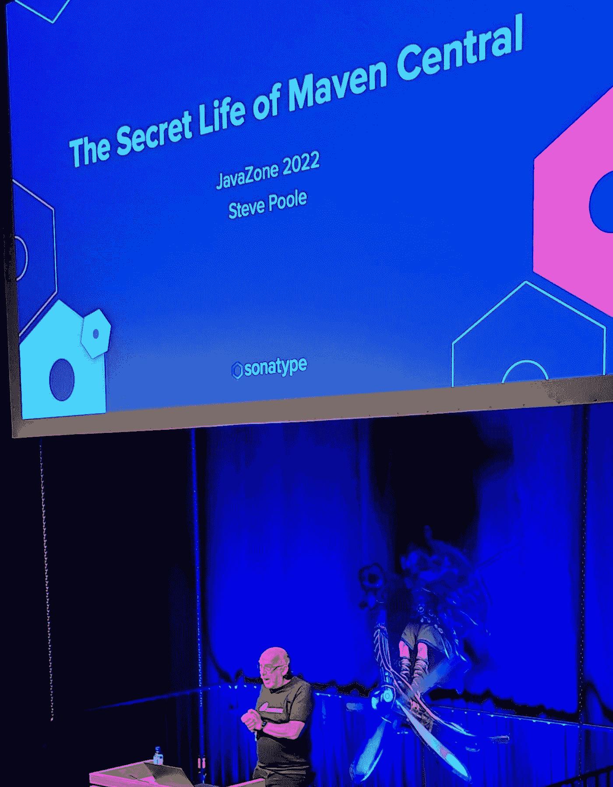

Sonatype 为什么要资助 maven central？他们为什么要做这项公益事业？

Maven central 已经超越了它的起源。maven central 的三个用户:

*   发布者—使用 nexus 存储库
*   回购用户
*   搜索用户

Maven central 坐拥 AWS。对于回购用户来说，这是一个中间有 Fastly 的 S3 桶。Maven central 发布了一个 REST API，带有一些简单的搜索功能，等等。有 27TB 的 Jar 文件，S3 存储的成本非常昂贵。2021 年对 maven central 的 4960 亿次请求。数量在增长，需求在增加。

保持应用程序的安全是管理存储库的一个重要方面。域所有权的证明是阻止恶意代码的一部分。一些潜在的攻击:

*   创建一个非常新的版本的包，试图在构建时抓住使用最新版本的人
*   错别字抢注是另一个危险。开发者可以抓取类似`logj4`(而不是`log4j`)的包
*   域名的域名抢注，如`org.apaceh`而不是`org.apache`，如果我们能购买域名并向 maven central 证明，这将是合法的

Python 和 JavaScript 包管理系统没有相同级别的域所有权保护。机器人用恶意软件创建这样的包。Java 中的结构化命名让我们跳过了一些潜在的攻击。不幸的是，除此之外的一切都很难。该软件包是否包含漏洞？恶意软件？我们怎么知道呢？

Sonatype 扫描所有上传的内容，寻找恶意软件。它不会阻止漏洞，因为某些情况下的某些漏洞可能是可以接受的。Maven central 确实会向您显示，如果它知道存在漏洞，它不会阻止易受攻击的代码，但它会向您显示它的存在及其严重性。

不幸的是，开发者们改变得很慢。我们不够主动。自从 log4shell 问题以来:

*   5100 万次 log4j 下载，其中 38%易受攻击
*   过去 24 小时内有 11，976 次下载，其中 33%易受攻击

网络战是攻击基础设施，并试图安装可利用的漏洞。这将让他们随心所欲地破坏。Maven central 正在尝试向 maven central 添加一些东西，以先发制人地阻止此类攻击。

*   生命周期中的 SBOM
*   签名存储支持—签名的中心位置
*   跨行业最佳实践—【openssf.org 
*   增强的开发人员智能—在此寻求您的反馈

来自 CNCF 的 CLOMonitor 可以让你看到一些与安全相关的基本东西是否在你的项目中配置正确。您能否对项目的安全级别进行“分级”,以便 maven central 能够“淘汰”那些安全性“不合格”的项目。

Maven central 没有徽标，所以请在 twitter 或其他渠道向 Steve 提出徽标建议……我口头建议使用带有数据库的 Atlas 徽标。尝试用 Dalle 生成，但没有得到理想的结果…

更多信息和建议请关注 [@spoole167](https://twitter.com/spoole167) 。

# 在 Java 和 Kubernetes 的云原生路径上蓬勃发展— Ana-Maria Mihalceanu

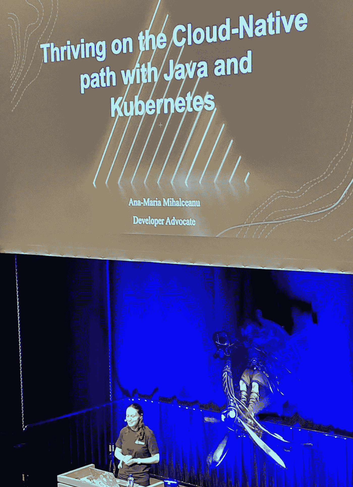

云原生应用是关于构建对并发变化开放的架构。我们应该快速学习，不断迭代，从中获得乐趣，并且仍然具有经济高效的自动伸缩功能。我们需要一种跨分布式存储同步数据的方法。我们想控制 Kubernetes 内部的流量，但它不是为此而设计的，所以它可能会发挥作用。但是仍然存在挑战:

*   设置环境很难
*   陡峭的学习曲线
*   难以进行一致的测试
*   膨胀的依赖性
*   配置可能与服务相去甚远
*   CI/CD 不足以扩展日常运营

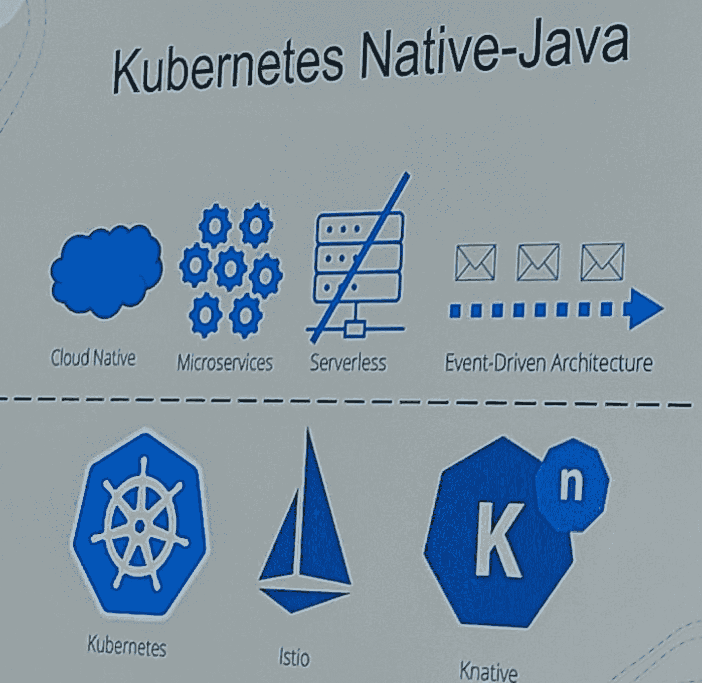

从小处着手，发展梦想中的应用。作为一个团队做出客观的选择。设想产品并建立概念证明。逐步发展设计/实现。鼓励团队了解整个堆栈。

夸库斯首先是集装箱。开发起来很有趣，并且通常符合上述要求。

在这一点上，演讲集中在一个 quarkus 的演示上，这是非常令人印象深刻的。Dev UI 非常酷，编程体验对 Spring 开发者来说非常熟悉。与 GraalVM 本地映像相比，使用带有 quarkus 的 JVM 工具的优点是可以使用辅助工具和功能。然而，GraalVM 几乎比 JVM 版本小 5 倍，并且启动速度更快。

Quarkus 将关于容器/编排环境的信息包含在项目中，以使部署/调试体验无缝。您可以直接从 Quarkus 属性文件中为 Kubernetes 定义一个负载平衡器。

您可以使用 quarkus 测试来测试 Kubernetes pod 部署是否正确，即使它不是作为 quarkus 部署的一部分构建的。这可能不太理想，因为这是运营部门的工作，而不是开发人员的工作，但在“现实生活”中仍然非常有用。你可以在 quarkus 中用`Func`注释创建无服务器函数，这看起来很酷。大部分删除了与 Kubernetes 复杂性相关的所有内容。我们可以把秘密转移到 knative 中，让它像预期的那样几乎无缝地工作。

*   为团队实现一致的本地设置
*   通过测试对本地代码的即时反馈
*   通过测试 YAML 内容来验证 Kubernetes 资源
*   使用有创意的和较小的容器图像快速放大和缩小
*   通过绑定 YAML 片段和应用程序配置实现平稳部署

在推特上看看安娜-玛利亚吧 [@ammbra1508](https://twitter.com/ammbra1508)

# Kubernetes 上性能调优 Java 的秘密—布鲁诺·博尔赫斯

# 应对云原生世界中的事务挑战— Grace Jansen

在 JavaZone 的最后两次会议上，我无法决定，所以我崩溃了，去了溢出。这是两个伟大的演讲者同时发言的常见场景。但是据我所知，JavaZone 是唯一能解决这个问题的会议。布鲁诺和格雷斯都是令人惊叹的演讲者，他们的话题都很吸引人，所以我的犹豫不决导致了对两个演讲的不同理解。幸运的是，JavaZone 通常会在事后上传高质量的谈话视频，这样我就可以稍后赶上了。希望接下来的两节不会太乱。

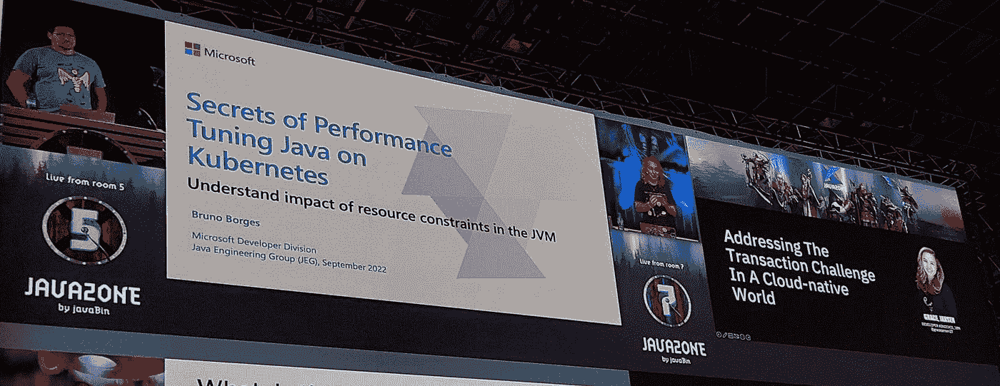

# 格雷丝 (女子名)

将后台服务视为附属资源，无状态微服务== cloud-native。真的是这样吗？云原生意味着什么？

无状态使扩展和恢复变得更加容易，因为我们只需重新创建资源。从这个意义上来说，有状态是有问题的，并且让一切变得更加困难。不幸的是，我们并不是生活在一个纯粹的世界里。在现实世界中，事物是有状态的。事务可以影响单个记录或多个记录。这取决于如何设置交易。

两阶段提交允许我们在单个事务中维护 ACID 属性的同时在数据存储之间进行转换。2PC 的工作方式是将事务转换成两部分，并在运行实际的事务之前运行一个验证阶段。2PC 通常很好，但对于云原生来说并不理想:

*   它很慢，因为我们需要等待最慢的服务来验证交易。在低可靠性问题上不实用
*   NoSQL 不支持
*   我们需要在运行 2PC 时锁定

分布式应用程序一致性的 SAGA 模式。基于基础:原子性、持久性、基本可用、软状态、最终一致性。SAGA 可以通过编排或编排来应用。该模式通过取消和有效撤销动作(补偿动作)并将系统恢复到这方面的先前状态来工作。

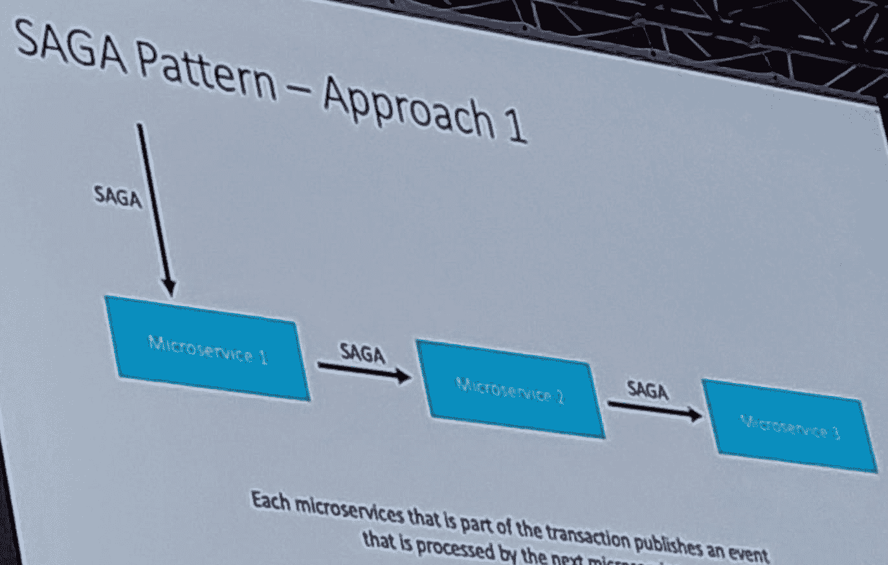

LRA 使用注释来声明微文件中的 LRA 事务。您可以使用`@Complete`完成微交易，使用`@Compensate`在失败时执行撤销。还有`@Forget`、`@Leave`、`@Status`。

*   在这个云原生世界中，仍然需要有状态的微服务
*   传统交易不适合云原生
*   SAGA 和 MicroProfile LA 等替代产品有助于为微服务提供合适的云原生事务
*   开放源码软件工具和技术可用于试验这些替代方案，例如，微型文件 LRA

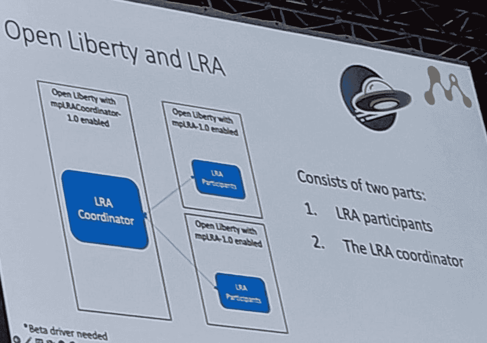

在推特上查看格雷斯 [@gracejansen27](https://twitter.com/gracejansen27) 。

# 布鲁诺

微软在 LinkedIn、《我的世界》和许多其他微软网站上使用 Java。

*   JVM 默认人机工程学
*   垃圾收集者
*   库伯内特斯

一个普通的 JDK 中有 4 个以上的 GC，但是很多人不知道，也不理解 JVM 选择 GC 的系统。默认由 CPU 和可用内存选择。

在对 150 名开发人员的调查中，大多数开发人员都在容器中部署 JVM 工作负载，最多有 4 个 CPU、4GB 和 50%的 IO 工作负载。在带有一个 CPU 和 1GB 或更少 RAM 的容器中运行时的默认 GC。在这种情况下，由于 CPU/RAM 的限制，使用串行收集器而不是 G1。当没有设置 GC 调优时，有许多设置是没有意义的，比如为显卡保留内存。这对于在无头机器上运行的容器来说毫无意义。

7 月/10 月将出版两期

*   cgroup v2 不考虑内存限制
*   默认情况下不使用 cpu 共享

不要使用`java -jar myApp.jar`！

当 GC 面向目标时，对其进行调优是非常重要的。不仅仅是设置堆大小，还要针对目标(吞吐量、开销等)调整 GC。).与 G1 相比，ParallelGC 在一些较小的堆中可能更好。

垃圾收集建议:

*   串行—最适合单核、小型堆。
*   并行—最适合多核小堆。任意堆大小的批处理作业。
*   G1 —中等大小堆的响应，中等开销。高尾潜伏期效应。
*   Z —在中型到大型堆中响应，中等开销。不到 1 毫秒的暂停。低尾潜伏期效应。
*   Shenandoah——中等大小堆的响应，中等开销。不到 10 毫秒的暂停。高尾潜伏期效应。

过去，我们有永久空间。我们现在有了元空间，这有点不同:

*   类定义等的本地区域。被储存
*   按需增长
*   清除堆栈中不再可达的类
*   JVM 标志:`MetaspaceSize`(初始)和`MaxMetaspaceSize`
*   `MaxMetaspaceSize`是一个很大的数字

Kubernetes 的多线程是有问题的，因为线程可能会消耗 CPU 周期。Kubernetes 可能会抑制一个没有做多少事情的应用程序，因为它有多个线程。这些线程加在一起可能会消耗 CPU 时间，但不会完成它们的任务。

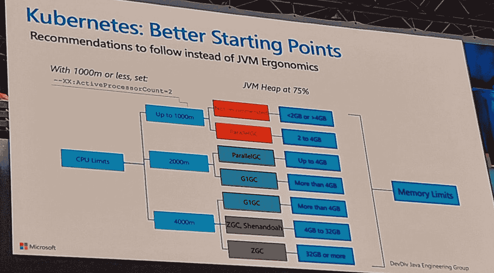

不幸的是，由于时间限制，我不得不在布鲁诺结束他的讲话之前离开，他的讲话比格雷斯的讲话稍长。

在推特上看看布鲁诺[@布鲁诺博格](https://twitter.com/brunoborges/)

# 最后

正如我在开头提到的，这是一次令人惊叹的会议，我度过了一段美好的时光。很抱歉，我错过了这么多与我参加的讲座同时进行的讲座。我也觉得我没有从展馆和聚会中获得尽可能多的东西，因为我太累了(不得不赶往机场)。但是如果 JavaZone 不在您的会议日程上，您可能应该添加它。这是一颗独一无二的宝石，永远不会让人失望。

研讨会不会被拍摄下来，所以我的演讲不会被那些想看的人看到。我将很快出版一本书，涵盖我演讲的主题(以及更多)。我还计划在研讨会上制作一个关于这个主题的视频，这样如果你关注博客(或者在 twitter 上关注我)，我会及时通知你。