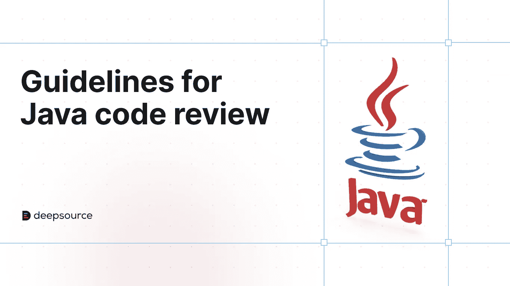

# Java 代码审查指南

> 原文：<https://medium.com/javarevisited/guidelines-for-java-code-review-12756c8a89b9?source=collection_archive---------0----------------------->

Java 开发人员快速审查代码的技巧。



让另一双眼睛审视你的代码总是有用的，可以帮助你在中断生产之前发现错误。你不需要成为专家来审查别人的代码。一些编程语言的经验和一个回顾清单应该可以帮助你开始。我们整理了一份清单，列出了您在审查 Java 代码时应该记住的事情。请继续阅读！

# 1.遵循 Java 代码约定

遵循语言约定有助于快速浏览代码并理解它，从而提高可读性。例如，Java 中所有的包名都是小写的，常量全部大写，变量名用 CamelCase，等等。点击此处查看[会议的完整列表。](https://www.oracle.com/technetwork/java/codeconventions-150003.pdf)

一些团队开发了他们自己的约定，所以在这种情况下要灵活！

# 2.用 lambdas 和 streams 替换命令式代码

如果您使用的是 Java 8+，用 streams 和 lambdas 替换循环和极其冗长的方法会使代码看起来更整洁。 [Lambdas](/javarevisited/7-best-java-tutorials-and-books-to-learn-lambda-expression-and-stream-api-and-other-features-3083e6038e14?source=---------14------------------) 和 [streams](/javarevisited/7-best-java-collections-and-stream-api-courses-for-beginners-in-2020-3ad18d52c38) 允许你用 Java 编写功能代码。以下代码片段以传统的命令方式过滤奇数:

```
List**<**Integer**>** oddNumbers **=** **new** ArrayList**<>();**
**for** **(**Integer number **:** Arrays**.**asList**(**1**,** 2**,** 3**,** 4**,** 5**,** 6**))** **{**
	**if** **(**number **%** 2 **!=** 0**)** **{**
	  oddNumbers**.**add**(**number**);**
  **}**
**}**
```

这是[过滤奇数](http://javarevisited.blogspot.sg/2013/04/how-to-check-if-number-is-even-or-odd.html#axzz59AWpr6cb)的功能方式:

```
List**<**Integer**>** oddNumbers **=** Stream**.**of**(**1**,** 2**,** 3**,** 4**,** 5**,** 6**)**
  **.**filter**(**number **->** number **%** 2 **!=** 0**)**
  **.**collect**(**Collectors**.**toList**());**
```

# 3.当心`NullPointerException`

当编写新方法时，如果可能的话，尽量避免返回空值。这可能导致空指针异常。在下面的代码片段中，如果列表中没有整数，则最高方法返回 null。

```
**class** **Items** **{**
	**private** **final** List**<**Integer**>** items**;**
	**public** **Items(**List**<**Integer**>** items**)** **{**
	        **this.**items **=** items**;**
	**}**
	**public** Integer **highest()** **{**
	  **if** **(**items**.**isEmpty**())** **return** **null;**
	  Integer highest **=** **null;**
	  **for** **(**Integer item **:** items**)** **{**
	      **if** **(**items**.**indexOf**(**item**)** **==** 0**)** highest **=** item**;**
	      **else** highest **=** highest **>** item **?** highest **:** item**;**
	  **}**
	  **return** highest**;**
	**}**
**}**
```

在直接调用对象上的方法之前，我建议检查一下[是否为空值](https://javarevisited.blogspot.com/2014/12/9-things-about-null-in-java.html#axzz6fLto55st)，如下所示。

```
Items items **=** **new** Items**(**Collections**.**emptyList**());**
Integer item **=** items**.**highest**();**
**boolean** isEven **=** item **%** 2 **==** 0**;** *// throws NullPointerException ❌* **boolean** isEven **=** item **!=** **null** **&&** item **%** 2 **==** 0  *// ✅*
```

但是，在代码中到处都使用空检查是非常麻烦的。如果您使用的是 Java 8+，可以考虑使用`Optional`类来表示可能没有有效状态的值。它允许您轻松地定义替代行为，并且对于链接方法非常有用。

在下面的代码片段中，我们使用 [Java Stream API](https://javarevisited.blogspot.com/2020/04/top-5-courses-to-learn-java-collections-and-streams.html) 通过返回`Optional`的方法来查找最大的数字。注意，我们使用的是`Stream.reduce`，它返回一个`Optional`值。

```
**public** Optional**<**Integer**>** **highest()** **{**
    **return** items
            **.**stream**()**
            **.**reduce**((**integer**,** integer2**)** **->** 
							integer **>** integer2 **?** integer **:** integer2**);**
**}**
Items items **=** **new** Items**(**Collections**.**emptyList**());**
items**.**highest**().**ifPresent**(**integer **->** **{**             *// ✅
*    **boolean** isEven **=** integer **%** 2 **==** 0**;**
**});**
```

或者，您也可以使用像`@Nullable`或`@NonNull`这样的注释，如果在构建代码时出现空冲突，就会产生警告。例如，向接受`@NonNull`参数的方法传递一个`@Nullable`参数。

# 4.直接从客户端代码向字段分配引用

即使该字段是 final，也可以操作向客户端代码公开的引用。让我们用一个例子来更好地理解这一点。

```
**private** **final** List**<**Integer**>** items**;**
**public** **Items(**List**<**Integer**>** items**)** **{**
        **this.**items **=** items**;**
**}**
```

在上面的代码片段中，我们直接将客户端代码中的引用分配给一个字段。客户端可以很容易地改变列表的内容，并操纵我们的代码，如下所示。

```
List**<**Integer**>** numbers **=** **new** ArrayList**<>();**
Items items **=** **new** Items**(**numbers**);**
numbers**.**add**(**1**);** *// This will change how items behaves as well*
```

相反，考虑[克隆引用](https://javarevisited.blogspot.com/2013/09/how-clone-method-works-in-java.html#axzz5Y4Ks1BbR)或创建一个新的引用，然后将其分配给字段，如下所示:

```
**private** **final** List**<**Integer**>** items**;**
**public** **Items(**List**<**Integer**>** items**)** **{**
    **this.**items **=** **new** ArrayList**<>(**items**);**
**}**
```

返回引用时，同样的规则也适用。您需要小心谨慎，以免暴露内部可变状态。

# 5.小心处理异常

在捕捉异常时，如果有多个 catch 块，请确保 catch 块的顺序从最特定到最不特定。在下面的代码片段中，异常永远不会在第二个块中被捕获，因为`Exception`类是所有异常的母体。

```
**try** **{**
	stack**.**pop**();**
**}** **catch** **(**Exception exception**)** **{**
	*// handle exception* **}** **catch** **(**StackEmptyException exception**)** **{**
	*// handle exception* **}**
```

如果这种情况是可恢复的，并且可以由客户端(库或代码的消费者)处理，那么最好使用[检查异常](https://javarevisited.blogspot.com/2011/12/checked-vs-unchecked-exception-in-java.html)。例如`IOException`是一个被检查的异常，它迫使客户端处理这个场景，如果客户端选择重新抛出异常，那么它应该是一个有意识的调用来忽略这个异常。

# 6.思考数据结构的选择

Java 集合提供`ArrayList`、`LinkedList`、`Vector`、`Stack`、`HashSet`、`HashMap`、`Hashtable`。重要的是要了解每种方法的优缺点，以便在正确的上下文中使用它们。帮助你做出正确选择的一些提示:

*   `Map`:如果您有键、值对形式的无序条目，并且需要高效的检索、插入和删除操作，那么这个选项非常有用。`[HashMap](https://www.java67.com/2017/08/top-10-java-hashmap-interview-questions.html)`、`Hashtable`、`LinkedHashMap`都是`Map`接口的实现。
*   `List`:非常常用于创建有序的项目列表。此列表可能包含重复项。`ArrayList`是`List`接口的实现。使用`Collections.synchronizedList`可以使列表成为线程安全的，因此不再需要使用`Vector`。[这里](https://javaconceptoftheday.com/not-use-vector-class-code/)有更多关于为什么`Vector`本质上已经过时的信息。
*   `Set`:类似列表，但不允许重复。`HashSet`实现了`Set`接口。

# 7.在你暴露之前三思

Java 中有很多访问修饰符可供选择— `public`、`protected`、`private`。除非您想向客户端代码公开一个方法，否则您可能想保留默认的一切`private`。一旦你公开了一个 API，就没有回头路了。

例如，您有一个类`Library`,它有下面的方法来按名称检查一本书:

```
**public** **checkout(**String bookName**)** **{**
	Book book **=** searchByTitle**(**availableBooks**,** bookName**);**
  availableBooks**.**remove**(**book**);**
  checkedOutBooks**.**add**(**book**);**
**}****private** **searchByTitle(**List**<**Book**>** availableBooks**,** String bookName**)** **{**
**...**
**}**
```

如果您没有在默认情况下保持`searchByTitle`方法私有，并且它最终被公开，其他类可能会开始使用它并在它之上构建逻辑，您可能希望成为`Library`类的一部分。它可能会破坏`Library`类的封装，或者在不破坏其他人的代码的情况下不可能恢复/修改。自觉曝光！

# 8.接口代码

如果你有某些接口的具体实现(例如`ArrayList`或`LinkedList`)并且如果你直接在你的代码中使用它们，那么它会导致高耦合。坚持使用`List`接口可以让你在未来的任何时候切换实现，而不会破坏任何代码。

```
**public** **Bill(**Printer printer**)** **{**
	**this.**printer **=** printer**;**
**}****new** Bill**(new** ConsolePrinter**());**
**new** Bill**(new** HTMLPrinter**());**
```

在上面的代码片段中，使用`Printer`接口允许开发人员转移到另一个具体的类`HTMLPrinter`。

# 9.不要强行安装接口

看看下面的界面:

```
**interface** **BookService** **{**
		List**<**Book**>** **fetchBooks();**
    **void** **saveBooks(**List**<**Book**>** books**);**
    **void** **order(**OrderDetails orderDetails**)** **throws** BookNotFoundException**,** BookUnavailableException**;**	
**}****class** **BookServiceImpl** **implements** BookService **{**
**...**
```

创建这样的界面有什么好处吗？这个接口被另一个类实现了吗？这个接口是否足够通用，可以被另一个类实现？如果所有这些问题的答案都是否定的，那么我肯定会建议你避免这个不必要的接口，因为你将来必须维护它。马丁·福勒在他的博客中对此做了很好的解释。

那么，什么是好的接口用例呢？假设我们有一个`class Rectangle`和一个`class Circle`来计算周长。总而言之，如果有一个需求，即所有形状的周长——多态性的一个用例，那么拥有这个接口会更有意义，如下所示。

```
**interface** **Shape** **{**
		Double **perimeter();**
**}****class** **Rectangle** **implements** Shape **{**
*//data members and constructors
*    @Override
    **public** Double **perimeter()** **{**
        **return** 2 ***** **(this.**length **+** **this.**breadth**);**
    **}**
**}****class** **Circle** **implements** Shape **{**
*//data members and constructors
*    @Override
    **public** Double **perimeter()** **{**
        **return** 2 ***** Math**.**PI ***** **(this.**radius**);**
    **}**
**}****public** **double** **totalPerimeter(**List**<**Shape**>** shapes**)** **{**
	**return** shapes**.**stream**()**
               **.**map**(**Shape**::**perimeter**)**
               **.**reduce**((**a**,** b**)** **->** Double**.**sum**(**a**,** b**))**
               **.**orElseGet**(()** **->** **(double)** 0**);**
**}**
```

# 10.当重写 equals 时重写 hashCode

因其值而相等的对象称为[值对象](https://martinfowler.com/bliki/ValueObject.html)。例如金钱、时间。如果值相同，这些类必须覆盖`equals`方法以返回 true。其他库通常使用`[equals](https://javarevisited.blogspot.com/2013/05/java-mistake-3-using-instead-of-equals.html)` <https://javarevisited.blogspot.com/2013/05/java-mistake-3-using-instead-of-equals.html>方法进行比较和相等检查；因此，超驰`equals`是必要的。每个 Java 对象都有一个散列码值，以区别于其他对象。

```
**class** **Coin** **{**
    **private** **final** **int** value**;** Coin**(int** value**)** **{**
        **this.**value **=** value**;**
    **}** @Override
    **public** **boolean** **equals(**Object o**)** **{**
        **if** **(this** **==** o**)** **return** **true;**
        **if** **(**o **==** **null** **||** getClass**()** **!=** o**.**getClass**())** **return** **false;**
        Coin coin **=** **(**Coin**)** o**;**
        **return** value **==** coin**.**value**;**
    **}**
**}**
```

在上面的例子中，我们只覆盖了`Object`的`equals`方法。

```
HashMap**<**Coin**,** Integer**>** coinCount **=** **new** HashMap**<**Coin**,** Integer**>()** **{{**
  put**(new** Coin**(**1**),** 5**);**
  put**(new** Coin**(**5**),** 2**);**
**}};***//update count for 1 rupee coin* coinCount**.**put**(new** Coin**(**1**),** 7**);**coinCount**.**size**();** *// 3 🤯 why?*
```

我们希望`coinCount`将 1 卢比硬币的数量更新为 7，因为我们覆盖了 equals。但是`[HashMap](https://www.java67.com/2013/02/10-examples-of-hashmap-in-java-programming-tutorial.html)`在内部检查两个对象的散列码是否相等，然后通过`equals`方法继续测试相等性。两个不同的对象可能有也可能没有相同的散列码，但是两个相同的对象必须总是有相同的散列码，如`hashCode`方法的契约所定义的。因此，首先检查哈希代码是提前退出的条件。这意味着必须重写`equals`和`hashCode`方法来表示相等。

如果你编写或审查 Java 代码，DeepSource 可以帮助你自动化代码审查，并为你节省大量时间。只需在资源库的根目录下添加一个`.deepsource.toml`文件，DeepSource 就会立即提取该文件进行扫描。该扫描将发现代码中的改进空间，并通过有用的描述帮助您修复它们。

[报名](https://deepsource.io/signup/?utm_source=medium&utm_medium=organic&utm_campaign=contentdistribution&utm_term=javacodereview)自己看吧！

*原载于* [*DeepSource 博客*](https://deepsource.io/blog/java-code-review-guidelines/?utm_source=medium&utm_medium=organic&utm_campaign=contentdistribution&utm_term=javacodereview) *。*