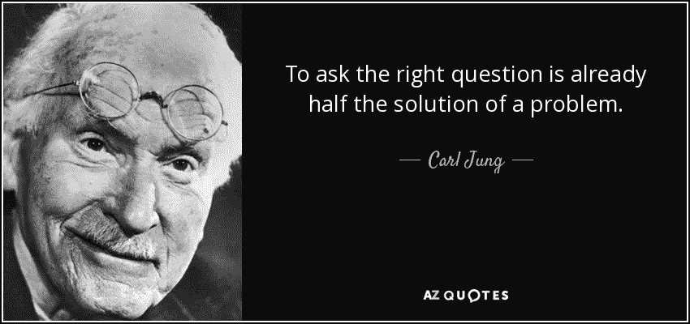

# Hibernate 取类型:懒还是急？简单的答案

> 原文：<https://medium.com/javarevisited/hibernate-a-silver-bullet-for-java-persistence-part-2-d803d653b591?source=collection_archive---------1----------------------->

> 表关系(连接)是通过数据库中的外键定义的。JPA 以一对一、一对多、多对一和多对多等关联形式表示连接。提取类型决定是否在从父表中提取数据后立即加载属于关联的所有数据。Fetch 类型支持两种类型的加载:惰性加载和急切加载。默认情况下，获取类型是惰性的。**什么时候用什么？！**在本文中，我将尝试以简单的方式回答这个问题。

经常有初级开发人员问我这个问题。通常我会用一个问题来回答:“你认为呢？”。常见的回答是这样的:“我迷路了！我有几个用例，在一些情况下它应该是急切的，而在另一些情况下它应该是懒惰的”。嗯，肯定不能两者都在同一时间！

正如我在本系列的[第 1 部分](/javarevisited/hibernate-a-silver-bullet-for-java-persistence-part-1-14799751f525)中所说， [Hibernate](http://hibernate.org/) 是 [CRUD](https://en.wikipedia.org/wiki/Create,_read,_update_and_delete) 的一个伟大工具。这是它的**主要**设计目标，它拥有的所有原语都是为了支持该目标而*构建的。这意味着在发生冲突的情况下，**主要目标**应该获胜！所以关于获取类型的决定应该只针对 CRUD 上下文。*

> 为了消除任何混淆，当我们允许编辑一个**单根实体**时，CRUD 上下文就是这种情况。根实体通常具有业务意义。用户可以创建、编辑和删除它们。比如你现在正在阅读的产品、订单、任务或文章。

对于其余的情况应该做些什么呢？这是我们需要思考的。不是关于获取类型，因为这个问题已经回答了。我们需要决定我们需要从数据库中检索什么数据。指导方针是检索我们真正需要的数据。

我们如何决定？我将描述一个我通常使用的决策树。

1.  我检索的数据是最终的吗，即我或多或少“按原样”返回它，还是我打算在检索后处理它？如果答案是“照原样”，我们可能需要一个 **DTO 投影**。稍后我将详细阐述这个选项。
2.  让我们进一步考虑处理数据的选择。这是我必须回答的最复杂的问题:*我如何最大限度地减少我从数据库中检索的数据集？*如果我需要检索一个包含大量引用对象的数据集，我可能没有很好地减少返回的数据集。同样，这个问题很复杂*，因为*不容易，需要编写一个更复杂的查询。但是如果我这样做，我会在性能和可维护性方面受益。最后，结果变成另一个 **DTO 投影**，与前一个案例合并。
3.  **DTO 投影**或**元组**。这是大多数非普通 CRUD 查询的结束方式。为什么？因为元组是针对用例的！还记得那个年轻的开发者吗？在不同的情况下，我们希望*有不同的*行为。我们不能在它们中使用同一个实体！我们需要一个新的、量身定制的实体来应对几乎每一个特定的(高级)案例——DTO 投影。

**总结**

*   使用 [JPA 实体](https://javarevisited.blogspot.com/2018/01/top-5-hibernate-and-jpa-courses-for-java-programmers-learn-online.html)进行 CRUD 和简单操作。
*   当出现“获取”冲突时，CRUD 案例应该获胜。“松动”的情况应该使用 DTO 投影。
*   喜欢将尽可能多的逻辑委托给数据库，并返回尽可能少的数据。如果您从数据库中检索数据，并在代码中进行可以在数据库中完成的计算，那么它总是比在数据库中进行要慢得多。凭借智能缓存和索引，您无法与高度优化的数据处理引擎竞争。在此基础上，您增加了从数据库中检索数据的时间和相关的内存管理。

最后，由于处理元组并不完全直接，FluentJPA 库[来拯救](https://github.com/streamx-co/FluentJPA/wiki/Entities-&-Tuples)。

# **其他你可能喜欢的 Hibernate 文章和面试问题**

*   **学习 Hibernate 和 JPA 的前 5 门课程深入(** [**课程**](https://javarevisited.blogspot.com/2018/01/top-5-hibernate-and-jpa-courses-for-java-programmers-learn-online.html) **)**
*   **Hibernate 中一级缓存和二级缓存的区别？(** [**回答**](http://javarevisited.blogspot.com/2017/03/difference-between-first-and-second-level-cache-in-Hibernate.html) **)**
*   **Hibernate 中 get()和 load()方法的区别？(** [**回答**](http://javarevisited.blogspot.com/2012/07/hibernate-get-and-load-difference-interview-question.html) **)**
*   **5 期面向 Java 开发者的 Spring 和 Hibernate 培训课程(** [**列表**](http://javarevisited.blogspot.com/2016/12/top-5-spring-and-hibernate-training-courses-java-jee-programmers.html) **)**
*   **2019 年学习冬眠的 2 本书(** [**本书**](http://www.java67.com/2017/02/2-best-books-to-learn-hibernate-for-Java-Developers.html) **)**
*   **2019 年学习 Spring Boot 的 5 门线上课程(** [**课程**](https://hackernoon.com/top-5-online-courses-to-learn-spring-boot-in-2019-c2fd7a0282c2) **)**
*   **2019 年 5 本书学春季框架(** [**本书**](http://www.java67.com/2016/12/5-spring-framework-books-for-java-programmers.html) **)**
*   **为什么 Hibernate 实体类在 Java 中不应该是 final？(** [**回答**](http://javarevisited.blogspot.com/2016/01/why-jpa-entity-or-hibernate-persistence-should-not-be-final-in-java.html) **)**
*   **来自 Java 访谈的 10 个 Hibernate 问题(** [**列表**](http://javarevisited.blogspot.com/2013/05/10-hibernate-interview-questions-answers-java-j2ee-senior.html) **)**
*   **Java 程序员 Spring Boot 面试 15 大问题(** [**问题**](https://www.java67.com/2018/06/top-15-spring-boot-interview-questions-answers-java-jee-programmers.html) **)**
*   **Top 5 课程学习 Spring 框架深入(** [**课程**](https://javarevisited.blogspot.com/2018/06/top-6-spring-framework-online-courses-Java-programmers.html) **)**

 [## Java 开发人员在线学习的 5 大 Hibernate 和 JPA 课程

### Hibernate 是 Java 和 Java EE 或 JEE 程序员的基本框架之一，尤其是如果你正在从事…

javarevisited.blogspot.com](https://javarevisited.blogspot.com/2018/01/top-5-hibernate-and-jpa-courses-for-java-programmers-learn-online.html)