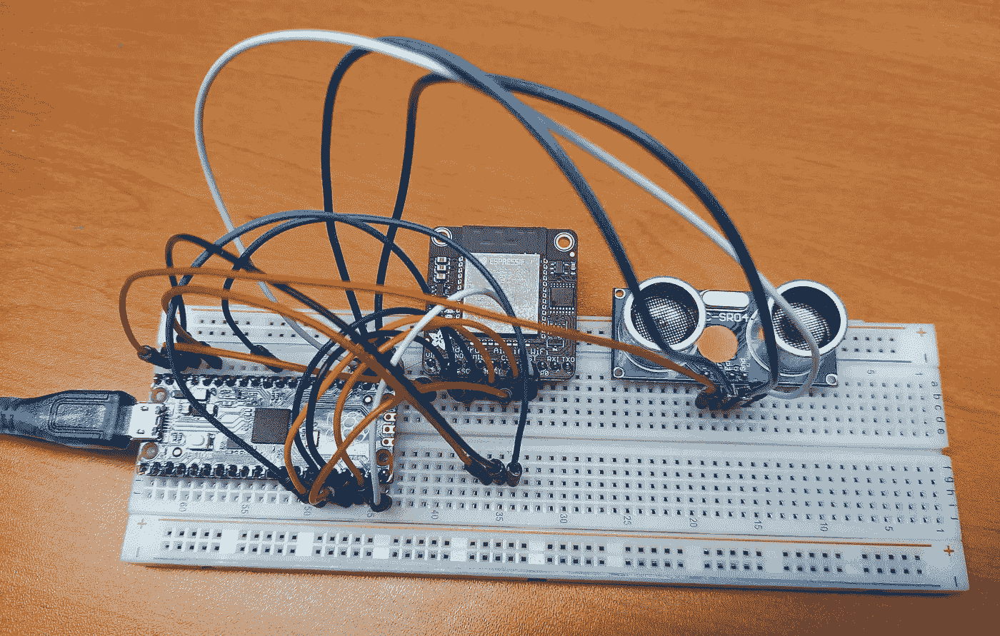
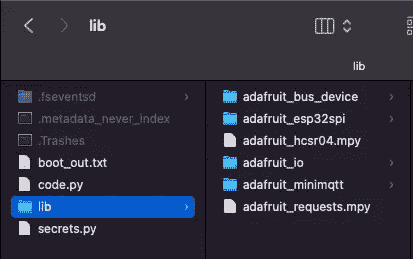
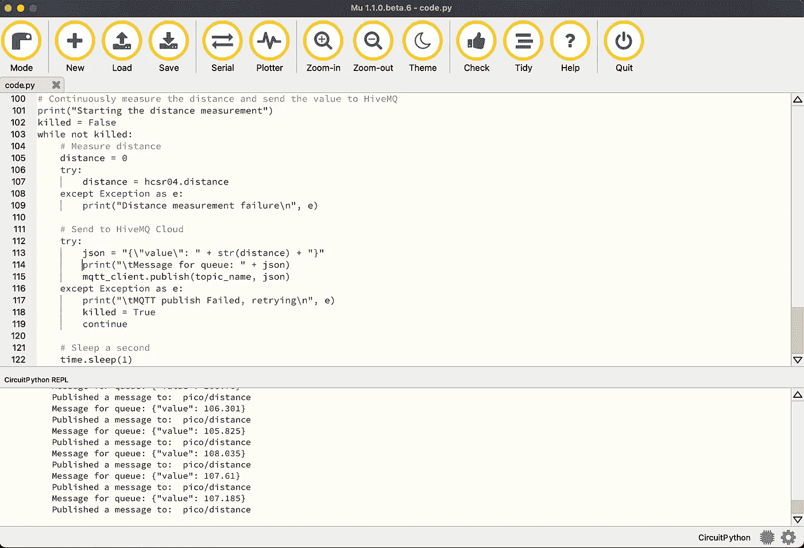
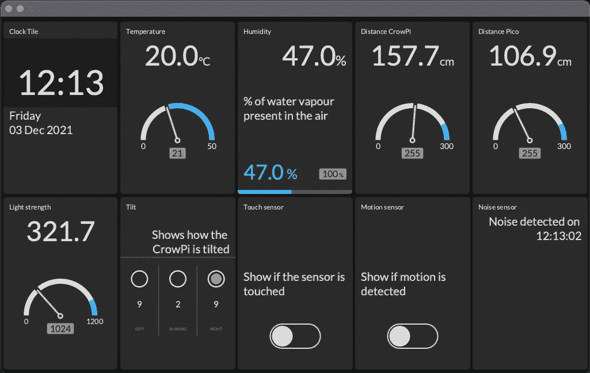

# HiveMQ 云，第 3 部分—将传感器数据从 Raspberry Pi Pico 发送到 HiveMQ 云

> 原文：<https://medium.com/javarevisited/hivemq-cloud-part-3-sending-sensor-data-from-raspberry-pi-pico-to-hivemq-cloud-5841ad0f999e?source=collection_archive---------3----------------------->

在本系列的前两篇文章中，我们在 Raspberry Pi 微型计算机上使用 Java 将传感器数据发送到 HiveMQ Cloud，并在仪表板上可视化。

*   [“第 1 部分:Raspberry Pi 上的 MQTT，用 Java 和 Pi4J 将传感器数据发送到 hive MQ Cloud”](https://www.hivemq.com/blog/mqtt-raspberrypi-part01-sensor-data-hivemqcloud-java-pi4j/)
*   [“第 2 部分:使用 MQTT 和 Raspberry Pi 在 TilesFX 仪表板上可视化传感器数据”](https://www.hivemq.com/blog/mqtt-raspberrypi-part02-visualizing-sensor-data-on-a-tilesfx-dashboard/)

现在，我们将使用 Raspberry Pi 家族的另一个成员:Pico 向我们的消息传递系统添加更多的数据。

# 关于覆盆子馅饼

2021 年 1 月，推出了树莓派 Pico。这是一种全新的开发板，因为它不是一台完整的 Linux PC，而是一个由 Raspberry Pi 自己开发的微控制器芯片(RP2040 ),位于一个小型的多功能开发板上。这款 RP2040 采用双核 Arm Cortex-M0+处理器，具有 264KB 内部 RAM，支持高达 16MB 的片外闪存，结合广泛的 GPIOs(支持 I2C、SPI 和可编程 I/O (PIO))。因此它相当于 Arduino 或类似的微控制器板。但是这款 Pico 最大的惊喜:只有 4 美金的价格！

树莓派基金会确保在发布该板时有一个非常广泛的[文档网站](https://www.raspberrypi.com/documentation/microcontrollers/raspberry-pi-pico.html)可用。编程可以用一个 [C/C++](/javarevisited/top-10-courses-to-learn-c-for-beginners-best-and-free-4afc262a544e) 和 MicroPython SDK 来完成。

Pico 提供许多 GPIOs，这些 GPIOs 通过接地连接很好地组合在一起。这些地面甚至在板上有不同的形状(没有圆角)，以便更容易找到您想要使用的正确引脚。

# Pico 项目

在这篇文章中，我们将扩展 Pico 的 WiFi 模块和一个距离传感器，作为一个例子，您可以轻松地从这个廉价的板将传感器数据发送到 HiveMQ Cloud。为了实现这个非常低的价格，Pico 不包含无线功能。

幸运的是，有不同的可能性可以为 Pico 添加 WiFi，其中 [Adafruit AirLift ESP32 WiFi 协处理器分线板](https://www.adafruit.com/product/4201)可能是最简单和最便宜的，价格为 9.95 美元。Adafruit 产品的一个额外优势是他们在网站上提供了大量的文档。

这些例子中的大多数使用了不同“风格”的 MicroPython，称为 **CircuitPython** ，它基于相同的 Python 实现，但更侧重于初学者、教育和入门教程。

本文中的项目结合了 Adafruit 的不同例子:

*   [连接到 MQTT 代理](https://learn.adafruit.com/mqtt-in-circuitpython/connecting-to-a-mqtt-broker)
*   [开始使用 Raspberry Pi Pico 和 CircuitPython](https://learn.adafruit.com/getting-started-with-raspberry-pi-pico-circuitpython/overview)
*   [快速启动物联网—带 WiFi 的 Raspberry Pi Pico RP 2040](https://learn.adafruit.com/quickstart-rp2040-pico-with-wifi-and-circuitpython/overview)
*   [Python & CircuitPython](https://learn.adafruit.com/ultrasonic-sonar-distance-sensors/python-circuitpython)
*   [安装管理部门编辑器](https://learn.adafruit.com/welcome-to-circuitpython/installing-mu-editor)

# 为 CircuitPython 准备 Pico

让我们从准备本教程的 Pico 开始。我们需要连接组件，在 Pico 上 flash CircuitPython，添加库，并上传我们的代码。

# 接线

拿一块试验板和一些电线来创建这个小测试设置。



## Adafruit 空运 WiFi

AirLift 是 WiFi 模块，它将处理 Pico 和 HiveMQ 云之间的所有通信。我们需要 8 根试验板电线来连接两个元件。通过使用引脚 10 至 15，我们将所有 GPIO 连接集中在一侧。

Adafruit 网站上的重要提示:**您必须使用 Pico 的 VSYS 引脚为空运突破供电。**

**Pico —空运**
VSYS—Vin
GND—GND
GP10(SPI 1 SCK)—SCK
GP11(SPI 1 TX)—MOSI
GP12(SPI 1 RX)—MISO
GP13(SPI 1 CSn)—CS
GP14—忙碌
GP15 —！英特尔的快速储存技术

## 距离传感器

试验板上的第三个元件是 HC-SR04 距离传感器，与 CrowPi 中的类似。这里我们需要 4 根线，对于 GPIOs，我们使用 Pico 的另一端。

**Pico—HC-SR04**
VBUS—Vcc
GND—GND
GP16—ECHO
GP17—TRIGGER

# Pico 上的 CircuitPython

为了让我们的 Pico 支持这个示例 CircuitPython 项目，我们需要加载正确的固件并添加一些库。

## 固件

下载需要安装在 Pico 上的固件，以便能够将其用作 CircuitPython 设备。这个. uf2 文件可以从 circuitpython.org/board/raspberry_pi_pico[下载。](https://circuitpython.org/board/raspberry_pi_pico/)

使用 USB 电缆(非充电专用)，按住 Pico 上的 BOOTSEL 按钮，并将电缆连接在 Pico 和电脑之间。等到你看到一个新的 USB 驱动器“RPI-RP2”出现在你的电脑上，释放 BOOTSEL 按钮。

将下载的. uf2 文件拖动或复制到“RPI-RP2”驱动器。完成后，这个驱动器将在 Pico 重新启动时消失，并重新显示为一个名为“CIRCUITPY”的驱动器。现在您的 Pico 已经准备好用 CircuitPython 编程了。

## 图书馆

为了简化组件的使用，在[circuitpython.org/libraries](https://circuitpython.org/libraries)上可以下载一整套库。下载 ZIP 文件，将其解压缩到您的 PC 上，并将以下列表中的目录或文件复制到“CIRCUITPY”驱动器上的“libs”目录中。

*   adafruit_bus_device
*   阿达果 _esp32_spi
*   阿达果 _hcsr04
*   阿达果 _ 木卫一
*   adafruit_minimqtt
*   阿达果 _ 请求



# 集成驱动电子设备

代码文件可以用任何文本编辑器或 IDE 直接写入 Pico。Adafruit 建议使用 Mu 编辑器，因为这允许在一个工具中编写代码和查看应用程序输出。你可以从 [codewith.mu](https://codewith.mu/) 下载这个工具。

在您的电脑上安装应用程序，运行它并选择模式> CircuitPython。

[](https://javarevisited.blogspot.com/2018/09/top-5-courses-to-learn-intellij-idea-java-and-android-development.html#axzz6A8Vy1sea)

# 密码

这个应用程序的源代码[可以在 GitHub 的同一个资源库中找到，在这个资源库中可以找到前两篇文章](https://github.com/FDelporte/HiveMQ-examples)的源代码。

## 秘密

要将通用代码与您的特定 WiFi 和 HiveMQ 云凭据分开，需要使用一个单独的文件。创建一个文件`secrets.py`,用你的登录名、密码等将它保存到 Pico。

```
secrets = {
   'ssid' : 'WIFI_NETWORK_NAME',
   'password' : 'WIFI_PASSWORD',
   'timezone' : 'Europe/Brussels',
   'mqtt_username' : 'HIVEMQ_USERNAME',
   'mqtt_key' : 'HIVEMQ_PASSWORD',
   'broker' : 'YOUR_INSTANCE.hivemq.cloud',
   'port' : 8883
}
```

## 主代码

下面你可以找到这个项目的完整代码。我试图通过添加评论和打印来解释每一步。在 Mu 中创建一个新文件，复制这段代码并将其保存到 Pico 中作为`code.py`。

```
import time
import board
import busio
import adafruit_hcsr04
import adafruit_requests as requests
import adafruit_esp32spi.adafruit_esp32spi_socket as socket
import adafruit_minimqtt.adafruit_minimqtt as MQTT

from digitalio import DigitalInOut
from adafruit_esp32spi import adafruit_esp32spi

# Load the WiFi and HiveMQ Cloud credentials from secrets.py
try:
    from secrets import secrets
except ImportError:
    print("Error, secrets could not be read")
    raise

# MQTT Topic to publish data from Pico to HiveMQ Cloud
topic_name = "pico/distance"

# Initialize the Pico pins, WiFi module and distance sensor
esp32_cs = DigitalInOut(board.GP13)
esp32_ready = DigitalInOut(board.GP14)
esp32_reset = DigitalInOut(board.GP15)
spi = busio.SPI(board.GP10, board.GP11, board.GP12)
esp = adafruit_esp32spi.ESP_SPIcontrol(spi, esp32_cs, esp32_ready, esp32_reset)
hcsr04 = adafruit_hcsr04.HCSR04(trigger_pin=board.GP17, echo_pin=board.GP16)

# Handle HTTP requests
requests.set_socket(socket, esp)

# Check ESP32 status
print("Checking ESP32")
if esp.status == adafruit_esp32spi.WL_IDLE_STATUS:
    print("\tESP32 found and in idle mode")
print("\tFirmware version: ", esp.firmware_version)
print("\tMAC address: ", [hex(i) for i in esp.MAC_address])

# List the detected WiFi networks
print("Discovered WiFi networks:")
for ap in esp.scan_networks():
    print("\t", (str(ap["ssid"], "utf-8")), "\t\tRSSI: ", ap["rssi"])

# Connect to the configured WiFi network
print("Connecting to WiFi: ", secrets["ssid"])
while not esp.is_connected:
    try:
        esp.connect_AP(secrets["ssid"], secrets["password"])
    except RuntimeError as e:
        print("\tCould not connect to WiFi: ", e)
        continue
print("\tConnected to ", str(esp.ssid, "utf-8"), "\t\tRSSI:", esp.rssi)
print("\tIP address of this board: ", esp.pretty_ip(esp.ip_address))
print("\tPing google.com: " + str(esp.ping("google.com")) + "ms")

# Configure MQTT to use the ESP32 interface
MQTT.set_socket(socket, esp)

# Configure MQTT client (uses secure connection by default)
mqtt_client = MQTT.MQTT(
    broker=secrets["broker"],
    port=secrets["port"],
    username=secrets["mqtt_username"],
    password=secrets["mqtt_key"]
)

# Define callback methods and assign them to the MQTT events
def connected(client, userdata, flags, rc):
    print("\tConnected to MQTT broker: ", client.broker)

def disconnected(client, userdata, rc):
    print("\tDisconnected from MQTT broker!")

def publish(mqtt_client, userdata, topic, pid):
    print("\tPublished a message to: ", topic)

mqtt_client.on_connect = connected
mqtt_client.on_disconnect = disconnected
mqtt_client.on_publish = publish

# Connect to the MQTT broker
print("Connecting to MQTT broker...")
try:
    mqtt_client.connect()
    print("\tSucceeded")
except Exception as e:
    print("\tMQTT connect failed: ", e)

# Continuously measure the distance and send the value to HiveMQ
print("Starting the distance measurement")
killed = False
while not killed:
    # Measure distance
    distance = 0
    try:
        distance = hcsr04.distance
    except Exception as e:
        print("Distance measurement failure\n", e)

    # Send to HiveMQ Cloud
    try:
        json = "{\"value\": " + str(distance) + "}"
        print("\tMessage for queue: " + json)
        mqtt_client.publish(topic_name, json)
    except Exception as e:
        print("\tMQTT publish Failed, retrying\n", e)
        killed = True
        continue

    # Sleep a second
    time.sleep(1)
```

因为`code.py`是主代码的默认文件名，所以这个文件会被直接执行，或者你可以在 Mu 的终端用`CTRL+D`软复位板卡。

## 程序输出

在 Mu 的终端，显示打印输出。

```
Auto-reload is on. Simply save files over USB to run them or enter REPL to disable.
code.py output:
Checking ESP32
	ESP32 found and in idle mode
	Firmware version:  bytearray(b'1.2.2\x00')
	MAC address:  ['0x50', '0x18', '0x49', '0x95', '0xab', '0x34']
Discovered WiFi networks:
	 *****1 		RSSI:  -73
	 *****2 		RSSI:  -79
Connecting to WiFi:  *****1
	Connected to  *****1 		RSSI: -71
	IP address of this board:  192.168.0.189
	Ping google.com: 20ms
Connecting to MQTT broker...
	Connected to MQTT broker:  ***.s1.eu.hivemq.cloud
	Succeeded
Starting the distance measurement
	Message for queue: {"value": 106.777}
	Published a message to:  pico/distance
	Message for queue: {"value": 106.352}
	Published a message to:  pico/distance
	Message for queue: {"value": 107.202}
```

# 将数据添加到我们的 JavaFX 仪表板

经过一些小的改动，我们现在可以将 Pico 消息的数据添加到我们在前一篇文章中创建的 JavaFX 应用程序中。唯一需要修改的文件是`DashboardView.java`。

# 代码更改

首先我们添加一个新变量:

```
private final Tile gaucheDistancePico;
```

在构造函数中，我们初始化类似于现有瓦片的瓦片，并定义对 Pico 发布其距离测量的主题的订阅。

```
gaucheDistancePico = TileBuilder.create()
    .skinType(Tile.SkinType.GAUGE)
    .prefSize(TILE_WIDTH, TILE_HEIGHT)
    .title("Distance Pico")
    .unit("cm")
    .maxValue(255)
    .build();

client.toAsync().subscribeWith()
    .topicFilter("pico/distance")
    .qos(MqttQos.AT_LEAST_ONCE)
    .callback(this::handlePicoData)
    .send();
```

还需要最后一个方法来解析接收到的数据并更新图块:

```
public void handlePicoData(Mqtt5Publish message) {
    var sensorData = new String(message.getPayloadAsBytes());
    logger.info("Pico distance data: {}", sensorData);
    try {
        var sensor = mapper.readValue(sensorData, 
           DoubleValue.class);
        gaucheDistancePico.setValue(sensor.getValue());
    } catch (JsonProcessingException ex) {
        logger.error("Could not parse the data to JSON: {}", 
           ex.getMessage());
    }
}
```

# 扩展布局

经过这些小小的修改，我们现在可以在一个仪表板上看到 CrowPi 和 Pico 的数据。



# 结论

Raspberry Pi Pico 是一款价格非常低廉的多功能设备。通过额外的 Adafruit WiFi 模块，您可以轻松添加无线通信。与此同时，已经有许多基于相同 RP2040 微控制器的新电路板上市，其中一些甚至具有板载 WiFi。一个很好的概述可以在[tomshardware.com/best-picks/best-rp2040-boards](https://www.tomshardware.com/best-picks/best-rp2040-boards)找到。

HiveMQ 云是一个伟大的(并免费多达 100 台设备！)尝试消息传递的方式。当将其与 Java、Raspberry Pi 和电子组件结合使用时，在不同的应用程序和设备之间交换数据变得非常容易。

我希望这三个帖子可以帮助你开始创建自己的项目！

*本文应 HiveMQ 的要求而写，最初发表于 HiveMQ 的博客*<https://www.hivemq.com/blog/mqtt-raspberrypi-part03-sending-sensor-data-hivemqcloud-pico/>**。**