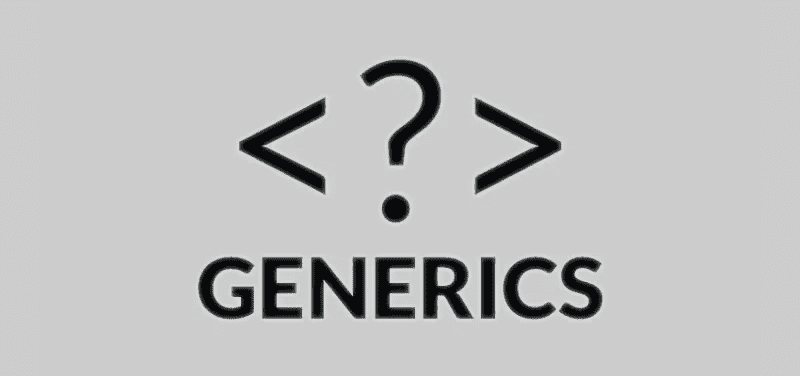

# Java 泛型中如何选择上下界？

> 原文：<https://medium.com/javarevisited/how-to-choose-upper-lower-bounds-in-java-generics-52bfdcfd17c2?source=collection_archive---------1----------------------->

由于缺乏理解，大多数 Java 开发人员对泛型有一种毫无根据的恐惧(或者我称之为对未知:D 的恐惧)。如果偶然，他们克服了恐惧，他们开始害怕上界和下界。这篇博客是我用简单的方式解释这个概念的真诚努力。

[](https://medium.com/javarevisited/top-5-java-online-courses-for-beginners-best-of-lot-1e1e240a758)

Java 泛型

**上&下界有什么用？**

这些用于放松对变量的限制。

**上限通配符(**？扩展类型 **)**

这将未知类型限制为**特定类型或子类型**。这可以用下面的例子来解释:

假设函数可以接受数字及其子类型，样本签名应该是这样的:

```
public void myFunction(List<? extends Number> list)
{ /* some implementation */}
```

**下界通配符(**？超级类型。 **)**

这将未知类型限制为该类型的**特定类型或超类型。这可以用下面的例子来解释:**

假设函数可以接受整数及其超类型，样本签名应该是这样的:

```
public void myFunction(List<? super Integer> list)
{ /* some implementation */}
```

> 所以上面的函数接受 List <integer>& List <number>，但**不接受** List < Double >。</number></integer>

**多重界限**

`<T extends C & I>`表示*调用方*可以指定[扩展](https://www.java67.com/2019/07/top-50-java-generics-and-collection-interview-questions.html) `C`和`I`的任意类型。这可以解释如下:

```
**class** MultipleBound<T **extends** A & B>
{
  **private** T objRef;

  **public** MultipleBound(T obj)
  {
    **this**.objRef = obj;
  }

  **public** **void** run()
  {
    **this**.objRef.execute();
  }
}**interface** B
{
  **public** **void** execute();
}**public class** A **implements** B
{
  **public** **void** execute()
  {
    System.out.println("Inside class A");
  }
}**public** **class** BoundedClass
{
   **public** **static** **void** main(String a[])
   {
     MultipleBound<A> obj= **new** MultipleBound<>(**new** A());
     obj.run();
   }
}
```

> 西格尔定律是一句谚语:
> 
> “有手表的人知道现在是什么时间。一个有两只表的人永远不确定。”

# 什么时候选择什么？

为了决定哪种类型的通配符最适合该条件，让我们首先将传递给方法的参数类型分类为 **in** 和 **out** 参数。

*   **输入变量**——输入变量向代码提供数据。例如，copy(src，dest)。这里，src 充当要复制的数据的变量。
*   **输出变量**——输出变量保存由代码更新的数据。例如，copy(src，dest)。这里 dest 充当复制了数据的变量。

# 通配符指南(Get-Put 原则)

*   **上限通配符**——如果变量属于类别中的**，使用带通配符的扩展关键字。**
*   **下限通配符**——如果变量不属于类别，使用带通配符的超级关键字。
*   [**无界通配符**](https://javarevisited.blogspot.com/2012/04/what-is-bounded-and-unbounded-wildcards.html)——如果变量可以使用对象类方法访问，则使用无界通配符。
*   [**无通配符**](http://javarevisited.blogspot.sg/2017/04/difference-between-raw-type-and-wild-card-arraylist.html#axzz4rZnBGAiP)——如果代码同时在和 **out** 类别中访问变量，则不要使用通配符。

# 摘要

有界通配符在创建灵活的通用 API 时非常有用。使用有界通配符的最大障碍是确定下界/上界通配符的情况。

get-put 原则可用于确定应该使用哪一个。

有问题吗？建议？评论？