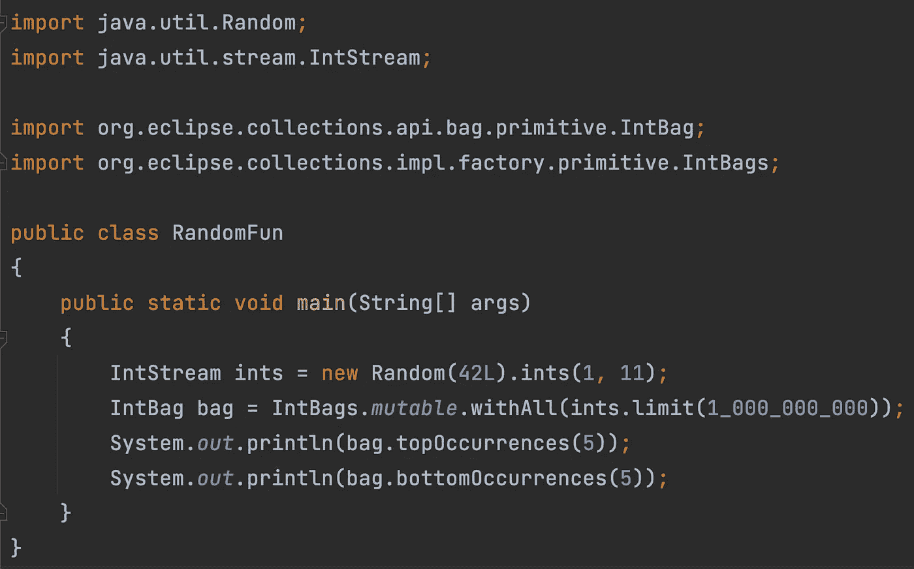

# 如何使用 Eclipse 集合计算十亿个随机整数

> 原文：<https://medium.com/javarevisited/how-to-count-a-billion-random-ints-using-eclipse-collections-96e4315be4e0?source=collection_archive---------0----------------------->

学习如何用 Java 从一个原始流构建一个原始包。

代码生成 10 亿个介于 1 和 10 之间的随机整数，并在 IntBag 中对它们进行计数。打印顶部和底部 5。

输出:

1 到 10 之间的前 5 个随机整数(顶线)。底部 5 个介于 1 和 10 之间的随机整数(底线)。

Eclipse Collections 有几种原始的集合类型，我在 2021 年 8 月的博客中提到过。

</javarevisited/the-missing-java-data-structures-no-one-ever-told-you-about-part-3-d26387b9e66e>  

一个`[IntBag](https://www.eclipse.org/collections/javadoc/11.1.0/org/eclipse/collections/api/bag/primitive/IntBag.html)`是一个原语`Bag`，它对计算`int`值很有用。你可以使用一个特殊的`[withAll](https://www.eclipse.org/collections/javadoc/11.1.0/org/eclipse/collections/api/factory/bag/primitive/MutableIntBagFactory.html#withAll(java.util.stream.IntStream))`方法直接从一个`[IntStream](https://docs.oracle.com/javase/8/docs/api/java/util/stream/IntStream.html)`初始化一个`IntBag`，如上例所示。一个`IntBag`有`[topOccurrences](https://www.eclipse.org/collections/javadoc/11.1.0/org/eclipse/collections/api/bag/primitive/IntBag.html#topOccurrences(int))`和`[bottomOccurrences](https://www.eclipse.org/collections/javadoc/11.1.0/org/eclipse/collections/api/bag/primitive/IntBag.html#bottomOccurrences(int))`方法，这些方法非常方便。还有`[DoubleBag](https://www.eclipse.org/collections/javadoc/11.1.0/org/eclipse/collections/api/bag/primitive/DoubleBag.html)`和`[LongBag](https://www.eclipse.org/collections/javadoc/11.1.0/org/eclipse/collections/api/bag/primitive/LongBag.html)`类型，它们可以通过`[DoubleBags](https://www.eclipse.org/collections/javadoc/11.1.0/org/eclipse/collections/api/factory/primitive/DoubleBags.html)`和`[LongBags](https://www.eclipse.org/collections/javadoc/11.1.0/org/eclipse/collections/api/factory/primitive/LongBags.html)`工厂类使用相应的`withAll`方法直接从`[DoubleStream](https://docs.oracle.com/javase/8/docs/api/java/util/stream/DoubleStream.html)`和`[LongStream](https://docs.oracle.com/javase/8/docs/api/java/util/stream/LongStream.html)`初始化。

以原始流作为参数的`withAll`方法出现在 [Eclipse 集合 9.0 版本](https://github.com/eclipse/eclipse-collections/releases/tag/9.0.0)中。如果您愿意，也有名为`[ofAll](https://www.eclipse.org/collections/javadoc/11.1.0/org/eclipse/collections/api/factory/bag/primitive/MutableIntBagFactory.html#ofAll(java.util.stream.IntStream))`的等价方法。如果你想了解为什么有`withAll`和`ofAll`方法做同样的事情，下面的博客将有助于解释。

</javarevisited/preposition-preference-1f1c709b098b>  

感谢您的阅读！尽情享受吧！

*我是由*[*Eclipse Foundation*](https://projects.eclipse.org/projects/technology.collections)*管理的*[*Eclipse Collections*](https://github.com/eclipse/eclipse-collections)*OSS 项目的创建者和提交者。Eclipse Collections 为* [*投稿*](https://github.com/eclipse/eclipse-collections/blob/master/CONTRIBUTING.md) *打开。*

## 您可能喜欢的其他 Java 文章

</javarevisited/10-best-places-to-learn-java-online-for-free-ce5e713ab5b2>  </javarevisited/the-java-programmer-roadmap-f9db163ef2c2>  </javarevisited/how-to-use-streams-map-filter-and-collect-methods-in-java-1e13609a318b> 