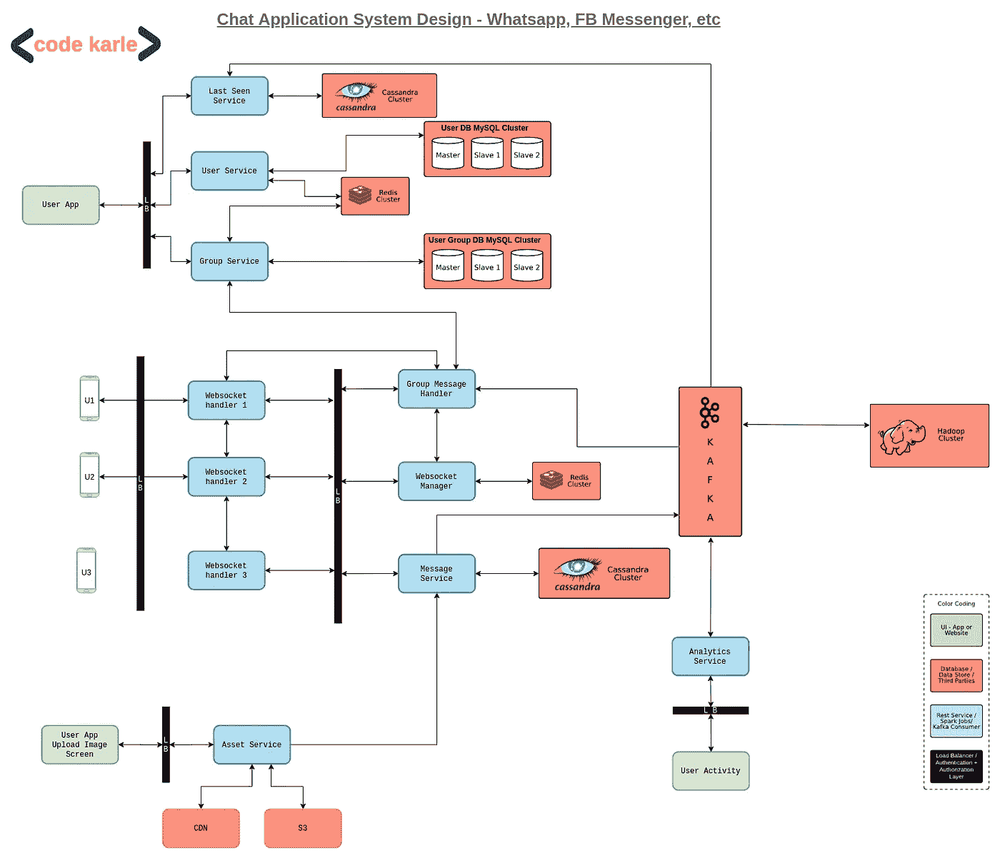
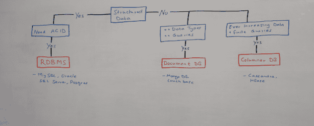
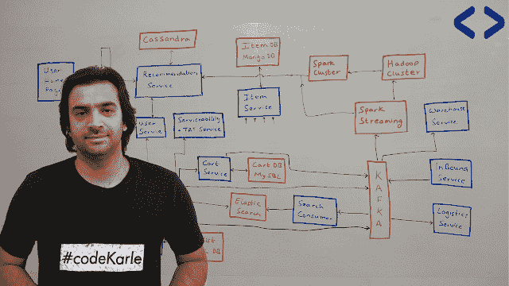
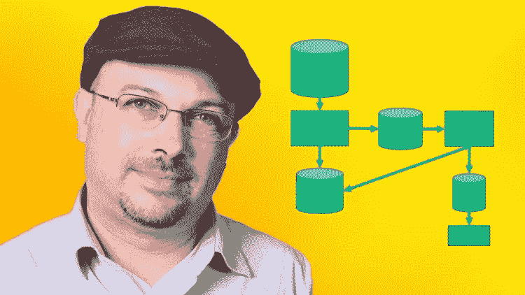
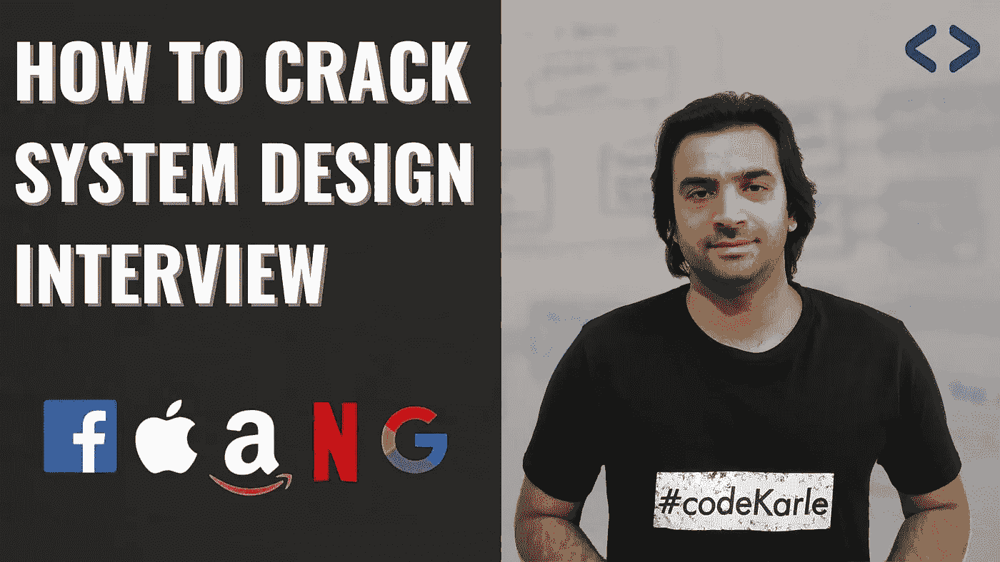

# 2023 年如何破解系统设计面试？提示、问题和资源

> 原文：<https://medium.com/javarevisited/how-to-crack-system-design-interviews-in-2022-tips-questions-and-resources-fcad05e2dab?source=collection_archive---------0----------------------->

## 破解系统设计面试和进入 FAANG 的指南

image_credit — codekarle

大家好，如果你正在准备编码面试，但不知道如何准备重要的系统设计主题，并寻找正确的方法，技巧和问题的逐步指导，那么你来对地方了。

之前我已经分享过[**最佳系统设计课程**](/javarevisited/10-best-system-design-courses-for-coding-interviews-949fd029ce65) 和 [25 个系统设计面试问题](/double-pointer/top-25-system-design-interview-questions-c468e025b370)而在这篇文章里，我将分享 2023 年破解系统设计面试的完整指南。

软件工程就业市场火了！尤其是如果你有几年的工作经验。而在软件工程的世界里，如果你应聘的是高级工程师/领导/架构师/或者更高级的角色， [**系统设计**](https://www.java67.com/2019/09/top-5-courses-to-learn-system-design.html) 是最抢手的技能，也因此是整个流程中最重要的一轮。

如果你把这件事搞砸了，其他的事情都不重要了。如果你做对了，你将会看到每年至少几万美元的加薪。

那么，你如何在系统设计中胜出呢？嗯，以下是我在准备脸书、[谷歌](https://javarevisited.blogspot.com/2012/01/google-interview-questions-answers-top.html)和[亚马逊](https://javarevisited.blogspot.com/2016/01/top-20-amazon-and-google-programming-interview-questions.html)的面试时所做的，效果相当不错。

我最终为自己创建了一份清单，这份清单让我度过了大部分的回合，所以如果你遵循类似的路径，你应该也能想出一些对你有用的东西。

在我们进入细节之前，**什么是系统设计面试？面试官对应聘者真正的期望是什么？**

# 期望:

1.  你应该能够设计出一个满足给你的需求并具有良好扩展性的系统，例如[设计一个自动售货机](https://javarevisited.blogspot.com/2016/06/design-vending-machine-in-java.html#axzz7CANVFpos) e 或者[设计一个交易位置聚集器](https://javarevisited.blogspot.com/2022/03/how-to-design-trade-position-calculator.html)。
2.  您的设计应该是可插拔的，而不是限制新功能的添加。
3.  你应该能够比较各种选择，并选择最佳的一个。比如，哪个数据库最重要，或者应该使用哪个协议，或者扩展系统的最佳方法是什么，等等。
4.  您应该知道从系统设计角度来看相关的基础知识，例如:
5.  负载平衡器
6.  蜜蜂
7.  隐藏所
8.  数据库
9.  网络协议
10.  消息队列
11.  CDNs
12.  关于 ML 和大数据的高级细节
13.  CAP 定理
14.  监控和分析

这些实际上是每个开发人员应该准备的**基本系统设计主题**和概念。如果你了解这些话题，那么你肯定会在系统设计面试中表现出色。顺便说一句，不要被众多的话题搞得不知所措，大多数好的系统设计课程，如 CodeKarle 的 [**【系统设计】**](https://bit.ly/3D2qsRS)**Udemy 或[**Grokking the System Design Interview on Educative**](https://www.educative.io/collection/5668639101419520/5649050225344512?affiliate_id=5073518643380224)**涵盖了所有这些话题。****

****<https://www.educative.io/collection/5668639101419520/5649050225344512?affiliate_id=5073518643380224> **** 

# ****如何准备系统设计面试？****

****有一个简单的四步过程来赢得任何系统设计回合。****

1.  ****概念****
2.  ****向科技巨头学习****
3.  ****常见问题****
4.  ****实践****

## ****1.系统设计概念****

****任何系统设计面试都一定会要求你为你试图构建的任何系统提出一个基本的高层次设计。肯定会需要一些组件。记下这些组件。****

****这里有一些-****

******负载均衡器** —如果没有负载均衡器来在各个节点之间分配传入的请求，就不可能有分布式系统。这确保了适当的资源利用，并且在您的系统中没有单点故障。下面是 Nginx 是如何做到的。****

******缓存** —大多数系统都有一些需要大量读取的交互，一些用户会经常访问但不会经常更新的信息。以这样一种方式缓存这些信息是有意义的，即不需要在数据库中查找就可以很容易地获取这些信息。认为**低延迟**。此外，根据您的用例，您可能需要存储更频繁访问的信息或最近访问的信息。所以，仔细阅读各种驱逐政策。****

******数据库** —同样，没有某种形式的数据存储就没有系统。无论您是想要存储文件、图像、产品信息、金融交易，还是简单地转储来自各种用户交互的所有数据以便稍后运行分析。****

****这都需要[数据库](/javarevisited/top-5-sql-and-database-courses-to-learn-online-48424533ac61)。所以好好读读吧。找出在选择数据库时什么是重要的，阅读关于 [SQL](https://javarevisited.blogspot.com/2018/05/top-5-sql-and-database-courses-to-learn-online.html) / [NoSQL](/javarevisited/5-best-nosql-database-programmers-and-developers-can-learn-42a0bdfa9a12) ，查询模式，以及 CAP 定理如何在权衡时发挥作用。****

********

******消息队列** —有时我们的系统需要执行一些需要完成但不一定马上完成的任务，或者它们的结果不影响用户的旅程。在这种情况下，与其发出服务调用并等待响应，不如将消息写入队列以便稍后执行。****

****如果您需要在数据库[中插入信息，而批量插入可能更有效，该怎么办？在消息队列中跟踪这些插入并执行一次批量插入而不是数百次一对一的插入来优化您的资源是有意义的。](https://javarevisited.blogspot.com/2018/05/top-5-sql-and-database-courses-to-learn-online.html)****

******CDN** —当您的用户分布在不同的地理位置时，在合理的时间内将您的内容提供给他们是一个真正的挑战。cdn 允许我们在离用户位置更近的各种数据中心维护数据副本，以减少延迟。这里有一个关于 Akamai 如何做的简短视频。****

******分析和监控** —这是你创建的每个系统都需要的东西。这是一个隐藏的需求，没有人会在需求聚会上说出来，但是每个面试官都希望这样。用户登录还是注销？愿望清单项目？支付失败？这是我们所有的信息！任何重要的事情发生时，激发一个事件并保存在您的消息队列中。****

****您可以对数据执行实时分析，或者只是将其转储到 [Hadoop 集群](/javarevisited/10-best-big-data-and-hadoop-tutorials-books-and-courses-to-learn-in-2020-aaca8cfccb80)中以备后用。类似地，如果一个 API 调用经常失败，或者如果您的服务器即将耗尽资源，难道您不想提前知道吗？****

******网络协议** —根据您的要求，根据您共享的内容类型，您可能需要决定使用哪种网络协议。仔细阅读各种[网络协议](/javarevisited/5-best-books-and-courses-to-learn-computer-networking-tcp-ip-and-udp-protocols-5a0e4dce75fa)，如 [TCP 和 UDP](https://javarevisited.blogspot.com/2014/07/9-difference-between-tcp-and-udp-protocol.html) ，以及它们何时相关，你可能需要做出哪些妥协，等等。****

****第一步是了解所有这些概念。我所说的了解概念，并不仅仅指这些概念的一些理论知识，而是更多的关于什么时候应该使用什么的实践经验。****

****你需要知道一些事情，比如:****

1.  ****给定用例，哪一个是可供选择的最佳选择。****
2.  ****在做出这些决定时，你需要考虑哪些权衡？****
3.  ****某些用例的最佳实践。****

****为了了解其中的大部分内容，我将推荐您阅读 CodeKarle 的《系统设计》课程，该课程涵盖了上述所有内容，并提供了真实世界中的具体示例。****

********

## ****2.向科技巨头学习****

****这在短期内可能不会有所帮助。但是从长远来看，要成为[系统设计](https://javarevisited.blogspot.com/2019/03/5-courses-programmers-can-join-to-learn.html)的专家，最好还是看看各个科技公司的科技博客，看看他们是如何解决各种技术问题的。****

****这将清楚地描绘出他们所面临的真正问题，以及他们如何创新地解决这些问题。了解这些将有助于你更好地进行系统设计，并让你跟上最新的技术创新。****

****一些值得关注的最佳博客是:****

1.  ****[脸书工程博客](https://engineering.fb.com/)****
2.  ****[网飞科技博客](https://netflixtechblog.com/)****
3.  ****[优步工程博客](https://eng.uber.com/)****

****如果你不喜欢阅读，更喜欢观看，那么你也可以参加 FAANG 前员工创建的在线课程，如弗兰克凯恩[**【掌握系统设计面试】(前亚马逊招聘经理)。这是学习面试系统设计的最佳资源之一。**](https://click.linksynergy.com/deeplink?id=JVFxdTr9V80&mid=39197&murl=https%3A%2F%2Fwww.udemy.com%2Fcourse%2Fsystem-design-interview-prep%2F)****

********

## ****3.常见的系统设计问题****

****开始面试准备的一个显而易见的方法！了解基础知识肯定很重要，但这还不够！开始实践的最基本方法是查看一些常见问题及其解决方案。****

****大多数系统设计面试都围绕着 5-6 个常见的[系统设计问题](https://www.java67.com/2018/05/top-20-system-design-interview-questions-answers-programming.html)展开，如果你知道这些问题的答案，你就很有可能通过这次面试。****

****最常见的问题是:****

1.  ****[如何设计 YouTube？](http://How to design Youtube)****
2.  ****[如何设计类似 WhatsApp 或 Facebook Messenger 的聊天系统](https://www.tryexponent.com/courses/system-design-interview?ref=javinpaul2)****
3.  ****Twitter 系统设计****
4.  ****脸书系统设计****
5.  ****[Whatsapp 系统设计](https://www.java67.com/2018/05/top-20-system-design-interview-questions-answers-programming.html)****
6.  ****Airbnb 系统设计****
7.  ****优步系统设计****
8.  ****Tinyurl 系统设计****

****如果你需要解决这些问题的资源，一些不仅能解决问题，还能解释解决系统设计问题的基本概念和方法的资源，那么 CodeKarle 的这个[高评分课程讨论了大多数案例研究](https://bit.ly/3D2qsRS)和一些更多的问题，这已经帮助许多人破解了他们在谷歌、脸书、微软、亚马逊等公司的面试。****

********

## ****4.实践****

****练习，练习，练习！我说练习了吗？外面有很多资源。我已经分享了一些详细讨论一些最流行的系统设计问题的例子。一旦你经历了其中的一些，你会开始注意到一个模式，很快就能自己想出解决办法。****

****更好地了解您的系统在您的组织中是如何设计的。其他团队做得怎么样？他们考虑了哪些因素？下一个最好的方法是和朋友一起练习。确保在正式面试前进行几次模拟面试，以避免一些常见但容易避免的陷阱。****

****我见过人们犯的一些最常见的错误是:****

1.  ****不推动面试****
2.  ****不问问题****
3.  ****没有合理安排面试****
4.  ****时间不多了****
5.  ****不考虑要求****
6.  ****没有探索所有可供选择的设计方案****

****通过与熟悉系统设计的人进行几次模拟面试，所有这些错误都可以很容易地避免。安排好面试时间。目标必须是在 40 分钟内达成解决方案，包括一些讨论的时间。****

****好了，就这样了，伙计们。通过这 4 个步骤，你很快就能在任何系统设计面试中胜出！希望这对你来说是一个好的起点。快乐学习！****

## ****最佳系统设计面试资源****

****如果你需要更多的资源，如书籍和在线课程来准备系统设计面试，以下是我的建议:****

*   ****[**CodeKarle 在 Udemy 上的系统设计面试课程**](https://bit.ly/3D2qsRS)****
*   ****[**探寻教育制度设计**](https://www.educative.io/collection/5668639101419520/5649050225344512?affiliate_id=5073518643380224) 访谈****
*   ****[**【掌握系统设计】采访弗兰克·凯恩**](https://click.linksynergy.com/deeplink?id=JVFxdTr9V80&mid=39197&murl=https%3A%2F%2Fwww.udemy.com%2Fcourse%2Fsystem-design-interview-prep%2F)****
*   ****[**软件设计与架构专业化【Coursera】**](https://coursera.pxf.io/c/3294490/1164545/14726?u=https%3A%2F%2Fwww.coursera.org%2Fspecializations%2Fsoftware-design-architecture)****
*   ****[**系统设计面试课程及指数模拟面试**](https://www.tryexponent.com/courses/system-design-interview?ref=javinpaul2)****
*   ****[字节跳动](https://bytebytego.com?fpr=javarevisited)系统设计访谈课程，Alex Wu****
*   ****[**Web 应用&软件架构 101【educative . io】**](https://www.educative.io/courses/web-application-software-architecture-101?affiliate_id=5073518643380224)****
*   ****[**语用系统设计【Udemy 课程】**](https://click.linksynergy.com/deeplink?id=JVFxdTr9V80&mid=39197&murl=https%3A%2F%2Fwww.udemy.com%2Fcourse%2Fpragmatic-system-design%2F)****
*   ****[为软件工程师&经理](https://www.educative.io/courses/grokking-modern-system-design-software-engineers-managers?affiliate_id=5073518643380224)钻研现代系统设计****

****<https://www.educative.io/courses/grokking-modern-system-design-software-engineers-managers?affiliate_id=5073518643380224>  

感谢您阅读本文。如果你喜欢这篇系统设计面试准备文章、问题、技巧和资源，那么请与你准备技术面试的朋友和同事分享。如果您有任何问题或反馈，请留言。

祝你面试顺利。

<https://www.java67.com/2018/05/top-20-system-design-interview-questions-answers-programming.html>  <https://www.java67.com/2016/07/top-5-object-oriented-design-interview-questions.html>  <https://javarevisited.blogspot.com/2016/06/java-object-oriented-analysis-and-design-vending-machine-part-2.html> ****