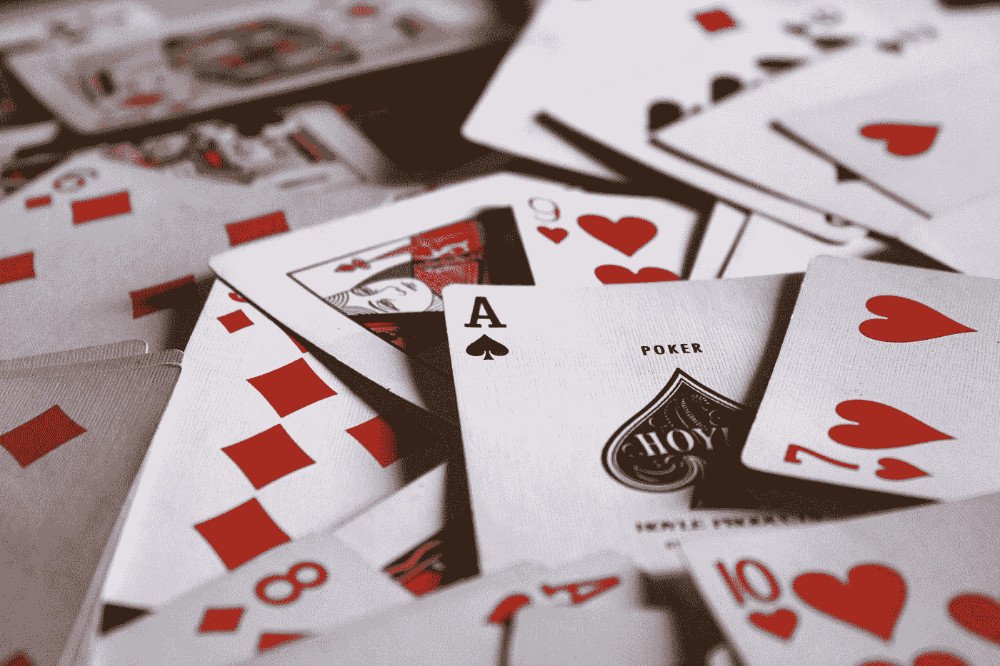
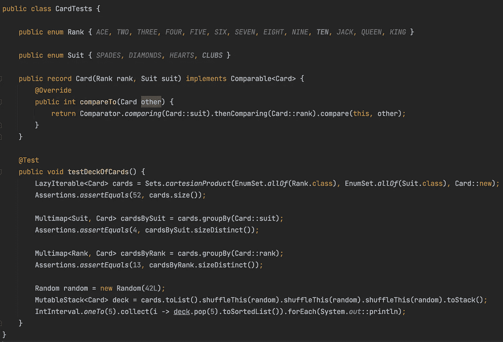

# 如何使用 Eclipse 集合创建一副卡片

> 原文：<https://medium.com/javarevisited/how-to-create-a-deck-of-cards-using-eclipse-collections-d9838ac430b7?source=collection_archive---------3----------------------->

一个用 Java 枚举和记录使用 [Eclipse 集合](https://github.com/eclipse/eclipse-collections)的有趣例子

[杰克·汉密尔顿](https://unsplash.com/@jacc?utm_source=medium&utm_medium=referral)在 [Unsplash](https://unsplash.com?utm_source=medium&utm_medium=referral) 上的照片

# 等级和套装的笛卡儿积

如果我们有一个`Rank`的`enum`和`Suit`的`enum`，使用 Java 记录创建一个`Card`类型是很简单的。使用 [Eclipse 集合](https://github.com/eclipse/eclipse-collections)中的`cartesianProduct`方法创建一副卡片也很简单。我们可以断言我们总共得到了 52 个`Card`实例。我们可以通过`Suit`和`Rank`对牌进行分组，并断言我们得到了 4 个花色和 13 个等级。我们也可以洗牌三次，用一个`MutableStack`和`IntInterval`发五手牌，每手五张。最后，我们可以打印五手牌。

cartesianProduct，groupBy，toList，shuffleThis，toStack，IntInterval，collect，multi-pop，toSortedList & forEach

以下是最终输出。

发五手牌，每手五张

我用 Java 17 写了这段代码。Java 还是太啰嗦吗？你决定吧。我认为 Java 每 6 个月就会有一个新的版本。😀

如果你想尝试使用 Java 的最新特性创建自己的卡片组，你可以在这里查看这个卡塔。

感谢您的阅读！

*我是由*[*Eclipse Foundation*](https://projects.eclipse.org/projects/technology.collections)*管理的*[*Eclipse Collections*](https://github.com/eclipse/eclipse-collections)*OSS 项目的创建者和提交者。Eclipse Collections 为* [*投稿*](https://github.com/eclipse/eclipse-collections/blob/master/CONTRIBUTING.md) *打开。*

## 您可能喜欢的其他 Java 文章

</javarevisited/50-java-collections-interview-questions-for-beginners-and-experienced-programmers-4d2c224cc5ab>  </javarevisited/the-java-programmer-roadmap-f9db163ef2c2>  </javarevisited/how-to-use-streams-map-filter-and-collect-methods-in-java-1e13609a318b> 