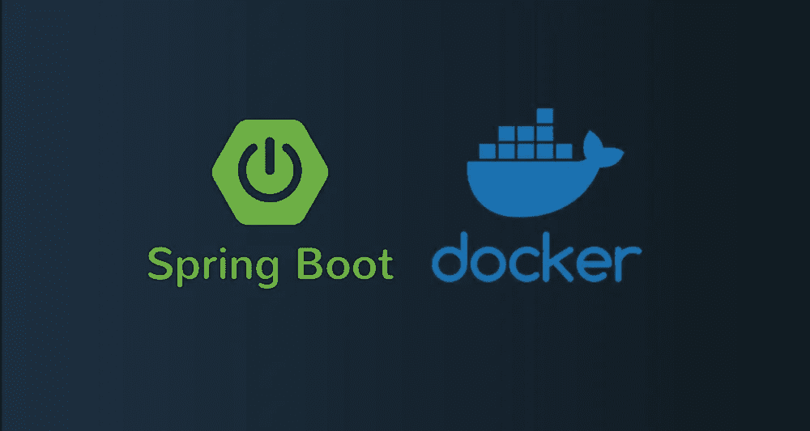

# 如何将你的 Spring Boot 申请归档

> 原文：<https://medium.com/javarevisited/how-to-dockerize-your-spring-boot-application-a2d2a84eda1a?source=collection_archive---------1----------------------->



# **概述**

在本文中，我们将研究如何对我们的 Spring Boot 应用程序进行 dockerize。如今，在软件开发领域，有一种做基于容器的部署的冲动。 [Docker](https://www.docker.com/) 是一种开源技术，主要用于开发、发布和运行应用程序。一旦将应用程序及其所有依赖项打包到 Docker 容器中，就可以确保它可以在任何环境中运行。

# 术语

在我们深入应用程序的 docker 化过程之前，最好先了解一下 docker 术语。

***docker 文件***

*   Docker 文件是一个简单的文本文件，包含如何构建图像的说明。

***docker 图像***

*   一个 **Docker 映像**包含一组用于创建能够在 **Docker** 平台上运行的**容器**的指令。

***码头工人集装箱***

*   容器是 Docker 映像的实例，可以使用 Docker run 命令运行。 [Docker](/javarevisited/top-15-online-courses-to-learn-docker-kubernetes-and-aws-for-fullstack-developers-and-devops-d8cc4f16e773) 的基本用途是运行集装箱。

***docker hub/registry***

*   注册中心的工作方式基本上类似于一个 [git 存储库](/javarevisited/7-best-courses-to-learn-gitlab-for-developers-and-devops-engineers-10d4de4ae206)，允许你推和拉容器图像。

***docker 撰写***

*   Compose 是一个定义和运行多容器 Docker 应用程序的工具。

***docker 卷***

*   为了能够保存(持久化)数据并在容器之间共享数据， [Docker](/javarevisited/10-free-courses-to-learn-docker-and-devops-for-frontend-developers-691ac7652cee) 提出了*卷*的概念。

# 让我们停下来！

## 1.创建 Jar 文件

作为第一步，您需要使用下面的命令创建一个可执行的 jar 文件。

*   如果你用的是 [maven](/javarevisited/6-best-maven-courses-for-beginners-in-2020-23ea3cba89)

```
***$ mvn clean install***
```

*   如果您正在使用 [Gradle](/javarevisited/5-best-gradle-courses-and-books-to-learn-in-2021-93f49ce8ff8e)

```
***$ gradle build***
```

您应该能够在 spring boot 项目中的目标文件夹下看到生成的 jar。这个 jar 文件的好处是我们可以像运行控制台应用程序一样运行这个 web 应用程序。所以我们的下一步是创建一个 docker 文件。

## 2.创建 Dockerfile 文件

我们必须在项目的根目录下创建一个 docker 文件。

```
FROM openjdk:8-jdk-alpine
VOLUME /tmp
ADD target/Docker-0.0.1-SNAPSHOT.jar app.jar
ENTRYPOINT ["java","-jar","/app.jar"]
```

来自:我们正在从基础映像 openjdk 构建我们的映像，我们将 OpenJDK 作为父映像，并在此基础上进行构建

卷: [spring boot 应用程序](https://javarevisited.blogspot.com/2019/02/difference-between-contextconfiguration-and-springapplicationConfiguration-annotations-in-spring-boot-testing.html)需要这个卷，因为 tomcat 试图在这个卷内部创建一个工作文件夹

ADD:它将我们的 jar 添加到 docker 映像中

ENTRYPOINT:它指定我们的应用程序运行的入口点。

## 3.构建 Docker 映像

转到 docker 文件位置，打开命令提示符并运行以下命令。

*   如果你用的是 [maven](/javarevisited/top-10-free-courses-to-learn-maven-jenkins-and-docker-for-java-developers-51fa7a1e66f6)

```
$ docker build -t tag-name/image-name .
```

*   如果你用的是 [Gradle](https://javarevisited.blogspot.com/2020/06/maven-vs-gradle-beginners-introduction.html#axzz6dHZ7oEpK)

```
$ docker build — build-arg JAR_FILE=build/libs/*.jar -t tag-name/image-name .
```

您可以使用以下命令检查现有图像。

```
docker image ls
```

注意:现在你可以把你的图片推送到 [docker hub](/javarevisited/5-best-docker-courses-for-java-and-spring-boot-developers-bbf01c5e6542) 。这样别人就可以拉你的图像，运行 docker 图像。我们可以使用同一个图像创建多个容器。

## 4.运行 Docker 容器

为了运行我们的 docker 映像，我们必须进行端口映射。这是因为我们的应用程序运行在某种虚拟环境中，所以我们必须进行从您的主机到 docker-machine 的端口映射。使用下面的命令来完成。

```
$ docker run -p 9090:8080 -t tag-name/image-name
```

如果你想停止我们的容器，使用下面的命令。

```
$ docker container stop container ID
```

*要了解更多关于 docker 的信息，请浏览*[***docker***](https://docs.docker.com/get-started/overview/)

我希望你已经理解了如何使用 Docker 容器化一个 Spring Boot 应用程序。感谢阅读😊。