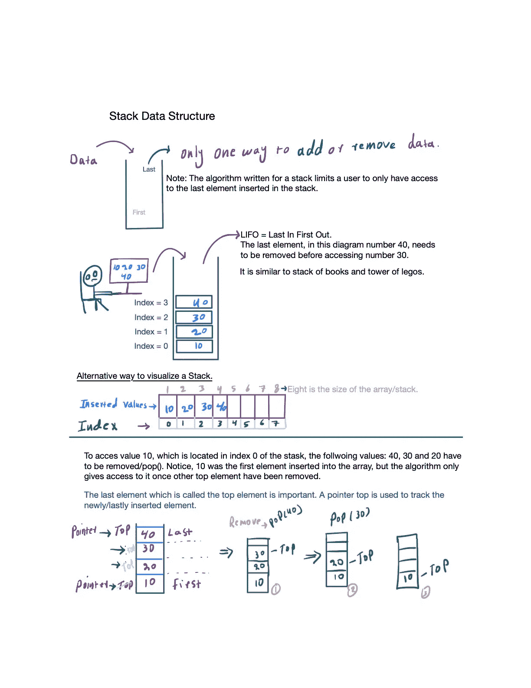

# 如何在 Java 中实现通用堆栈数据结构

> 原文：<https://medium.com/javarevisited/how-to-implement-a-generic-data-structure-in-java-2523b5c4d3ff?source=collection_archive---------1----------------------->

Java 是一种静态类型语言，它要求用户在声明变量之前定义数据的类型(Oracle)。因此，一个不了解泛型的程序员将会多次重写同一个类来创建一个整数、双精度和字符串对象，以满足应用程序的需求。

因此，充分了解 Java 中的泛型非常重要。像 [JavaScript](/javarevisited/5-best-javascript-books-for-beginners-and-experienced-web-developers-2c6353d1cc85) 或者 [Python](/javarevisited/10-best-python-certification-courses-from-coursera-4576890eb6b3) 这样的语言允许用户定义变量而不定义数据类型。

因此，程序员可以对不同的数据类型使用同一个类。然而， [Java](/javarevisited/10-best-places-to-learn-java-online-for-free-ce5e713ab5b2) 并没有那么灵活，但是对变量声明和数据类型灵活性的需求导致 Java 开发人员创建了通用对象，其行为几乎类似于非静态类型语言。

在本教程中，我们使用一个泛型栈类和数据结构来说明使用泛型的好处。

一个泛型类可以写一次但可以多次使用，这就是[不要重复自己](/javarevisited/10-oop-design-principles-you-can-learn-in-2020-f7370cccdd31)(干)的原则。让我们回顾一下下面的泛型和非泛型类。

[https://raw . githubusercontent . com/menhaj 007/generic stack/main/car . Java](https://raw.githubusercontent.com/menhaj007/genericStack/main/Car.java)

[https://raw . githubusercontent . com/menhaj 007/generic stack/main/car 1 . Java](https://raw.githubusercontent.com/menhaj007/genericStack/main/Car1.java)

[https://raw . githubusercontent . com/menhaj 007/generic stack/main/zip code . Java](https://raw.githubusercontent.com/menhaj007/genericStack/main/ZipCode.java)

要实例化一个[通用 Java 类](https://javarevisited.blogspot.com/2012/08/how-to-write-parametrized-class-method-Generic-example.html#axzz6tWnd7QYO)，在类名旁边添加< T >或< E >或任何其他首选单词或字母。比如公共类汽车< T >，公共类队列< E >或者公共类树<节点>。

让我们比较一下上面的两个示例/(链接)类:

在上面的例子中有两个关键的区别。第一个区别是泛型类需要用诸如<integer>、<double>、<string>之类的对象包装器来实例化。另一个区别是，在 main 方法中可以用不同的数据类型创建同一个类的多个实例。</string></double></integer>

另一方面，在类 Car1 中，变量类型必须在创建它的实例之前定义。如果 serialCode 和 weight 的数据类型需要改变，就需要一个新的类。因此，有效使用泛型类可以节省时间和空间。

注意:用户可以用多个键和值对定义一个泛型类，比如 [HashMap](https://www.java67.com/2013/02/10-examples-of-hashmap-in-java-programming-tutorial.html) 。比如，公共类 Zipcode < code，城市名>。

```
public class ZipCode<code, city> {
    code areaCode;
    city cityName;

    public ZipCode(code areaCode, city cityName) {
        this.areaCode = areaCode;
        this.cityName = cityName;
    }
    public String toString() {
        return "Zip code: " + areaCode + ", City name: " + cityName;
    }

    public static void main(String[] args) {
        ZipCode<Integer, String> alexandria = new ZipCode<>(22304, "Alexandria");
        ZipCode<Integer, String> fairfax = new ZipCode<>(22030, "Fairfax");
        System.out.println(alexandria);
        System.out.println(fairfax);
        ZipCode<Long, String> Himalaya = new ZipCode<>(33939932223L, "Himalaya");
        System.out.println(Himalaya);

    }
}
```

[https://raw . githubusercontent . com/menhaj 007/generic stack/main/zip code . Java](https://raw.githubusercontent.com/menhaj007/genericStack/main/ZipCode.java)

为了允许一个比整数容量更长的数，只需要用<long string="">替换<integer string="">即可。</integer></long>

让我们在实现之前回顾一下[堆栈数据结构](https://www.java67.com/2013/08/ata-structures-in-java-programming-array-linked-list-map-set-stack-queue.html)。堆栈是一种后进先出(LIFO)的数据结构(维基百科)。这意味着当程序员决定设计一个堆栈数据结构时，他/她至少要实现以下方法或算法:

pop()、push()、top()、isFull()、isEmpty()和 size()。栈中常用的数据结构之一是一个[数组对象](/javarevisited/20-array-coding-problems-and-questions-from-programming-interviews-869b475b9121?source=---------33------------------)。在 Java 中，数组的大小和数据类型必须在实例化时定义。否则，它将抛出错误。我们来比较一下 JavaScript 的数组和 Java 的数组。

`JavaScript: let myArray = []`

`Java: int[] myArray = new int[10],`
或
`data-type[] variable = new data-type[size]`

通过查看 Java 的数组实现，很明显，如果程序员需要创建一个[字符串数组](https://javarevisited.blogspot.com/2013/11/java-array-101-for-programmers-and.html)，那么他/她必须重做整个工作，除非使用通用对象。通常，在声明变量之前，数据类型必须是静态类型的。

如果程序员不使用通用数据类型来实现堆栈数据结构，并且如果需要多种类型的堆栈或其他类，那么程序员必须创建多个类似的堆栈或类。

以下是整数堆栈、字符串堆栈和泛型堆栈的示例实现:

[](https://javarevisited.blogspot.com/2017/03/difference-between-stack-and-queue-data-structure-in-java.html#axzz5dxZIUUxy)

堆栈数据结构

[https://raw . githubusercontent . com/menhaj 007/generic stack/main/int stack . Java](https://raw.githubusercontent.com/menhaj007/genericStack/main/IntStack.java)

[https://raw . githubusercontent . com/menhaj 007/generic stack/main/string stack . Java](https://raw.githubusercontent.com/menhaj007/genericStack/main/StringStack.java)

[https://raw . githubusercontent . com/menhaj 007/generic stack/main/stack . Java](https://raw.githubusercontent.com/menhaj007/genericStack/main/Stack.java)

[https://raw . githubusercontent . com/menhaj 007/generic stack/main/main . Java](https://raw.githubusercontent.com/menhaj007/genericStack/main/Main.java)

[](https://en.wikipedia.org/wiki/Stack_%28abstract_data_type%29) [## 堆栈(抽象数据类型)-维基百科

### 在计算机科学中，栈是一种抽象的数据类型，作为元素的集合，有两个主要的作用…

en.wikipedia.org](https://en.wikipedia.org/wiki/Stack_%28abstract_data_type%29)  [## 开放式数据结构

### 书中介绍的数据结构包括堆栈、队列、队列和实现为数组和链表的列表…

opendatastructures.org](https://opendatastructures.org/)  [## 动态类型与静态类型

### 这个主题只是出于尊重而提供的，因为它解释了动态和静态类型之间的区别…

docs.oracle.com](https://docs.oracle.com/cd/E57471_01/bigData.100/extensions_bdd/src/cext_transform_typing.html) [](https://www.geeksforgeeks.org/stack-data-structure-introduction-program/) [## 堆栈数据结构(简介和程序)- GeeksforGeeks

### 堆栈是一种线性数据结构，它遵循操作执行的特定顺序。订单可能会…

www.geeksforgeeks.org](https://www.geeksforgeeks.org/stack-data-structure-introduction-program/) [](https://algs4.cs.princeton.edu/13stacks/) [## 包、队列和堆栈。算法，第四版由罗伯特·塞奇威克和凯文·韦恩。

### 几种基本的数据类型涉及对象的集合。具体来说，该组值是一组…

algs4.cs.princeton.edu](https://algs4.cs.princeton.edu/13stacks/) [](/javarevisited/7-best-courses-to-learn-data-structure-and-algorithms-d5379ae2588) [## 学习数据结构和算法的 7 门最佳课程

### 这些都是学习数据结构和算法的最好的课程，既适合面试，也适合成为一个更好的软件…

medium.com](/javarevisited/7-best-courses-to-learn-data-structure-and-algorithms-d5379ae2588)