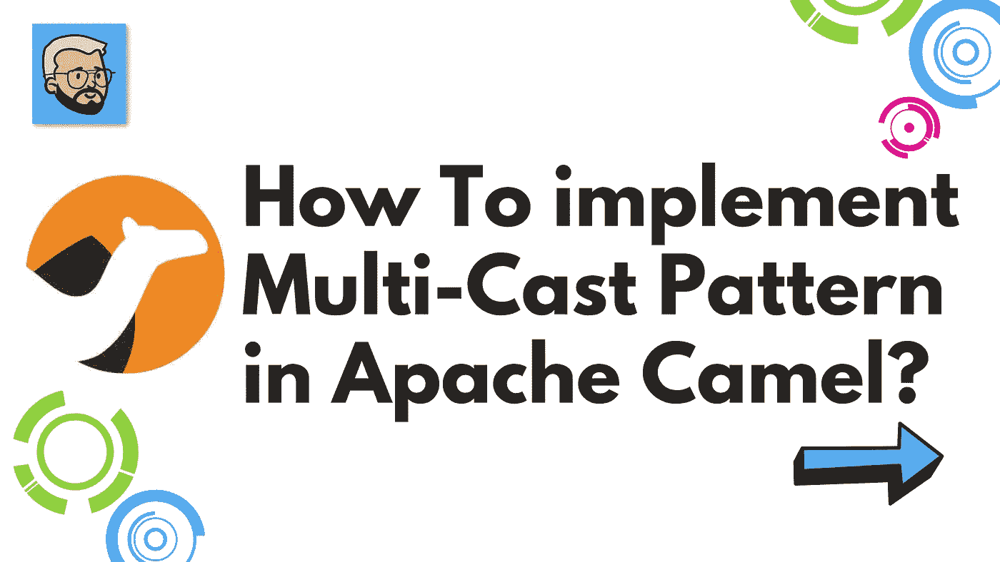

# 如何在 Apache Camel 中实现多播模式？

> 原文：<https://medium.com/javarevisited/how-to-implement-multi-cast-pattern-in-apache-camel-8626518b8044?source=collection_archive---------1----------------------->

## 阿帕奇骆驼

你好，🖐，我自己 [Rohan Ravindra Kadam](https://medium.com/u/a1b33b7cda75?source=post_page-----8626518b8044--------------------------------) ，全栈开发者，印度

欢迎，开发者社区！！在本文中，我们尝试使用 [Apache Camel](https://javarevisited.blogspot.com/2022/02/top-5-courses-to-learn-apache-camel-in.html) 来理解异常处理。在直接进入文章之前，让我们试着理解与主题相关的某些问题或疑问。我们可能会问什么是阿帕奇骆驼？为什么用阿帕奇骆驼？如何在 Apache Camel 中实现多播模式？

[](https://www.java67.com/2022/02/5-best-apache-camel-courses-for-java.html)

如何在 Apache Camel 中实现多点传送模式？

嘿，社区，让我们深入到我们的问题中去，找到问题的答案。

## ⚡什么是阿帕奇骆驼？

Apache Camel 是一个基于已知的[企业集成模式](https://camel.apache.org/components/3.15.x/eips/enterprise-integration-patterns.html)的通用开源集成框架。

Camel 使您能够用各种特定于领域的语言( [DSL](https://camel.apache.org/manual/dsl.html) ，比如 [Java](/javarevisited/10-best-places-to-learn-java-online-for-free-ce5e713ab5b2) ，XML， [Groovy](/javarevisited/6-best-resources-to-learn-groovy-and-grails-for-java-developers-18c04e88fa8a) ， [Kotlin](/javarevisited/top-5-courses-to-learn-kotlin-in-2020-dfc3fa7706d8) ，以及 [YAML](https://javarevisited.blogspot.com/2021/11/top-5-courses-to-learn-yaml-in-2022.html) )来定义路由和中介规则。这意味着您可以在 IDE 中智能地完成路由规则，无论是在 Java 还是 XML 编辑器中。

Apache Camel 使用 [URIs](https://camel.apache.org/manual/uris.html) 来直接处理任何类型的传输或消息模型，如 [HTTP](https://camel.apache.org/components/3.15.x/http-component.html) 、 [ActiveMQ](https://camel.apache.org/components/3.15.x/activemq-component.html) 、 [JMS](https://camel.apache.org/components/3.15.x/jms-component.html) 、【JBI】SCA、 [MINA](https://camel.apache.org/components/3.15.x/mina-component.html) 或 [CXF](https://camel.apache.org/components/3.15.x/cxf-component.html) ，以及可插拔的[组件](https://camel.apache.org/manual/component.html)和[数据格式](https://camel.apache.org/manual/data-format.html)选项。Apache Camel 是一个很小的库，具有最少的[依赖性](https://camel.apache.org/manual/what-are-the-dependencies.html)，可以很容易地嵌入到任何 Java 应用程序中。Apache Camel 允许您使用相同的 [API](https://camel.apache.org/manual/exchange.html) 工作，不管使用哪种传输方式——所以学习一次 API，您就可以与开箱即用的所有[组件](https://camel.apache.org/components/3.15.x/index.html)进行交互。

Apache Camel 支持 Bean 绑定以及与 CDI、 [Spring](https://camel.apache.org/manual/spring.html) 等流行框架的无缝集成。Camel 也广泛支持[单元测试](https://camel.apache.org/manual/testing.html)你的路线。

## ⚡为什么使用阿帕奇骆驼？

让我们试着列出 Apache Camel 的一些用例

1.  为**企业集成模式(EIP)** 提供支持
2.  Apache Camel 是独立的，可以作为库嵌入到 Spring Boot、Quarkus、应用服务器和云中。Camel 子项目致力于简化您的工作。
3.  **挤满了组件**:挤满了数百个组件，用于访问数据库、消息队列、API 或天底下的任何东西。帮助你融入一切。
4.  **支持超过 50 种数据格式** :- Camel 支持大约 50 种数据格式，允许翻译多种格式的消息，并得到金融、电信、医疗保健等行业标准格式的支持。

## ⚡如何在 Apache Camel 中实现多播模式？

嘿，🖐Community，在文章的前一部分，我们试图解释为什么&阿帕奇骆驼怎么样？在第节中，我们将尝试理解相同的实现。

让我们先了解一下**什么是阿帕奇骆驼中的多点传送模式？**

Apache Camel 多播模式借用了相同的术语，它同时将消息路由到多个端点。[多播](https://www.java67.com/2017/08/top-17-sql-and-unix-interview-questions.html)允许你将相同的消息路由到多个端点或目的地，并以不同的方式进行处理。多播可以在同一线程中顺序完成，也可以使用并行处理。

从下面的链接查看关于**多播模式的更多信息**

 [## Apache Camel 帮助您集成 300 多个不同的系统！

### 多播 EIP 允许将相同的消息路由到多个端点，并以不同的方式处理它们。的…

camel.apache.org](https://camel.apache.org/components/next/eips/multicast-eip.html) 

在直接进入实现之前，不要忘记看看如何使用 Apache Camel 编写第一条路线？从下面的链接

[](https://rohankadam965.medium.com/apache-camel-how-to-write-first-route-7f7767c86c2a) [## 阿帕奇骆驼🦒:如何写第一条路线？

### 你好，我是罗汉·卡达姆😊,

rohankadam965.medium.com](https://rohankadam965.medium.com/apache-camel-how-to-write-first-route-7f7767c86c2a) 

## 步骤 1:如何使用 Spring Initializr 创建项目？

[](https://start.spring.io/) [## 弹簧初始化 r

### Initializr 生成一个 spring boot 项目，其中包含您快速启动所需的内容！

start.spring.io](https://start.spring.io/) 

## 步骤 2:项目中包括哪些依赖项？

[](https://javarevisited.blogspot.com/2019/03/top-5-course-to-learn-apache-maven-for.html)

信用:[洛汗·拉温德拉·卡达姆](https://medium.com/u/a1b33b7cda75?source=post_page-----8626518b8044--------------------------------)属地

## 步骤 3:如何使用 Apache Camel 实现多播模式？

在下面的例子中，我们使用一个定时器端点向两个名为**log:route 1 called**&**log:route 2 called**的端点发送多播消息

```
package com.example.apachecameltest.route;

import org.apache.camel.builder.RouteBuilder;
import org.springframework.stereotype.Component;

@Component
public class MultiCastPatternRoute extends RouteBuilder {

    @Override
    public void configure() throws Exception {

        from("timer:mutlicast?period=1000")
                .multicast()
                .to("log:route1called","log:route2called");
    }
}
```

## 第四步:骆驼路线输出？

在下面的输出块中，我们可以注意到它们的两个端点被同时调用

```
[mer://mutlicast] route1called : Exchange[ExchangePattern: InOnly, BodyType: null, Body: [Body is null]]
[mer://mutlicast] route2called : Exchange[ExchangePattern: InOnly, BodyType: null, Body: [Body is null]]
[mer://mutlicast] route1called : Exchange[ExchangePattern: InOnly, BodyType: null, Body: [Body is null]]
[mer://mutlicast] route2called : Exchange[ExchangePattern: InOnly, BodyType: null, Body: [Body is null]]
[mer://mutlicast] route1called : Exchange[ExchangePattern: InOnly, BodyType: null, Body: [Body is null]]
202
```

## 🖐Conclusion:-

在本文中，我们试图理解 Apache Camel 中的多点传送模式。多播是一种企业集成模式(EIP ),是向多个目的地传输相同消息时广泛使用的设计模式。我们也试图了解一些关于阿帕奇骆驼的事情。请分享和喜欢💕如果你觉得文章有用。在媒体上关注我，在推特上关注我，关注我，关注我，关注我，关注我，关注我，关注我，关注我

## ⚡Bibliography

[](https://camel.apache.org/) [## 主页

### Camel 支持 Gregor Hohpe 和 Bobby Woolf 的优秀著作中的大多数企业集成模式，并且…

camel.apache.org](https://camel.apache.org/) [](/javarevisited/how-to-implement-exception-handling-using-apache-camel-26faad831e8f) [## 如何使用 Apache Camel 实现异常处理？

### 你好，🖐，我自己，罗汉·拉温德拉·卡达姆

medium.com](/javarevisited/how-to-implement-exception-handling-using-apache-camel-26faad831e8f) [](/javarevisited/how-to-consume-public-api-using-apache-camel-70f7382959ab) [## 如何使用 Apache Camel 消费公共 API？

### Hello🖐我自己 Rohan Ravindra Kadam，全栈开发者

medium.com](/javarevisited/how-to-consume-public-api-using-apache-camel-70f7382959ab) 

谢谢观众们— [罗汉·拉温德拉·卡达姆](https://medium.com/u/a1b33b7cda75?source=post_page-----8626518b8044--------------------------------)