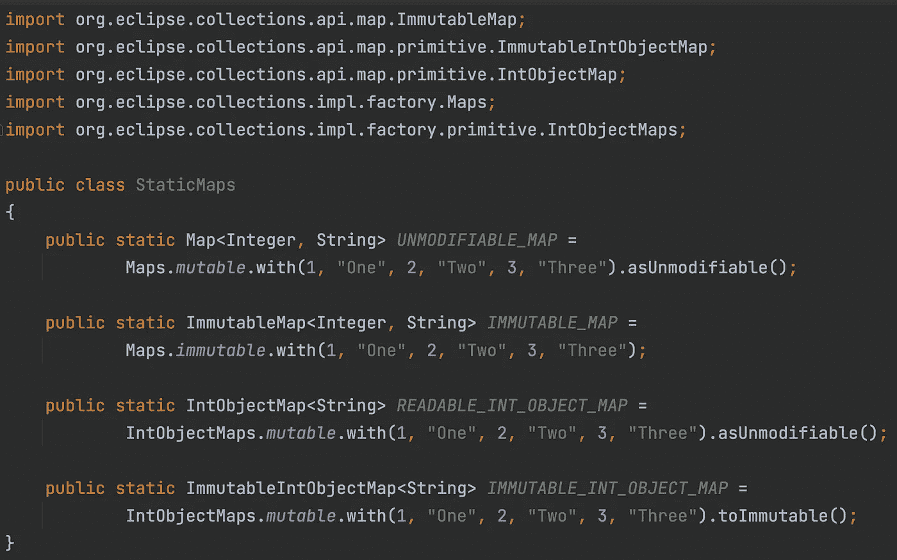
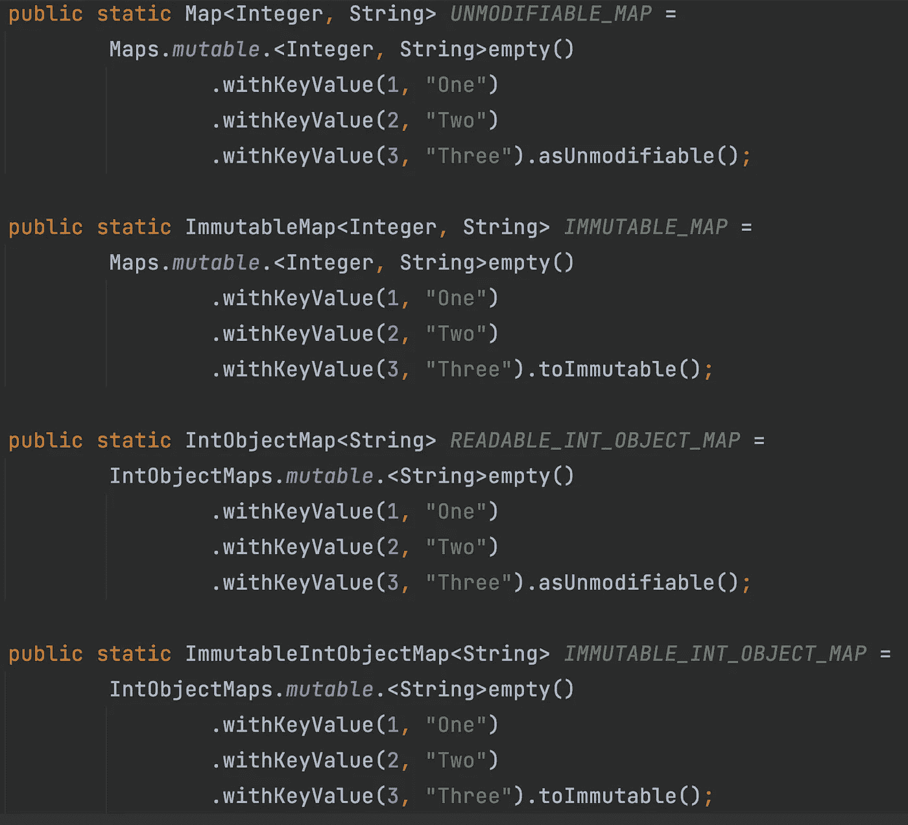

# 如何使用 Eclipse 集合初始化静态地图

> 原文：<https://medium.com/javarevisited/how-to-initialize-a-static-map-using-eclipse-collections-3ea503e1d69d?source=collection_archive---------3----------------------->

使用 [Eclipse 集合](https://github.com/eclipse/eclipse-collections)初始化地图既简单又灵活。

使用对象和图元映射工厂

差不多十年前我回答了下面这个关于栈溢出的问题。

<https://stackoverflow.com/questions/507602/how-can-i-initialise-a-static-map/13943037#13943037>  

如果您使用`empty`和`withKeyValue`在 Eclipse 集合中创建一个`MutableMap`，那么您可以根据需要链接任意多的键/值组合。作为最后的转换步骤，您可以使地图同步(`asSynchronized`)、不可修改(`asUnmodifiable`)或不可改变(`toImmutable`)。

使用 empty、withKeyValue、asUnmodifiable 和 toImmutable 创建地图

在下面的博客中，我展示了更多使用 Eclipse 集合流畅地创建地图、列表、集合和包的例子。

</oracledevs/as-a-matter-of-factory-part-3-method-chaining-224217074d31>  

感谢阅读！尽情享受吧！

*我是由*[*Eclipse Foundation*](https://projects.eclipse.org/projects/technology.collections)*管理的*[*Eclipse Collections*](https://github.com/eclipse/eclipse-collections)*OSS 项目的创建者和提交者。Eclipse Collections 为* [*投稿*](https://github.com/eclipse/eclipse-collections/blob/master/CONTRIBUTING.md) *打开。*

<https://javarevisited.blogspot.com/2019/10/the-java-developer-roadmap.html>  </javarevisited/10-best-places-to-learn-java-online-for-free-ce5e713ab5b2>  <https://javarevisited.blogspot.com/2021/09/microservices-design-patterns-principles.html> 