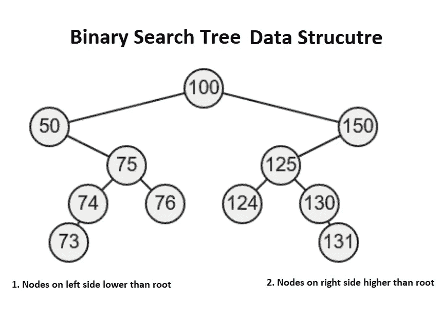
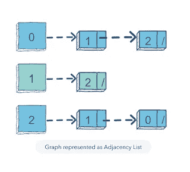
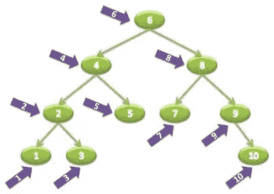

# 如何按排序顺序打印二叉查找树的节点？

> 原文：<https://medium.com/javarevisited/how-to-print-nodes-of-a-binary-search-tree-in-sorted-order-8a4e52eb8856?source=collection_archive---------0----------------------->

[](https://www.educative.io/collection/5668639101419520/5671464854355968?affiliate_id=5073518643380224)

[寻找编码面试:编码问题的模式](https://www.educative.io/collection/5668639101419520/5671464854355968?affiliate_id=5073518643380224)

大家好，最近在一次电话 Java 采访中，我的一位读者被问到关于**如何按顺序打印一个二叉查找树的所有节点。不幸的是，他不知道[可以用来打印排序后的节点，他在采访后问我。](https://javarevisited.blogspot.com/2016/08/inorder-traversal-of-binary-tree-in-java-recursion-iteration-example.html)**

以前我已经分享过 [**最佳数据结构课程**](/javarevisited/7-best-courses-to-learn-data-structure-and-algorithms-d5379ae2588?source=---------18------------------) 和[数据结构面试题](/hackernoon/50-data-structure-and-algorithms-interview-questions-for-programmers-b4b1ac61f5b0)，今天我就来教大家一些有趣又有用的二叉树算法，叫做 InOrer 遍历。我们还将看到使用 Java 编程语言的实现。

**有序**遍历是遍历二叉树数据结构的三种流行方式之一，另外两种是[前序](http://www.java67.com/2016/07/binary-tree-preorder-traversal-in-java-without-recursion.html)和[后序](http://www.java67.com/2016/10/binary-tree-post-order-traversal-in.html)。在有序遍历算法中，首先浏览左边的子树，然后是根，最后是右边子树上的节点。

您从根节点开始遍历，然后转到左侧节点，然后再次转到左侧节点，直到到达一个叶节点。在那个时间点，您打印节点的值或标记它被访问过，并移到右边的子树。继续相同的算法，直到访问了二叉树的所有节点。

InOrder 遍历也称为**左节点右**或**左根右**遍历或 **LNR** 遍历算法。

类似于[预排序算法](http://www.java67.com/2016/07/how-to-implement-preorder-traversal-of-binary-tree-in-java.html)，它也是深度优先算法，因为它在探索兄弟之前探索二叉树的深度。因为它是基本的二叉树算法之一，所以在[编程面试](https://codeburst.io/100-coding-interview-questions-for-programmers-b1cf74885fb7)中很受欢迎。

<https://codeburst.io/100-coding-interview-questions-for-programmers-b1cf74885fb7>  

这些遍历算法也是学习更高级的[二叉树算法](/javarevisited/20-binary-tree-algorithms-problems-from-coding-interviews-c5e5a384df30)的基础，因此每个程序员都应该学习、理解并知道如何实现顺序和其他遍历算法。

在 Java 或任何编程语言中实现 inOrder 遍历算法的最简单方法是使用[递归](https://javarevisited.blogspot.com/2016/03/how-to-reverse-arraylist-in-java-using-recursion.html)。由于二叉树是一种递归数据结构，递归是解决基于树的问题的自然选择。BinaryTree 类中的方法实现了使用递归遍历二叉树的逻辑。

从采访的角度来看，InOrder 遍历是非常重要的，因为它也打印了一个排序顺序为的二叉查找树的节点，但前提是给定的树是一个[二叉查找树](http://javarevisited.blogspot.com/2015/10/how-to-implement-binary-search-tree-in-java-example.html)。

如果你还记得，在 BST 中，左子树中节点的值低于根，右子树上节点的值高于根。按顺序遍历的字面意思是按顺序，也就是说，节点是按顺序或排序后的顺序打印的。

顺便说一下，尽管这三种算法(前序、按序和后序)是流行的二叉树遍历算法，但它们不是唯一的。你也有其他广度优先的方法来遍历二叉树，比如层次顺序遍历(参见 [**数据结构和算法:深度挖掘**](https://click.linksynergy.com/fs-bin/click?id=JVFxdTr9V80&subid=0&offerid=323058.1&type=10&tmpid=14538&RD_PARM1=https%3A%2F%2Fwww.udemy.com%2Fdata-structures-and-algorithms-deep-dive-using-java%2F) )。

[](https://click.linksynergy.com/fs-bin/click?id=JVFxdTr9V80&subid=0&offerid=323058.1&type=10&tmpid=14538&RD_PARM1=https%3A%2F%2Fwww.udemy.com%2Fdata-structures-and-algorithms-deep-dive-using-java%2F)

# 实现二叉树有序遍历的递归算法

顺序遍历的递归算法非常简单。你只需要按照你想要访问树的顺序调用 BinaryTree 类的 inOrder()方法。最重要的是包含基本情况，这是任何递归算法的关键。

例如，在这个问题中，基本情况是您到达了叶节点，没有更多的节点要探索，在那个时间点递归开始减速。下面是使用有序遍历遍历二叉树的具体步骤:

1.  访问左侧节点
2.  打印根的值
3.  访问正确的节点，下面是在 Java 中使用递归实现该算法的示例代码:

```
private void inOrder(TreeNode node) {
    if (node == null) {
      return;
    } inOrder(node.left);
    System.out.printf("%s ", node.data);
    inOrder(node.right);
}
```

类似于[最后一个例子](http://javarevisited.blogspot.com/2016/07/binary-tree-preorder-traversal-in-java-using-recursion-iteration-example.html)中的 preOrder()方法，还有另一个`inOrder()`方法，它将 inorder 遍历公开，并调用这个私有方法来实际执行 InOrder 遍历。

这是编写接受输入的递归方法的标准方式，它使得客户端调用该方法更容易。

```
public void inOrder() {
    inOrder(root);
}
```

你可以看到我们从 root 开始，然后用`node.left`递归调用`inOrder()` 方法，这意味着我们在左子树上向下，直到我们点击`node == null`，这意味着最后一个节点是一个[叶节点](https://www.java67.com/2020/02/top-40-binary-tree-interview-questions.html)。

此时，`inOrder()`方法将返回并执行下一行，打印 node.data。之后，这又是一个对 node.right 的递归`inOrder()`调用，这将再次启动相同的过程。

您也可以查看 Pluralsight 上的 [**数据结构和算法第一部分和第二部分**](https://pluralsight.pxf.io/c/1193463/424552/7490?u=https%3A%2F%2Fwww.pluralsight.com%2Fcourses%2Fads-part1) 课程，了解更多关于算法以及如何设计自己的算法。

[](https://pluralsight.pxf.io/c/1193463/424552/7490?u=https%3A%2F%2Fwww.pluralsight.com%2Fcourses%2Fads-part1)

顺便说一句，你需要一个 Pluralsight 会员才能参加这个课程，费用大约是每月 29 美元或者每年[299 美元](https://pluralsight.pxf.io/c/1193463/424552/7490?u=https%3A%2F%2Fwww.pluralsight.com%2Fpricing)(节省 14%)。我有一个，我也建议所有开发人员都有这个计划，因为 [Pluralsight](https://medium.com/u/50a6c7ef7431?source=post_page-----8a4e52eb8856--------------------------------) 就像软件开发人员的网飞。

它有 5000 多门高质量的课程，涵盖所有最新的主题。因为我们程序员每天都要学习新的东西，所以 299 美元的投资是不错的。

顺便说一下，它还提供了 10 天的免费试用，没有任何义务，允许您观看 200 小时的内容。注册那个 [**10 天免费试用**](http://pluralsight.pxf.io/c/1193463/424552/7490?u=https%3A%2F%2Fwww.pluralsight.com%2Flearn) ，就可以免费观看这些课程。

<https://pluralsight.pxf.io/c/1193463/424552/7490?u=https%3A%2F%2Fwww.pluralsight.com%2Flearn>  

# Java 中二叉树的有序遍历

下面是我们在 Java 中对 inorder 遍历算法的完整解决方案。这个程序使用一个[递归算法](https://javarevisited.blogspot.com/2016/12/how-to-count-number-of-leaf-nodes-in-java-recursive-iterative-algorithm.html)来打印一个二叉树的所有节点的值。

正如我之前告诉你的，在有序遍历期间，首先打印左子树的值，然后是根和右子树。如果你对迭代算法感兴趣，可以进一步查看这个[教程](http://javarevisited.blogspot.com/2016/08/inorder-traversal-of-binary-tree-in-java-recursion-iteration-example.html)实现无递归的顺序遍历。

```
import java.util.Stack;/*
 * Java Program to traverse a binary search tree
 * using inorder traversal without recursion 
 * and print all nodes in sorted order
 * In InOrder traversal first left node is visited, followed by root
 * and right node.
 *
 * input:
 *      40
 *     /\
 *    20   50
 *   / \    \
 *  10  30   60
 * /   /  \
 * 5  67  78
 *
 * output: 5 10 20 30 40 50 60 67 78
 */public class Main { public static void main(String[] args) throws Exception { // construct the binary tree given in question
    BinaryTree bt = BinaryTree.create(); // traversing binary tree using InOrder traversal using recursion
    System.out
        .println("printing nodes of binary tree on InOrder using recursion"); bt.inOrder();
  }}class BinaryTree {
  static class TreeNode {
    String data;
    TreeNode left, right; TreeNode(String value) {
      this.data = value;
      left = right = null;
    } } // root of binary tree
  TreeNode root; /**
   * traverse the binary tree on InOrder traversal algorithm
   */
  public void inOrder() {
    inOrder(root);
  } private void inOrder(TreeNode node) {
    if (node == null) {
      return;
    } inOrder(node.left);
    System.out.printf("%s ", node.data);
    inOrder(node.right);
  } /**
   * Java method to create binary tree with test data
   *
   * @return a sample binary tree for testing
   */
  public static BinaryTree create() {
    BinaryTree tree = new BinaryTree();
    TreeNode root = new TreeNode("40");
    tree.root = root;
    tree.root.left = new TreeNode("20");
    tree.root.left.left = new TreeNode("10");
    tree.root.left.left.left = new TreeNode("5"); tree.root.left.right = new TreeNode("30");
    tree.root.right = new TreeNode("50");
    tree.root.right.right = new TreeNode("60");
    tree.root.left.right.left = new TreeNode("67");
    tree.root.left.right.right = new TreeNode("78"); return tree;
  }}
```

**输出**
`printing nodes of the binary tree on InOrder using recursion`
`5 10 20 30 67 78 40 50 60`

这就是关于**如何使用递归**在 Java 中实现二叉树的有序遍历。你可以看到代码非常类似于前序遍历，唯一的区别是我们递归调用方法的顺序。在这种情况下，我们首先调用`inOrder(node.left)`，然后打印节点的值。

值得记住的是，按顺序遍历是一种深度优先算法，如果给定的二叉树是一个二叉查找树，则按排序顺序打印树节点。

在本文的下一部分，我将分享无递归的有序遍历，同时，您可以尝试练习以下数据结构和二叉树问题。

**进一步学习**
[数据结构和算法:深度挖掘使用 Java](https://click.linksynergy.com/fs-bin/click?id=JVFxdTr9V80&subid=0&offerid=323058.1&type=10&tmpid=14538&RD_PARM1=https%3A%2F%2Fwww.udemy.com%2Fdata-structures-and-algorithms-deep-dive-using-java%2F)
[算法和数据结构—第一部分和第二部分](https://pluralsight.pxf.io/c/1193463/424552/7490?u=https%3A%2F%2Fwww.pluralsight.com%2Fcourses%2Fads-part1)
[Java 9 中的数据结构由亨氏 Kabutz](https://learning.javaspecialists.eu/courses/data-structures?affcode=92815_johrd7r8)
[破解编码面试— 189 题及解答](http://www.amazon.com/Cracking-Coding-Interview-6th-Edition/dp/0984782850/?tag=javamysqlanta-20)
[100+数据结构和算法题给程序员的](http://www.java67.com/2018/06/data-structure-and-algorithm-interview-questions-programmers.html)
[75+编程和编码面试题](http://www.java67.com/2018/05/top-75-programming-interview-questions-answers.html)

面向 Java 程序员的其他**数据结构和算法教程**

*   每个程序员都应该读的 10 本算法书([列举](http://www.java67.com/2015/09/top-10-algorithm-books-every-programmer-read-learn.html))
*   如何用 Java 实现快速排序算法？([解](http://javarevisited.blogspot.com/2014/08/quicksort-sorting-algorithm-in-java-in-place-example.html))
*   用 Java 学习数据结构和算法的 5 本书？([书籍](http://javarevisited.blogspot.com/2015/07/5-data-structure-and-algorithm-books-best-must-read.html))
*   如何用 Java 实现一个二分搜索法算法？([解](http://www.java67.com/2016/05/java-program-to-perform-binary-search-without-recursion.html)
*   如何在一个和等于给定一个数的整数数组上找到所有对？([解](http://javarevisited.blogspot.sg/2014/08/how-to-find-all-pairs-in-array-of-integers-whose-sum-equal-given-number-java.html)
*   如何在 Java 中原地反转数组？([解](http://www.java67.com/2016/01/java-program-to-reverse-array-in-place.html))
*   如何在 Java 中不使用递归来反转一个链表？([解](http://www.java67.com/2016/07/how-to-reverse-singly-linked-list-in-java-example.html))
*   如何在 Java 中实现插入排序？([解](http://www.java67.com/2014/09/insertion-sort-in-java-with-example.html))
*   如何在 1 到 100 的数组中找到缺失的数字？([解决方案](http://javarevisited.blogspot.sg/2014/11/how-to-find-missing-number-on-integer-array-java.html))
*   如何在 Java 中求单链表的长度？([解决方案](http://javarevisited.blogspot.sg/2016/05/how-do-you-find-length-of-singly-linked.html))
*   15 个常见的数据结构与算法面试问题([列举](http://javarevisited.blogspot.com/2015/07/5-data-structure-and-algorithm-books-best-must-read.html))

如果你有什么建议可以让这个算法变得更好，欢迎提出来。面试官喜欢那些提出自己的算法或者对流行算法有所触动的人。

**P.S.** —如果你不介意从免费资源中学习，那么你也可以看看我为 Java 开发人员提供的 [**免费数据结构和算法课程**](https://javarevisited.blogspot.com/2018/01/top-5-free-data-structure-and-algorithm-courses-java--c-programmers.html) 列表。

</javarevisited/top-10-free-data-structure-and-algorithms-courses-for-beginners-best-of-lot-ad807cc55f7a>  </javarevisited/10-best-books-for-data-structure-and-algorithms-for-beginners-in-java-c-c-and-python-5e3d9b478eb1>  

> 如果你不是媒体成员，我强烈推荐你加入媒体，阅读不同领域伟大作家的精彩故事。你可以**在这里加入介质**</@somasharma_81597/membership>