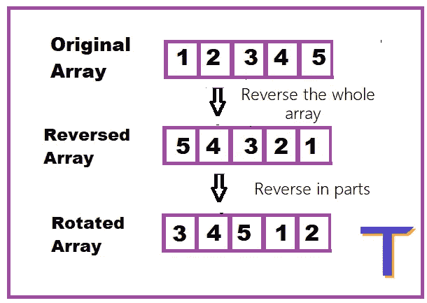

# 如何在 Java | Tekolio 中旋转数组

> 原文：<https://medium.com/javarevisited/how-to-rotate-an-array-in-java-e10f4a5ed129?source=collection_archive---------2----------------------->

[](https://javarevisited.blogspot.com/2015/07/how-to-rotate-array-in-java-leetcode-solution.html)

在这篇博客中，我们将学习什么是真正的[数组](https://tekolio.com/what-are-arrays-in-java-and-how-to-use-them/)旋转？以及如何向左或向右旋转数组。这里旋转仅仅意味着在期望的方向上移动数组的元素。

# 例子

```
Input : Arr[] = [1, 2, 3, 4, 5]k=2Output : Arr = [4, 5, 1, 2, 3]
```

# 说明

最初，数组是[1，2，3，4，5]，如果我们向右旋转数组一次(k=1)，元素将从索引 0 移动到索引 1。类似地，我们需要向右移动所有元素，这意味着最后一个元素将在第一个位置结束。

在第一轮旋转之后——Arr[]=[5，1，2，3，4]

如果我们旋转更多的时间— Arr[] = [4，5，1，2，3] -> k = 2

同样，如果我们想向左旋转[数组](https://javarevisited.blogspot.com/2015/06/top-20-array-interview-questions-and-answers.html)。在这种情况下，我们必须将元素向左移动，元素将从索引 1 移动到索引 0，其他元素也一样，使第一个元素成为数组的最后一个元素。

# 如何解决

有很多种方法，但我们在这个博客中只会看到两种方法，它们是

1.  使用临时数组
2.  通过[反转阵列](https://www.java67.com/2016/10/3-ways-to-reverse-array-in-java-coding-interview-question.html)

# 方法 1 —通过使用临时数组

这个想法很简单，我们将创建一个大小为 k 的新数组，根据我们所做的旋转类型，从数组的开头或结尾存储等于 k 的元素，然后在旋转后将它们放回原来的数组中。检查下面给出的例子，我们向左旋转 k 次，以更好地理解这种方法。

**例子**

**输入** arr[] = [1，2，3，4，5]

k = 2

*   将前 k 个元素存储在临时数组中:temp[] = [1，2]
*   移位其余元素(根据给定数据/问题):arr[] = [3，4，5，]
*   存储回 k 个元素:arr[] = [3，4，5，1，2]

[](https://www.java67.com/2018/05/how-to-rotate-array-left-and-right-by-given-number.html)

**使用临时数组旋转数组**

# 方法

1.  [创建一个名为 temp 的新数组](https://javarevisited.blogspot.com/2015/05/sieve-of-Eratosthenes-algorithm-to-generate-prime-numbers-in-java.html)，长度为 k——我们必须旋转数组的次数
2.  根据旋转类型，存储前 k 个元素或后 k 个元素
3.  将其余元素移向第 0 个索引或最后一个索引。
4.  将存储在临时数组中的元素复制到原始数组中它们各自的索引处。

# 输出

```
A = [3, 4, 5, 1, 2]
```

**时间复杂度** : O(N)，**辅助空间** : O(N)

在上面的代码中，我们已经使用了 [**System.arraycopy** 方法从数组](https://javarevisited.blogspot.com/2013/11/java-array-101-for-programmers-and.html)中复制 k 个元素，并在旋转后将它们放回所需的位置。

上面讨论的代码是为了让[向左旋转数组](/javarevisited/20-array-coding-problems-and-questions-from-programming-interviews-869b475b9121)，我们也可以做同样的事情让数组向右旋转，我们只需要改变**循环**和 **System.arraycopy** 方法中的索引号，如图所示。

# 方法 2 —通过反转阵列

想法是首先反转整个数组，然后再次反转，但是是部分反转。第一部分将从第 0 个索引到第 k 个索引，而第二部分包含其余的元素。

[](https://javarevisited.blogspot.com/2013/03/how-to-reverse-array-in-java-int-String-array-example.html)

**使用反向算法旋转阵列**

# 例子

```
**Input : A = [1, 2, 3, 4, 5], k=2**Reversing the whole array — A = [5, 4, 3, 2, 1]Reversing in parts — A = [4, 5, 1, 2, 3]
```

这里，我们没有像上面的代码那样使用任何额外的空间，因此空间复杂度变为 O(1 ),而时间复杂度保持不变。

# 方法

1.  反转整个数组
2.  将数组分成两部分，从 0 到 k-1 和从 k 到 n-1
3.  分别反转这两个部分，我们就有了旋转后的数组

# 输出

```
A = [3, 4, 5, 1, 2]
```

**时间复杂度** : O(n) **辅助空间:** O(1)

我们已经简要地讨论了这种方法，从代码本身也可以清楚地看出，我们正在对数组进行两次反转，开始时是完全反转，结束时是部分反转，以获得我们想要的数组。

为此，我们创建了一个名为 **rotateArray** 的独立类，用于处理程序的反转部分。这个类有三个参数-

1.  原始数组
2.  起始索引
3.  结束索引

这是我们从 [**主类**](https://javarevisited.blogspot.com/2015/04/error-could-not-find-or-load-main-class-helloworld-java.html) 中提供的，我们从这个主类中调用了这个类，用于反转整个数组以将其向左旋转的所有三种情况。

如果我们想把数组往正确的方向旋转呢？

我们必须首先处理部分反转数组，然后反转整个数组以得到想要的数组。检查下面的代码-

# 结论

在这篇博客中，我们已经了解了旋转数组的含义，以及数组旋转有多少种类型，每种类型都有不同的旋转方式。

可以有更多的策略来解决这个问题，但是最小的时间复杂度和空间复杂度将总是 O(n)和 O(1 ),因为我们必须遍历数组一次，以根据我们正在进行的旋转类型向右或向左移动所有元素。

这个问题被许多科技公司如微软和亚马逊问到，如果 k 的值超过了数组的长度或者是负的，这个问题有时会变得非常困难。

*原载于 2022 年 5 月 30 日 https://tekolio.com*[](https://tekolio.com/how-to-rotate-an-array-in-java/)**。**

*[](/javarevisited/20-array-coding-problems-and-questions-from-programming-interviews-869b475b9121) [## 20 多个数组编码问题和来自编程访谈的问题

### 大家好，数组是最基本的数据结构，它将元素存储在连续的内存位置。它…

medium.com](/javarevisited/20-array-coding-problems-and-questions-from-programming-interviews-869b475b9121) [](/javarevisited/top-21-string-programming-interview-questions-for-beginners-and-experienced-developers-56037048de45) [## 面向初学者和有经验的开发人员的 21 个字符串编程面试问题

### 除了数组、二叉树和链表数据结构，字符串是编程工作中的另一个热门话题…

medium.com](/javarevisited/top-21-string-programming-interview-questions-for-beginners-and-experienced-developers-56037048de45) [](/javarevisited/20-binary-tree-algorithms-problems-from-coding-interviews-c5e5a384df30) [## 来自编程访谈的 20 多个二叉树编码问题

### 大家好，我已经分享了很多关于编程面试的资源，比如书籍、课程和一些…

medium.com](/javarevisited/20-binary-tree-algorithms-problems-from-coding-interviews-c5e5a384df30)*