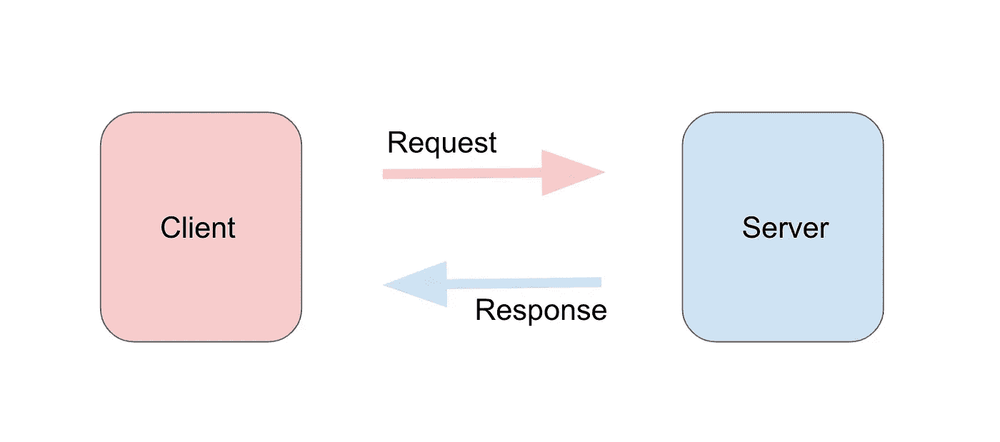

# 如何使用 Java 发送 HTTP Get 请求并将 JSON 数据解析成字符串

> 原文：<https://medium.com/javarevisited/how-to-send-http-get-request-and-parse-json-data-into-string-using-java-3c0cf7eeebbc?source=collection_archive---------0----------------------->

本文将介绍两种方法(`HttpURLConnection`和`HttpClient)`)来读取响应，然后将其转换成字符串。

# **方法一:** `**java.net.http.HttpURLConnection**`

我们可以首先使用`java.net.http.HttpURLConnection` API，如下所示:

打印结果是一个 [JSON 数组](https://www.java67.com/2015/02/how-to-parse-json-tofrom-java-object.html)。将这个 Maven 依赖项添加到 pom.xml 中，以便稍后处理响应体:

现在，我们将使用以下方法[将 JSON 数组解析成字符串](https://javarevisited.blogspot.com/2013/04/convert-json-array-to-string-array-list-java-from.html):

记得在 [main 方法](https://www.java67.com/2014/02/can-you-run-java-program-without-main-method.html)中注释这一行:

`System.out.println(responseContent.toString());`

而是添加以下命令:

`parse(responseContent.toString());`

# 方法 2: java.net.http.HttpClient

或者我们可以使用下面的`HttpClient` API 来代替第一种方法`[HttpURLConnection](https://www.java67.com/2019/03/7-examples-of-httpurlconnection-in-java.html)` :

瞧啊。我们现在可以发送一个`GET`请求，并将 JSON 数组响应转换成 string 类型。