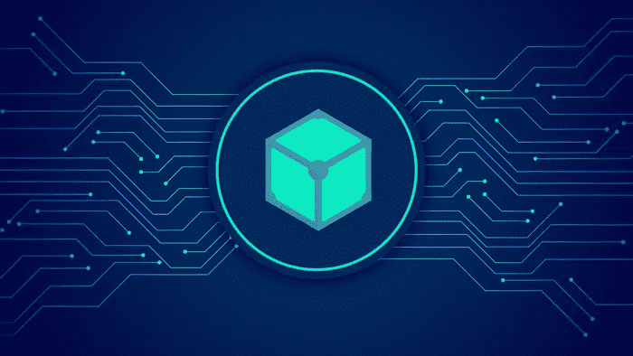

# 如何为 NFTs 建立 IPFS 网络？

> 原文：<https://medium.com/javarevisited/how-to-set-up-ipfs-network-for-nfts-4f328f72e835?source=collection_archive---------3----------------------->

用户可以使用不可替代代币(NFT)生产和交换不同价值的数字商品。利用 Pinata 和 nft.storage 服务从无到有，创建一个新制作的 nft 令牌并将其存储在 IPFS 上。

[区块链技术](/javarevisited/best-blockchain-courses-and-certification-in-2020-63729f8f04d0)是一个奇妙的解决方案，可以在创建 NFT 的同时管理多个节点上的铸造、簿记和不可变元数据。

同时，在[区块链](/javarevisited/7-free-courses-to-learn-blockchain-in-2020-764e66b47ebe)上存储大量数据变得极具挑战性，因为跨网络中数百个节点复制数据的相关成本很高。

由于存储和保护离线 NFT 数据的需求，IPFS 诞生了(星际文件系统)。

IPFS 可以帮助解决这些挑战，并确保分散网络上 [NFT 数据存储的长期可行性和可访问性。为了存储和检索数据，它使用了对等版本控制的文件系统和超媒体协议。](https://www.leewayhertz.com/decentralized-data-storage-nfts/)

IPFS 可以为 NFTs 使用一个全局命名空间来唯一地标识每个文件，并将 NFT 信息连接到所存储数字资产的内容寻址功能。与 Dropbox 或 Google Drive 等集中式系统相比，IPFS 实现了更持久的数据锁定。

随着 NFT 越来越受欢迎，遵循链接和存储 IPFS NFT 数据的最佳实践至关重要。有许多方法可以引用 IPFS 的数据，每种方法都适用于特定的用例。下面详细介绍其中的几个。

*   **CID(内容标识符)** CID 是任何类型内容的自描述性唯一标识符，与内容的存储位置无关。它们以压缩的二进制格式存储并通过网络传输。它们以看似随机的字符串形式显示给用户。
*   **URI(统一资源标识符)** IPFS URI 统一资源标识符用于表示上下文中的特定内容。上下文由 URI 方案标识(该方案作为前缀应用于 URI，后跟:/)。在这种情况下，IPFS·URI 计划就是简单的 IPFS。
*   **HTTP 网关的 URL** HTTP 网关为无法本地解析 IPFS URIs 的传统浏览器提供互操作性。这些链接用于应用程序的表示层，而不是存储在区块链或 NFT 元数据中。

# 在不同的情况下应该如何处理内容？

开发人员应该根据上下文使用各种链接形式:

*   **链上** NFT 智能合约应该为每个令牌的资产和元数据返回一个 IPFS URI。在整个 URI 链上铸造和定位每个令牌之前，生成 IPFS URI 是至关重要的。这意味着智能合约接口需要 URIs，而 ipfs:/ URI 方案允许任何应用程序确定数据是否仍然可以通过 ipfs 访问。
*   **应用** 建议通过 IPFS URI 和 HTTP 网关 URL 将 IPFS 素材连接到面向用户的应用。根据要求，网关链接可能通过 CID 或 IPFS 生成。

# 在元数据及其资产之间建立链接

元数据是 NFT 值的重要组成部分。大多数 NFT 要求指定结构化信息，以便指定令牌的属性。因此，以编码为 [UTF-8 字节字符串](https://javarevisited.blogspot.com/2015/02/difference-between-utf-8-utf-16-and-utf.html)的 J [子对象](https://www.java67.com/2015/02/how-to-parse-json-tofrom-java-object.html)的形式保存元数据至关重要。

下面提到的步骤将指导您访问连接的元数据:

**步骤 1:** 分离资产和元数据目录。

**步骤 2:** 导航到新建立的目录并添加资产。

**步骤 3:** 将资产目录添加到 IPFS，并记录其 CID。

**步骤 4:** 使用 CID 参考资产在您的目录中为 IPFS·URIs 创建元数据。确定 URI 包含 CID 的文件名和目录的资产。

**步骤 5:** 继续将元数据目录上传到 IPFS，并记下它们的 CID。

**步骤 6:** 生成一个包含上述 CID 的 IPFS URI，并将其存储在链上以创建一个所有权记录。

# 数据持久性和可用性

当用户在 IPFS 上保存 NFT 数据时，他们可以从包含它的副本的任何 IPFS 节点检索它。它支持简单的数据传输，并降低了对单台服务器的需求。

检索数据后，用户保留一份本地副本，以便将来帮助其他用户。这些是临时拷贝，当用户希望固定数据时可以删除。

固定 CID 向 IPFS 表明，当节点的存储容量接近其最大值时，该数据非常重要，不应删除。使用 IPFS 构建存储平台时，将 NFT 数据固定到 IPFS 节点至关重要。

这些节点的健壮性和高可用性确保了它们无中断地运行并提供卓越的性能。采用 IPFS 集群还可以帮助您管理您的 IPFS 节点云，这些节点协调存储您的平台数据并将其提供给用户。

通过将基础架构委托给远程锁定服务，您可以为您的 IPFS 数据获得冗余、高度可用的存储，而不会局限于特定的供应商。

当您的平台增长时，您可以在固定服务之间切换或迁移到另一个基础架构，因为 CID 可以处理基于 IPFS 的数据，而不管其位置如何。

# 结论

IPFS 因其持久性、永久性和独特性而获得了广泛的关注。对便于检索和利用安全 cid 的数据管理系统和存储的需求不断增长，这使得用户能够采用 IPFS 最佳实践。

IPFS 使 NFT 生产商能够立即获得分散、不可变和可验证存储的好处。创作者可以很容易地将材料推送到 IPFS，建立与 NFT 元数据的不变链接，并确保内容永久存储。