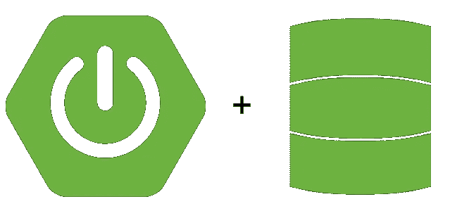

# 拥有数据库和 Redis 的 Spring Boot

> 原文：<https://medium.com/javarevisited/how-to-use-database-and-redis-with-spring-boot-jpa-fdfac0789d10?source=collection_archive---------1----------------------->

本文解释了如何使用带有多个数据源的 spring boot 应用程序。

我使用 Spring Boot 2.3.0.RELEASE 和数据库作为 Postgres，先决条件是 [Postgres 数据库](/javarevisited/7-best-free-postgresql-courses-for-beginners-to-learn-in-2021-3bf369d73794)和 Redis 已经运行。

让我们从向 pom.xml 文件添加以下依赖项开始

使用这些[注释](https://www.java67.com/2019/01/top-5-spring-boot-annotations-java-programmers-should-know.html)来注释 spring boot 应用程序类。

rediskeyvalueadapter . enablekeyspaceevents .*ON _ STARTUP 监听 redis 条目的到期事件。*

在 *application.yml* 中配置您的数据源

使用@Primary 注释为 [Postgres](https://javarevisited.blogspot.com/2020/02/top-5-courses-to-learn-postgresql-in.html#axzz6ggCCT42g) 创建一个数据源 bean，告诉 spring 它是主数据源，如果 spring 在创建实体管理器 bean 时遇到异常，这个步骤会有所帮助。

让我们为 Postgres 和 Redis 创建实体 POJO

*redis 实体的@Id* 应该来自*org . spring framework . data . annotation . Id*而不是 *javax.persistence.Id*

我们启动 app，进入健康检查[*http://localhost:8080/health*](http://localhost:8080/health)*。*您可以编写 JPA 存储库类，并使用 Postgres 和 Redis 执行操作。

你可以在这里访问完整的代码报告[https://github . com/shashikanth 69/multiple-data-source-spring-boot . git](https://github.com/shashikanth69/multiple-data-source-spring-boot.git)

编码快乐！！