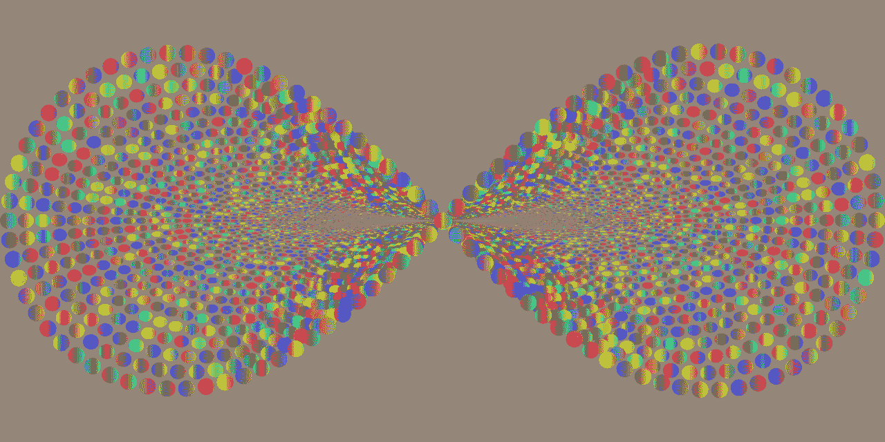

# 如何在 Java 中使用数组列表？让我们深潜吧

> 原文：<https://medium.com/javarevisited/how-to-work-with-arraylists-in-java-lets-deep-dive-f1911d261358?source=collection_archive---------1----------------------->

## 了解什么是数组列表，我们为什么使用它以及如何使用它


图片来自 [Pixabay](https://pixabay.com/?utm_source=link-attribution&utm_medium=referral&utm_campaign=image&utm_content=151346) 的[openclipbart-Vectors](https://pixabay.com/users/openclipart-vectors-30363/?utm_source=link-attribution&utm_medium=referral&utm_campaign=image&utm_content=151346)

ArrayList 比固定大小的标准数组用得更多。如果你是一个有竞争力的程序员，或者想成为一名程序员，那么你必须理解并清楚地了解 ***数组列表*** 的概念，因为每次你为一个特定的问题输入一些信息时，你都会用到它。

在直接跳到[***ArrayList***](https://javarevisited.blogspot.com/2011/05/example-of-arraylist-in-java-tutorial.html#axzz6qVaG06bu)之前，我想先给大家看一下标准的**数组**，这样会更清晰的理解它所面临的挑战以及使用 ArrayList 的必要性。

# 使用数组:-

当我们在 **Java** 或任何其他编程语言中谈论 [***数组*** 时，我们脑海中最常见的格式或语法*与此非常相似:-*](https://javarevisited.blogspot.com/2016/02/6-example-to-declare-two-dimensional-array-in-java.html)

```
*int[] arr = new int[5];*
```

*这是 ***语法*** 用于在 **Java** 中创建固定大小的 [**数组**。
在这里，](https://www.java67.com/2014/04/array-length-vs-arraylist-size-java.html)*

*   *`**arr**`-这是引用变量，将指向堆内存中的数组对象*
*   *`**int[]**`-这是指定将存储在数组对象中的元素的数据类型。例如，在这里，数组`arr`中的所有元素都必须是`int`数据类型。*
*   *`**new**`-这是我们想要创建一个新对象时使用的关键字。这里，简单地说，我们正在创建一个新的数组*
*   *`**int[5]**`-这意味着我们正在[创建一个固定大小](https://www.java67.com/2018/02/10-examples-of-array-in-java-tutorial.html)或长度为 5 的数组。我们可以存储或者说数组只能指向 5 个整数值，索引值范围为 0-4。*

# *标准阵列的缺点:-*

*   ***固定大小** —数组的大小或长度必须在一开始就指定，也就是在数组初始化的时候。一旦分配了固定的大小，在程序执行的任何时候都不能改变。如果我们试图插入或越过固定的大小限制，额外的值将不会添加到数组中，否则将会引发错误。*
*   ***不能移除元素，只能替换** —一旦我们开始填充数组，当它被完全填充时，我们只能用新元素替换某个索引位置的现有元素。我们不能通过添加新的元素来删除元素，而且数组的大小在整个过程中保持不变。*
*   ***内部数组操作繁琐耗时** —假设你想[检查一个特定的元素是否存在于数组](https://javarevisited.blogspot.com/2012/02/how-to-check-or-detect-duplicate.html)内部。为此，您必须迭代每个值或使用一些内置的 Java 方法。要找到最大值和最小值，再次迭代。*

*这种类型的数组很难使用，因为要插入其中的元素数量一开始就无法决定，而且完全取决于用户。*

*此外，如果你从一个相当大的文件中读取，很难确定总行数，因此，数组的大小，其中每个元素是一个字符串，代表文件中的每一行，是无法指定的。*

*还有很多情况下，标准数组不用于执行存储相似类型值的操作。*

*在这种情况下，使用 [***数组列表***](https://javarevisited.blogspot.com/2015/07/java-arraylist-tutorial.html) 。*

**

*照片由[克里斯蒂娜·莫里洛](https://www.pexels.com/@divinetechygirl?utm_content=attributionCopyText&utm_medium=referral&utm_source=pexels)从 [Pexels](https://www.pexels.com/photo/black-and-silver-laptop-computer-on-round-brown-wooden-table-1181243/?utm_content=attributionCopyText&utm_medium=referral&utm_source=pexels) 拍摄*

# *初始化数组列表:-*

*我们已经提到了使用 **数组列表**的必要性或*原因，现在让我们来关注一下**如何使用**的部分。**

*从语法开始，数组列表以下列形式定义或初始化:-*

```
*ArrayList<Integer> list = new ArrayList<>(5);*
```

*现在，让我们深入挖掘，逐一理解每个部分:-*

*   *`**list**`—[引用变量](https://www.java67.com/2016/01/difference-between-list-and-arraylist-variable-in-java.html)，用于指向由`ArrayList`类构成的对象。*
*   *`**ArrayList<Integer>**` —这里，`ArrayList`的意思是，引用变量`list`所指向的对象是由名为`ArrayList`的类制成的，或者属于该类。简单来说，`[ArrayList](https://javarevisited.blogspot.com/2012/01/how-to-sort-arraylist-in-java-example.html)` [](https://javarevisited.blogspot.com/2012/01/how-to-sort-arraylist-in-java-example.html)就是引用变量`list`的数据类型。*
*   *`**<Integer>**` —这是一个**泛型**，用于指定该数组列表只能存储`Integer`数据类型的值。如果你不知道什么是泛型，我将在接下来的文章中讨论这个问题。
    还有一点值得一提的是，我们不能在泛型里面包含类似 ***int*** ， ***char*** ， ***boolean*** 这样的原语数据类型。我们只能包含 ***包装类*** 像**整数**。我们可以使用或指定**字符串**，因为它不是原始数据类型。
    如果我们不包含泛型，程序仍然会运行，但是，在需要的时候使用泛型是一个好习惯。*
*   *`**new ArrayList<>(5)**`—`**new**`关键字已经在解释标准数组时讨论过了。这里的部分`ArrayList`正在调用类`ArrayList`的构造函数，以便创建类`ArrayList`的一个对象。`**(5)**`用于指定数组列表的初始容量。虽然，如果我们不指定或超过初始容量，它仍然可以工作，但是，在初始化时指定是一个好的做法。*

*我们已经讨论了语法部分，现在让我们熟悉一下类`**ArrayList**`提供的所有漂亮的方法，这些方法用于执行数组操作，比如添加新元素、删除、检查元素的存在、用新元素修改或替换现有元素等等。*

# *使用数组列表时经常使用的方法:-*

1.  ***添加新元素** —为了向数组列表添加元素，我们使用方法:-
    **i)。add(Object) :-** 这将在数组列表的末尾创建或添加一个新元素。
    **ii)。add(int index，Object) :-** 在指定的索引位置添加一个元素，并将所有其他元素在指定的索引值之后向右移动一个位置。如果最后一个索引值小于指定的值，那么新元素将被添加到数组的最后一个。*
2.  ***替换一个现有的元素:-** 如果我们想要修改、更新或者用一个新的元素替换一个已经存在的元素，那么我们使用:-
    **i)。set(int index，Object) :-** 这将在指定的索引位置设置一个新元素并替换现有的元素。*
3.  ***删除一个现有的元素:-** 为了删除或完全删除一个元素，我们使用:-
    **i)。remove(Object)** —这将从 ArrayList 中删除指定的对象或元素。如果 ArrayList 中存在多个元素或对象，那么首先遇到的或者说索引值最小的元素或对象将被移除。
    **ii)。remove(int index)-** 这将删除指定索引位置的元素。指定索引值之后出现的所有元素都将左移一位。这里实际的数组大小变小了。*
4.  ***获取对象或元素:-** 为了获取数组列表中的对象或元素，我们使用:-
    **i)。get(int index)-** 用于获取一个对象或元素在指定的索引位置。注意，当使用数组列表时，我们不能使用或编写类似于`arr[3]`的东西来获取索引位置 3 的值。这是不允许的。*
5.  ***检查特定元素的存在:-** 如果我们想检查一个特定的元素或对象是否存在于数组列表中，我们使用:-
    **i)。contains(Object)** —如果元素存在，这将返回一个布尔值，即 ***true*** ，如果在数组列表中找不到元素或对象，则返回 ***false*** 。不需要迭代整个数组！！*
6.  ***获取一个元素的索引值:-** 如果我们想知道一个元素或者对象在 ArrayList 中的位置或者索引值，我们用:-
    **i)。indexOf(Object)** —这将返回一个整数值，它是指定元素或对象的索引值或位置。如果在 ArrayList 中找不到给定的对象或元素，那么将返回 **-1** 。所以，这也可以作为 ***的替代。*包含【对象】方法**。*

*现在，让我们把我们到目前为止学到的所有这些方法合并到一个程序中，以便更清楚地理解它们是如何工作的。*

```
*ArrayList<Integer> list = new ArrayList<>(3);
list.add(15);
list.add(35);
list.add(47);
list.add(13);
list.add(17);
System.out.println(list); // [15, 35, 47, 13, 17]
int a = list.indexOf(47);
System.out.println(a); // 2
int num = list.get(1);
System.out.println(num); //35
System.out.println(list.contains(45)); // false
list.set(3, 72);
System.out.println(list); // [15, 35, 47, 72, 17]
list.remove(17);
System.out.println(list); // [15, 35, 47, 72]
list.add(1, 98);
System.out.println(list); // [15, 98, 35, 47, 72]*
```

*另一点值得一提的是，我们不需要写类似于`**Arrays.toString(arr)**`的东西来首先将数组转换成字符串，然后一起打印数组的元素。
***ArrayList 内部就是这么做的！！****

# *数组列表真的没有大小限制吗？*

**

*图片来自 [Pixabay](https://pixabay.com/?utm_source=link-attribution&utm_medium=referral&utm_campaign=image&utm_content=6184654) 的[戈登·约翰逊](https://pixabay.com/users/gdj-1086657/?utm_source=link-attribution&utm_medium=referral&utm_campaign=image&utm_content=6184654)*

*答案是大大的 ***没有*** 。*

> *虽然看起来我们可以继续在一个特定的数组列表中添加任意多的元素或对象，但是在内部我们得到了一个非常不同的画面。*

## *用一个简单的例子来形象化*

*你可以把它想象成，在数组列表初始化之后，JVM 在堆内存中创建一个固定长度的数组，比如说 **n** 。*

*现在，我们开始向一个特定的数组列表中添加元素或对象。在数组被填充或达到某个值(比如 m(内部算法))之后，出于解释的目的，假设 50%，一个新的**数组**被创建，是先前数组大小的两倍，即 **2n** 。*

*原始或先前数组中存在的所有元素或对象，将**复制**到这个新创建的数组。*

*之后，所有的元素被复制，之前的数组被删除。这个新数组现在将开始接受新元素，直到某个值，然后整个过程重复。*

# *作者说明:-*

**

*照片由[马库斯·温克勒](https://unsplash.com/@markuswinkler?utm_source=medium&utm_medium=referral)在 [Unsplash](https://unsplash.com?utm_source=medium&utm_medium=referral) 拍摄*

*如果你已经看完了所有的内容并到达目前为止，那么 ***恭喜*** ！！*

*现在，我希望你已经对 **Java** 中的**数组列表**有了一个完整的了解，它是如何工作的，并且也澄清了许多人对于数组列表的大小或者最大长度的误解。*

*你可以看看我以前写的关于 Java 的文章*

*[](/javarevisited/what-is-the-scope-of-a-variable-in-java-lets-deep-dive-c2a9ca566d1) [## Java 中变量的作用域是什么？让我们深潜吧

### 详细了解方法范围、块范围和所有其他概念

medium.com](/javarevisited/what-is-the-scope-of-a-variable-in-java-lets-deep-dive-c2a9ca566d1) 

请关注**Medium**Medium**上的**me，获取更多关于 **Java** 的此类文章，我将从头开始讲述一个主题，并通过一步一步地解释所有核心概念来更深入地探讨这个主题。****

如果你想让我为这篇文章添加更多的信息，欢迎在下面评论。你也可以提出任何你想让我涉及的与编程相关的话题，我将非常乐意就这些话题进行写作，并与他人分享我的知识。*