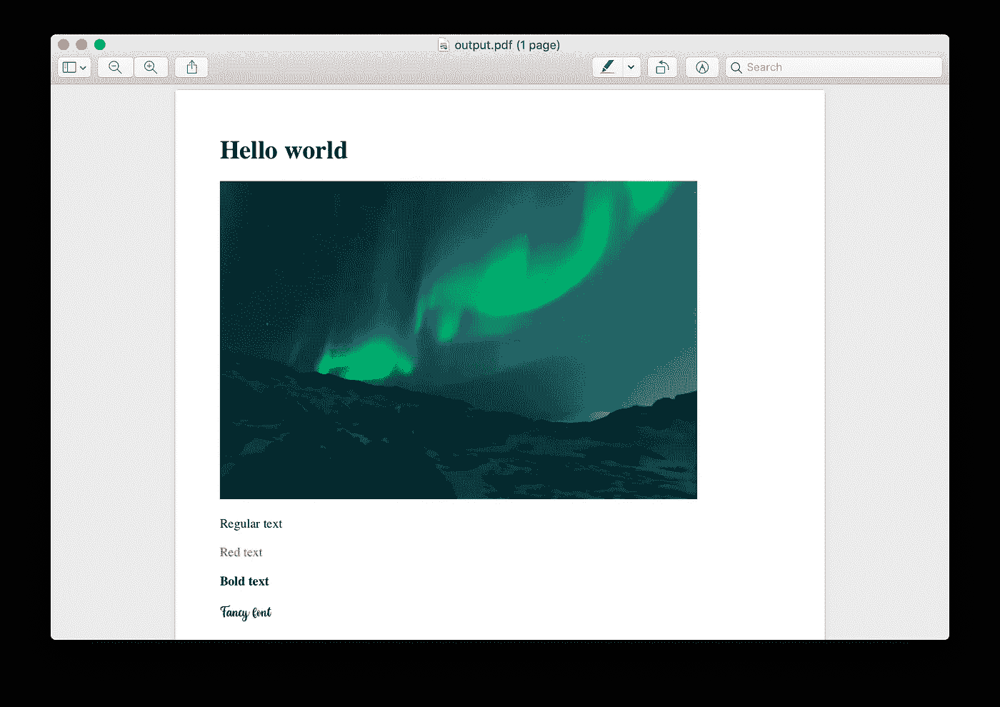

# 用 Java 将 HTML 转换成 PDF

> 原文：<https://medium.com/javarevisited/html-to-pdf-in-java-using-flying-saucer-f73b70d9014d?source=collection_archive---------0----------------------->

## 使用开源库:Jsoup 和飞碟

我最近遇到了使用免费的开源库将 HTML 文件转换成 Java 的 PDF 文件的需求。在这篇文章中，我将带你完成我的设置过程:

*   使用自制软件安装 [Maven](/javarevisited/top-10-free-courses-to-learn-maven-jenkins-and-docker-for-java-developers-51fa7a1e66f6?source=collection_home---4------3-----------------------) 并配置$JAVA_HOME
*   在 IntelliJ 中建立一个 Maven 项目，并安装我们代码所需的 jar
*   将 HTML 转换成 PDF 的代码

# 安装和配置 Maven

如果你还没有安装[自制软件](https://brew.sh/)。然后我们会用家酿安装 [Maven](https://javarevisited.blogspot.com/2019/03/top-5-course-to-learn-apache-maven-for.html#axzz645Kt2tH8) 。

```
brew install maven
```

将下面一行添加到 **~/。bash_profile**

```
export JAVA_HOME=$(/usr/libexec/java_home)
```

然后在终端中运行:

```
source ~/.bash_profile
```

检查`$JAVA_HOME`设置是否正确:

```
echo $JAVA_PATH
```

这应该会给出类似于**/Library/Java/JavaVirtualMachines/adopt open JDK-13 . 0 . 1 . JDK/Contents/Home**的内容

# 在 IntelliJ 中配置 Maven 项目

在 IntelliJ 中创建新项目并选择 [Maven](/javarevisited/top-10-free-courses-to-learn-maven-jenkins-and-docker-for-java-developers-51fa7a1e66f6?source=collection_home---4------3-----------------------) 。从这一步开始，您可能会遇到两个常见错误，我将向您展示如何解决它们。

## 错误:不支持发布版本

在`src/main/java`中创建一个 Java 文件，并让它打印出 **Hello World！**

运行程序，你可能会遇到错误`Error:java: error: release version 5 not supported`如果你使用的是 JDK 8+。在 Dev.to 上有一个关于解决这个错误的帖子。

在 **pom.xml** 文件中添加以下几行:(JDK 8 为 1.8，JDK 11 为 1.11，JDK 13 为 1.13 等。)我用的是 JDK 13。

```
<properties>
    <maven.compiler.source>1.13</maven.compiler.source>
    <maven.compiler.target>1.13</maven.compiler.target>
</properties>
```

Shift + Cmd + A(在 Mac 上)或“帮助”>“查找操作”来调出“操作”菜单。键入**重新导入所有 Maven 项目。**

现在重新运行 Java 程序，确保 **Hello World** 被正确打印。

接下来，让我们将我们的 [HTML](/javarevisited/5-free-html-and-css-courses-to-learn-front-end-web-development-online-8b04517c6ecb?source=collection_home---4------0-----------------------) 到 PDF 代码依赖的 jar 文件添加到 **pom.xml 中。**

```
<dependencies>
    <!-- [https://mvnrepository.com/artifact/org.xhtmlrenderer/flying-saucer-core](https://mvnrepository.com/artifact/org.xhtmlrenderer/flying-saucer-core) -->
    <dependency>
        <groupId>org.xhtmlrenderer</groupId>
        <artifactId>flying-saucer-core</artifactId>
        <version>9.1.20</version>
    </dependency> <!-- [https://mvnrepository.com/artifact/org.xhtmlrenderer/flying-saucer-pdf-openpdf](https://mvnrepository.com/artifact/org.xhtmlrenderer/flying-saucer-pdf-openpdf) -->
    <dependency>
        <groupId>org.xhtmlrenderer</groupId>
        <artifactId>flying-saucer-pdf-openpdf</artifactId>
        <version>9.1.20</version>
    </dependency></dependencies>
```

## Maven 错误:无效的目标版本

在 IntelliJ 的终端中，运行以下命令来安装依赖项。

```
mvn install
```

这可能会失败，并显示一条错误消息`error: invalid target release: 1.13`。这篇[博文](https://javarevisited.blogspot.com/2018/12/how-to-fix-invalid-target-release-17-18-error-in-maven.html#axzz5kyUBax4O)对此有一个解决方案。

将以下插件添加到 **pom.xml** 并**重新导入所有 Maven 项目。**注意，`source`和`target`应该是 JDK 8 的 1.8，JDK 10 的 1.10，但是 JDK 11 的 11，JDK 12 的 12， [JDK 13 的 13](https://dev.to/javinpaul/6-mini-courses-and-tutorials-to-learn-new-java-features-from-jdk-8-to-jdk-13-1dij) 等等。

```
<build>
    <plugins>
        <plugin>
            <groupId>org.apache.maven.plugins</groupId>
            <artifactId>maven-compiler-plugin</artifactId>
            <version>3.8.1</version>
            <configuration>
                <source>13</source>
                <target>13</target>
            </configuration>
        </plugin>
    </plugins>
</build>
```

然后`mvn install`应该没有错误地完成。

# 将 HTML 转换为 PDF

我们需要两步:首先，用 [Jsoup](http://javarevisited.blogspot.sg/2014/09/how-to-parse-html-file-in-java-jsoup-example.html#axzz57nN5jeqk) 把 HTML 转换成 XHTML。第二，用[飞碟](https://mvnrepository.com/artifact/org.xhtmlrenderer/flying-saucer-pdf)把 XHTML 转换成 PDF。XHTML 与 HTML 的不同之处在于，XHTML 是 HTML 在语法上更严格的版本。例如，XHTML 不允许像``这样的自结束标签。

## HTML 到 XHTML

将 Jsoup 作为依赖项添加到 **pom.xml** :

```
<dependency>
    <groupId>org.jsoup</groupId>
    <artifactId>jsoup</artifactId>
    <version>1.13.1</version>
</dependency>
```

导入 j 组:

```
import org.jsoup.Jsoup;
import org.jsoup.nodes.Document;
```

创建一个将 HTML 转换为 XHTML 的方法:

```
private static String htmlToXhtml(String html) {
    Document document = Jsoup.parse(html);
    document.outputSettings().syntax(Document.OutputSettings.Syntax.xml);
    return document.html();
}
```

## XHTML 到 PDF

将飞碟作为依赖项添加到 **pom.xml** :

```
<dependency>
    <groupId>org.xhtmlrenderer</groupId>
    <artifactId>flying-saucer-core</artifactId>
    <version>9.1.20</version>
</dependency>

<dependency>
    <groupId>org.xhtmlrenderer</groupId>
    <artifactId>flying-saucer-pdf-openpdf</artifactId>
    <version>9.1.20</version>
</dependency>
```

进口飞碟:

```
import org.xhtmlrenderer.pdf.ITextRenderer;
import java.io.*; // for file I/O
```

创建将 XHTML 转换为 PDF 的方法:

```
private static void xhtmlToPdf(String xhtml, String outFileName) throws IOException {
    File output = new File(outFileName);
    ITextRenderer iTextRenderer = new ITextRenderer();
    iTextRenderer.setDocumentFromString(xhtml);
    iTextRenderer.layout();
    OutputStream os = new FileOutputStream(output);
    iTextRenderer.createPDF(os);
    os.close();
}
```

或者，您可以注册 HTML 中使用的自定义字体。在第`ITextRenderer iTextRenderer = new ITextRenderer();`行之后，添加:

```
FontResolver resolver = iTextRenderer.getFontResolver();
iTextRenderer.getFontResolver().addFont("MyFont.ttf", true);
```

## 将两种方法结合起来

```
public static void main(String[] args) throws IOException {
    String html = "<h1>hello</h1>";
    String xhtml = htmlToXhtml(html);
    xhtmlToPdf(xhtml, "output.pdf");
}
```

我下载了一个叫做 [Butterfly.ttf](https://www.dafont.com/butterfly-8.font) 的字体，用在我的 HTML 里。

```
<head>
    <style>
    [@font](http://twitter.com/font)-face {
        font-family: "Butterfly";
        src: url("Butterfly.ttf");
    }
    .butterfly {
        font-family: "Butterfly";
    }
    </style>
</head><body>
    <h1>Hello world</h1>
    
    <p>Regular text</p>
    <p style="color:red">Red text</p>
    <b>Bold text</b>
    <p class="butterfly">Fancy font</p>
</body>
```



上面 HTML 的输出(作者:Lynn Zheng)

## [完整代码](https://gist.github.com/RuolinZheng08/2ea8902f3316bf51c3555dce4a2dff5f)