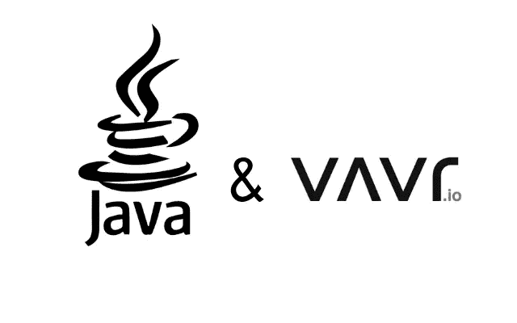

# 一.❤

> 原文：<https://medium.com/javarevisited/i-vavr-940c05d5dda4?source=collection_archive---------0----------------------->

在 2012 年我作为 Java 开发人员的第一份工作中，我有幸与一个在编码实践方面非常进步的团队一起工作。他们向我介绍了结对编程和测试驱动开发等。我记得那时我读了一本小书叫做[*【Java 8】*](https://horstmann.com/java8/)*。*

我对 Java 8 和[函数式编程](/javarevisited/7-best-java-tutorials-and-books-to-learn-lambda-expression-and-stream-api-and-other-features-3083e6038e14)非常感兴趣。
如此之多，以至于下班回家后，我会尝试从一些 git 存储库中将大块代码从声明式 Java 风格重构为函数式 Java 8 风格。

在办公室，我会和我的同事谈论，我们确实问过管理层是否有可能提前采用 Java 8 并升级我们的应用。不幸的是，如此快速地升级到 java 8 并不是企业的首要任务。但是失望并没有持续多久。另一个团队的一位同事告诉我们，在他们的团队中，他们收到了来自企业的相同回复，但他们开始使用 [VAVR.io](https://www.vavr.io/) 而不是升级到 Java 8。

这是个好消息，因为对库没有任何限制，我们立即采用了 VAVR 库。随着时间一天天地过去，我学会了使用 VAVR 进行函数式编程。我真的很喜欢它，直到将近两年后，我才第一次专业地编写 Java 8。

VAVR 几年前被称为 JavaSlang，是一个 Java api，它为您的代码带来了[函数式编程](/javarevisited/5-best-java-functional-programming-books-for-beginners-and-experienced-programmers-4daecd159756)功能，并且还提供了一个伟大的不可变集合 api。在这篇文章中，我不想谈论很多关于 VAVR 的理论，我只想展示 Java 8 中的代码和它的 VAVR 等价物，这样你就可以看到使用这个库有多好。我希望你喜欢它。

**Function N types** Java 8 支持 Function*by Function*但是 Vavr 支持 *Function* (N)类型，允许最多 8 个参数。

**组合函数** 使用 VAVR 我们可以进行函数的组合。非常好的特性，允许我们以可维护的方式扩展功能。

**提升** 如果一个复合函数中的一个函数抛出了异常，我们可以阻止这个异常，而是*返回 Option.none* 。这在编写使用第三方库[并能返回异常的函数时非常有用。](/javarevisited/20-essential-java-libraries-and-apis-every-programmer-should-learn-5ccd41812fc7)

**部分应用** 我们可以通过传递比所需参数更少的参数来部分应用一个函数。

**curry** curry 允许我们将一个多参数的函数分解成一系列单参数的函数。

**记忆/幂等** 如果用相同的参数调用一个函数，结果应该是相同的。[记忆化](https://javarevisited.blogspot.com/2020/05/fibonacci-series-in-java-8-with.html)允许我们在函数中轻松实现缓存。

在我看来，VAVR 的选项优于它的 Java 对应物 Optional。
这里只是一些原因:

*   在 VAVR 中，选项是可序列化的，而在 Java 8 中，选项是不可序列化的。
*   VAVR 中的选项支持 peek，它允许我们在有事情发生时执行一个动作。
*   选件可与 [java 8 选件](https://www.java67.com/2018/06/java-8-optional-example-ispresent-orElse-get.html)互操作
*   在 vavr 中，对 Option.map()的调用可能会导致一些(null)这可能会导致 NullPointerException。有些人不喜欢这样，但它实际上迫使你注意可能出现的空，并相应地处理它们，而不是不知不觉地接受它们。处理 null 出现的正确方法是使用 flatMap。

选项是值的包装器，如果使用正确，我们可以避免[空检查](https://javarevisited.blogspot.com/2016/01/how-to-check-if-string-is-not-null-and-empty-in-java-example.html)以及[*NullPointerException*](https://www.java67.com/2021/05/how-to-solve-nullpointerexception-in-java.html)*。*

这只是 vavr 选项的一个小例子。但是 vavr 选项的功能要大得多，我需要另一篇文章来讨论它。但是我想分享一个 git 回购协议的链接，我有更多的期权例子，这样你就可以看到它还能做什么。

**Try** 

*   我们可以从方法中返回 Try 来推迟执行，它的语法非常直观。
*   在出现错误的情况下，我们可以优雅地提供替代的执行路径。
*   如果我们调用的方法返回了多个异常，但是我们只是想通过 Try 的方法 *recoverWith()* 有选择地对其中一个做出反应
*   结合 Try.sequence 和 flatmap，我们可以从 Try 列表中提取值。

**惰性初始化值** 不管我们调用它多次，惰性初始化值只会计算一次。

**集合** Vavr 引入了一个非常强大的不可变集合 api。我将用一篇更广泛的文章来解释所有 vavr 集合功能的更多信息，但让我们来看一个 vavr 中一些有用的集合功能的小示例。

**元组** 元组是元素的分组。Java 8 支持对，但是 vavr 更进一步，允许元组。元组的值是使用 values _1、_2 等来访问的……我们必须承认，这可能不是最友好的名称。最大元组大小是 8 个元素。

**无痛检查异常** 这是使用 [lambdas](/javarevisited/8-best-lambdas-stream-and-functional-programming-courses-for-java-developers-3d1836a97a1d) 和[检查异常](https://javarevisited.blogspot.com/2011/12/checked-vs-unchecked-exception-in-java.html)时的经典问题。我们必须以如此丑陋的方式嵌入 catch 块，或者我们可以重构，bla bla…但它看起来不太好。

在 vavr 中，我们可以做这样的事情，这样我们就可以无痛苦地检查异常。

**模式匹配** 有了 vavr，我们可以做模式匹配来替代 switch 语句

感谢您花时间阅读我希望你喜欢这篇文章和/或发现它有用。如果你喜欢这种内容，我将非常感谢你给我一些掌声，关注并在你的社交媒体上分享。我的目标是每月发表一篇文章。