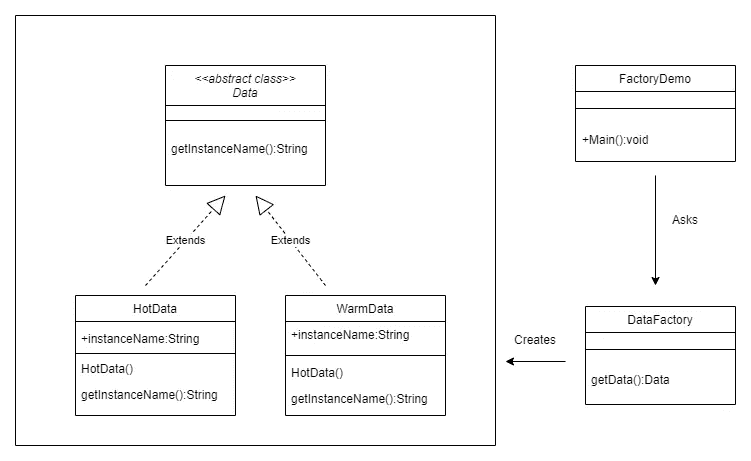

# 使用工厂方法设计模式提高可伸缩性

> 原文：<https://medium.com/javarevisited/improve-scalability-using-factory-method-design-pattern-4c6a166f0c0?source=collection_archive---------2----------------------->

## 工厂模式使我们的代码更加健壮，耦合度更低，并且高度可伸缩。

弗拉德·库特波夫在 [Unsplash](https://unsplash.com?utm_source=medium&utm_medium=referral) 上的照片

工厂设计模式是一种创造性的设计模式，也称为虚拟构造器。它委托对象创建，并为在超类中创建对象和改变子类提供接口，而不影响现有的客户端实现。它通过消除将特定于应用程序的类绑定到代码中的需要，促进了**松耦合**。

> **耦合**意味着一个类与另一个类的关系有多紧密。耦合必须保持较低。无论如何，模块之间相互依赖很小。所有的类和方法必须与其他类有小的直接可见的和灵活的关系。但是一个模块必须容易被其他模块使用。

[工厂模式](http://javarevisited.blogspot.sg/2013/01/difference-between-factory-and-abstract-factory-design-pattern-java.html)从客户端代码中移除实际实现类的实例化。代码只与生成的接口或抽象类交互，因此它将与实现该接口或扩展该[抽象类](https://javarevisited.blogspot.com/2013/05/difference-between-abstract-class-vs-interface-java-when-prefer-over-design-oops.html)的任何类一起工作。它将客户端代码从具体的类中分离出来，您需要通过允许子类选择要创建的对象类型并改变将要创建的对象类型来进行实例化。

## **何时使用？**

*1。当您事先不知道代码应该处理的对象的确切类型和依赖关系时，请使用* [*工厂方法*](https://javarevisited.blogspot.com/2011/12/factory-design-pattern-java-example.html#axzz7CAMs6DOi) *。*

*2。当您希望在不破坏初始客户端实现的情况下扩展其内部组件时，请使用工厂方法。*

*3。当您希望通过重用现有对象而不是每次都重新生成它们来节省系统资源时，请使用工厂方法。*

# **现实世界系统设计类比**

# 问题

我认为我们的应用程序有 3 种类型的数据，它们是按用途分类的。应用程序应该根据情况支持不同类型的数据连接。从设计角度来看，每次都创建一个[数据连接](https://javarevisited.blogspot.com/2012/06/jdbc-database-connection-pool-in-spring.html#axzz6ggCCT42g)是不明智的。它使样板代码和紧密耦合。我们的示例中使用了以下数据类型。

**热数据**——频繁访问的数据。存储在内存缓存存储中。

**暖数据** -访问频率较低。存储在数据库中。

# 解决办法

如果我们应用了工厂设计模式，那么我们只需要从客户端代码传递一个参数。然后工厂开始发挥作用，它知道哪种类型的数据连接实例应该返回给我们。

编写客户机源只是为了给出数据观点。客户请求来自抽象类的工厂请求。[抽象类](https://www.java67.com/2014/06/why-abstract-class-is-important-in-java.html)给出选择的对象。

类图

# 履行

1.  创建一个抽象类。

2.创建扩展同一抽象类的具体类。

3.创建一个工厂，根据给定的信息生成具体类的对象。

4.演示-通过传递类型等信息，使用工厂获取具体类的对象。

## 工厂设计模式的优势

1.  工厂设计模式为接口提供了一种接近[代码的方法，而不是实现](/javarevisited/10-oop-design-principles-you-can-learn-in-2020-f7370cccdd31)。
2.  工厂模式从客户端代码中移除了实际实现类的实例化。工厂模式使我们的代码更加健壮，耦合性更低，易于扩展。例如，我们可以很容易地改变`HotData` 类的实现，因为客户端程序不知道这一点。
3.  工厂模式通过继承在实现和客户端类之间提供了抽象。

# 包装东西

最后，我希望您清楚工厂方法设计模式及其适用性。本文试图巩固工厂方法的大多数常见设计方法。

如果你愿意学习我写的其他设计模式，

<https://susithrj.medium.com/demystifying-singleton-design-pattern-in-java-96887744d40a>  </javarevisited/toned-down-code-complexity-using-facade-design-pattern-6f21d1e762d>  

如果有什么我说得不对的地方，欢迎在下面评论！。*如果你喜欢这篇文章，点击👏下面这样更多的人可以看到它！请务必在*[***Medium***](/@susithrj)**或* [***我的博客***](https://susithrj.wordpress.com/)**上关注我，以便在有新文章发表时获得更新。***

***快乐编码！👌***