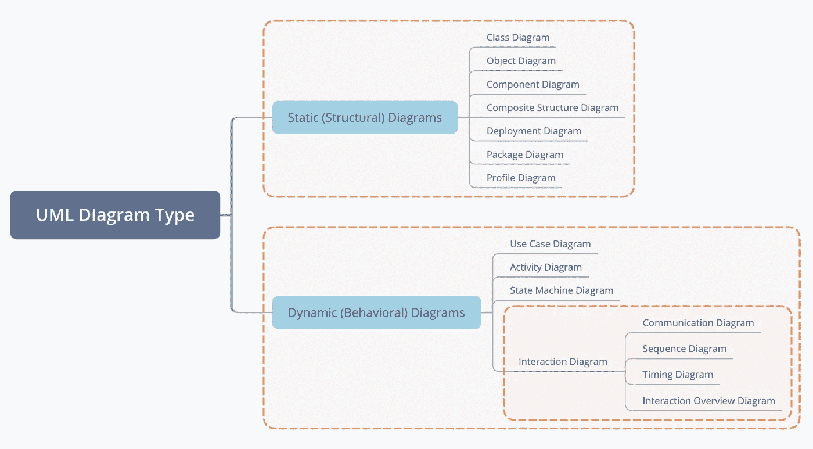

# 信息系统:简介。&开发生命周期

> 原文：<https://medium.com/javarevisited/information-system-intro-overview-317d2cc0a97a?source=collection_archive---------4----------------------->

信息系统在公司的日常运作中非常重要的原因是，有了有效的信息系统，一个组织可以有更好的决策，更好的计划，并最终取得更好的结果。也就是说，当正确实施时，信息系统将有助于公司更有效地运作。

在本文中，我们将探讨 1)什么是信息系统，2)系统开发生命周期，重点是系统需求&分析和系统架构设计

# 什么是信息系统？

一个信息系统由五部分组成:硬件、软件、数据、人员和流程。每个组件相互集成，以支持组织中的决策、协调、控制、数据分析&可视化，从而实现业务目标。

示例包括:业务流程管理系统(BPM)、流程控制系统、人力资源管理系统(HRM)、销售和营销系统、库存控制系统、办公自动化系统、企业资源规划系统(ERP)、会计和财务系统、客户关系管理系统(CRM)以及管理报告系统。

# **系统开发生命周期**

所有的信息系统项目都必须经历**的四个阶段:规划、分析、设计和实施。**这些阶段是 [**系统开发生命周期(SDLC)**](/javarevisited/6-best-sdlc-courses-for-beginners-and-experienced-programmers-devops-and-project-managers-b8242c04d761) 的一部分。SDLC 的一个重要概念是这是一个**迭代**过程，SDLC 的目标是**创建一个高质量的系统，满足客户在时间、成本、有效性和效率方面的要求。**

## SDLC 的阶段

1.  规划:这一步的目的是找出问题的范围并确定解决方案。在此阶段，还应考虑资源、成本、时间等限制因素。它们包括:

*   确定现有系统的问题和范围。
*   概述新系统并确定其目标。
*   检查项目可行性并制定项目进度表。
*   威胁、安全和任何约束。
*   整个项目的**可行性报告**，在该阶段结束时创建。

> 注:此阶段的主要目标是确定开发新系统是否可行。可行性包括:1)技术可行性，2)财务可行性，3)运营可行性，4)用户行为可行性，5)管理可行性，6)法律可行性，7)时间可行性。

2.分析:这个阶段是确定**一个企业的**需求是什么，**如何**满足这些需求，**谁**将负责项目的各个部分，以及**预计**何时完成项目。它们包括:

*   收集、分析和验证信息。
*   定义新系统的需求和原型。
*   评估备选方案并确定需求的优先级。
*   审查最终用户的信息需求，增强系统目标。
*   在此阶段结束时，将准备一份**软件要求规范(SRS)** 文档，该文档指定了系统的软件、硬件、功能和网络要求。

> 系统需求和分析:
> 
> 需求分析过程的目标包括
> 
> a)将最终用户的需求与系统、系统元素联系起来，并使系统元素能够被设计和开发。
> 
> b)定义一个在规定的成本和进度限制内满足最终用户作战任务要求的系统。
> 
> c)提供对各种功能之间的交互的洞察，以实现基于用户目标的一组平衡的需求。
> 
> 注意:同时，开发团队可以以用户故事、用例、[数据模型图](/javarevisited/all-you-need-to-know-about-uml-diagrams-546c9f191a9d) (ER model & UML)和流程图的形式与涉众交流，而不是文本页面，以确保需求得到满足。

[https://medium . com/Java re visited/all-you-need-to-know-about-UML-diagrams-546 c9f 191 a9d](/javarevisited/all-you-need-to-know-about-uml-diagrams-546c9f191a9d)

3.设计:该阶段将详细解释必要的**规格、特征和操作**，以满足将到位的拟议系统的[功能要求](https://javarevisited.blogspot.com/2015/01/difference-between-functional-and-nonfunctional-requirements-software-development.html)。这是最终用户讨论和确定他们对建议系统的具体业务信息需求的步骤。这包括:

*   应用程序、网络、[数据库](/hackernoon/top-5-sql-and-database-courses-to-learn-online-48424533ac61)、用户界面和系统界面的设计。
*   将 SRS 文档转换成逻辑结构，该结构包含可以用编程语言实现的详细且完整的规范集。
*   创建应急、培训、维护和运行计划。
*   审查提议的设计。确保最终设计必须满足 SRS 文件中规定的要求。
*   准备将在下一阶段使用的**设计文件**。

> 系统架构设计:
> 
> 架构设计是系统设计过程的早期阶段。它代表**规范和设计过程**之间的联系。系统架构设计过程的目的是建立系统架构设计，确定哪些系统需求应分配给系统的哪些元素，并根据定义的标准评估系统架构设计。
> 
> 一个成功的过程结果包括:
> 
> `**[Outcome 1]**` **定义系统架构设计，并指定系统的所有元素。**
> 
> `**[Outcome 2]**` **系统需求被分配给系统的所有元素。**
> 
> `**[Outcome 3]**` **定义了系统元素的各个界面。**
> 
> `**[Outcome 4]**` **定义系统元素的每个动态行为**
> 
> `**[Outcome 5]**` **对系统需求和系统架构设计要素之间的可追溯性进行开发。**
> 
> `**[Outcome 6]**` **一个建筑设计商定。与所有相关方沟通设计。**
> 
> 基本实践:
> 
> **BP1。开发系统架构设计**
> 开发并记录系统架构设计，该设计根据所有功能性和非功能性系统需求指定系统的所有元素。
> 
> BP2。分配系统需求
> 将系统需求分配给系统架构设计的元素。
> 
> **BP3。定义系统元素的接口**
> 
> 识别、开发和定义接口，包括每个元素的内部和外部接口。
> 
> **BP4。描述动态行为**
> 
> 评估并记录系统元素之间交互的动态行为。动态行为由 ***操作模式*** 确定，如启动、关闭、正常模式、校准、诊断。
> 
> **BP5。评估备选系统架构**
> 
> 确定体系结构的评估标准。这些将用于评估替代系统架构。应记录所选系统架构的解释(基本原理)。评估标准应包括制造-购买-再使用分析的**和* ***质量特性*** 如模块化、可维护性、可扩展性、可伸缩性、可靠性、安全实现和可用性。*
> 
> ***BP6。建立双向可追溯性***
> 
> *建立系统需求和系统架构设计元素之间的可追溯性。*
> 
> ***BP7。确保一致性***
> 
> *确保我们的系统需求和系统元素之间的一致性。*
> 
> **注:系统需求通常包括系统架构需求。参考 BP5。**
> 
> ***BP8。传达商定的系统架构设计***
> 
> *确保所有相关的涉众都获得了关于商定的系统架构设计的更新。*

*4.实现:这一步通过将旧系统中的数据和组件转移到新系统中，将项目投入生产。这包括:*

*   *通过编码将设计实现到源代码中。*
*   *将所有模块组合到一个检测错误和缺陷的培训环境中。*
*   *包含错误的**测试报告**是通过测试计划准备的，测试计划包括测试相关的任务，如测试用例生成、测试标准和测试资源分配。*
*   *将信息系统集成到其环境中并安装新系统。*

****值得一读****

*[*数据建模:概念、逻辑、物理数据模型类型*](https://www.guru99.com/data-modelling-conceptual-logical.html)*

****觉得这个帖子有意思？*** *如果你能抱着“拍拍”，对我来说意义重大。那会让我非常开心！**