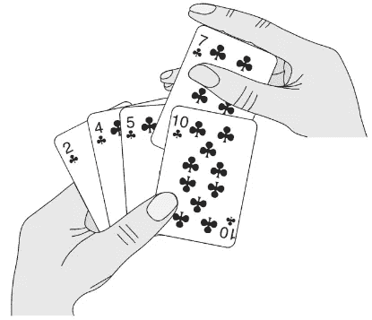

# 插入排序的剖析

> 原文：<https://medium.com/javarevisited/insertion-sorts-anatomy-b43fd4edc986?source=collection_archive---------1----------------------->

## 一个有趣的类比有助于在你的记忆中加深排序的概念

*来源*:算法入门书籍

作为一名软件工程师或计算机科学专业的应届毕业生，我一直对“*正确地*理解插入排序算法有问题。嗯，至少一开始是这样，现在不是了。如果你读到这里，脸上挂着笑容，很可能你也经历过或者正在经历同样的问题。

不再是我的朋友。

为了破解科技公司的[编码面试](/javarevisited/10-data-structure-algorithms-and-programming-courses-to-crack-any-coding-interview-e1c50b30b927)，人们深入准备[数据结构和算法](https://javinpaul.medium.com/6-best-data-structure-and-algorithms-courses-for-javascript-developers-c35e23236165) (DSA)。这是一个好兆头，除非你已经从练习编码问题中抽身出来，你必须回到公司转换的准备阶段。很多时候，人们会尝试先复习 DSA 的基础知识，第一个主题通常是“*分类*”。在这种情况下，第一个也是最基本的排序算法[是“*插入排序*”。](https://javarevisited.blogspot.com/2019/04/top-20-searching-and-sorting-algorithms-interview-questions.html#axzz6uiUE2EEk)

让我们"*正确地*"彻底地理解这个算法，然后完成它。

## 纸牌游戏:类比

每个人一生中至少玩过一次纸牌游戏。在大多数纸牌游戏中，每个玩家都有一手牌。现在，不管游戏的动机是什么，牌手总是把手中的牌分类是一种天生的本能。

让我们仔细看看一个玩家是如何对一手牌进行分类的。

考虑一组面朝下叠放的牌。

> 玩家用他/她的右手拉 a 牌，理解牌的价值，并把它放在他/她的左手的适当位置。因此，保持左手牌总是排序。

## 插入排序

类比上面的游戏:

> 给定一个 *n 元素*数组形式的输入，插入排序算法要求我们维护两个逻辑部分的数组: ***排序部分(左手)*** 和 ***未排序部分(右手)*** 。我们需要从未排序部分中提取元素，并将其放入排序部分中的适当位置，这样当算法执行完毕时，排序部分的长度必须等于 n，未排序部分的长度必须等于 0。

算法(伪代码):

完成了，对吗？

就这么简单。

首先，我们通过将第一个元素 A[0]作为已排序元素(因为单个数字本来就是已排序的)，并将数组的其余部分作为未排序元素，定义了数组[的已排序和未排序部分。](/javarevisited/20-array-coding-problems-and-questions-from-programming-interviews-869b475b9121)

然后，我们确保排序后的部分是完整的，并且随着每次迭代增加循环的*(第 1–8 行)。*

## 更多细节

在数学世界里，[插入排序算法](/javarevisited/20-algorithms-coding-problems-to-crack-you-next-technical-interviews-23191f229788)可以用一种叫做 ***数学归纳法*** 的技术来证明。基本上，让我们看看如何证明上述算法，事实上，对于任何给定的输入数组，都以排序的方式输出数组。

> 数学归纳法的工作原理是从算法中提取一个基本属性，该属性在算法执行的所有阶段都是正确的。这个性质叫做 ***不变量。*** 在我们的例子中，由于算法在循环中执行，这个属性将被称为 ***循环不变量。***

一旦确定了循环不变量，我们需要满足 3 个条件:

1.  ***初始化*** :这个条件意味着循环不变量甚至在循环的第一次迭代之前就成立。
2.  ***维护*** :这个条件意味着循环的每次迭代都保持循环不变的性质。
3.  ***终止*** :这个条件暗示当循环终止时，循环不变量给了我们一个有用的性质，表明算法的正确性。

## 插入排序的循环不变量

不变的属性是左边部分(排序部分)始终保持排序。

> 因此，对我们来说，循环不变量是数组的左边部分总是被排序。

## 初始化

循环从第二个元素开始，这意味着甚至在第一次循环迭代之前，我们已经对左边部分进行了排序，因为只有一个元素。

## 维护

在每次迭代“*I”*之后，数组 A[0 到 i-1](左侧子数组)始终保持排序。

## 结束

在最后一次迭代“ *i* ”之后，I 等于 n。由于我们对数组 A[0 到 i-1]总是进行排序，因此我们可以说，在最后一次迭代之后，子数组 A[0 到 n-1]实际上是整个数组，并且是经过排序的。

因此，算法是正确的。

## 结论

插入排序总是保持输入数组左边部分的排序，并使其增长以匹配原始数组的长度。

更多此类文章请点赞、分享、关注。

 [## 50 大数据结构和算法程序员面试问题

### 准备编程工作面试？这里有 50 多个数据结构和算法问题，你可以练习…

medium.com](/javarevisited/50-data-structure-and-algorithms-interview-questions-for-programmers-b4b1ac61f5b0)  [## 面向初学者和有经验的开发人员的 21 个字符串编程面试问题

### 除了数组、二叉树和链表数据结构，字符串是编程工作中的另一个热门话题…

medium.com](/javarevisited/top-21-string-programming-interview-questions-for-beginners-and-experienced-developers-56037048de45)  [## 前 25 个系统设计面试问题

### 以下是在大型科技公司，如脸书、微软、谷歌，最常被问到的系统设计面试问题

medium.com](/double-pointer/top-25-system-design-interview-questions-c468e025b370)