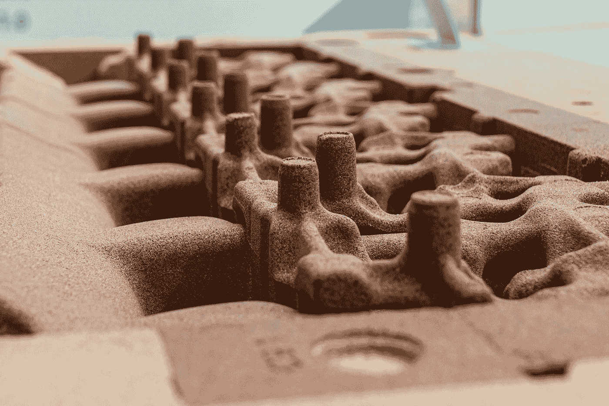
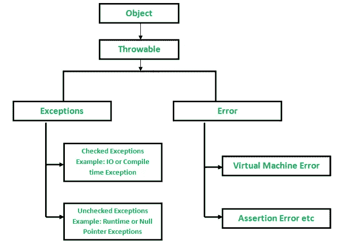
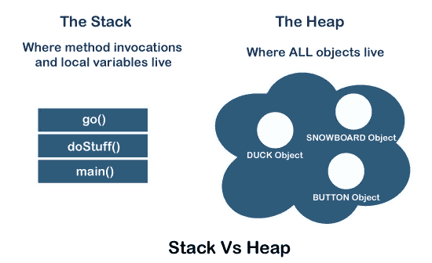

# 面向对象编程和 JAVA 的面试问题

> 原文：<https://medium.com/javarevisited/interview-questions-on-object-oriented-programming-and-java-41b027d93ddb?source=collection_archive---------0----------------------->

## 面试经验和指南—第二部分

## 面向对象和 JAVA 的面试准备

大家好，今天我将分享 oop 和 JAVA 的相关概念，作为我软件工程师职位面试准备系列的一部分。这是该系列的第二部分。如果你错过了第一部分，点击 [*这里*](/geekculture/interview-preparation-kid-for-software-engineer-1380f6fcbae9) *。下一篇关于数据库相关面试问题可用* [*此处*](https://faun.pub/interview-questions-on-database-concepts-d480defce050) *。不再拖延，让我们进入今天的话题。*

[](https://javarevisited.blogspot.com/2020/05/object-oriented-programming-questions-answers.html#axzz6vwZEctyQ)

照片由[克里斯蒂娜@ wocintechchat.com](https://unsplash.com/@wocintechchat?utm_source=medium&utm_medium=referral)在 [Unsplash](https://unsplash.com?utm_source=medium&utm_medium=referral) 上拍摄

OOP 是一个非常基础的概念，不仅是软件工程师，软件开发相关人员也需要了解它。面向对象编程问题也是任何面试官的必答问题。oop 中有四个主要概念。我将在下面解释其中的一些问题和答案。要了解更多关于 OOP 的基础知识，请访问[这里](/codex/object-oriented-programming-in-five-minutes-d54b96c906d)。我在下面的问答中给出了所有的主要话题。

1.  用真实世界的例子解释基本的 OOP 概念。

*   有四个基本的 oop 概念。它们是继承、抽象、封装和多态。
*   **继承**是指继承子类中的父类方法和字段。让我们考虑狗和动物类。狗是动物类的一个子类。因此，例如狗继承动物的*吃()*的方法。
*   **抽象**就是隐藏实现细节。我们只说做了什么，但隐瞒了如何做。例如:当我们使用 ATM 时，我们只需点击取现，但我们不知道具体是如何操作的。它是抽象的。
*   **封装**意为数据隐藏。在内部隐藏与类相关的数据。封装是通过设置私有属性并提供访问这些变量的 setters 和 getters 来实现的。我们可以想象一个医用胶囊，它用一个包装来隐藏内部。所以我们不知道它的成分。
*   **多态性**是指一个对象采取多种形式。在 JAVA 中，每个对象都是多态的，因为每个对象都是 Java 对象类的子对象。例如，狗既是一种动物，也是一只狗。就是多态性。父类引用用于创建子类对象。那也是多态性。

**2。为什么我们需要使用 oop？**

*   OOP 概念是编程中最古老的概念之一。Java 和 Python 是面向对象的语言。当我们使用 oop 时，有很多优点。我们可以避免代码冗余，管理变更，管理复杂性和代码重用支持。

**3。封装在编程中有什么好处？**

*   更改类内部不会影响类外部的任何代码。
*   管理变化更容易。更改实现不会反映到使用它们的客户机上。

**4。Java 是如何实现多态性的？**

*   Java 多态性已经通过**运行时多态性**和**编译时多态性**实现。
*   **运行时多态性**也被称为方法**覆盖**。在方法重写中，两个不同类中的两个方法的方法名和签名是相同的，但实现会不同。JVM 将决定在运行时运行哪个方法。我们不能用 static 关键字覆盖一个类。最终类不能被覆盖。
*   **编译时多态性**也被称为方法**重载**。这里使用了相同的方法名，但是参数不同。重载方法在同一个类中。JVM 在编译时而不是运行时决定这一点。

**5。Java 中实现抽象有哪些不同的方式？**

*   使用**抽象类**和**接口**。
*   该接口给出了 100%的抽象，而我们甚至可以在抽象类中定义具体的方法。
*   我们只能在接口中定义使用 final 和 static 修饰符。但是 final，不是 final，静态和非静态成员都可以在抽象类中定义。
*   我们不能从抽象类中初始化对象。
*   基于我们的目的，我们可以选择以上其中之一。如果我们计划使用多个继承，我们可以选择接口。但是如果我们想要子类之间的一些共同特征，我们可以使用抽象类。

**6。oop 中的造型是什么？**



照片由[米卡·鲍梅斯特](https://unsplash.com/@mbaumi?utm_source=medium&utm_medium=referral)在 [Unsplash](https://unsplash.com?utm_source=medium&utm_medium=referral) 上拍摄

*   强制转换意味着将对象类型转换为超类或子类。
*   将一个对象的类型转换成它的超类叫做**向上转换**。
*   将一个对象的类型转换成它的子类叫做**向下转换**。
*   下面的代码段是**向上抛掷**和**向下抛掷的例子。你也可以用其他例子。这里狗是动物的一个子类。**

```
**#Upcasting**
Dog d = new Dog();      
Animal a = (Animal)d;**#Downcasting**
Animal animal = new Animal();
Dog sampleDog = (Dog) animal;
```

**7。oop 中的内聚和耦合是什么意思？**

*   内聚性描述了一个类的成员为了中心目标而紧密合作的程度。凝聚力一定要强。定义良好的抽象会产生强大的凝聚力。
*   耦合意味着一个类与另一个类的关系有多紧密。耦合必须保持较低。无论如何，模块之间相互依赖很小。所有的类和方法必须与其他类有小的直接可见的和灵活的关系。但是一个模块必须容易被其他模块使用。

**8。抽象和封装的区别？**

*   在抽象中，使用抽象类和接口隐藏了实现的复杂性。在封装中，数据是使用 getters 和 setters 方法隐藏的。
*   抽象是隐藏不想要的实现信息的方法。而封装是一种将数据隐藏在单个实体或单元中的方法，同时也是一种保护信息不受外界影响的方法。

**9。什么是功能接口和标记接口？**

*   只有一个抽象方法的接口称为函数接口。他们一次只能演示一种功能。一个函数接口可以有任意多的默认方法。 **Runnable** 和 **Comparable** 是功能接口的例子。
*   这是一个空白接口(没有字段或方法)。可串行化的和可克隆的是标记接口的例子。所有这些界面都是空的。它主要用于向 java 编译器说明对象的类型。

10。线程在 Java 中是如何实现的？

线程是一个轻量级的进程。java 中有两种实现线程的方法。

1.  通过扩展线程类并重写
2.  通过实现 Runnable 接口。

任何其实例由线程运行的类都应该实现 Runnable 接口或 thread 类。只有一个名为的抽象方法在 runnable 接口中运行。它被用作一根线。我们在扩展 Thread 类的时候不能扩展任何其他类，即使我们需要。当我们为线程实现一个 Runnable 接口时，我们可以为我们的类节省空间。这样我们就可以在未来或现在扩展任何其他类。

10。什么是 Java 垃圾收集器？它是如何工作的？

垃圾收集是在运行时自动回收未使用的内存的过程。换句话说，这是一种在 JAVA 中清除不需要的项目的方法。垃圾收集器从堆内存中清除未被引用的对象，从而提高 java 内存的效率。作为程序员，
**我们不需要做任何额外的事情**，因为垃圾收集器(JVM 的一部分)已经为我们做了。

**11。Final，Finally 和 Finalize 有什么区别？**


斯蒂芬·以赛亚在 [Unsplash](https://unsplash.com?utm_source=medium&utm_medium=referral) 上拍摄的照片

*   **Final:** 在 Java 中，Final 是保留关键字。该关键字可用于变量、方法和类。在 Java 中，final 关键字有不同的含义，这取决于它是用于引用变量、类还是方法。如果一个最终变量被初始化，它就不能被改变。最终类不能被继承。当我们将一个方法声明为 final 时，我们表明我们将不能重写该方法。
*   **Finally:** Finally 也是 Java 的保留术语。当与 try/catch 块结合使用时，finally 关键字确保即使抛出异常，部分代码也能运行。在 try 和 catch 块之后，但在控制返回其原点之前，将执行 finally 块。最后，Finally 块的目的是释放资源。也就是说，我们在 try 块中打开的任何资源，比如网络连接和数据库连接，都必须关闭，这样我们才不会丢失资源。因此，这些资源必须在 finally 块中关闭。
*   **Finalize:** 这是垃圾收集器在删除或销毁适合垃圾收集的对象之前调用的一种方法，用于进行清理。清除操作需要取消分配或关闭与该项关联的资源，如数据库连接和网络连接。

**12。解释 Java 中的异常处理？**

*   在程序执行过程中发生的扰乱程序正常指令流的事件称为异常。
*   Java Throwable 类是所有类型的 Java 异常和错误的根类。JVM 只抛出这个类的实例对象。
*   错误是不可恢复的，而异常可以被处理以维持程序的正常运行。
*   java 中的异常和错误是有层次的。请参考下图进一步了解。

[](https://www.java67.com/2015/12/top-30-oops-concept-interview-questions-answers-java.html)

[https://www.geeksforgeeks.org/exceptions-in-java/](https://www.geeksforgeeks.org/exceptions-in-java/)

*   检查的异常在编译时处理，而未检查的异常在运行时处理。
*   我们也可以根据自己的需要用 java 设计自定义异常。这就是所谓的定制异常处理。
*   有时可能会出现这样的情况，块的一部分可能会导致一个异常，而整个块本身可能会导致另一个异常。我们甚至可以使用嵌套的 try-catch 块来处理程序中的多个异常。

**13。在 Java 中比较 throw 和 throws**

*   **Throw** 可以通过 Throw 关键字在 Java 中显式抛出检查过的或未检查的异常。**抛出**用于声明异常。它向程序员提供了可能发生异常的信息。
*   **throw** 后面是一个实例，而 **Throws** 后面是一个类。
*   **抛出**用于方法内部，而**抛出**用于方法签名。
*   您不能使用 **Throw** 抛出多个异常，但是我们可以使用 **Throws** 声明多个异常。

14。什么是 Java 栈和堆内存管理比较和对比？



[https://www.javatpoint.com/stack-vs-heap-java](https://www.javatpoint.com/stack-vs-heap-java)

*   **栈**内存中包含有短暂生命周期的项目，比如对象方法、变量、引用变量。**堆**内存保存 Java 运行时环境(JRE)类和对象。
*   在**堆栈**内存中，只有所有者线程可以看到变量。变量暴露给**堆**内存中的所有线程。
*   如果**栈**的大小超过了限制，JVM 就会抛出**stackoverflowererror**。增加堆栈大小以避免此问题。如果 JVM 无法在**堆**内存空间中构造一个新对象，它将抛出一个 **OutOfMemoryError** 。
*   因为每个线程都有自己的**堆栈**，所以堆栈是线程安全的。因为**堆**不是线程安全的，适当的代码同步是必不可少的。

我相信你已经理解了上面讨论的所有与 Java 和 OOP 相关的问题。如果您有任何问题或任何澄清，不要犹豫，通过回复部分与我联系。感谢你花宝贵的时间阅读这篇博客，我相信这会激励你继续阅读其他关于面对面试的博客。

喜欢这篇文章吗？成为 [*中等会员*](https://sthenusan.medium.com/membership) *继续无限制学习。如果你使用上面的链接，我会收到你的一部分会员费，不需要你额外付费。提前感谢。*


由 [Kelly Sikkema](https://unsplash.com/@kellysikkema?utm_source=medium&utm_medium=referral) 在 [Unsplash](https://unsplash.com?utm_source=medium&utm_medium=referral) 上拍摄的照片