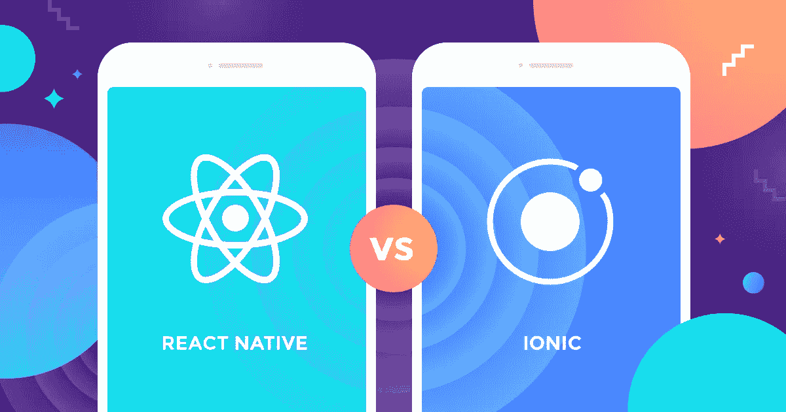

# Ionic vs. React Native:构建移动应用程序时应该选择哪一个？

> 原文：<https://medium.com/javarevisited/ionic-vs-react-native-which-one-should-you-go-for-when-building-a-mobile-app-d1135a122f9b?source=collection_archive---------3----------------------->

在当今不断连接的时代，信息和数据比以往任何时候都更重要。许多企业正在放弃传统网站，转而青睐时尚、用户友好的移动应用。为了用最少的额外工作创建一个在几个平台上运行的移动应用程序，开发者可以利用混合移动应用程序框架。

如今，你可能会得到各种混合移动应用框架。在本文中，我们将介绍两种最流行的用于创建混合移动应用程序的**开源混合框架**之一:[**Ionic Vs React Native**](https://jumpgrowth.com/react-native-vs-ionic/)。

# **那些框架是什么？**

## **离子框架**

[Ionic](https://javarevisited.blogspot.com/2022/03/top-5-ionic-courses-for-beginners-to.html) 是一个免费的开源用户界面框架，用于使用 web 技术构建移动和桌面应用，包括 CSS ( [级联样式表](/javarevisited/10-best-css-online-courses-for-beginners-and-experienced-developers-54aa2e8c0253))、HTML5 和 JavaScript。它促进了健壮的跨平台软件的开发。

Ionic Native 和 Capacitor 框架提供了本地 API(应用程序编程接口)和适合移动使用的基于 web 的组件。Drifty 在 2013 年使用 Apache Cordova(以前的 PhoneGap)和 Angular.js 作为其基础，共同创建了 Ionic 框架。然而，在 2019 年，推出了支持不同前端的 Ionic 平台。

你可以用 [Angular](/javarevisited/is-full-stack-web-development-with-angular-specialization-on-coursera-worth-it-review-e1077792f6af) 、React.js、Vue.js，甚至香草 JavaScript 搭配 Ionic 开发一个混合移动 app。

## **React 原生框架**

当比较[反应原生](/javarevisited/5-projects-you-can-build-to-learn-react-native-in-2022-c7111aceddd)与爱奥尼亚的成功时，有显著的差异。Ionic 是一家初创公司，而世界上最大、最知名的公司之一脸书在 2015 年推出了 React Native。

要用 React 代码构建原生应用，开发者可以利用 **React 原生移动应用框架**的跨平台能力。它在后台不可见地运行，并连接到设备的本机组件。

在 React Native 的情况下，JavaScript 可以用于构建 Android 和 iOS 的应用程序。通过提供“本机”组件，可以更容易地构建在多个平台上运行的应用程序，这些组件的行为类似于这些平台的本机 UI(用户界面)元素，但不是这些平台的本机组件。

# **离子型和反应型，相比较而言**

到目前为止，您已经熟悉了像 React Native 和 Ionic 这样的框架。现在我们可以开始对比 React Native 和 Ionic，看看它们是如何变化的。

## **人气**

根据 2022 年的堆栈溢出研究，React Native 比 Ionic 更受欢迎(12.5%)。最近，Ionic 越来越受欢迎，但只有一些人知道它的功能和优势。

## **学习曲线**

**反应原生**

如果你不熟悉 React 技术，React Native 的学习曲线对你来说会很陡。

**离子型**

与 React Native 相比，这里的学习曲线更容易管理。

## **第三方集成**

**反应原生**

[**React 原生移动应用框架**](https://jumpgrowth.com/react-native-development/) 中包含了很多有用的库。虽然不缺乏第三方插件，但其中许多插件很难集成到 React 本机应用程序中。

**离子型**

由于 Ionic 框架丰富的库，开发者可以很容易地找到像 Ionic、Apache/Cordova 等插件。此外，在 Ionic 中开发定制模块比在 React Native 中简单得多。

## **插件和社区**

**反应原生**

脸书和 Instagram 使用并支持 React Native，这有助于提高其在开发者中的受欢迎程度。因此，这个框架有相当多的人可以提供答案、改进和新闻。当你熟悉 React 时，你会觉得使用 React Native 就像在家里一样。

**离子型**

Ionic 的增长和受欢迎程度已经稳定了一段时间。您可以在社区中搜索必要的插件来获得本地功能。此外，社区中还有一个市场，会员可以在那里购买和交易不同的插件。

## **调试**

**反应原生**

Chrome 的开发工具 Consol.log 和官方的 React 原生调试器应用程序可以轻松检查和修复 React 原生应用程序使用的基于 JavaScript 的代码中的错误。任何编辑器，比如 iOS 应用的 XCode 或者 Android 应用的 Visual Studio，如果使用了足够多的原生代码，都可以用来调试。

**离子型**

开发人员可以从调试的简易性中受益，这要归功于 Ionic 中包含的特殊工具集合，比如 Chrome dev 工具。然而，剧情有了惊人的转折。利用 Ng Cordova 硬件特性的项目可能会发现调试过程更具挑战性。

## **测试**

**反应土著**

您可以使用 React Native 的各种测试框架，从单元测试到全自动化。

**离子型**

Ionic 的端到端测试设置与 Angular CLI(命令行界面)非常接近。因此，因果报应可以用来检查个别部分。作为奖励，Jasmine 和量角器用于集成和单元测试。

## **应用大小**

**反应原生**

对于 Expense Manager 应用程序，React 本地版本的大小约为 8.5 MB。

**离子型**

对于 Expense Manager 应用程序，Ionic build 的大小约为 3.2 MB。

## **开发时间**

**反应原生**

React 原生应用的开发周期平均约为 1.5 个月。

**离子型**

使用 Ionic 创建费用管理器应用程序需要一个月的时间。

# **我应该使用哪个框架？**

离子型和原生型孰优孰劣并不容易决定。所有人都以自己独特的方式做出贡献。我们所能做的就是比较并确定哪一个最适合特定的功能。

如果你想创建一个适用于移动设备和各种操作系统的应用，Ionic 是一个不错的选择。为此，你将加强你的网络形象。因为所有应用程序的代码都是标准的，所以维护和更新会更容易。你也将避免浪费精力和材料。这是一个方便的附加功能，可以与许多不同的管理系统(比如 MPMS)一起工作。拥有一个跨设备工作的混合应用程序可以实现更精确的控制和报告。

然而，如果你正在寻找 **iOS 和 Android 移动设计和开发**，你会发现使用 React Native 更成功。为了用户的利益，它增强了这些系统的功能。此外，原生应用往往表现更好，并提供更大的灵活性。

## **总结**

如果你已经决定了你的下一个混合应用程序开发选择哪个框架，你可以联系**一家移动应用程序开发公司**来 [**雇佣应用程序开发人员**](https://jumpgrowth.com/) ，将你梦想中的应用程序带入现实。