# Coursera 的 IBM 数据科学专业证书值得吗？[综述]

> 原文：<https://medium.com/javarevisited/is-courseras-ibm-data-science-professional-certification-worth-it-review-656e0b504fdf?source=collection_archive---------0----------------------->

[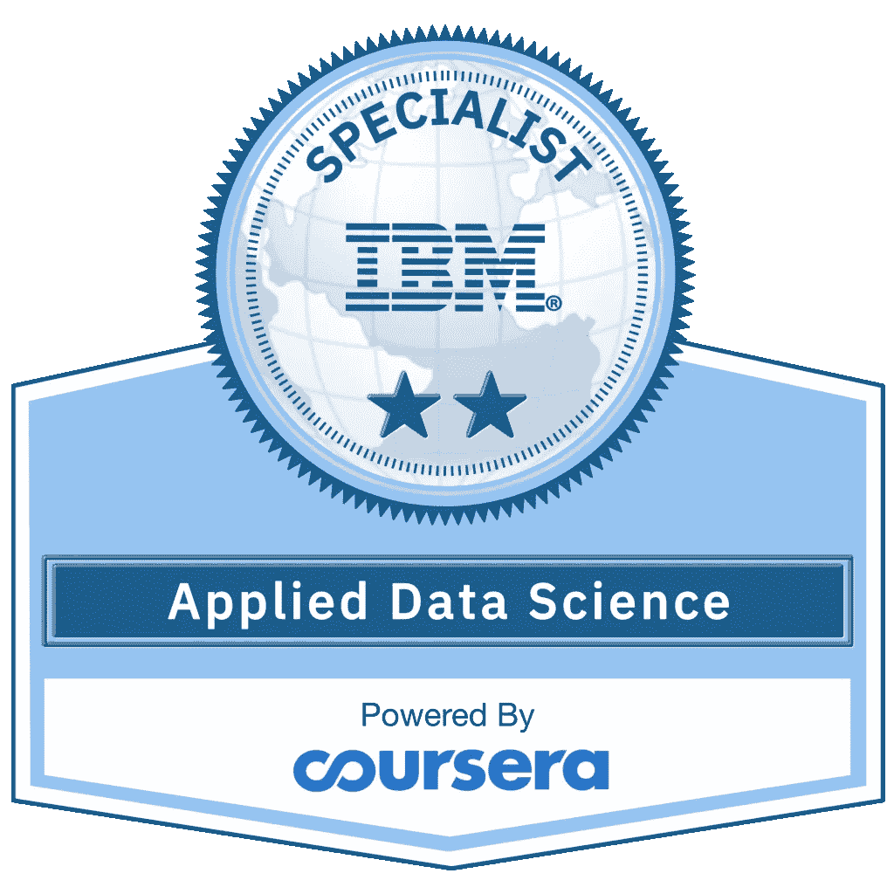](https://coursera.pxf.io/c/3294490/1164545/14726?u=https%3A%2F%2Fwww.coursera.org%2Fprofessional-certificates%2Fibm-data-science)

大家好，许多人将数据科学称为这 21 个国家中最性感的工作，因为公司需要洞察他们的数据以进行决策和高薪工作。

因此，许多人试图学习数据科学家职位所需的技能，几乎没有比参加 IBM 的数据科学家课程更好的地方了。

[**IBM 数据科学专业证书**](https://coursera.pxf.io/c/3294490/1164545/14726?u=https%3A%2F%2Fwww.coursera.org%2Fprofessional-certificates%2Fibm-data-science) 是最好的在线课程之一，它会给你最需要的入门技能，并且不需要任何技能就可以开始你在他领域的旅程，所以让我们更多地讨论这门课程以及你报名参加这项计划时将学到的东西。

<https://coursera.pxf.io/c/3294490/1164545/14726?u=https%3A%2F%2Fwww.coursera.org%2Fprofessional-certificates%2Fibm-data-science>  

# Coursera 上的 IBM 数据科学专业证书述评

在参加一门课程之前，我通常会看三样东西，谁在教，意思是讲师和作者，课程和课程中涵盖和不涵盖的内容，以及人们的评论。

我的意思是其他参加课程的人是怎么说的。保持那个传统，这里是我对 Coursera 和 IBM 的流行数据科学专业认证评审的评审。

## 1.教员回顾

该计划由在 IBM 公司工作的近 11 名讲师创建，他们都在数据科学领域拥有丰富的经验，如博士学位和高级数据科学家，因此您获得的所有信息都基于他们的经验。

[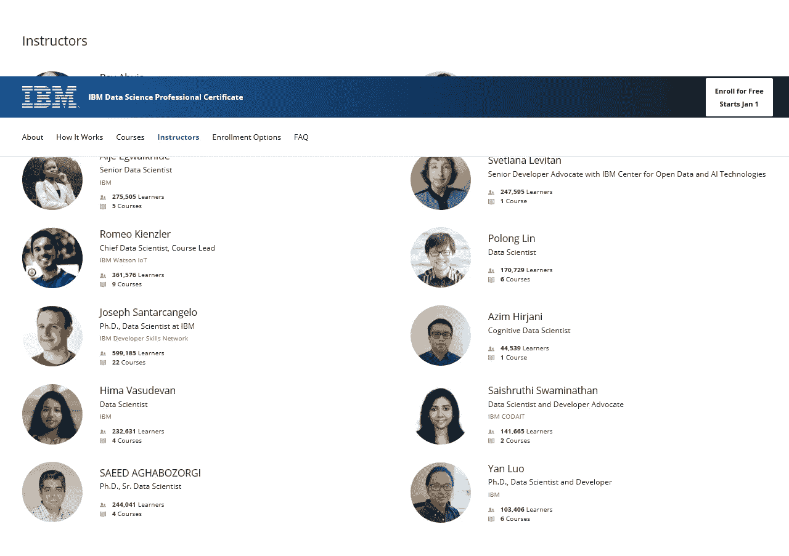](https://coursera.pxf.io/c/3294490/1164545/14726?u=https%3A%2F%2Fwww.coursera.org%2Fprofessional-certificates%2Fibm-data-science)

## 2.课程结构和内容

以下是 Coursera 的这一热门数据科学专业认证中包含的课程列表。

## 2.1.[什么是数据科学？](https://coursera.pxf.io/c/3294490/1164545/14726?u=https%3A%2F%2Fwww.coursera.org%2Flearn%2Fwhat-is-datascience)

您将从定义什么是数据科学家以及他在公司内做什么开始学习，比如数据科学家每天使用什么工具，以及任何想要在这个行业发展的人需要的技能，并为新人提供一些建议。

最后，您将了解公司开始使用数据科学时需要采取的途径或方法。谈到社会证明，已经有超过 519K 的学生加入了这门课程，学习什么是数据科学，以及如何在 2023 年成为一名数据科学家。

**以下是加入本课程的链接** — [什么是数据科学？](https://coursera.pxf.io/c/3294490/1164545/14726?u=https%3A%2F%2Fwww.coursera.org%2Flearn%2Fwhat-is-datascience)

[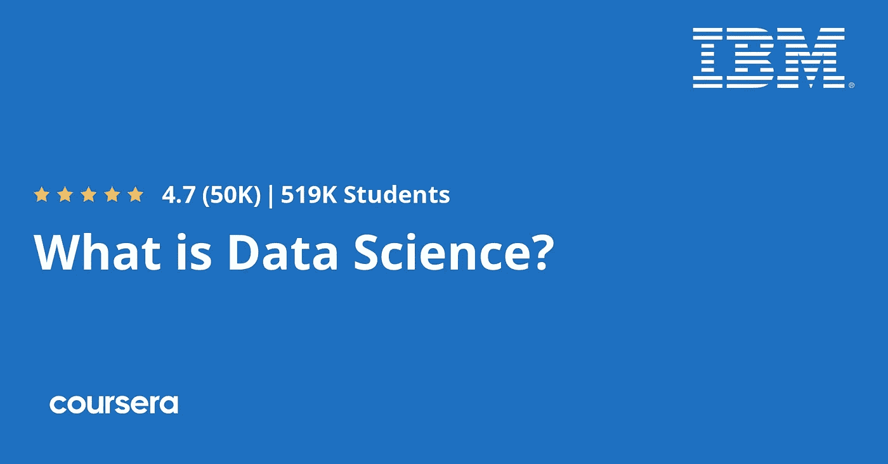](https://coursera.pxf.io/c/3294490/1164545/14726?u=https%3A%2F%2Fwww.coursera.org%2Flearn%2Fwhat-is-datascience)

## 2.2.[数据科学工具](https://coursera.pxf.io/c/3294490/1164545/14726?u=https%3A%2F%2Fwww.coursera.org%2Flearn%2Fopen-source-tools-for-data-science)

了解了公司数据科学职位的一些信息后，您将从本课程的第二部分开始学习数据科学家使用的编程语言，如 python 编程语言。

您还将看到使用的流行数据科学工具:GitHub、jupyter notebook 和 R studio。谈到社会证明，超过 243，000 名学生已经加入了这门课程，学习数据科学的基本工具。

**这是参加本课程** — [数据科学工具](https://coursera.pxf.io/c/3294490/1164545/14726?u=https%3A%2F%2Fwww.coursera.org%2Flearn%2Fopen-source-tools-for-data-science)的链接

[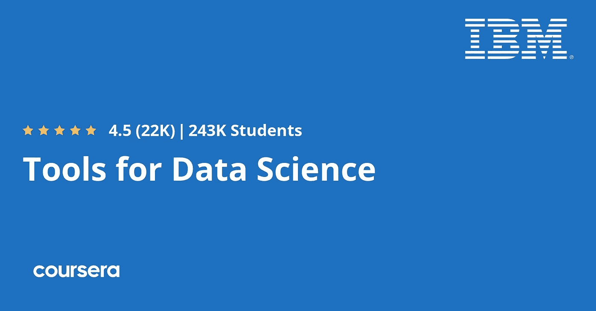](https://coursera.pxf.io/c/3294490/1164545/14726?u=https%3A%2F%2Fwww.coursera.org%2Flearn%2Fopen-source-tools-for-data-science)

## 2.3.[数据科学方法论](https://coursera.pxf.io/c/3294490/1164545/14726?u=https%3A%2F%2Fwww.coursera.org%2Flearn%2Fdata-science-methodology)

现在，您将了解为什么公司需要数据科学家以及数据科学家使用的不同方法，并了解数据科学方法的两个阶段，即业务理解和分析方法。

您还将看到我们理解数据和清理数据的含义以及数据建模的目的。谈到社会证明，超过 165，000 名学生在 Coursera 上加入了这个课程。

**这是参加本课程** — [数据科学方法论](https://coursera.pxf.io/c/3294490/1164545/14726?u=https%3A%2F%2Fwww.coursera.org%2Flearn%2Fdata-science-methodology)的链接

[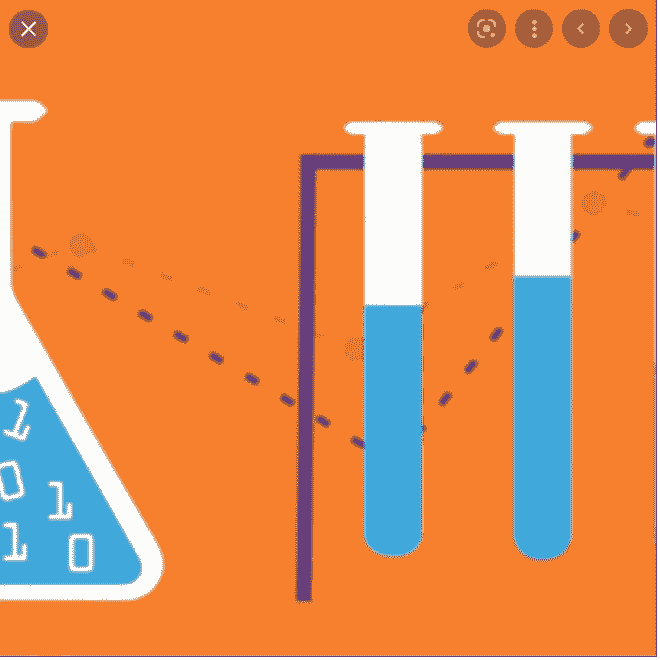](https://coursera.pxf.io/c/3294490/1164545/14726?u=https%3A%2F%2Fwww.coursera.org%2Flearn%2Fdata-science-methodology)

## 2.4. [Python 用于数据科学，AI &开发](https://www.coursera.org/learn/python-for-applied-data-science-ai?specialization=ibm-data-science)

现在你已经到了最有趣的部分，那就是学习 python 语言，从基础开始，比如不同的数据类型，到数据结构。

例如，您将学习如何在一个变量中存储数据集合，如列表、元组和字典，以及如何使用 python 处理数据，如读写文件和执行 web 抓取。

谈到社会证明，已经有超过 25 万名学生加入了这门课程来学习用于数据科学的 Python，这是关于这个主题的最受欢迎的课程之一。

**这里是加入本课程的链接**——[Python 用于数据科学，AI &开发](https://www.coursera.org/learn/python-for-applied-data-science-ai?specialization=ibm-data-science)

[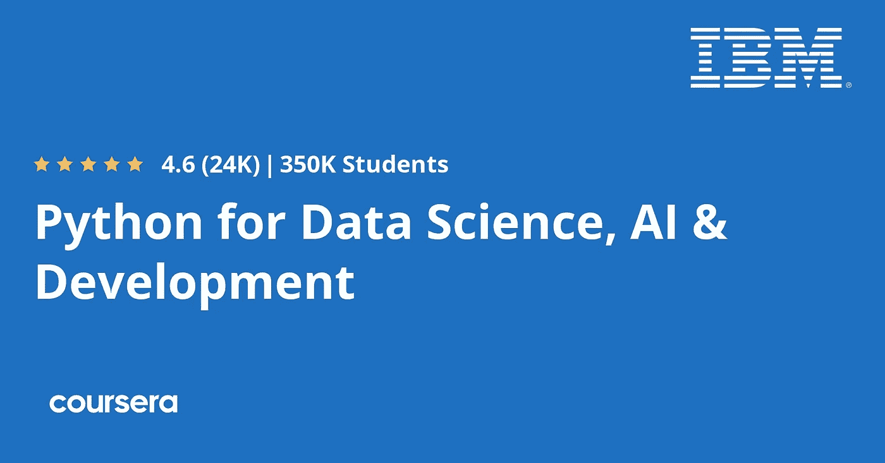](https://www.coursera.org/learn/python-for-applied-data-science-ai?specialization=ibm-data-science)

## 2.5.[数据科学 Python 项目](https://coursera.pxf.io/c/3294490/1164545/14726?u=https%3A%2F%2Fwww.coursera.org%2Flearn%2Fpython-project-for-data-science)

本课程要求您具备 python 语言的经验，并且您已经完成了前面的课程，因为您将开始探索和测试使用这种语言处理数据的技能。

超过 41，000 名学生已经在 Coursera 上加入了这个项目，如果你喜欢边做边学，你也可以加入。

**这里是加入这个项目** — [数据科学 Python 项目](https://coursera.pxf.io/c/3294490/1164545/14726?u=https%3A%2F%2Fwww.coursera.org%2Flearn%2Fpython-project-for-data-science)的链接

[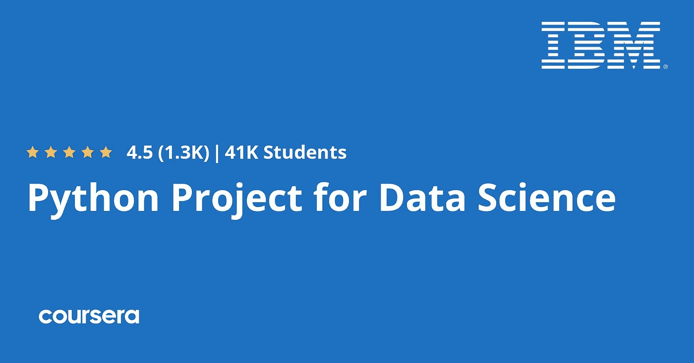](https://coursera.pxf.io/c/3294490/1164545/14726?u=https%3A%2F%2Fwww.coursera.org%2Flearn%2Fpython-project-for-data-science)

## 2.6.[使用 Python 开发用于数据科学的数据库和 SQL](https://coursera.pxf.io/c/3294490/1164545/14726?u=https%3A%2F%2Fwww.coursera.org%2Flearn%2Fsql-data-science)

您将理解如何使用 SQL 语言从数据库中提取数据。接下来，您将理解数据库中不同表之间的关系。

此外，您还将学习如何使用字符串模式和范围搜索数据，以及如何使用 python 访问数据库。

[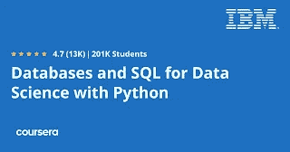](https://coursera.pxf.io/c/3294490/1164545/14726?u=https%3A%2F%2Fwww.coursera.org%2Flearn%2Fsql-data-science)

## 2.7.[使用 Python 进行数据分析](https://coursera.pxf.io/c/3294490/1164545/14726?u=https%3A%2F%2Fwww.coursera.org%2Flearn%2Fdata-analysis-with-python)

数据科学最重要的部分是分析数据，因此您将学习使用 python 来分析数据并探索许多不同的数据类型。您将学习诸如准备分析数据和执行简单统计的技能。

[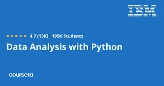](https://coursera.pxf.io/c/3294490/1164545/14726?u=https%3A%2F%2Fwww.coursera.org%2Flearn%2Fdata-analysis-with-python)

## 2.8.[用 Python 实现数据可视化](https://www.coursera.org/learn/python-for-data-visualization?specialization=ibm-data-science)

使用这个 python 包，您将从理解不同的可视化工具(如 matplotlib)开始，并创建饼图和散点图等图表。

接下来，您将学习高级数据可视化，了解 seaborn 库以及如何使用 follow 执行 word cloud 可视化和地理空间可视化。

[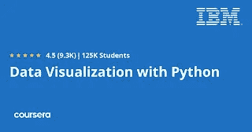](https://www.coursera.org/learn/python-for-data-visualization?specialization=ibm-data-science)

## 2.9.[用 Python 进行机器学习](https://coursera.pxf.io/c/3294490/1164545/14726?u=https%3A%2F%2Fwww.coursera.org%2Flearn%2Fmachine-learning-with-python)

你将了解不同类型的机器学习，以及它们在医疗保健和其他行业中的应用。接下来，您将开始使用不同的算法(如 SVM 和决策树)对数据应用机器学习算法，如回归和分类，并了解如何应用于聚类和构建推荐系统。

[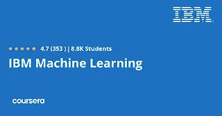](https://coursera.pxf.io/c/3294490/1164545/14726?u=https%3A%2F%2Fwww.coursera.org%2Flearn%2Fmachine-learning-with-python)

## 2.10.[应用数据科学顶点](https://coursera.pxf.io/c/3294490/1164545/14726?u=https%3A%2F%2Fwww.coursera.org%2Flearn%2Fapplied-data-science-capstone)

这是该计划中的最后一门课程，将测试您在数据科学方面的知识，并将您所学的知识应用到实际场景中，如制作 RESTful API 和使用 python pandas 库来操作数据并可视化后者，以及将机器学习应用到您的数据。

顺便说一句，本课程也是多个计划的一部分，完成本课程将计入您在以下任何计划中的学习:

1.  [*IBM 数据科学专业证书*](https://click.linksynergy.com/deeplink?id=JVFxdTr9V80&mid=40328&murl=https%3A%2F%2Fwww.coursera.org%2Fprofessional-certificates%2Fibm-data-science)
2.  [*应用数据科学专业*](https://click.linksynergy.com/deeplink?id=JVFxdTr9V80&mid=40328&murl=https%3A%2F%2Fwww.coursera.org%2Fspecializations%2Fapplied-data-science)

说到社会证明，已经有超过 87K 人加入了这个项目。

**以下是加入本项目** t — [应用数据科学顶点](https://coursera.pxf.io/c/3294490/1164545/14726?u=https%3A%2F%2Fwww.coursera.org%2Flearn%2Fapplied-data-science-capstone)的链接

[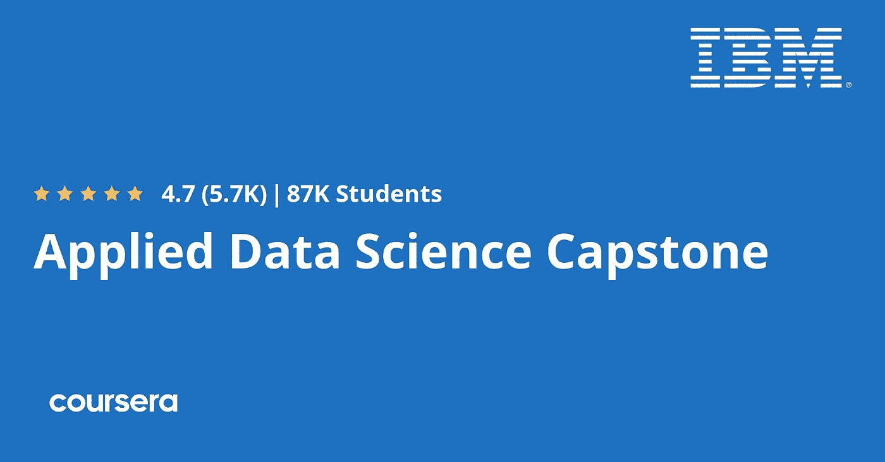](https://coursera.pxf.io/c/3294490/1164545/14726?u=https%3A%2F%2Fwww.coursera.org%2Flearn%2Fapplied-data-science-capstone)

## 结论

数据科学是一个紧张的领域，一些公司要求你拥有比简单的程序更多的技能，如深度学习和另一种编程语言。因此，你必须了解更多，并实践现实生活中的数据，以获得这个职位所需的知识。

顺便说一下，你可以单独加入这个专业证书，也可以参加 [**Coursera Plus**](https://coursera.pxf.io/c/3294490/1164545/14726?u=https%3A%2F%2Fwww.coursera.org%2Fcourseraplus) 会员资格，该会员资格允许参加 3000 多门 Coursera 课程，并可以无限制地参加热门的 Coursera 认证和专业。如果你想参加一个以上的课程或证书，那么你应该加入 Coursera Plus。

<https://coursera.pxf.io/c/3294490/1164545/14726?u=https%3A%2F%2Fwww.coursera.org%2Fcourseraplus>  

你可能喜欢的其他 **Coursera 资源文章**

*   [2023 年程序员十大课程课程](https://javarevisited.blogspot.com/2020/08/top-10-coursera-courses-specilizations-and-certifications.html)
*   [面向程序员和开发者的 Coursera 十大项目](https://javarevisited.blogspot.com/2020/08/top-10-coursera-projects-to-learn-essential-programming-skills.html)
*   [Udemy vs. Pluralsight？哪个学习平台比较好？](https://javarevisited.blogspot.com/2019/10/udemy-vs-pluralsight-review-which-is-better-to-learn-code.html)
*   [学习云计算的 10 门最佳 Coursera 课程](https://javarevisited.blogspot.com/2020/08/top-10-coursera-certifications-to-learn-cloud-computing-aws.html#axzz6WK1yC5WW)
*   [你可以在 Coursera 上在线申请的前 5 个计算机科学学位](https://javarevisited.blogspot.com/2020/04/is-it-possible-to-get-master-of-computer-science-degree-online-coursera.html)
*   [5 个最佳 Coursera 程序员职业证书](https://javarevisited.blogspot.com/2019/10/top-5-coursera-professional-certificates-for-programmers-IT-professionals.html)
*   [2023 年学习 Python 可以做的 8 个项目](/javarevisited/8-projects-you-can-buil-to-learn-python-in-2020-251dd5350d56)
*   [Coursera Plus Review——在 Coursera 上学习的更好方式](https://javarevisited.blogspot.com/2020/08/coursera-plus-better-way-to-take-coursera-courses-specilizations-certification.html)
*   [学习数据科学的十大 Coursera 课程](https://javarevisited.blogspot.com/2020/08/top-10-coursera-certifications-to-learn-Data-Science-Visualization-and-Data-Analysis.html)
*   向顶级科技公司学习的 18 门最佳 Coursera 课程
*   [2023 年学习人工智能的 7 门最佳课程](/javarevisited/7-best-courses-to-learn-artificial-intelligence-in-2020-26d59d62f6fe)
*   [你可以在 Coursera Online 上获得 5 个数据科学学位](https://www.java67.com/2020/06/top-5-data-science-degree-you-can-earn-online-coursera-edx.html)
*   [开始职业生涯的十大 Coursera 认证](/javarevisited/top-10-coursera-certificates-to-start-your-career-in-cloud-data-science-ai-mainframe-and-it-558690c83587)
*   [Udemy vs Coursera？学理工和编程哪个好](https://javarevisited.blogspot.com/2020/01/coursera-vs-udemy-which-is-better-for-programming-tech.html)
*   [Coursera 证书对工作和事业有帮助吗](https://javarevisited.blogspot.com/2020/02/does-udemy-coursera-edx-educative-or.html)？
*   [学习 Web 开发的十大课程](https://javarevisited.blogspot.com/2020/08/top-10-coursera-certifications-to-learn-web-development.html)
*   [Udemy vs . CodeCademy vs . one month？](https://javarevisited.blogspot.com/2019/09/codecademy-vs-udemy-vs-onemonth-which-is-better-for-learning-code.html#axzz6VYKcmyZz)
*   Udemy vs. Educative vs. Codecademy？新手用哪个比较好
*   [学习 Python 的 10 个 Coursera 专业化和认证](https://javarevisited.blogspot.com/2020/02/10-best-coursera-courses--for-python.html)
*   [Coursera 的 10 项数据科学和机器学习认证](/javarevisited/top-10-machine-learning-and-data-science-certifications-and-training-courses-for-beginners-and-a6308497b764)

感谢阅读这篇文章。如果你喜欢 Coursera 和 IBM 的数据科学专业认证的这个*评论，*那么请分享给你的朋友和同事。如果您有任何问题或反馈，请留言。

**P. S.** —如果你正在寻找学习网络安全和信息安全的最佳 Udemy 在线课程，你也可以在 Udemy **上查看 [**数据科学课程 2023:完整的数据科学训练营课程**](https://click.linksynergy.com/deeplink?id=JVFxdTr9V80&mid=39197&murl=https%3A%2F%2Fwww.udemy.com%2Fcourse%2Fthe-data-science-course-complete-data-science-bootcamp%2F) 。**也是学习数据科学最受欢迎、评分最高的 Udemy 课程之一。

</javarevisited/my-favorite-data-science-and-machine-learning-courses-from-coursera-udemy-and-pluralsight-eafc73acc73f> 