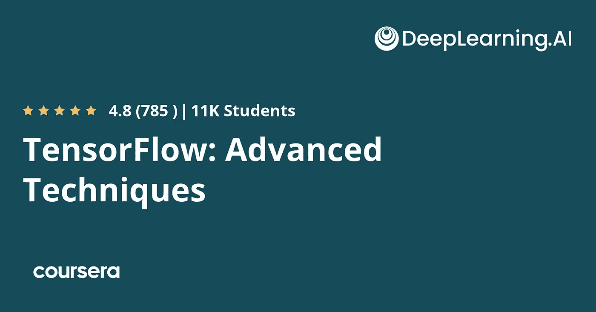
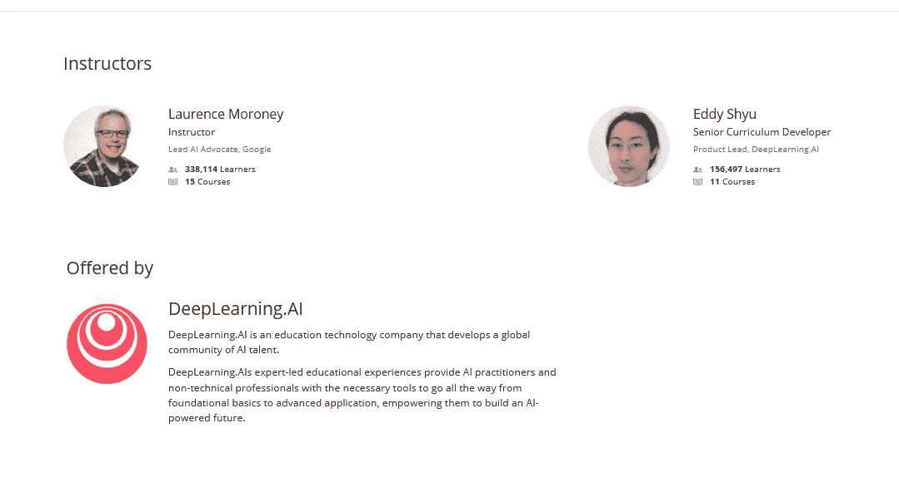
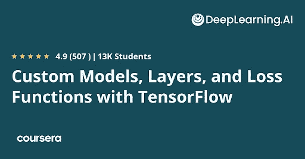
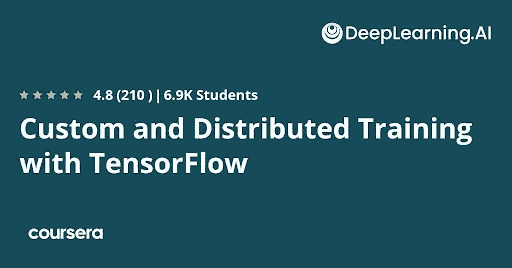
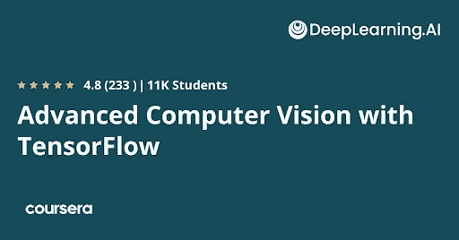
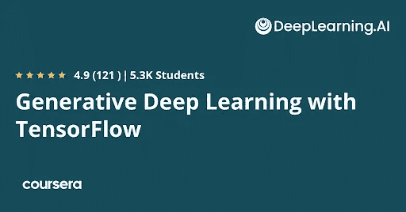

# Coursera 的 TensorFlow:高级技术专精值得吗？回顾

> 原文：<https://medium.com/javarevisited/is-courseras-tensorflow-advanced-techniques-specialization-worth-it-review-de51ba2ee385?source=collection_archive---------0----------------------->

## 如果你想掌握 TensorFlow，这是谷歌最受欢迎的机器学习和深度学习库之一，那么这个 Coursera 专业化绝对值得。

大家好，如果你正在寻找 2022 年学习 TensorFlow 的最佳资源，或者只是想加入 Coursera 的 [*TensorFlow:高级技术专精*](https://coursera.pxf.io/c/3294490/1164545/14726?u=https%3A%2F%2Fwww.coursera.org%2Fspecializations%2Ftensorflow-advanced-techniques) ，但不确定这是否适合你，那么你来对地方了。

早些时候，我已经分享了[最佳 TensorFlow 课程](https://javarevisited.blogspot.com/2018/08/top-5-tensorflow-and-machine-learning-courses-online-programmers.html)和[最佳机器学习课程](/javarevisited/top-10-machine-learning-and-data-science-certifications-and-training-courses-for-beginners-and-a6308497b764)，今天，我将回顾一下 Coursera 的这一热门 Tensorflow 认证。

看完这篇文章你会发现 Coursera 的 [*TensorFlow:高级技术专精*](https://coursera.pxf.io/c/3294490/1164545/14726?u=https%3A%2F%2Fwww.coursera.org%2Fspecializations%2Ftensorflow-advanced-techniques) 到底值不值？

如果你不是生活在岩石下，那么你可能知道机器学习和人工智能已经慢慢占领了整个世界。人工智能产业的市场规模预计将在 2026 年达到 2990 亿美元以上。

公司正试图将这项技术纳入他们的系统，如亚马逊的推荐系统，该系统将推荐与您的历史购买相关的产品，这将产生更多收入，或者自动驾驶汽车将为您驾驶，这样的例子不胜枚举。

对人工智能工程师的需求正在快速增长。它供不应求，这意味着拥有这些技能将保证你有一份好工作，根据 glassdor.com 的调查，平均年薪约为 118000 美元，甚至可能创建你自己的在线业务，利用这项科学解决人们的问题，如探测枪支和火灾的人工智能相机。

人们认为他们需要在大学里呆上几年才有这方面的经验。尽管如此，实际上，它只需要你理解 [Python 编程语言](/javarevisited/8-advanced-python-programming-courses-for-intermediate-programmer-cc3bd47a4d19)和一些人工智能的在线课程。

如果你很急，准备开始这个职业生涯，我推荐你报名参加这个 [**TensorFlow:高级技术专精**](https://coursera.pxf.io/c/3294490/1164545/14726?u=https%3A%2F%2Fwww.coursera.org%2Fspecializations%2Ftensorflow-advanced-techniques) 项目。对于想掌握谷歌这个热门机器学习库的人来说，完全值得。

 [## 张量流:高级技术

### 扩展您的技能集并掌握 TensorFlow。通过四门实践课程定制您的机器学习模型…

coursera.pxf.io](https://coursera.pxf.io/c/3294490/1164545/14726?u=https%3A%2F%2Fwww.coursera.org%2Fspecializations%2Ftensorflow-advanced-techniques) 

# 回顾 Coursera 的 TensorFlow:高级技术专业化值得吗？

为了发现这个项目是否值得，我们将考察两个因素，谁在教学，我是说教师简介，以确认他们是知识渊博的专家，在教学方面也很棒，以及课程内容及其结构。如果想深入学习 TensorFlow 这样复杂的库，课程的结构是非常重要的。

## 1.教员回顾

这个课程是由 ai 领域的领军公司之一的 *deeplearning.ai* 公司打造的，他们的导师对这个行业有着深厚的了解。

这个专业有两个导师，一个叫 Laurence Moroney，写了几十本编程书籍和 AI。第二个是 [Eddy Shyu](https://click.linksynergy.com/deeplink?id=JVFxdTr9V80&mid=40328&murl=https%3A%2F%2Fwww.coursera.org%2Finstructor%2Feddy-shyu) ，他是 [Udacity](https://imp.i115008.net/c/1193463/786224/11298?u=https%3A%2F%2Fwww.udacity.com%2F) 的联合导师之一。

如果你看看他们的简介，你就会知道他们都是经验丰富的教师，教过 50 多万学生。劳伦斯也是 [**DeepLearning 的导师。Coursera**](https://coursera.pxf.io/c/3294490/1164545/14726?u=https%3A%2F%2Fwww.coursera.org%2Fprofessional-certificates%2Ftensorflow-in-practice) 上的人工智能 TensorFlow 开发者专业证书和谷歌的首席人工智能倡导者，所以你将向世界上最好的谷歌专家之一学习。

# 2.课程内容、覆盖面和结构

现在，我们来看看这个 Coursera 计划的内容结构和内容质量。在这一部分中，您将了解 Coursera 中的最佳 TensorFlow 专业包括哪些内容以及哪些在线课程。

## 2.1.[用 TensorFlow 定制模型、层和损失函数](https://coursera.pxf.io/c/3294490/1164545/14726?u=https%3A%2F%2Fwww.coursera.org%2Flearn%2Fcustom-models-layers-loss-functions-with-tensorflow)

首先，这个专业化要求你有一些 python 语言的知识，也有一些 TensorFlow 和深度学习的经验。

您将直接从比较函数式 API 和顺序式 API 开始，了解前者如何让您在设计模型和学习构建客户 loos 函数时具有更大的灵活性，该函数可衡量您的模型有多好，并帮助神经网络从数据中学习。

稍后，您将开始制作自定义图层，并编写自己的自定义密集图层和自定义模型。最后，扩展 TensorFlow 模型类来构建 ResNet 模型。

**这里是加入本课程的链接**——[用 TensorFlow](https://coursera.pxf.io/c/3294490/1164545/14726?u=https%3A%2F%2Fwww.coursera.org%2Flearn%2Fcustom-models-layers-loss-functions-with-tensorflow) 定制模型、图层和损失函数

## 2.2.[使用 TensorFlow 进行定制和分布式培训](https://coursera.pxf.io/c/3294490/1164545/14726?u=https%3A%2F%2Fwww.coursera.org%2Flearn%2Fcustom-distributed-training-with-tensorflow)

本课程从理解 Tensorflow 中构建模块的基础开始，学习张量的工作原理以及这些张量背后的 mat 操作。

接下来，您将在 [TensorFlow](https://becominghuman.ai/top-10-courses-to-learn-tensorflow-for-machine-learning-in-2020-39a31e7cd84b) 中构建自己的定制训练循环，为您的模型提供更多灵活性。

此外，您将了解图形模式、生成在图形模型上运行的代码的好处，以及如何使用 TensorFlow 工具提高效率，这样您就不必自己编写代码了。

最后，你会了解分布式训练，并使用它更快地处理更多的数据和大型模型，并使用各种分布式训练。

**以下是参加本课程的链接—** [使用 TensorFlow 进行定制和分布式培训](https://coursera.pxf.io/c/3294490/1164545/14726?u=https%3A%2F%2Fwww.coursera.org%2Flearn%2Fcustom-distributed-training-with-tensorflow)

## 2.3.[采用 TensorFlow 的高级计算机视觉](https://coursera.pxf.io/c/3294490/1164545/14726?u=https%3A%2F%2Fwww.coursera.org%2Flearn%2Fadvanced-computer-vision-with-tensorflow)

本节是关于在计算机视觉行业中使用 Tensorflow 的所有内容。你首先开始了解分类和对象检测，它们是如何工作的，以及什么是迁移学习。接下来，您将对流行的对象检测模型(如 ResNet-50)进行概述。

您将使用预先训练的模型来训练数据，构建自己的对象检测模型，并使用迁移学习来检测图像中的局部橡皮鸭。

稍后，您将了解标记图像像素的图像分割，并执行比其他对象检测技术更详细的对象识别。

最后，您将了解模型的可解释性，这让您了解您的模型如何做出决策。

**这里是加入本课程的链接—** [带 TensorFlow 的高级计算机视觉](https://coursera.pxf.io/c/3294490/1164545/14726?u=https%3A%2F%2Fwww.coursera.org%2Flearn%2Fadvanced-computer-vision-with-tensorflow)

## 2.4.[采用 TensorFlow 的生成式深度学习](https://coursera.pxf.io/c/3294490/1164545/14726?u=https%3A%2F%2Fwww.coursera.org%2Flearn%2Fgenerative-deep-learning-with-tensorflow)

你将了解什么是风格转移，并使用它来提取图像的内容和图像中的其他类型的特征。

接下来，您将了解自动编码器并使用 TensorFlow 构建它们，了解 DNN 和 CNN 自动编码器模型的结果差异，并构建一个 CNN 自动编码器来从有噪声的图像中输出清晰的图像。

稍后，您将看到各种自动编码器来生成全新的数据，并且您将使用自动编码器来生成动画人脸。

最后，了解 Gans 和谁发明了它们，并构建自己的 Gans 来生成人脸。

**以下是加入本课程的链接—** [使用 TensorFlow 的生成式深度学习](https://coursera.pxf.io/c/3294490/1164545/14726?u=https%3A%2F%2Fwww.coursera.org%2Flearn%2Fgenerative-deep-learning-with-tensorflow)

## 结论

总之 s *Coursera 的 TensorFlow:高级技术专精*完全值得。你不仅有机会向谷歌领先的人工智能专家学习，还可以深入了解最受欢迎的深度学习库之一。

这个*关于 Tensorflow* 的高级在线课程一定会提升你在这个框架和深度学习领域的技能。您可以注册以构建更复杂的模型，并通过创建自定义模型和函数来优化它们。

顺便说一句，如果你计划参加多个 Coursera 课程或专业，那么考虑参加 [**Coursera Plus 订阅**](https://coursera.pxf.io/c/3294490/1164545/14726?u=https%3A%2F%2Fwww.coursera.org%2Fcourseraplus) ，它为你提供无限制的访问他们最受欢迎的课程、专业、专业证书和指导项目的机会。它每年花费大约 399 美元，但它完全值得你的钱，因为你可以获得无限的证书。

 [## Coursera Plus |无限制访问 7，000 多门在线课程

### 用 Coursera Plus 投资你的职业目标。无限制访问 90%以上的课程、项目…

coursera.pxf.io](https://coursera.pxf.io/c/3294490/1164545/14726?u=https%3A%2F%2Fwww.coursera.org%2Fcourseraplus) 

你可能喜欢的其他 **Coursera 编程和开发文章**

*   [Coursera 证书对工作和事业有帮助吗](https://javarevisited.blogspot.com/2020/02/does-udemy-coursera-edx-educative-or.html)？
*   [开始职业生涯的十大 Coursera 认证](/javarevisited/top-10-coursera-certificates-to-start-your-career-in-cloud-data-science-ai-mainframe-and-it-558690c83587)
*   [2022 年程序员十大课程](https://javarevisited.blogspot.com/2020/08/top-10-coursera-courses-specilizations-and-certifications.html)
*   [面向程序员和开发人员的 Coursera 十大项目](https://javarevisited.blogspot.com/2020/08/top-10-coursera-projects-to-learn-essential-programming-skills.html)
*   [Udemy vs. Pluralsight？哪个学习平台比较好？](https://javarevisited.blogspot.com/2019/10/udemy-vs-pluralsight-review-which-is-better-to-learn-code.html)
*   [学习云计算的 10 门最佳 Coursera 课程](https://javarevisited.blogspot.com/2020/08/top-10-coursera-certifications-to-learn-cloud-computing-aws.html#axzz6WK1yC5WW)
*   向顶尖科技公司学习的 18 门 Coursera 课程
*   [学习 Web 开发的十大课程](https://javarevisited.blogspot.com/2020/08/top-10-coursera-certifications-to-learn-web-development.html)
*   [学习数据科学的十大 Coursera 课程](https://javarevisited.blogspot.com/2020/08/top-10-coursera-certifications-to-learn-Data-Science-Visualization-and-Data-Analysis.html)
*   [你可以在 Coursera 上在线申请排名前五的计算机科学学位](https://javarevisited.blogspot.com/2020/04/is-it-possible-to-get-master-of-computer-science-degree-online-coursera.html)
*   [5 个最佳 Coursera 程序员职业证书](https://javarevisited.blogspot.com/2019/10/top-5-coursera-professional-certificates-for-programmers-IT-professionals.html)
*   [2022 年学习 Python 可以做的 8 个项目](/javarevisited/8-projects-you-can-buil-to-learn-python-in-2020-251dd5350d56)
*   [学习 Python 的 10 个 Coursera 专业和认证](https://javarevisited.blogspot.com/2020/02/10-best-coursera-courses--for-python.html)
*   [Coursera 的 10 项数据科学和机器学习认证](/javarevisited/top-10-machine-learning-and-data-science-certifications-and-training-courses-for-beginners-and-a6308497b764)
*   [2022 年学习人工智能的 7 门最佳课程](/javarevisited/7-best-courses-to-learn-artificial-intelligence-in-2020-26d59d62f6fe)
*   [Coursera Plus Review——在 Coursera 上学习的更好方式](https://javarevisited.blogspot.com/2020/08/coursera-plus-better-way-to-take-coursera-courses-specilizations-certification.html)

感谢阅读这篇文章。如果你喜欢 Coursera 的 TensorFlow:高级技术专业化的这篇*评论，*那么请与你的朋友和同事分享。如果您有任何问题或反馈，请留言。

**p . s .**——如果你正在寻找学习 TensorFlow 的最佳 Udemy 在线课程，那么你也可以在 Udemy **上查看 [**TensorFlow 开发者证书:零到精通课程**](https://click.linksynergy.com/deeplink?id=JVFxdTr9V80&mid=39197&murl=https%3A%2F%2Fwww.udemy.com%2Fcourse%2Ftensorflow-developer-certificate-machine-learning-zero-to-mastery%2F) **e** 。**它是 Udemy 上最好的 TensorFlow 认证课程之一，受到超过 14K 学习者的信赖，而如果你想成为认证 TensorFlow 开发者，那么 2022 年这个 Coursera Professional 认证也值得一看。

 [## 张量流:高级技术

### 扩展您的技能集并掌握 TensorFlow。通过四门实践课程定制您的机器学习模型…

coursera.pxf.io](https://coursera.pxf.io/c/3294490/1164545/14726?u=https%3A%2F%2Fwww.coursera.org%2Fspecializations%2Ftensorflow-advanced-techniques)