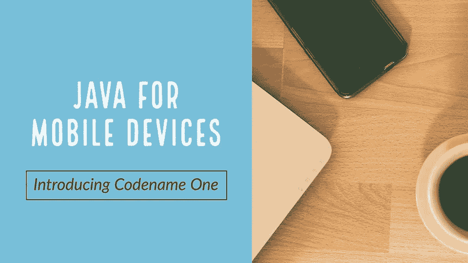

# 面向移动设备的 Java 免费在线课程

> 原文：<https://medium.com/javarevisited/java-for-mobile-devices-free-online-course-33f16b2109f3?source=collection_archive---------4----------------------->

以下是我在 teachable 上创建和主持的在线课程的全文和视频。不久前, [Teachable](/javarevisited/teachable-thinkific-or-udemy-which-is-the-best-platform-for-first-time-course-creators-in-2021-9da6133d73b) 放弃了提供免费的主机选项，所以这个(以及其他材料)将在这里免费提供。

整个课程包括大约 25 个小时的视频、幻灯片和文字记录。代号一中的“最新和最棒的”有点过时了，例如，它早于 Maven 支持，并且在我们决定专注于 [CSS](/javarevisited/top-10-free-courses-to-learn-html-5-css-3-and-web-development-872d62d97a97) 之前。然而，大多数概念仍然适用，并且可能开箱即用。

第一个课程涵盖了移动开发的所有基础知识，如何构建一个应用程序等。接下来的两篇文章将涵盖更高级的内容，最终将会是脸书、优步、Whatsapp 等流行应用的全面克隆应用开发。这些克隆还简要地涵盖了服务器组件，因此它们包括了涵盖和其他全栈概念的部分。

评论是开放的，所以请随意提问，我会尽可能地帮助你。

# 介绍

# 创建 Hello World 应用程序

注意:这是旧方法。我建议在这里看看更新的方法[。](https://www.youtube.com/watch?v=rl6z7DD2-vg)

# 移动开发的核心概念

# 代号一是什么

# 剖析一个代号为 One 的应用程序

# 国际化和本地化

# 布局基础

# 主题基础

注意:对于新的应用程序，我建议关注 [CSS](/javarevisited/10-best-css-online-courses-for-beginners-and-experienced-developers-54aa2e8c0253)

# 调整用户界面设计

本节的演示源代码和资源文件存放在 github 项目的[中。](https://github.com/shai-almog/ShoppingList)

# 存储文件系统和 SQL

# 线程和 EDT

# 了解属性

# 推送通知

# 本机界面—访问本机设备功能