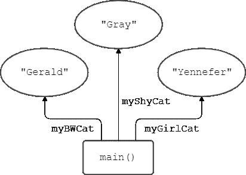
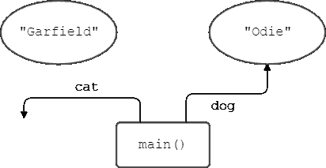
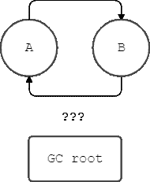

# Java GC，基本的我想大家应该已经知道了

> 原文：<https://medium.com/javarevisited/java-gc-the-basic-i-think-we-should-already-know-98f20a98eb5c?source=collection_archive---------1----------------------->


照片由[陈嘉里](https://unsplash.com/@gary_at_unsplash?utm_source=medium&utm_medium=referral)在 [Unsplash](https://unsplash.com?utm_source=medium&utm_medium=referral) 上拍摄

最近，当我被问及 Java 垃圾收集器时，我认为我应该知道的一切都从我的脑海中消失了。我是说，这很不幸，但没关系；现在，我有机会在练习英语的同时打磨和重塑我的知识(如果你正在用葡萄牙语阅读这篇文章，请忽略)，现在，有一个地方可以让这个主题在我的脑海中保持新鲜，希望在其他人的脑海中也是如此。因此，让我们来看看这个伟大的内存管理工具的一些基本情况，以及它如何改变您作为 Java 开发人员的日常编码。

# 垃圾收集器是什么？

我亲切地称它为 JGC(在你的脑海中读出“Jay Gee See”)，或者简称为 GC，正如它的名字所说:“听起来像是某种收集垃圾的东西”。太好了！GC 在 Java 中找到不用的对象并删除它们来释放一些内存，这样你就不用担心内存不够用了。这是一个执行堆内存管理的自动过程，堆是 JVM (Java 虚拟机)用来创建对象的专用内存部分。而这种“管理”是如何做到的？通过清理不用的物品。

[](https://javarevisited.blogspot.com/2019/04/top-5-courses-to-learn-jvm-internals.html) [## 学习 JVM 内部结构、内存管理和 Java 性能调优的前 5 门课程

### 对于一个高级 Java 开发人员来说，了解 JVM 的工作原理以及如何解决与…相关的问题是非常重要的

javarevisited.blogspot.com](https://javarevisited.blogspot.com/2019/04/top-5-courses-to-learn-jvm-internals.html) 

# JGC 是如何工作的？

我们的朋友 GC 真的很聪明:正如我所说的，它是一个自动的过程，不像其他编程语言，比如 C，你不必担心标记要删除的对象:GC 实现知道如何找到未使用的对象，我指的是现在被另一个活动对象引用的对象。

## 但是怎么做呢？

当我们说要“斩草除根”时，GC 却反其道而行之:它不再寻找无用的东西，而是开始逐根寻找好的东西——在这种情况下，我们称之为*活着的对象*。

和我一起走向绿色，想象一棵树:b̶e̶ ̶a̶ ̶y̶o̶u̶永远是主要的方法，就像这样:

```
public static void main(String[] args){
// oh, how I love this method <3
Cat myBWCat = new Cat("Gerald");
Cat myShyCat = new Cat("Gray");
Cat myGirlCat = new Cat("Yennefer");
doingSomeStuff();
}
```

这是我们最早的树根之一！当您第一次启动您的应用程序时，必须有一些东西让您的对象保留下来，并且不会被 GC 删除，为什么不保留您面前的第一个东西呢？

例如，从这个根开始，GC 开始标记*实际上正在使用的对象*，使我们的树变得更强壮，充满分枝、树枝、树叶和果实。并且像这样，引用的对象被标记为*活的*。

[](https://javarevisited.blogspot.com/2012/10/10-garbage-collection-interview-question-answer.html)

这棵小小的猫树上的三个果实，根在 main()上。请注意，我们仍然有对它们的引用。

而地上的枯叶烂果呢？有时(我们会看到这也是可配置的，但不是确定性的)，GC 会检查堆中的所有对象，看看什么是杂乱的，并为我们清理它。假设我创建了一个对象，但之后我丢失了对它的引用，比如:

```
public static void main(String[] args){
// Now, other objects here
Pet cat = new Cat("Garfield");
Pet dog = new Dog("Odie");
cat = null;
}
```

加菲猫去哪了？在这个例子中，Cat 类的对象“Garfield”将从内存中清除，因为在我们的应用程序中没有对它的引用。

[](https://www.java67.com/2020/02/50-garbage-collection-interview-questions-answers-java.html)

加菲猫会被收集起来，因为它到处漂浮。

有时，我们会发生一些有趣的事情:假设一个对象 A 引用一个对象 B，而 B 引用 A，这听起来像是 GC 会忽略的事情，因为这里没有松散引用。但是我没有告诉你的是*只有一些东西可以是根*，因此，A→B→A 对象关系不会被认为是 GC 的活对象树，除非 A 或 B 是一个*有效的*根。



将收集 a 和 B。这也被称为“孤岛”。你也可以把一个单独的物体看作一个岛。

## 一切善的根源是什么？

GC 根有很多种，我可以花一整天的时间来提及和解释每一种。它们也是垃圾收集器实现的一个特殊细节。因此，从理论上讲，我可以实现一个垃圾收集，它总是将任何猫对象标记为活动的，并有一个装满猫的堆，这将是非常棒的。

让我们来谈谈最广为人知的 JVM 实现，由 Oracle 公司维护和发布的 Java 虚拟机 *HotSpot* 。我提到过垃圾收集属于 JVM 吗？没有吗？嗯，现在我做到了:)

记下这一点，“通常被算作 GC 算法的根的例子”:

*   main 方法中的局部变量；
*   主线程；
*   主类的静态变量；
*   用于同步的监视器；
*   由 Java 系统类加载器加载的类

任何与它们相关的(或被它们引用的)东西都不会受到 GC 的攻击并被标记。

[](https://www.java67.com/2019/08/best-books-to-learn-java-virtual-machine-in-depth.html) [## 深入学习 Java 虚拟机、垃圾收集和性能的前 5 本书

### 在过去的几年里，我看到了一种趋势，许多 Java 开发人员想要学习更多关于 JVM 的知识…

www.java67.com](https://www.java67.com/2019/08/best-books-to-learn-java-virtual-machine-in-depth.html) 

## 好了，现在怎么办？

好了，现在我们有了自己的根，我们必须做一些清洁工作。其实不是现在，我们要把之前的一切都整理好！你知道什么时候你需要整理你的盘子、杯子和餐具，这样你就有空间去清理它们了？这就是 GC 正在做的事情。

[](https://javarevisited.blogspot.com/2015/10/133-java-interview-questions-answers-from-last-5-years.html#axzz5ntvpdIs3)

照片由[布鲁克·拉克](https://unsplash.com/@brookelark?utm_source=medium&utm_medium=referral)在 [Unsplash](https://unsplash.com?utm_source=medium&utm_medium=referral) 上拍摄

GC 标记所有对象，从根开始遍历相互引用的对象树。在 HotSpot 实现中，实际上还有其他实现，使用了一个很好的对象管理策略:按年龄对对象进行分类，称为分代垃圾收集策略。

这很巧妙:大多数应用程序会创建很多很多小而短暂的对象，但是它们也会有一些对象在应用程序的整个生命周期中一直存在。没有什么比更频繁地检查自服务器启动以来就存在的 bean 更好的了。

现在，GC 将内存中的一些部分分开:

*   最新的对象从年轻一代开始。这一部分被细分为伊甸园空间和两个幸存者空间，伊甸园空间是他们开始生活的地方，幸存者空间是在一次收集活动中幸存下来的新物品举行聚会庆祝他们的第一个“生日”的地方
*   幸存者在庆祝了一些生日后，会搬到老一代区(也叫终身职位，我觉得这个名字更可爱、更甜蜜)
*   在 Java 8 之前，有永久生成部分，保存来自类和内部化字符串的数据。在 Java 8 中，这被换成了元空间，元空间现在保存类定义，而其他东西回到了传统的内存堆。

[](https://javarevisited.blogspot.com/2018/07/top-5-java-performance-tuning-books-for.html) [## 面向有经验程序员的 5 大 Java 性能调优书籍——最好的，必读

### 您可能会想，为什么 Java 开发人员要读一本关于性能调优的书呢？当我第一次面对这个问题的时候…

javarevisited.blogspot.com](https://javarevisited.blogspot.com/2018/07/top-5-java-performance-tuning-books-for.html) 

## 现在，我们打扫？

是的，现在我们打扫！有 3 种垃圾收集事件:次要、主要和完整事件:

*   在未成年人，对象是从年轻一代部分收集；
*   在 major 中，较旧的对象是从 Tenured Generation 部分收集的；
*   在完整事件中，所有部分都收集了它们未使用的对象。

友情提醒:收集的对象是从有效根开始*不是*标记为活的，好吗？

# 后续步骤

哦，我的天，有这么多我没有提到的！我们可以在这里写下一大堆稀奇古怪的东西，但是文字太长了。我将在这里列出一些我发现的关于 GC 的非常特别的主题，稍后我会写出来，但是如果你太好奇而等不及的话，你可以自己搜索一下。

—性能

*   实际上，世代假设可能不适用于您的应用程序；
*   从 HotSpot 中选择 4 个 GC 实现之一；
*   当 GC 被触发时(停止世界事件)

—内存使用

*   巨大的物体(我喜欢这个词)；
*   当 GC 被触发时(某些区域已满)；
*   记忆是如何细分的；
*   这些细分是如何工作的

—其他东西

*   finalize()方法！我的天啊。

再次感谢你的耐心，希望你喜欢它，并期待下一个！

[](https://javarevisited.blogspot.com/2019/04/top-5-courses-to-learn-jvm-internals.html) [## 学习 JVM 内部结构、内存管理和 Java 性能调优的前 5 门课程

### 对于一个高级 Java 开发人员来说，了解 JVM 的工作原理以及如何解决与…相关的问题是非常重要的

javarevisited.blogspot.com](https://javarevisited.blogspot.com/2019/04/top-5-courses-to-learn-jvm-internals.html) 

# 参考

[https://stackify.com/what-is-java-garbage-collection/](https://stackify.com/what-is-java-garbage-collection/)
[https://www . Java 67 . com/2019/08/best-books-to-learn-Java-virtual-machine-in-depth . html](https://www.java67.com/2019/08/best-books-to-learn-java-virtual-machine-in-depth.html)
[https://www . javaworld . com/article/2078645/JVM-performance-optimization-part-3-garbage-collection . html](https://www.javaworld.com/article/2078645/jvm-performance-optimization-part-3-garbage-collection.html)
[https://Java reviewed . blogspot . com/2011/2011](https://javarevisited.blogspot.com/2011/04/garbage-collection-in-java.html#axzz4zt6jlTWS)

[](https://javarevisited.blogspot.com/2019/10/the-java-developer-roadmap.html#123) [## 2020 年 Java 开发者路线图

### 大家好，首先祝大家 2020 新年快乐。我已经分享了很多成为网络的路线图…

javarevisited.blogspot.com](https://javarevisited.blogspot.com/2019/10/the-java-developer-roadmap.html#123)