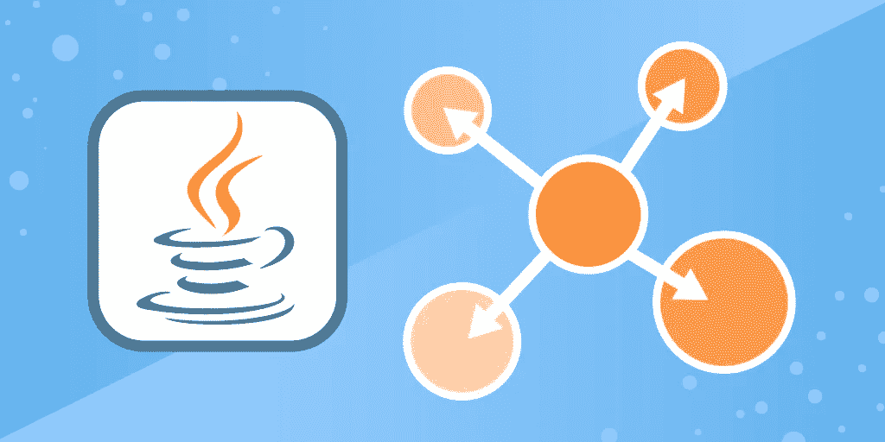
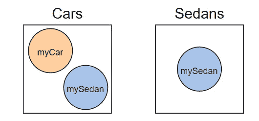
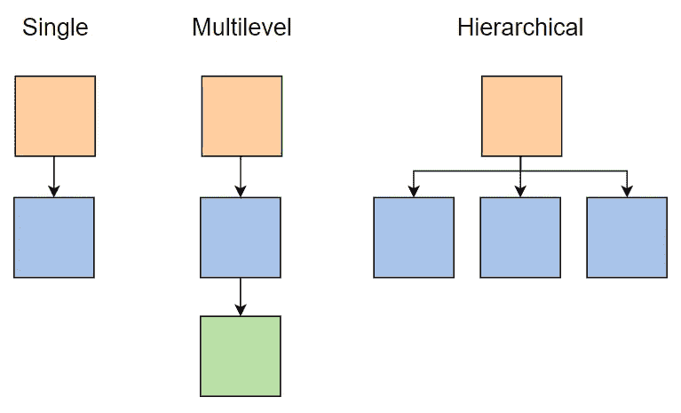
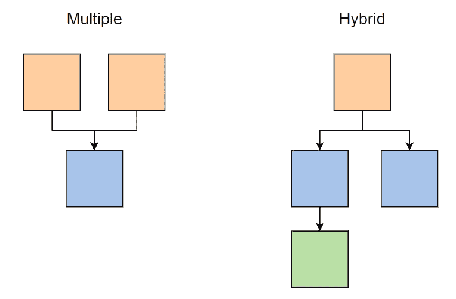

# Java 继承教程:举例说明

> 原文：<https://medium.com/javarevisited/java-inheritance-tutorial-explained-with-examples-1b5c8f341b54?source=collection_archive---------2----------------------->

[](https://www.educative.io/subscription?affiliate_id=5073518643380224)

图片来源:作者

继承是基于另一个现有类的特性构建一个新类的过程。它在 Java、Python 和其他面向对象的语言中大量使用，以提高代码的可重用性，并将程序逻辑简化为分类和层次关系。

然而，每种语言都有自己独特的实现继承的方式，这使得切换很困难。

今天，我们将为您提供 Java 编程中继承用法的速成课程，并向您展示如何实现核心继承工具，如类型转换、方法覆盖和`final`实体。

**以下是我们今天要讲的内容:**

*   什么是继承？
*   Java 中的继承
*   Java 继承示例
*   接下来要学习的高级概念

# 什么是继承？

继承是一种机制，它允许一个类从另一个类继承属性或行为。多个类可以从同一个父类继承，形成树状层次结构。继承类可以添加从父类继承的特性之外的特性，以允许独特的行为。

继承对于高级面向对象编程( [OOP](/javarevisited/10-oop-design-principles-you-can-learn-in-2020-f7370cccdd31) )来说是必不可少的，因为它允许您在整个程序中重用一个类的特性，而无需复制代码。

继承通常用于表示类别(父类)和子类别(子类)。父类设置所有对象中存在的特性，而不考虑子类，而每个子类代表一个更小、更具体的类别。

例如，您可以创建指定`wheels = 4`的类`Car`和包含属性`doors = 4`的子类`Sedan`。继承关系的流向往往反映了类似正方形和长方形的逻辑关系；在这种情况下，所有的轿车都是轿车，但不是所有的轿车都是轿车。

[](https://javarevisited.blogspot.com/2012/10/what-is-inheritance-in-java-and-oops-programming.html)

图片来源:作者

继承有三个主要优点:

1.  **可重用性:**继承允许您在继承现有类的任何类中无限次地重用该类的特性。您可以在相同类型的所有对象之间保持一致的功能，而无需重写代码。
2.  **代码结构:**继承为你的程序提供了一个清晰、可绘制的逻辑结构。它允许开发人员将您的代码理解为相关但独特的类别的集合，而不是简单的代码块。
3.  **数据隐藏:**基类可以被设置成私有的，这样就不会被派生类修改。这是[封装](https://javarevisited.blogspot.com/2012/03/what-is-encapsulation-in-java-and-oops.html)的一个例子，其中对数据的访问被限制为只有那些角色需要它的类。

## Java 中的继承

每种编程语言对于继承都有稍微不同的术语。
在 [Java](/javarevisited/10-free-courses-to-learn-java-in-2019-22d1f33a3915) 中，父类称为**超类**，继承类称为**子类**。开发人员也可以将超类称为基类或父类，将子类称为派生类或子类。

子类在定义过程中使用关键字`extends`链接到超类。子类可以定义新的本地方法或字段来使用，或者可以使用`**super**`关键字来调用继承的方法或超级构造函数。

```
class b {
// implementation of inheritedMethod()
}
class a extends b
{  
   inheritedMethod();
}
```

## 何时使用`super`关键词

`super`本质上是一个从子类中调用的“前一个值”按钮，允许您从父类中读取和访问特性，而不管它们在当前子类中的值。

`super`关键字用于:

*   **访问父类字段** : `super.var`读取父类中设置的`var`的值，而`var`单独从子类中读取修改后的值。
*   **调用父类方法** : `super.method()`允许孩子访问`method()`的父类实现。只有当子类也有同名的方法时，这才是必需的。
*   使用构造函数:这允许你从子类中创建父类的新实例。

回顾一下，Java 中的[构造函数](https://www.educative.io/blog/object-oriented-programming-concepts-java#constructors)是用于初始化对象的特殊方法。调用超级构造函数会创建一个新对象，该对象需要父类构造函数中定义的所有字段。

然后，您可以在其他语句中添加额外的字段，使子实例比父实例更具体。本质上，它允许您将父类构造函数用作子类构造函数的模板。

```
public Car(String make, String color, int year, String model, String bodyStyle) {
        super(make, color, year, model);  //parent class constructor
        this.bodyStyle = bodyStyle;       
    }
```

# 继承的类型

[](https://www.java67.com/2016/03/top-21-java-inheritance-interview-Questions-Answer-Programming.html)

图片来源:作者

Java 中有几种类型的继承:

*   **单一继承**是单个子类从超类继承，形成一层继承。
*   **多级继承**是超类被中间类继承，再被派生类继承，形成 3 级或 3 级以上的继承。
*   **层次继承**是指一个超类作为多个特定子类的基线。这是最常见的继承形式。

[](https://www.java67.com/2015/12/top-30-oops-concept-interview-questions-answers-java.html)

图片来源:作者

通过类和接口继承的组合，还有另外两种类型的继承只在 [Java](/javarevisited/top-5-java-online-courses-for-beginners-best-of-lot-1e1e240a758) 中可用。

*   **多重继承**，当一个子类从多个父类继承时。
*   **混合遗传**，以上两种或两种以上遗传的混合。

[Java 并不**支持类**](http://javarevisited.blogspot.sg/2011/07/why-multiple-inheritances-are-not.html#axzz55Zuelntp)的多重继承，这意味着这两种类型的继承对于单独的 Java 类都是不可能的。然而，一个子类可以继承多个接口(一个抽象类)。因此，如果结合使用接口和类，就可以模拟多个继承。

# Java 继承示例

为了帮助您更好地理解继承，让我们来看一些代码示例。寻找到目前为止我们已经看到的继承的语法成分，比如`super`和共享方法。

要在 Java 中声明继承，我们只需在子类的标识符后添加`extends [superclass]`。

下面是一个从基类`Vehicle`继承而来的类`Car`的例子，它使用私有字符串和 getter/setter 方法来实现封装。

```
// Base Class Vehicle
class Vehicle { // Private Fields
  private String make; 
  private String color; 
  private int year;      
  private String model;  // Parameterized Constructor
  public Vehicle(String make, String color, int year, String model) {
    this.make = make;
    this.color = color;
    this.year = year;  
    this.model = model; 
  } // public method to print details
  public void printDetails() {
    System.out.println("Manufacturer: " + make);
    System.out.println("Color: " + color);
    System.out.println("Year: " + year);
    System.out.println("Model: " + model);
  }}// Derived Class Car
class Car extends Vehicle { // Private field
  private String bodyStyle; // Parameterized Constructor
  public Car(String make, String color, int year, String model, String bodyStyle) {
    super(make, color, year, model);  //calling parent class constructor
    this.bodyStyle = bodyStyle;       
  } public void carDetails() {  //details of car
    printDetails();         //calling method from parent class
    System.out.println("Body Style: " + bodyStyle);
  }}class Main { public static void main(String[] args) {
    Car elantraSedan = new Car("Hyundai", "Red", 2019, "Elantra", "Sedan"); //creation of car Object
    elantraSedan.carDetails(); //calling method to print details
  }}
```

这是一个单一继承的例子，因为只有一个对象从父类继承。在第 37 行上，你可以看到我们使用`super`来调用超类构造函数，它简化了我们的`Car`构造函数。您还可以看到`Car`如何访问**行 42** 上的`Vehicle`类`printDetails()`方法。

> `*printDetails()*` *可以称为没有* `*super*` *是因为* `*Car*` *没有自己实现的* `*printDetails()*` *。只有当程序必须决定使用哪个版本的方法时，才需要* `*super*` *关键字。*

## Java 中的类型转换

Java 也允许你引用一个子类作为它的超类的一个实例，本质上把子类当作超类类型。这个过程被称为<https://javarevisited.blogspot.com/2012/12/what-is-type-casting-in-java-class-interface-example.html#axzz5mFvI6vQr>**。这是创建模块化代码的好方法，因为您可以编写适用于同一父类的任何子类的代码。例如，你可以引用一个`Car`类型的变量作为一个`Vehicle`类型的对象。**

```
Car car     = new Car();
Vehicle vehicle = car;
```

**我们首先创建一个`Car`实例，然后将该实例分配给一个`Vehicle`类型变量。现在`Vehicle`变量引用指向了`Car`实例。这允许您将`Vehicle`的任何子类视为相同的`Vehicle`类型，即使您不知道它是`Vehicle`的哪个子类。两种类型的类型转换是向上转换和向下转换。**

**向上转换是当你把一个子类当作父类的一个实例时，就像我们之前的例子一样。子类特有的任何字段都将被隐藏，以适应父类的模式。**

**向下转换是将父类的一个实例当作它的一个子类来对待。虽然任何子类都可以向上转换，但是只有最初是子类类型的对象才可以向下转换。**

**换句话说，如果一个对象是子类类型的原始对象，但后来被向上转换为父类，则该对象可以向下转换。**

```
//valid code
Car car = new Car();
// upcast to Vehicle
Vehicle vehicle = car;
// downcast to car again
Car car2 =  (Car) vehicle;
```

**向上转换的对象仍然保留它所拥有的字段，因此可以添加回来，使它再次成为子类类型的有效对象。**

**但是，最初属于父类的对象没有任何子类独有的基本字段的值。因此，它可以编译，但会在运行时抛出错误。**

## **在 Java 中重写方法**

**有时我们需要一个子类来编辑继承方法的行为。 [Java](https://javarevisited.blogspot.com/2018/05/top-5-java-courses-for-beginners-to-learn-online.html#axzz6lZkAcdj7) 让我们通过创建同名的新方法来覆盖现有方法，从而做到这一点。它还允许我们从接口提供抽象方法的类实现。**

```
class Parent {
  void myMethod() {
    //original implementation
  }
}
class Child extends Parent {
  @override
  void myMethod() {
    //new implementation
  }
}
```

**[方法覆盖](http://www.java67.com/2012/08/what-is-method-overriding-in-java-example-tutorial.html)是实现多态时的一个基本工具，多态是一种设计原则，它允许不同的类对同一方法有不同的实现。如果我们把这个词分解，“poly”的意思是很多，“morph”的意思是形式。**

**最简单地说，[多态性](https://javarevisited.blogspot.com/2020/04/difference-between-inheritance-and-Polymorphism-in-java-oop.html)意味着有许多特定于类的流程形式来完成相同的任务。**

**下面是程序必须具备的允许方法重写的特性:**

*   **方法重写需要继承，并且应该至少有一个派生类。**
*   **派生类必须具有与基类相同的声明，即访问修饰符、名称、相同的参数和相同的方法返回类型。**
*   **派生类中的方法必须具有彼此不同的实现。**
*   **基类中的方法必须需要在派生类中重写。**
*   **基类/方法不能声明为`Final`类。要在 Java 中覆盖一个方法，定义一个与您想要覆盖的方法同名的新方法，并在它上面添加`@Override`标记。**

**在这里，您可以看到一个例子，说明我们如何为同一个方法调用创建特定于类的行为。我们的方法调用总是`getArea()`然而，方法的实现依赖于被评估的形状的类。**

```
// A sample class Shape which provides a method to get the Shape's area
class Shape {
  public double getArea() {
    return 0;
  }
}
// A Rectangle is a Shape with a specific width and height
class Rectangle extends Shape {   // extended form the Shape class
  private double width;
  private double height;
  public Rectangle(double width, double height) {
    this.width = width;
    this.height = height;
  }
  public double getArea() {
    return width * height; 
  }
}
// A Circle is a Shape with a specific radius
class Circle extends Shape {
  private double radius;
  public Circle(double radius) {
    this.radius = radius; 
  }
  public double getArea() {
    return 3.14 * radius * radius; 
  }
}
class driver {
  public static void main(String args[]) {
    Shape[] shape = new Shape[2]; // Creating shape array of size 2
    shape[0] = new Circle(2); // creating circle object at index 0
    shape[1] = new Rectangle(2, 2); // creating rectangle object at index 1
    // Shape object is calling children classes method
    System.out.println("Area of the Circle: " + shape[0].getArea());
    System.out.println("Area of the Rectangle: " + shape[1].getArea());
  }
}
```

**[方法超越](https://javarevisited.blogspot.com/2011/08/what-is-polymorphism-in-java-example.html)的优点是:**

*   **每个派生类都可以为继承的方法提供自己的特定实现，而无需修改父类方法。**
*   **对于任何方法，子类都可以使用父类中的实现或自己实现。此选项为您设计解决方案提供了更大的灵活性。**

## **`final`关键字**

**在 Java 中，`[final](https://javarevisited.blogspot.com/2016/09/21-java-final-modifier-keyword-interview-questions-answers.html)` [关键字](https://javarevisited.blogspot.com/2016/09/21-java-final-modifier-keyword-interview-questions-answers.html)可以在声明变量、类或方法时使用，以使值不可更改。实体的值是在初始化时决定的，并且在整个程序中保持不变。试图改变任何声明为`final`的值将会抛出一个编译器错误。**

```
// declaring a final variable
class FinalVariable {
        final int var = 50;
        var = 60 //This line would give an error
}
```

**`final`的确切行为取决于实体的类型:**

*   **`**final**` **参数**不能在功能中的任何地方更改**
*   **`**final**` **方法**不能被任何子类覆盖或隐藏**
*   **`**final**` **类**不能是任何子类的父类**

```
final boolean immutable = true;
boolean mutable = immutable;
```

**虽然`final`实体的值不能改变，但它们可用于设置非`final`变量的值。该属性有助于解决多个代码段需要引用同一个实体才能运行的数据可变性问题。**

**您可以设置节来引用实体的`final`版本，使用它来创建非`final`实体副本，然后对其进行任何操作。使用`final`确保原始的共享引用保持不变，这样每一部分都可以表现一致。**

# **接下来要学习的高级概念**

**继承是 Java 中一个强大的工具，也是理解高级 OOP 设计的基础。在您的 Java 开发之旅中，接下来要探索的一些概念是:**

*   **抽象和接口**
*   **聚合**
*   **作文**
*   **Java 8 APIs**
*   **高级访问修饰符**

***快乐学习！***