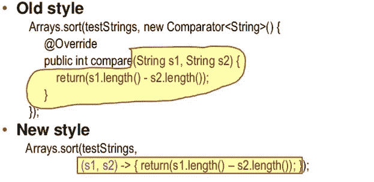

# Java Lambda 表达式

> 原文：<https://medium.com/javarevisited/java-lambda-expressions-6696793a6c38?source=collection_archive---------1----------------------->



在面向对象编程中，每个代码块都与类和对象相关。一个方法不能独立存在。例如，当我们想要打印`Hello world!`时，我们必须创建一个类，并在这个类中定义一个执行打印的方法。相反，函数式编程允许我们创建和使用独立的方法。λ表达式是在面向对象的 Java 世界中实现函数式编程的方法。它是在 Java 8 版本中添加的。

## λ表达式的优点

*   启用函数式编程。
*   使代码更具可读性。
*   允许摆脱样板代码。
*   促进 API 和库的使用。
*   支持并行编程。

让我们像 Java 8 版本之前一样实现第一段提到的`Hello world!`打印过程。

与其直接打印`Hello world!`，不如通过行为传递来实现。首先，创建一个接口和一个实现该接口的类。

现在，将`Greeting`接口作为参数添加到`greet()`方法中。然后，创建一个`HelloGreeting`的实例，并将这个实例发送给`greet()`方法。

我们也可以通过创建一个匿名内部类来提供这个功能，而不是创建`HelloGreeting`类。

无论以上哪种方式，我们都在一个实现了`Greeting`的类中指定行为，然后传递这个行为。不这样传递行为，可以直接传递类似下面结构的行为吗？

```
public void greet(perform()) {
    perform();
}
```

是的。Lambda 表达式使我们能够创建与类无关的方法，并且我们可以传递这些方法(行为)。


**λ表达式的结构**

Lambda 表达式可以赋给一个变量。换句话说，可以认为是把一个方法赋给一个变量。

上面显示了一个代表性的结构。从这个结构到 lambda 表达式结构的转换如下:

*   当创建一个属于类的方法时，使用访问修饰符是有意义的，但是因为 lambda 表达式与类无关，所以不需要访问修饰符。
*   不需要指定方法名，因为 lambda 表达式提供的函数将通过变量使用。
*   由于编译器知道所写的 lambda 表达式的返回类型——它是由我们指定的，我会提到——所以没有必要指定返回类型。
*   和上面的子句一样，不需要指定参数的类型，因为编译器知道参数的类型。
*   如果 lambda 表达式只有一行，花括号是可选的。

lambda 表达式的结构如下例所示。

**注意-1:** 和第 3 行一样，return 关键字对于不使用花括号的单行语法是无效的。

**注意-2:** While `this`引用可以在静态上下文中创建的匿名内部类中使用；它不能用于在静态上下文中创建的 lambda 表达式。

**注-3:** 在[这篇](https://youtu.be/1OpAgZvYXLQ)演讲中，Venkat 强调，由于其结构和创建目的，使用单行 lambda 表达式是一个很好的实践。我强烈建议你看那个演讲！

那么我们给 lambda 表达式赋值的变量是什么类型呢？功能界面。


## 功能界面

只包含一个抽象方法的接口称为函数接口。在函数接口中，可以根据需要多次找到默认方法和静态方法。重要的是只有一个抽象方法。

用`@FunctionalInterface`标注，可以说明该接口是一个功能接口。这个注释的目的是为了意识到程序员正在使用一个函数接口，并防止添加一个新的抽象方法。如果不使用这个注释，并且接口中有一个抽象方法，那么这个接口仍然是一个函数接口。所以使用这个注释可以被看作是最佳实践。

为什么 Java 设计者没有创造一个全新的变量类型？这样做的主要原因是向后兼容。例如，`Thread`类可以使用 lambda 表达式，因为它有一个将`Runnable`函数接口作为参数的构造函数。然而，如果设计者已经创建了一个新的变量类型，那么必须对`Thread`类进行修改，以使用这个新的变量类型。

我们必须为每个 lambda 表达式创建一个函数接口吗？其实是的，但是考虑到这种情况，Java 设计师用 Java 8 在`[java.util.function](https://docs.oracle.com/javase/8/docs/api/java/util/function/package-summary.html)` 包下创建了很多功能接口，适合常见用例场景。

通过使用这个包中的`[BiConsumer](https://docs.oracle.com/javase/8/docs/api/java/util/function/BiConsumer.html)`功能接口，我们可以执行除法过程。这个接口有两种类型，这些类型定义了`accept()`方法的参数类型。同样，这个方法的返回类型是`void`。在这里，通过查看`accept()`方法，我们可以看到，我们将给出两个参数，不会返回任何内容。

在第 16 行，执行从`main`传来的打印操作。正如所见，传递的行为是由`accept()`方法执行的。

然而，由于异常处理，lambda 表达式提供的更可读代码的优势被削弱了。使用 lambda 表达式时，处理异常的最佳方式是使用包装器。

正如所看到的，调用`process()`方法的行已经减少到一行，可读性得到了提高。


## 一个例子

在本节中，首先，将使用 Java 8 之前的方法，然后使用 Java 8 方法对示例进行改进。

正如您在上面看到的，包含`Person`对象的列表是在 main 方法中创建的。然后，通过创建一个匿名的内部类，这些`Person`对象按照它们的姓氏进行排序。之后，所有的`Person`对象用`printAll()`方法打印，姓氏以`O`开头的`Person`对象用`printLastNameBegginningWithO()`方法打印。

虽然`printLastNameBegginningWithO()`方法实现了期望的功能，但它并不灵活。例如，当我们想要打印名字以`Y`开头的`Person`对象时，应该编写一个全新的方法。为了提供灵活性，让我们创建一个包含`check()`方法的名为`Condition`的接口，并创建一个将`Condition`接口作为参数的名为`printConditionally()`的方法。该方法将打印满足作为参数传递的条件的`Person`对象。

上面，`Person`通过创建匿名内部类，根据三种不同的条件，使用单一方法打印对象。分别打印所有的`Person`对象、姓氏以`O`开头的`Person`对象、名字以`Y`开头的`Person`对象。

现在，让我们看看如何使用 lambda 表达式摆脱样板代码。

我们提到过 Java 8 中的`java.util.function` 包。我们可以使用内置的`[Predicate](https://docs.oracle.com/javase/8/docs/api/java/util/function/Predicate.html)` 接口来代替我们自己创建的`Condition`接口。

可能还需要一个行为传递，因为它不总是仅仅是一个打印过程，所以让我们扩展一下这个例子。为此，我们可以使用`[Consumer](https://docs.oracle.com/javase/8/docs/api/java/util/function/Consumer.html)` 接口。

如第 13 行所示，`consumer.accept()`执行通过的打印过程。因此`performConditionally()`变得更加灵活，可以执行许多不同的功能。

重要的是，lambda 表达式(或方法引用)的参数和返回值对应于函数接口中呈现的抽象方法的输入参数和返回值。


## 方法引用

方法引用是 lambda 表达式的一种特殊用法。它们用于使用现有方法以更短、更易读的形式创建 lambda 表达式。有三种类型的方法引用:

**1-静态方法的引用**

上面创建的两个线程提供相同的功能，但是使用静态方法引用实例化了`thread2`对象。如图所示，其结构类似于`ClassName::MethodName`。

**2-引用一个实例方法**

**3-对构造函数的引用**

*文件结束*