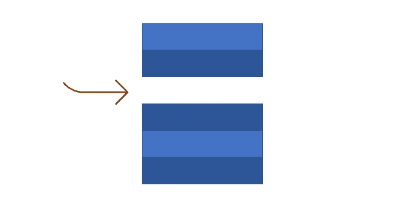

# 可选的 Java 空处理

> 原文：<https://medium.com/javarevisited/java-null-handling-with-optionals-b2ded1f48b39?source=collection_archive---------2----------------------->



在本文中，我们将讨论 java 的一个基本主题，即空处理，我们将用 Java 8 中引入的选项来做这件事，我们将用例子来详细说明这件事。

我们将创建可选的返回方法，还将看到使用可选的数据库操作的 Spring 方式。首先，让我们记住什么是 NullPointerException，然后看看什么是 Optionals。

在 Java 中，如果我们想创建一个变量，我们首先声明它，然后初始化它。当我们使用一个不指向内存(未初始化)的引用并对其进行操作(例如调用方法)时，我们会得到 NullPointerException。你可以在下面看到一个例子。

```
Object someObject = null; // created null variable
someObject.toString(); // method call over null variable
```

这里，我们有一个名为 someObject 的未初始化对象，并试图调用它的 toString 方法。因为它没有被初始化，也没有指向内存中的任何地方，所以它最终会抛出 [NullPointerException](https://javarevisited.blogspot.com/2013/05/ava-tips-and-best-practices-to-avoid-nullpointerexception-program-application.html) 。现在，如果我们刷新一下记忆，我们就能得到期权。

## 1-什么是可选的？

可选类提供了一种使用 fluent API 以优雅的方式处理可空对象的方法。使用提供的 API，如果对象存在(非空)，我们将处理该对象。让我们看看它是什么样子的

```
Object someObject = null;
Optional<Object> objectOptional = Optional.*ofNullable*(someObject);
System.*out*.println(objectOptional.isPresent()); // prints false
```

如上所述，我们将 someObject 变量设置为 null，然后创建了包装 null 对象的[可选对象](https://javarevisited.blogspot.com/2017/04/10-examples-of-optional-in-java-8.html#axzz6ccm5KWKs)。然后，我们用 isPresent 方法检查变量是否为 null。让我们尝试使用非空对象，看看当我们将非空对象传递给可选包装器时，它是否打印为 true。

```
Object someObject2 = new Object();
Optional<Object> objectOptional2 = Optional.*ofNullable*(someObject2);
System.*out*.println(objectOptional2.isPresent()); // prints true
```

## 2-可选类的方法

现在，让我们看看可以使用什么方法来充分利用可选类。

我们可以从创造性的方法开始。这些创建方法是可选类中的静态方法。

*   **ofNullable(T 值)**，创建可选包装一个可以为空或非空的对象。

```
Optional<Object> optional = Optional.*ofNullable*(new Object());
```

*   **(T 值)**，创建一个不能为空的可选包装对象。

```
Optional<Object> optional = Optional.*of*(new Object());
```

你可能会问“如果我们确保传递的对象不为空，我为什么要使用它”。在某些情况下，您可能需要在方法中返回一个可选对象，作为实现接口方法的结果，因此您可能需要此方法。

*   **empty()** ，创建空的可选对象，这意味着可选对象中不存在任何值。

```
Optional<Object> optional = Optional.*empty*();
```

现在，让我们看看检查值的存在的方法。

*   [**isPresent()**](https://www.java67.com/2018/06/java-8-optional-example-ispresent-orElse-get.html) ，如果可选包含非空值，则返回 true，否则返回 false。

```
Optional<Object> optional = Optional.*ofNullable*(new Object());
System.*out*.println(optional.isPresent()); // prints true
```

*   **ifPresent(消费者<？super T > consumer)** ，如果 Optional 中的值存在，您可以运行自己的逻辑。

```
Optional<String> stringOptional = Optional.*of*("Hi!");
Optional<String> stringOptionalNull = Optional.*empty*();

stringOptional.ifPresent(System.*out*::println); // prints "Hi!"
stringOptionalNull.ifPresent(System.*out*::println); // prints nothing
```

您可以在传统的 if 语句中使用 isPresent，也可以选择 ifPresent 作为处理现有值的优雅方式。

如果值不存在，我们有时需要运行一些逻辑，比如提供备份值。让我们看看如何处理不存在的值。

*   **orElse(T other)** ，如果存在，则返回 Optional 内部的值，否则返回给定值作为参数。

```
Optional<String> stringOptionalNull = Optional.*empty*();
String backupValue = stringOptionalNull.orElse("Hi!");
System.*out*.println(backupValue); // prints "Hi!"
```

如您所见，stringOptionalNull 是一个空的可选值，我们提供了一个备份值，以防由于 orElse 方法而不存在。所以，它打印出给 orElse 方法的值。

*   **orElseGet(供应商<？扩展 T > other)** ，返回 Optional 内部的值(如果存在)，否则运行提供的逻辑，然后返回其结果。

```
Optional<String> stringOptionalNull = Optional.*empty*();
String backupValue = stringOptionalNull.orElseGet(() -> "Hi!");
System.*out*.println(backupValue); // prints "Hi!"
```

如果我们在一系列操作后提供一个备份值，就可以利用 orElseGet 方法。


以下重要说明

在谈论另一个方法之前，我们将看到 orElse 和 orElseGet 方法之间的一个重要区别。当你给 orElse 方法提供一个函数时，不管这个值是否在 Optional 中，它总是运行给定的方法。对于 orElseGet 方法，如果该值存在于 Optional 中，它将不会运行给定的方法。让我们看一个例子。

```
public static void main(String[] args) {
    Optional<String> stringOptional = Optional.*of*("I exist..");
    String value = stringOptional.orElse(*getStr*());
    String value2 = stringOptional.orElseGet(() -> *getStr*());}public static String getStr() {
    System.*out*.println("I am being evaluated");
    return "Hi!";
}// Above program prints only one "I am being evaluated"
```

我们首先创建了一个值为“我存在”的可选字符串。然后，我们通过将 getStr()方法作为参数来应用 orElse 方法。正如我们之前说过的，即使价值存在，orElse 也会评估赋予它的方法。所以，它会打印“我正在接受评估”。然后，我们有 orElseGet 方法和给定的 lambda 表达式。这一次，它不会运行给定的 lambda，因为值是存在的。如果该值不存在，例如最初的 Optional.empty()，它将打印两个“我正在被评估”。让我们继续我们将涉及的最后一个功能。

*   **orelsthrow(供应商<？扩展 X > exceptionSupplier)** ，在值不存在的情况下抛出提供的异常。

```
Optional<String> stringOptionalNull = Optional.*empty*();
String backupValue = stringOptional.orElseThrow(RuntimeException::new);// Result
// Exception in thread "main" java.lang.RuntimeException
 // at java.util.Optional.orElseThrow(Optional.java:290)
 // at optional.Demo.main(Demo.java:29)
```

我们可以看到 orElseThrow 抛出了异常，因为 Optional 中的值不存在。

*   **地图(功能<？超 T，？扩展 U >映射器)**，通过给定的映射函数映射可选内部的值。

```
Optional<String> stringOptional = Optional.*of*("Hi, there!");
int length = stringOptional.map(String::length).orElse(0);
```

上面的代码片段显示了最初的字符串可选到整数的映射。

*   **过滤器(谓词<？超级 T >谓词)**，用给定的谓词过滤可选对象内部的值。

```
Optional<String> stringOptional = Optional.*of*("I love java");
stringOptional.filter(str -> str.endsWith("java")).ifPresent(System.*out*::println);
```

上面的代码块将运行 ifPresent 中的代码块，因为我们应用于可选对象的过滤器评估为 true。

最后，让我们看看可以用来获取可选对象内部值的最基本的方法。

*   **get()** ，简单返回可选对象内部的值。

我们需要首先通过存在检查小心地使用 get 函数。如果可选对象内部不存在值，那么该方法将抛出[**NoSuchElementException**](http://javarevisited.blogspot.sg/2012/02/how-to-solve-javautilnosuchelementexcep.html)。所以，我们可以如下使用它，或者只使用 ifPresent 方法。

```
if (someConditional.isPresent()) {
    Object value = someConditional.get();
}
```

## 例子

由于我们已经介绍了可选方法，我们可以看看[核心 Java](/javarevisited/11-advanced-core-java-online-courses-to-join-in-2021-46011661257a) 和 [Spring 应用](/javarevisited/10-best-online-courses-to-learn-spring-framework-in-2020-f7f73599c2fd)中的一些例子。

想象一下，我们有一个作为缓存的类，我们可以获得带有 String 类型键的对象。在这种情况下，使用 Optionals 不是很有意义吗？因为我们可能没有与给定键相关联的对象。让我们看看它的实际效果

```
public enum  ObjectCache {
    *INSTANCE*;

    private final Map<String, Object> objectMap = new HashMap<>();

    public Optional<Object> get(String key) {
        return Optional.*ofNullable*(objectMap.get(key));
    }

    public void add(String key, Object value) {
        objectMap.put(key, value);
    }

    public Optional<Object> delete(String key) {
        return Optional.*ofNullable*(objectMap.remove(key));
    }
}
```

在 ObjectCache 类中，我们有三个与 objectMap 交互的方法。当我们使用带有键的 get 方法时，它可能不总是有关联的对象，如果我们对返回的空对象进行操作，我们将面临 [NullPointerException](https://www.java67.com/2021/05/how-to-solve-nullpointerexception-in-java.html) 。但是在上面的类中，我们返回了 Optional，客户端可以通过我们之前讨论过的方法来使用它，以确保空安全。

另一个用例可以是 Spring 应用程序。在数据层，我们执行一些查询，它们从数据库[返回值](/javarevisited/8-free-oracle-database-and-sql-courses-for-beginners-f4e9b25b33c4)。使用与上面相同的逻辑，它可能没有相应的值，所以它可能返回 null 值。在这种情况下，最好返回包装在选项中的值。让我们看看。

```
@Repository
public interface UserRepository extends JpaRepository<User, String> {
    Optional<User> findByUsername(String username);
    Optional<User> findByEmail(String email);
}
```

这里，我们有两种方法。例如，对于 findByUsername 方法，我们传递 Username，它从数据库返回相关的用户。但是，这样的用户可能不存在。在这种情况下，我们最好将用户包装在 Optional 中返回，以便更好地处理空值。

在这篇文章中，我讨论了 Java 中可选的空处理。我希望你喜欢它。更多类似文章，你可以关注我。

[https://github . com/kurural 4/medium-Java/tree/master/optionals](https://github.com/kurular4/medium-java/tree/master/optionals)