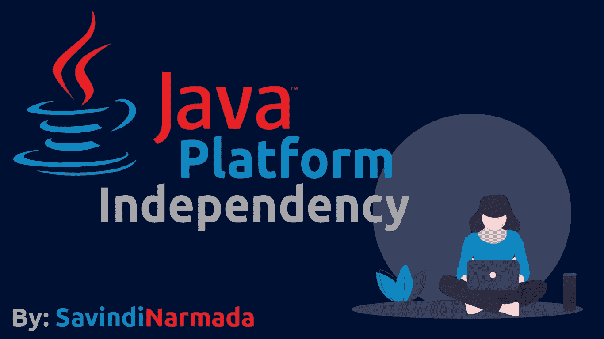
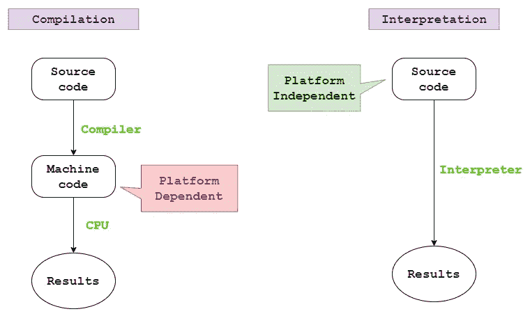
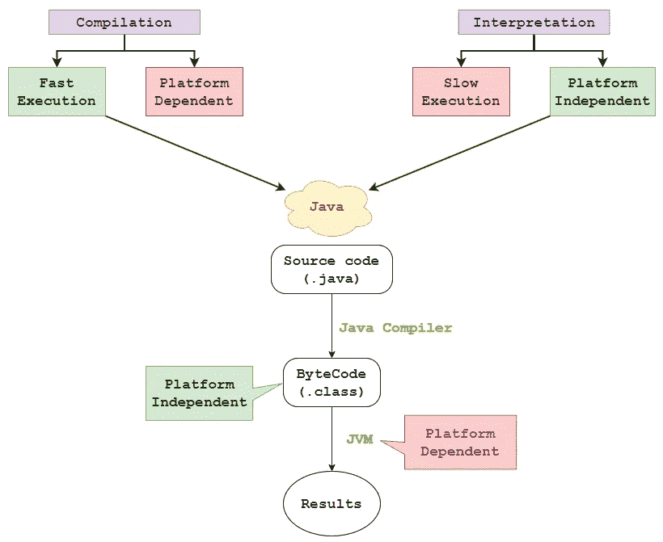

# Java 如何实现平台无关性

> 原文：<https://medium.com/javarevisited/java-platform-independency-2dddd92a53f8?source=collection_archive---------0----------------------->

读者们好！在漫长的休息之后，欢迎回来。希望你没看到我写的东西。🤗

我今天写了一篇关于 JVM 的长文(预计很快会发表)。但是在谈论 JVM 及其内部过程之前，我想我应该从什么是 Java 以及为什么它作为一种编程语言如此重要开始我们的讨论，这样，你就可以理解 JVM 在使 Java 从其他编程语言中脱颖而出方面的作用。

这篇文章相对较小，我们将讨论:

1.  Java 的重要特性(简述)
2.  编译与解释
3.  java 如何实现平台无关性

不多说了，让我们开始吧！💪🏽

# Java 的重要特性

1.  ***通用*** :不局限于一个领域，拥有 web 应用、独立应用、移动应用等多种应用。
2.  ***面向对象*** :帮助将现实世界的对象和实体建模到程序代码中。
3.  ***平台无关*** :一次写入随处运行(WORA)不考虑操作系统或架构(32 位/64 位)→这是我们要深入讨论的特性🤓
4.  ***并发*** :支持多线程
5.  *:由于字节码的紧凑、优化和编译，以及 JIT 编译器*
6.  ****健壮性*** :由字节码验证器保证*
7.  ****支持多种语言***:Scalar、Ruby 等语言可以被编译成有效的字节码，因此可以被 JVM 执行。*

*</javarevisited/10-free-courses-to-learn-java-in-2019-22d1f33a3915>  

# 编译与解释

机器只能理解 1 和 0。但是，对于一个正常的人类来说，用 1 和 0 写复杂的程序并不容易。因此，人们发明了一种语言，叫做汇编语言。甚至汇编语言也不是一种表达能力很强的语言，因此，更多类似英语的语言后来被引入。

机器语言和汇编语言被归类为低级语言，而更多的类似英语的语言(Fortron、C、C++等)。)被归类为高级语言。除了机器语言(即 1 和 0)之外，所有语言都需要一种机制来将它们转换成机器可理解的指令。

对于汇编语言，使用了一种叫做汇编程序的转换器。(这里不讨论)。对于所有的高级语言，要么使用编译器，要么使用解释器。

然而，编译过程和解释过程彼此有很大的不同。编译是作为一个整体在程序上完成的，机器代码是从源代码中生成的，随后由 CPU 执行以完成工作。

C 和 C++就是很好的例子。另一方面，解释是逐行进行的，直接执行源代码，就像 javascript、python 等脚本语言一样。

编译器 vs 解释器

这里要注意的重要一点是，源代码是独立于平台的，而机器码不是，因为机器码是专门为执行机器的操作系统创建的，以支持 OS 库和各种适当的优化。因此，编译过程被认为是依赖于平台的任务，而解释是独立于平台的。

另一方面，解释相对较慢，这是因为不断地访问内存(不像编译那样涉及寄存器)，源代码每次运行时都要重新解释等原因。

与解释相比，编译过程中的执行更快，因为生成的机器代码在运行程序之前已经过预编译、优化和压缩。关于解释的另一个考虑是安全性，因为是逐行执行的机制。此外，解释器需要和程序一起加载到内存中，因此也要占用一定的内存。

总而言之，编译和解释过程各有利弊。当 Sun Microsystems(现已被 Oracle 收购)第一次要求开发可以在各种连接的嵌入式系统上运行的程序时，他们遇到的主要考虑因素是平台独立性和性能，以及嵌入式系统的内存限制。编译和解释过程都未能打动致力于此事的绿色团队。因此，Java(以前的 Oak)在 1996 年诞生了。

# Java 如何实现平台无关性

Java 如何实现平台无关性

Java 将编译和解释这两个过程结合起来，保留了两者的优点。类似于传统的编译过程，Java 也编译它的程序。但不是转换成机器码，而是转换成 Java 特有的字节码。

字节码对 Java 来说非常特殊。它提供了机器码提供的大部分优势，比如快速执行(因为紧凑、预编译和优化的特性)。它还可以通过网络快速传输，这使得 Java 成为一种可以创建高度可移植程序的语言。

与机器码不同，字节码是独立于平台的，因此没有任何特定于操作系统的东西。那么，计算机，或者更确切地说，操作系统，如何理解字节码呢？🙄这得感谢 ***JVM*** 或者 [***Java 虚拟机***](/@phantomgrin/jvm-101-introduction-classloader-sub-system-jit-compiler-part-1-9e5a6782fa3e) 。

<https://javarevisited.blogspot.com/2019/04/top-5-courses-to-learn-jvm-internals.html>  

Java 虚拟机是一个抽象的、依赖于平台的虚拟机，能够执行字节码。它有自己的机制来处理与之对话的操作系统。因此，平台无关的字节码和平台相关的 JVM 保证了 Java 程序的平台无关性。

至此，我将结束这篇文章。今天我们讨论了 Java 的关键特性，“平台独立性”，以及 Java 是如何实现的。我希望你喜欢读它，就像我喜欢写它一样。🙈

一如既往，热烈欢迎评论和批评。🤗我希望我增加了你的知识。直到下一篇文章(期待它很快出来，谈论我们在这里简单讨论过的 JVM)，

快乐阅读！！❤️

此外，保持健康和警惕(无论你来自哪里),因为我们正面临着全球健康危机，因为冠状病毒。😷希望你和你的家人都平安。洗手。避开人群。保持祝福…😇❤️

学习 Java 的其他**有用资源**你可能喜欢的
[Java 程序员 2020 年应该学习的 10 件事](https://javarevisited.blogspot.com/2017/12/10-things-java-programmers-should-learn.html#axzz5atl0BngO)
[从头开始学习 Java 的 10 门免费课程](http://www.java67.com/2018/08/top-10-free-java-courses-for-beginners-experienced-developers.html)
[深入学习 Java 的 10 本书](https://medium.freecodecamp.org/must-read-books-to-learn-java-programming-327a3768ea2f)
[每个 Java 开发人员都应该知道的 10 种工具](http://www.java67.com/2018/04/10-tools-java-developers-should-learn.html)
[学习 Java 编程语言的 10 个理由](http://javarevisited.blogspot.sg/2013/04/10-reasons-to-learn-java-programming.html)
[2020 年 Java 和 Web 开发人员应该学习的 10 个框架](http://javarevisited.blogspot.sg/2018/01/10-frameworks-java-and-web-developers-should-learn.html) 成为 2020 年更优秀的 Java 开发者
[2020 年要学习的 5 大 Java 框架](http://javarevisited.blogspot.sg/2018/04/top-5-java-frameworks-to-learn-in-2018_27.html)
[每个 Java 开发者都应该知道的 10 个测试库](https://javarevisited.blogspot.sg/2018/01/10-unit-testing-and-integration-tools-for-java-programmers.html)

</javarevisited/what-java-programmers-should-learn-in-2020-648050533c83>  </javarevisited/top-5-java-online-courses-for-beginners-best-of-lot-1e1e240a758> *