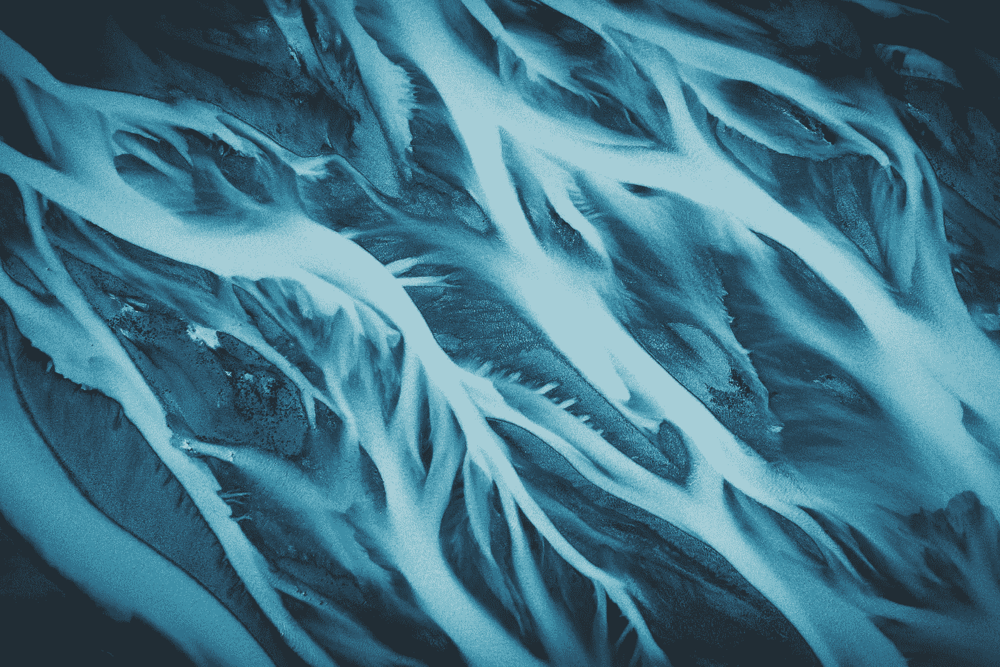

# Java 流 API——了解如何将流转换成其他数据结构

> 原文：<https://medium.com/javarevisited/java-streams-and-collectors-how-to-easily-convert-streams-to-other-data-structures-2a8ed9a6b65?source=collection_archive---------1----------------------->

照片由[哈里森·坎德林](https://www.pexels.com/@harrison-candlin-1279336?utm_content=attributionCopyText&utm_medium=referral&utm_source=pexels)从[派克斯](https://www.pexels.com/photo/new-zealand-topography-from-above-2441454/?utm_content=attributionCopyText&utm_medium=referral&utm_source=pexels)拍摄

有时，数据结构之间的转换可能会变得重复或容易出错。如果您在 Java 中使用流，您可能需要获取一个列表，将其转换为流，并将其映射到另一个数据结构。

多亏了来自 [Java](/javarevisited/top-5-java-online-courses-for-beginners-best-of-lot-1e1e240a758) 的`Stream`和`Collectors`API，有一个非常简单的方法来完成这些类型的转换。在这个…