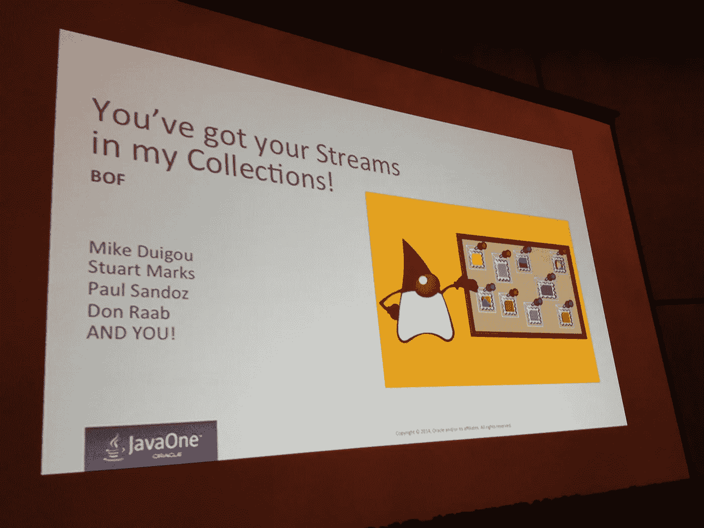
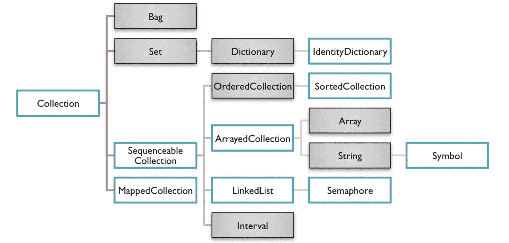
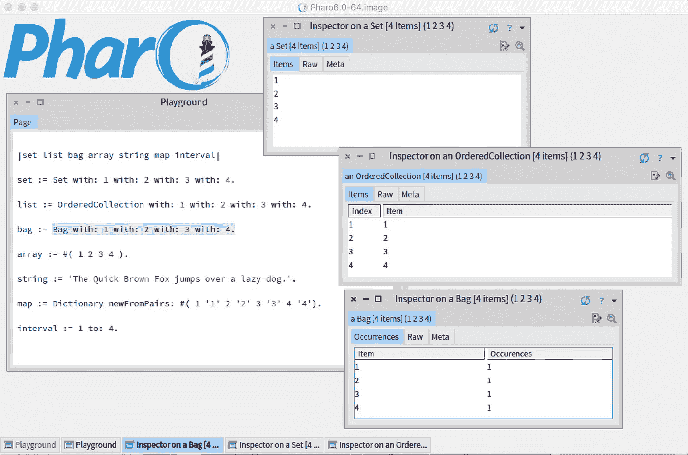
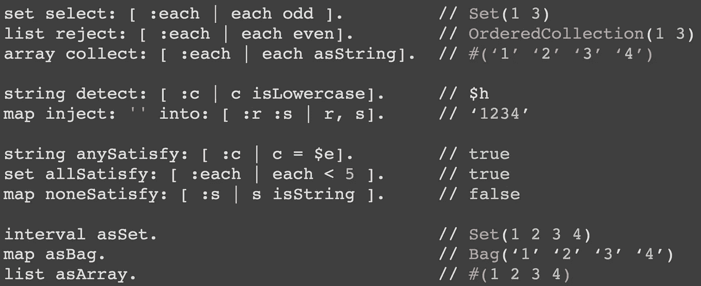
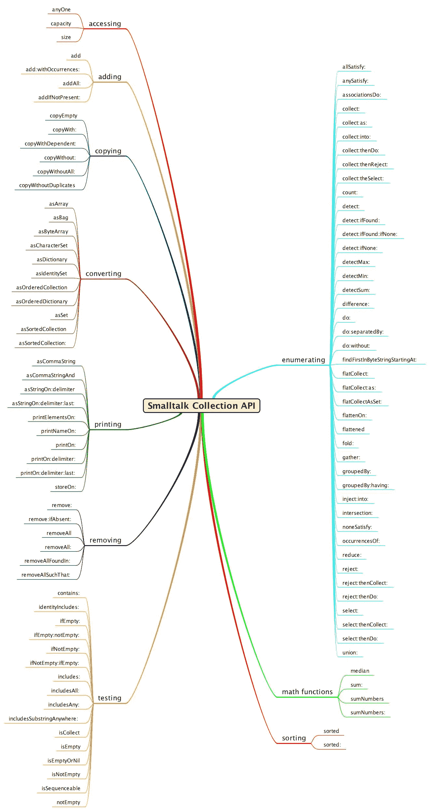
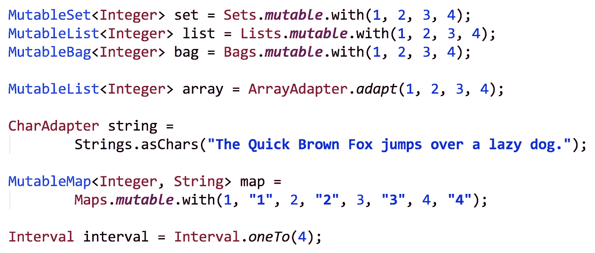
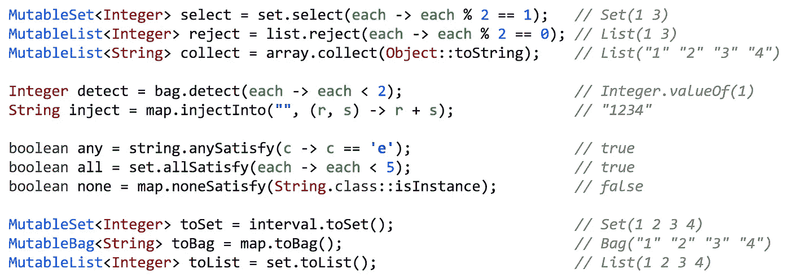
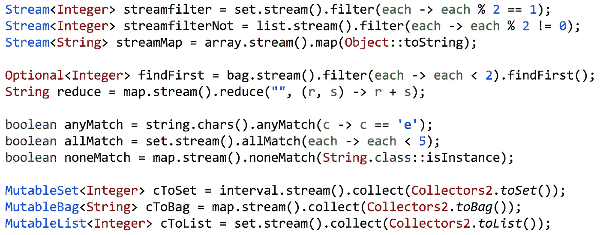
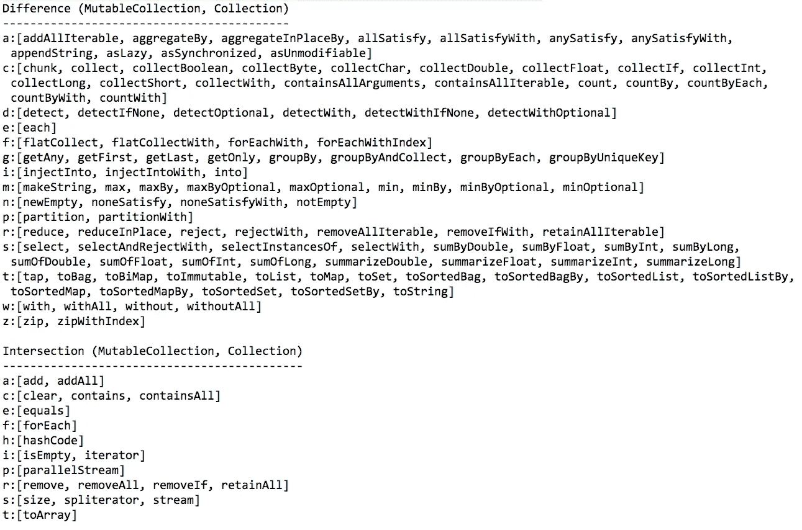

# Java 流很棒，但现在是更好的 Java 集合的时候了

> 原文：<https://medium.com/javarevisited/java-streams-are-great-but-its-time-for-better-java-collections-42d2c04235d1?source=collection_archive---------0----------------------->

25 年后，Java 是时候进行集合升级了。

来自 JavaOne 2014 的 Java 流和集合“一丘之貉”

# 25 年的 Java

今年将是 Java 编程语言诞生 25 周年。2020 年 3 月，我们将庆祝 Java 8 发布 6 周年，其中包括 [Lambdas](https://javarevisited.blogspot.com/2014/02/10-example-of-lambda-expressions-in-java8.html) 、[方法引用](https://javarevisited.blogspot.com/2017/08/how-to-convert-lambda-expression-to-method-reference-in-java8-example.html)、[默认方法](https://javarevisited.blogspot.com/2014/07/default-defender-or-extension-method-of-Java8-example-tutorial.html)和 [Java 流](https://javarevisited.blogspot.com/2018/05/java-8-filter-map-collect-stream-example.html)。

Java 8 过去和现在都很棒。在 19 年没有对 Lambdas 的支持之后，Java 开发人员突然享受到了语言和核心库带来的惊人的生产率提高。Java 流非常有用，可以满足大量的用例。他们也给了 Java 内容作者很多东西可写，给了 Java 会议演讲者很多东西可谈。

虽然 Java 集合框架已经通过 Java Streams 中的新功能得到了很大的增强，但不幸的是，Java Streams 隐藏了更大的生产力增益、更高的类型安全性和性能改进。

让我们探讨一下为什么在 25 年后，是时候建立一个更好、更现代的 Java 集合框架了。为了看到 Java 中我们仍然缺少的一些东西，我们可以回顾一下过去。

# 40 年的闲聊

四十年前，Smalltalk-80 发布。Smalltalk 的影响如此之大，以至于我们每天都在使用现代编程语言和软件开发技术，如 TDD 和重构。

[Smalltalk](https://en.wikipedia.org/wiki/Smalltalk) 是一种动态类型的面向对象编程语言。Smalltalk 有一个简单的语法，可以放在[明信片](/@richardeng/syntax-on-a-post-card-cb6d85fabf88)上，还有一个功能丰富的类库。从 1994 年到 2000 年，我受雇于 IBM 全球服务部，在新泽西州的 Horizon Blue Cross Blue Shield 工作，在 Smalltalk 中进行专业编程。在过去的 25 年里，Smalltalk 塑造了我思考编程的方式，并直接影响了我用 Java 设计和编程的方式。

我认为 Smalltalk 最容易被忽视的特性之一是其丰富的集合框架。Smalltalk 集合有一个组织有序且易于学习的层次结构。

Smalltalk 集合层次结构

Smalltalk 中的具体集合有简单的工厂方法来创建它们(`with:`)，某些集合类型如数组和字符串有文字语法。在下面的截图中，我使用 Pharo Smalltalk 创建了一个`Set`、`OrderedCollection`(又名`List`)、`Bag`、`Array`、`String`、`Dictionary`(又名`Map`)和`Interval`。Smalltalk 是一个实时编程环境。在 Smalltalk 中，您可以在任何地方突出显示代码并执行它，或者检查结果并在检查器中查看它们。

创建 Smalltalk 集合的工厂方法和文字语法

Smalltalk 中的集合 API 非常丰富，API 中的很多常用方法都是在`Collection`类的层次结构的根中定义的。

API 包括选择:，拒绝:，采集:，检测:，注入:注入:适用于所有采集类型

为了理解 Smalltalk 集合 API 有多丰富，我捕获了一个 Pharo Smalltalk 集合类的思维导图，展示了主要的方法类别和各个方法。我真的很怀念 Java 中的方法类别，因为这是组织更大的 API 的好方法。Collection 的每个子类都继承了所有这些常见的行为。

Smalltalk 集合类 API

Smalltalk 拥有 lambdas 和功能丰富的集合框架已经超过 40 年了——40 年了！25 年过去了，JDK 仍然没有直接在系列中提供的相同水平的功能。

***Java 开源社区中有选项可用。***

# Java 年来更好的收藏

2004 年在高盛工作时，我开始开发一个名为 Caramel 的库。2012 年，该库在 GitHub 上被开源为 [GS Collections](https://github.com/goldmansachs/gs-collections) 。2015 年，它被转移到 Eclipse 基金会，成为 [Eclipse Collections](https://github.com/eclipse/eclipse-collections) 。

**更新**:我在 2012 年 7 月的 JVM 语言峰会上找到了一个链接，题目是“[一个 Java 集合框架设计](http://wiki.jvmlangsummit.com/images/c/c2/Raab_Collections_Design.pdf)”。在演讲中，我比较了 Java、Scala、Smalltalk 和 GS 集合中的集合框架。

Eclipse 集合框架的灵感来自于 Smalltalk 集合框架。Eclipse 集合具有工厂类，它们提供了创建集合的一致方式。

Eclipse Collections 还提供了丰富的 API，大多数方法都在名为`RichIterable`的父接口中定义。默认情况下，集合上直接可用的方法是**eager**。返回集合如`select`、`reject`和`collect`的方法在 Eclipse 集合中是共同变体。

将此与上面的 Smalltalk 示例进行比较

通过调用`asLazy`，Eclipse 集合中有一个**惰性** API 可用。

Eclipse 集合中的可变类型扩展了 Java 中等价的集合类型。

*   `MutableList`延长`java.util.List`
*   `MutableSet`延伸`java.util.Set`
*   `MutableMap`延伸`java.util.Map`
*   `MutableBag`延伸`java.util.Collection`

这意味着像`stream`和`parallelStream`这样的方法在 Eclipse 集合类型上也是可用的。

Eclipse Collections 附带了一个`Collectors2`类，它具有与`Collectors`中相同的`Collector`实现，但是它返回 Eclipse Collections 类型。

如果您想看到 Eclipse 集合库的可视化，在下面的博客中有很多。

</oracledevs/visualizing-eclipse-collections-646dad9533a9>  

# 比较 Java 中的集合基类

那么 Eclipse 集合和 JDK 集合框架之间有什么区别呢？在下图中，我使用不带参数的方法名计算了`MutableCollection`和`java.util.Collection`API 的区别和交集，因此重载方法被排除在外。

Eclipse 集合`MutableCollection`与 java.util.Collection 的比较

**注意** : `MutableCollection`扩展了`RichIterable`，这个类的很多行为都是从这里继承的。

在`MutableCollection`上有更多可用的功能。这些特性直接提高了 Java 开发人员的工作效率。`MutableCollection`类扩展了`java.util.Collection`，所以上面的交集包括了`java.util.Collection`和`java.lang.Iterable`中的所有方法。

# 今天 Java 集合缺少什么？

1.  功能和流畅的 API 直接在集合上
2.  [内存效率](/oracledevs/unifiedset-the-memory-saver-25b830745959)
3.  [优化的 Eager API](/@donraab/the-4am-jamestown-scotland-ferry-and-other-optimization-strategies-66365ac415ef)—在此了解 Eager 与 lazy 的区别
4.  [所有原始类型的原始集合](/javarevisited/the-missing-java-data-structures-no-one-ever-told-you-about-part-3-d26387b9e66e?source=friends_link&sk=00643d5a044cfa85514cd583963048ce)
5.  [合同不可变集合](/javarevisited/immutable-collections-in-java-using-sealed-types-ae8eb580fc1e?source=friends_link&sk=e9b062d5b59c0d341b718c32150e2d26)
6.  [用于对象和原语集合的惰性可迭代 API](/@donraab/lazy-and-inexhaustible-f41ffda857dc)
7.  *distinct* [并行可迭代层次结构](https://www.infoq.com/presentations/java-streams-scala-parallel-collections)
8.  [多重映射](/oracledevs/multimap-how-it-works-a3430f549d35)
9.  [袋子](/oracledevs/bag-the-counter-2689e901aadb)
10.  [BiMaps](/javarevisited/the-missing-java-data-structures-no-one-ever-told-you-about-part-1-f45b6d0ee969?source=friends_link&sk=5d47f3f673046886e998ad54116a7af9)
11.  [可变](/@donraab/as-a-matter-of-factory-part-1-mutable-75cc2c5d72d9)和[不可变](/@donraab/as-a-matter-of-factory-part-2-immutable-8cb72ff897ee)集合工厂
12.  64 位集合(大小较长，数组为 64 位)

**博客系列** : [没人告诉过你的丢失的 Java 数据结构](/javarevisited/blog-series-the-missing-java-data-structures-no-one-ever-told-you-about-17f34cc4b7e2?source=friends_link&sk=9403ae8464ae3477bfc1e52119c1576d)

# 过去是现在，未来是现在

在 Java 中，我们仍然可以从 Smalltalk 中学到很多东西。Smalltalk 走在了时代的前面(可以说现在仍然是)。在较新版本的 Java 语言中添加额外的语法可能是有用的，但是我们需要在像集合框架这样的基础类库中构建更好的支持。我希望在 Java 的未来版本中看到更多这些经典的集合特性。Java 是一个很棒的开发平台，更新的集合框架会让 Java 变得更好。

> 让我们在未来的 25 年里让 Java 变得更好。

如果你现在就渴望这些特性，那就没有必要再等了。现在就使用 [Eclipse Collections](https://github.com/eclipse/eclipse-collections) 可以提高你的生产率和编程乐趣。Eclipse Collections 在 Maven Central 中作为一个库提供，并且没有依赖性。 [Eclipse Collections](https://www.eclipse.org/collections/) 是在 [Eclipse Foundation](https://www.eclipse.org/) 的一个开源项目，这是它获得 Eclipse 名称前缀的地方。Eclipse Collections 与 Eclipse IDE 无关，也不依赖于它，它可以在任何支持 Java 8 或更高版本的 Java 库、应用程序或 IDE 中工作。

**注意**:如果你还在用 Java 5，6 或者 7，还是有希望的。Eclipse Collections 7.x 版本应该很适合您。这个版本也适用于 Java 8。从 JDK 1.4 开始，我们就一直在享受 Smalltalk 丰富的集合特性，这是我 2004 年在最初的焦糖库中创建第一组类时可用的。

***感谢我们所有的用户、贡献者、提交者、倡导者和朋友在过去的 8 年里支持我们的开源之旅！您的贡献、支持和反馈激发了我们将 Eclipse 集合做得更好的动力。我们正致力于帮助 Java 平台成为未来 25 年的最佳编程平台。*** [***求助通缉***](/@donraab/help-wanted-b1acf25d8c8d?source=friends_link&sk=64bf7b9fba1f083ec04af97a7c05bf97) ***！***

*我是*[*Eclipse Collections*](https://github.com/eclipse/eclipse-collections)*OSS 项目在*[*Eclipse Foundation*](https://projects.eclipse.org/projects/technology.collections)*的项目负责人。* [*月食收藏*](https://github.com/eclipse/eclipse-collections) *是开投* [*投稿*](https://github.com/eclipse/eclipse-collections/blob/master/CONTRIBUTING.md) *。如果你喜欢这个库，你可以在 GitHub 上让我们知道。*

学习 Java 的其他**有用资源**你可能喜欢的
[2020 年 Java 程序员应该学会的 10 件事](https://javarevisited.blogspot.com/2017/12/10-things-java-programmers-should-learn.html#axzz5atl0BngO)
[从零开始学习 Java 的 10 门免费课程](http://www.java67.com/2018/08/top-10-free-java-courses-for-beginners-experienced-developers.html)
[深入学习 Java 的 10 本书](https://medium.freecodecamp.org/must-read-books-to-learn-java-programming-327a3768ea2f)
[10 个工具每个 Java 开发人员都应该知道的](http://www.java67.com/2018/04/10-tools-java-developers-should-learn.html)
[学习 Java 编程语言的 10 个理由](http://javarevisited.blogspot.sg/2013/04/10-reasons-to-learn-java-programming.html)
[Java 和 Web 开发人员应该的 10 个框架 成为 2020 年更优秀的 Java 开发者](http://javarevisited.blogspot.sg/2018/01/10-frameworks-java-and-web-developers-should-learn.html)
[2020 年要学习的 5 大 Java 框架](http://javarevisited.blogspot.sg/2018/04/top-5-java-frameworks-to-learn-in-2018_27.html)
[每个 Java 开发者都应该知道的 10 个测试库](https://javarevisited.blogspot.sg/2018/01/10-unit-testing-and-integration-tools-for-java-programmers.html)

混合来源，但在研究和实践之间保持适当的平衡。当然，祝你在追逐自己的目标时好运:)

<https://javarevisited.blogspot.com/2019/10/the-java-developer-roadmap.html#123> 