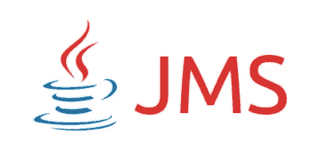

# JMS-SimpleMessageListenerContainer Vs DefaultMessageListenerContainer

> 原文：<https://medium.com/javarevisited/jms-simplemessagelistenercontainer-vs-defaultmessagelistenercontainer-940415bef558?source=collection_archive---------1----------------------->

Spring 提供了一个 JMS 集成框架，简化了对 [JMS](https://en.wikipedia.org/wiki/Java_Message_Service) API 的使用。消息监听器是 JMS 应用程序的一部分。为了异步接收 JMS 消息， [Spring](/javarevisited/top-10-free-courses-to-learn-spring-framework-for-java-developers-639db9348d25) 提供了创建**消息驱动 POJO**(MDP)的解决方案。

Spring MessageListenerContainer 允许我们在没有 EJB 容器的情况下注册 MessageListeners。它用于异步接收消息。它是 Pojo 和消息传递提供者之间的中介。它从队列中轮询消息，并将其提供给侦听器。

Spring 打包的两个标准 JMS MessageListenerContainer 是:**DefaultMessageListenerContainer(DMLC)和 SimpleMessageListenerContainer(SMLC)**

两种容器的细节和方法可在[这里](https://docs.spring.io/spring-framework/docs/current/javadoc-api/org/springframework/jms/listener/MessageListenerContainer.html)查看。我特别要写的是创建 JMS 应用程序时面临的差异和问题。

当**SimpleMessageListenerContainer**使用推的方法时，**DefaultMessageListenerContainer**使用拉的方法，这意味着它在一个无限循环中接收消息。

SMLC 是消息侦听器容器的最简单形式。它创建固定数量的 JMS 会话来调用侦听器，并且不允许任何运行时需求。它的主要优点是低复杂性和对 JMS 提供者的最低要求。

虽然 SMLC 易于使用，并且是本机 JMS 的首选，而且如果 JMS 提供者能够很好地处理线程管理和连接恢复，那么它也有一些缺点。

特别是在您的[队列/主题](https://javarevisited.blogspot.com/2014/03/top-10-websphere-mq-series-interview-questions-answers-active-rabbit.html)与您的监听器不在同一个服务器上，或者与 JMS 提供者的连接频繁失败的情况下，线程管理将是 SMLC 的主要问题，因为一旦您的监听器启动，线程数量超过该服务器的 [ulimit](https://www.linuxtechi.com/set-ulimit-file-descriptors-limit-linux-servers/) ，线程管理就会继续创建不必要的线程，因为 [Linux](/javarevisited/7-best-linux-courses-for-developers-cloud-engineers-and-devops-in-2021-7415314087e1) 有每个用户允许的最大进程限制，这可能会导致应用程序出错(**无法创建新的本机线程:内存不足问题**)。

您将需要重新启动应用程序来终止所有线程，这将背离使用 MessageListenerContainer 连续监听消息的整体目的。

上述问题的解决方案是在这种情况下应该使用 DMLC，这也是许多环境中更值得推荐的方法。它不使用/阻止 JMS 提供者线程。它还能优雅地处理连接失败。

为了深入一点，我有一个带有 JMS 实现的应用程序。最初，在 JMS 提供者托管在本地服务器上之前，SMLC 运行得很好。

后来的提供者被转移到 [AWS 设置](/javarevisited/how-to-prepare-for-aws-solution-architect-associate-certification-saa-c01-saa-c02-exam-in-2021-a6e7e7e771fc)并进行一些常见的连接重置，这开始导致线程问题。在我将我的**SimpleMessageListenerContainer**替换为**DefaultMessageListenerContainer 之后，这个问题得到了解决。**

在本文中，我们看了看 Spring 提供的两种不同的 JMS 侦听器及其用法。希望你觉得有用。

谢谢！